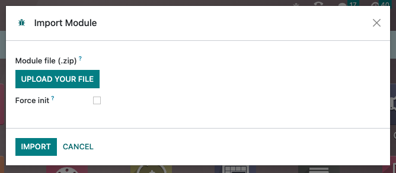

==========
Going live
==========

Once all the web design and development work finished, it's time to deploy it on a development or
production database.

.. _website_themes/going_live/module_import:

Module import
=============

.. _website_themes/going_live/module_import/saas:

Odoo SaaS
---------

Follow these steps the first time you import a module:

#. Create a ZIP file of your module.
#. Connect to the project database.
#. Enable the :ref:`developer mode <developer-mode>`.
#. Go to :guilabel:`Apps`, search for `base_import_module`, and install it if necessary.
#. Click on :guilabel:`Import Module` in the menu.
#. Upload your ZIP file, tick :guilabel:`Force init`, and click the :guilabel:`Import App` button.

If you need to re-import a module after making some changes, follow the same steps, but before
importing the module, open the developer menu and select :guilabel:`Become Superuser`. To leave the
Superuser mode, log out and log back in.

.. important::
   - Don't forget to untick :guilabel:`Force init` if you import a module for the second time.
     Otherwise, existing data might be lost. (:ref:`Related to noupdate=1 <website_themes/pages/theme_pages/noupdate>`).
   - The ZIP file size must be less than 50 MB.

.. seealso::
   - `Odoo eLearning: Register a Free Domain Name <https://www.odoo.com/slides/slide/register-a-free-domain-name-1663>`_

.. _website_themes/going_live/module_import/sh:

Odoo.sh
-------

Go to :guilabel:`Apps` and click on :guilabel:`Update Apps List` in the menu. Search for your module
in the list and install it.

.. seealso::
   :doc:`Introduction to Odoo.sh <../../../administration/odoo_sh/overview/introduction>`

.. _website_themes/going_live/whats_next:

What's next?
============

After importing and installing the module and before going live, make sure to check the SEO and
redirects as well as your domain name.

.. seealso::

   **SEO & Redirects**

   - :doc:`/applications/websites/website/structure/seo`
   - :ref:`website/pages/URL-redirection`

   **Domain name**

   - :ref:`domain-name/existing`
