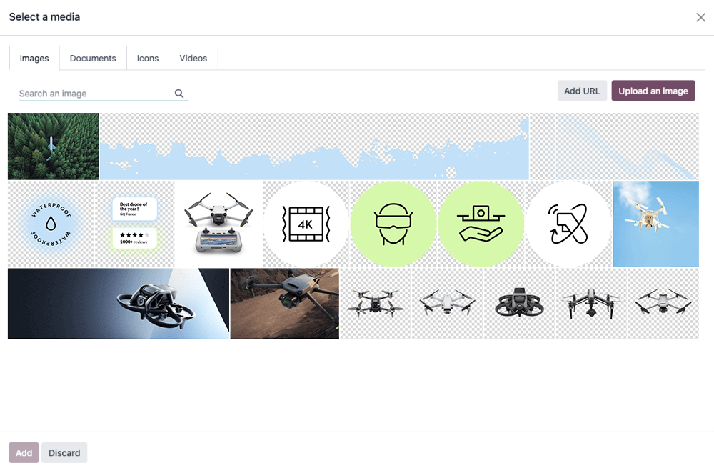
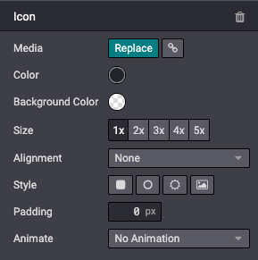

=====
Media
=====

In this chapter we will see how to include media elements such as images, videos or icons within Odoo.

.. _website_themes/media/images:

Images
======

Record images in the database and use them later in your design/code. They will also be
available for the end user through the *media dialog*.

The Website Builder supports the following image file formats: JPG, GIF, PNG, and SVG.

.. warning::
   Some options offered by the Website Builder are only applicable to media registered into a
   record. You might not see some options if you add an image directly with a relative path to
   your module folder.

.. _website_themes/media/images/declaration:

Declaration
-----------

To use your images in your code and have them included in the builder's gallery (so the client can
reuse them), declare them like this:

.. code-block:: xml
   :caption: ``/website_airproof/data/images.xml``

   <record id="img_about_01" model="ir.attachment">
       <field name="name">About Image 01</field>
       <field name="datas" type="base64" file="website_airproof/static/src/img/content/img_about_01.jpg"/>
       <field name="res_model">ir.ui.view</field>
       <field name="public" eval="True"/>
   </record>

.. list-table::
   :header-rows: 1
   :stub-columns: 1
   :widths: 20 80

   * - Field
     - Description
   * - id
     - The name of your image to be used in your code
   * - name
     - A descriptive name for your image
   * - datas
     - The location of your image

.. _website_themes/media/images/use:

Use
---

.. _website_themes/media/images/use/regular:

Regular images
~~~~~~~~~~~~~~

In your xml templates, call your images as follows:

.. code-block:: xml

   

Being `img_about_01` the id you gave to your image.

.. _website_themes/media/images/use/background:

Background images
~~~~~~~~~~~~~~~~~

.. code-block:: xml

    <section style="background-image: url('/web/image/website_airproof.img_about_01');">

.. _website_themes/media/images/use/logo:

Company logo
~~~~~~~~~~~~

For the company logo, the use is a little bit different. First declare it within the `website.xml`
file and then call it using the right template. For instance, to call inside the header, we will
use `<t t-call="website.placeholder_header_brand">`.

.. code-block:: xml
    :caption: ``/website_airproof/data/images.xml``

    <record id="website.default_website" model="website">
        <field name="logo" type="base64" file="website_airproof/static/src/img/content/logo.png"/>
    </record>

.. note::
   :ref:`Here <theming/module/website>` you can find more information about the company logo setup
   and global website settings presets.

.. tip::
   To make sure that your images don't slow down your web page and don't weigh too much, try to
   respect these few points:

   - **Weight**: < 200Kb.
   - **Size**: not more than 1500px if not needed.
   - **Extension**: use svg or jpg, png or gif.
   - **Name**: no spaces, accents or special characters and separate words with dashes. Use
     relevant words whenever possible.
   - Images larger than 1920px will be heavily compressed by the website builder. If < 1920px, they
     will remain intact.

.. _website_themes/media/videos:

Videos
======

Add videos as background.

.. code-block:: xml

   <section class="o_background_video" data-bg-video-src="...">
       <!-- Content -->
   </section>

.. list-table::
   :header-rows: 1
   :stub-columns: 1
   :widths: 20 80

   * - Attribute
     - Description
   * - data-bg-video-src
     - Video URL.

Add videos as content.

.. code-block:: xml

   

       

       

       <iframe src="..."
           frameborder="0"
           contenteditable="false"
           allowfullscreen="allowfullscreen"/>
   

.. list-table::
   :header-rows: 1
   :stub-columns: 1
   :widths: 20 80

   * - Attribute
     - Description
   * - data-oe-expression
     - Video URL.
   * - src
     - Video URL.

.. _website_themes/media/icons:

Icons
=====

By default, the Font Awesome icons library is included in the Website Builder. You can place icons
anywhere using the CSS Prefix `fa` and the icon's name. Font Awesome is designed to be used with
inline elements. You can use `<i>` tag for brevity, but using a `` is more semantically
correct.

.. code-block:: xml

   

.. seealso::
   `Font Awesome v4 icons <https://fontawesome.com/v4/icons/>`_

Enable the Website Builder style options.

.. code-block:: xml

   

Increase the icon size (fa-2x, fa-3x, fa-4x, or fa-5x classes).

.. code-block:: xml

   

