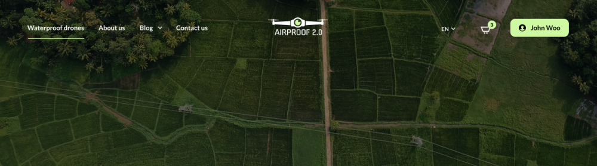
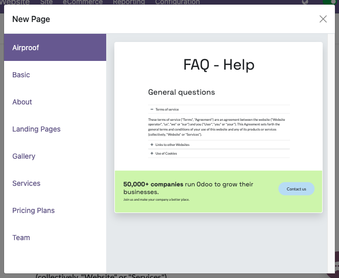

=====
Pages
=====

In this chapter, you will learn how to declare static pages.

.. _website_themes/pages/default :

Default pages
=============

In Odoo, websites come with a few default static pages (Home, Contact us, 404, ...). They are built
the following way.

.. code-block:: xml
   :caption: `/website/data/website_data.xml`

   <template id="website.homepage" name="Home">
      <t t-call="website.layout">
         <t t-set="pageName" t-value="'homepage'"/>
         

      </t>
   </template>

Each default page is a template with its own content saved into a record. This is the reason why,
:ref:`custom pages are created within a record <website_themes/pages/theme_pages>`.

The `<t-call='website.layout'>` has some variables that can be set:

Define the meta title.

.. code-block:: xml

   <t t-set="additional_title">My Page Title</t>

.. tip::
   The `t-set` here does not pass the value into a `t-value` or a `t-valuef` attribute.
   This is for translation purpose. The content of a `t-value` or a `t-valuef` is not explicitly
   exported for translation. Beside that, as it's written in XML, a string located between an opening
   and a closing tag is considered translatable by default.

   .. example::
      **Good example:**

      .. code-block:: xml

         <t t-set="additional_title">My title</t>

      **Bad example:**

      .. code-block:: xml

         <t t-set="additional_title" t-valuef="My title"/>

Define the meta description.

.. code-block:: xml

   <t t-set="meta_description">This is the description of the page that will appear on Search
   Engines.</t>

Add a CSS class to the page.

.. code-block:: xml

   <t t-set="pageName" t-valuef="..."/>

Hide the header.

.. code-block:: xml

   <t t-set="no_header" t-value="true"/>

Hide the footer.

.. code-block:: xml

   <t t-set="no_footer" t-value="true"/>

If needed, deactivate default pages.

.. code-block:: xml
   :caption: ``/website_airproof/data/pages/home.xml``

   <record id="website.homepage" model="ir.ui.view">
       <field name="active" eval="False"/>
   </record>

.. code-block:: xml
   :caption: ``/website_airproof/data/pages/contactus.xml``

   <record id="website.contactus" model="ir.ui.view">
       <field name="active" eval="False"/>
   </record>

Alternatively, replace the default content of these pages using XPath.

.. code-block:: xml
   :caption: ``/website_airproof/data/pages/404.xml``

   <template id="404" inherit_id="http_routing.404">
       <xpath expr="//*[@id='wrap']" position="replace">
           <t t-set="additional_title" t-value="'404 - Not found'"/>

           

               <!-- Content -->
           

       </xpath>
   </template>

.. seealso::
   - :doc:`Odoo Documentation on SEO </applications/websites/website/structure/seo>`

.. _website_themes/pages/theme_pages :

Theme pages
===========

You can add as many pages as you want to your website. Instead of defining a `<template>`, create a
page object.

**Declaration**

.. code-block:: xml
   :caption: ``/website_airproof/data/pages/about_us.xml``

   <?xml version="1.0" encoding="utf-8"?>
   <odoo noupdate="1">
      <record id="page_about_us" model="website.page">
         <field name="name">About us</field>
         <field name="is_published" eval="True"/>
         <field name="key">website_airproof.page_about_us</field>
         <field name="url">/about-us</field>
         <field name="website_id" eval="1" />
         <field name="type">qweb</field>
         <field name="arch" type="xml">
            <t t-name="website_airproof.page_about_us">
               <t t-call="website.layout">
                  

                     <!-- Content -->
                  

               </t>
            </t>
         </field>
      </record>
   </odoo>

.. admonition:: Multiwebsite and `website_id`

   In a module context, the record created above is available, by default, on every website
   available on the database. It's preferable to specify the `website_id` of the website where the
   page will be findable.

.. list-table::
   :header-rows: 1
   :stub-columns: 1
   :widths: 20 80

   * - Field
     - Description
   * - name
     - Page name (human-readable).
   * - is_published
     - Define if the page is published (visible to visitors).
   * - key
     - View key (must be unique)
   * - url
     - Relative path where the page is reachable.
   * - type
     - View type
   * - arch
     - View architecture (the markup of your page)

With `<t t-call="website.layout">` you use the Odoo default page layout with your code.

.. _website_themes/pages/theme_pages/noupdate :

`noupdate` attribute
--------------------

This attribute prevents data overwriting. It can be added either on a `data` tag wrapping some
records to protect or on the `odoo`tag` in order to protect all records declared into the file.

Protect all records of the file:

.. code-block:: xml

   <?xml version="1.0" encoding="utf-8"?>
   <odoo noupdate="1">
      <record id="menu_company" model="website.menu">
         <!-- Fields -->
      </record>
      <record id="menu_faq" model="website.menu">
         <!-- Fields -->
      </record>
   </odoo>

Protect specific records in the file:

.. code-block:: xml

   <?xml version="1.0" encoding="utf-8"?>
   <odoo>
      <record id="menu_company" model="website.menu">
         <!-- Fields -->
      </record>

      <data noupdate="1">
         <record id="menu_faq" model="website.menu">
            <!-- Fields -->
         </record>
         <record id="menu_legal" model="website.menu">
            <!-- Fields -->
         </record>
      </data>
   </odoo>

**Use case**

There are several static pages created in the module. This one has been installed on the database
and the end-user has updated some of those pages. Some bug fixes must be applied on the
static pages while avoiding any loss of changes made by the end-user.

**Problem**

In case of a module update on the database, every record declared into the module will overwrite
those existing in the database even if the end-user has changed some of these records.

**Solution**

By wrapping the record (or all records declared in the file) into a `<data noupdate="1"></data>`
tag, the record declared is created at the first module installation but not updated after a module
update.

.. spoiler:: What happens if the record has been manually deleted (e.g.: a menu item) ?

   The system detects that this record doesn't exist and will re-create it.

.. spoiler:: Is this method only valid on static page records?

   Of course not. It's technically usable for every type of records.

.. _website_themes/pages/theme_pages/header_overlay :

Header overlay
--------------

Make the header background transparent and stand on top of the page content.

.. code-block:: xml

   <field name="header_overlay" eval="True"/>

.. note::
   To create the content of a static page, use the Odoo way of doing things in order to remain
   editable by the Website Builder. Please note that Odoo takes advantage of Bootstrap framework (5.1.3).

   Find the available classes and components:

   - `Bootstrap cheat sheet <https://getbootstrap.com/docs/5.3/examples/cheatsheet/>`_
   - `Bootstrap documentation <https://getbootstrap.com/docs/5.3/getting-started/introduction/>`_

.. _website_themes/pages/theme_pages/page_templates :

Page templates
--------------

Create preset static page templates available from the New Page dialog window.

**Declaration**

The page templates has to be defined into the :file:`__manifest__.py` of the module through
`new_page_templates` and :file:`new_page_template_templates.xml`:

.. code-block:: python
   :caption: `/website_airproof/__manifest__.py`
   :emphasize-lines: 11,16-19

   {
      'name': 'Airproof Theme',
      'description': '...',
      'category': 'Website/Theme',
      'version': '{BRANCH}.0.0',
      'author': '...',
      'license': '...',
      'depends': ['website'],
      'data': [
         # ...
         'views/new_page_template_templates.xml'
      ],
      'assets': {
         # ...
      },
      'new_page_templates': {
         'airproof': {
            'faq': ['s_airproof_text_block_h1', 's_title', 's_faq_collapse', 's_call_to_action']
      }
   }

**Templates**

Then you have to create the template using a specific naming convention based on the hierarchy into
the :file:`__manifest__.py`. In this case, the name is `new_page_template_sections_airproof_faq`.
The building blocks called in this template are exactly the same as the standard ones except for
the first that has been adapted "on the fly".

Create a new instance of the standard `s_text_block` (`primary` attribute is important) and apply some
adaptations:

.. code-block:: xml
   :caption: `/website_airproof/views/new_page_template_templates.xml`

   <template id="s_airproof_text_block_h1" inherit_id="website.s_text_block" primary="True">
      <xpath expr="//div[hasclass('container')]|//div[hasclass('o_container_small')]" position="replace">
         

               <h1 class="display-1">FAQ - Help</h1>
         

      </xpath>
   </template>

Instantiate each building block (modified or not) for the page template:

.. code-block:: xml
   :caption: `/website_airproof/views/new_page_template_templates.xml`

   <template id="new_page_template_airproof_faq_s_text_block_h1" inherit_id="website_airproof.s_airproof_text_block_h1" primary="True"/>
   <template id="new_page_template_airproof_faq_s_title" inherit_id="website.s_title" primary="True"/>
   <template id="new_page_template_airproof_faq_s_faq_collapse" inherit_id="website.s_faq_collapse" primary="True"/>
   <template id="new_page_template_airproof_faq_s_call_to_action" inherit_id="website.s_call_to_action" primary="True"/>

Then, create your page template with some `t-snippet-call` within an `#wrap` as explained above:

.. code-block:: xml
   :caption: `/website_airproof/views/new_page_template_templates.xml`

   <template id="new_page_template_sections_airproof_faq" name="Airproof - New Page Template FAQ">
      

         <t t-snippet-call="website_airproof.new_page_template_airproof_faq_s_text_block_h1"/>
         <t t-snippet-call="website_airproof.new_page_template_airproof_faq_s_title"/>
         <t t-snippet-call="website_airproof.new_page_template_airproof_faq_s_faq_collapse"/>
         <t t-snippet-call="website_airproof.new_page_template_airproof_faq_s_call_to_action"/>
      

   </template>

Once the page template is created, create a custom group and add it to the existing ones. Find below a list of the
existing groups:

.. code-block:: xml
   :caption: `/website/views/new_page_template_templates.xml`

   <template id="new_page_template_groups">
      
Basic

      
About

      
Landing Pages

      
Gallery

      
Services

      
Pricing Plans

      
Team

   </template>

Feel free to add custom groups to the list:

.. code-block:: xml
   :caption: `/website_airproof/views/new_page_template_templates.xml`

   <template id="new_page_template_groups" inherit_id="website.new_page_template_groups" name="Airproof - New Page Template Groups">
      <xpath expr="//div[@id='custom']" position="after">
         
Airproof

      </xpath>
   </template>

.. seealso::
   `Go further by altering the building blocks of a custom template <https://github.com/odoo/odoo/blob/64971a0b1b2f8c063def5846f6029d5bb3a574cd/addons/website/views/new_page_template_templates.xml#L38>`_
