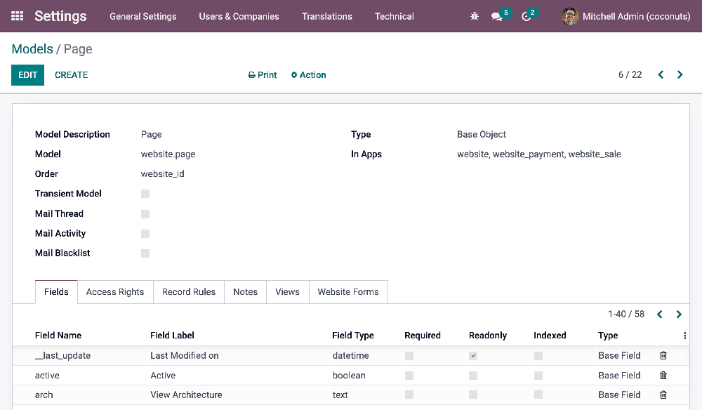
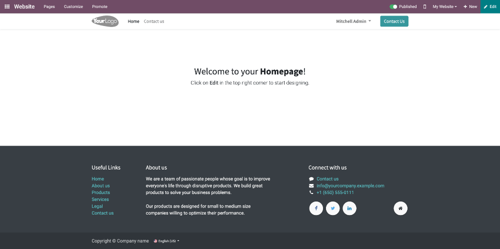

=====
Setup
=====

In this chapter, you will learn:

- To set up your local development environment.
- The outline of the Odoo database structure.
- To export and import an Odoo database in your local environment.
- To have an Odoo instance up and running.

.. _website_themes/setup/install :

Install
=======

There are multiple ways to :doc:`install Odoo </administration/on_premise>`, depending on the
intended use case. This documentation assumes you use the :doc:`source install
</administration/on_premise/source>` (running Odoo from the source code), which is best suited
for Odoo designers and developers.

.. _website_themes/setup/databases :

Databases
=========

.. _website_themes/setup/databases/structure :

Structure
---------

Every Odoo application works similarly; they are built with the same logic. A model contains fields
and relational fields that link to other models. Each model has views representing all its fields,
with backend and frontend views.

.. _website_themes/setup/databases/models :

Models
~~~~~~

The basis of Odoo is models. Models use fields to record the data. Records are stored in a database:
they are therefore linked to a model. In Odoo, you can find the different models in the
backend by enabling the :ref:`developer mode <developer-mode>` and then going to
:menuselection:`Settings --> Technical --> Database Structure: Models`.

.. _website_themes/setup/databases/fields :

Fields
~~~~~~

In a model, we will centralize fields (field names we need to target in our code).

.. seealso::
   :doc:`/applications/studio/fields`

.. _website_themes/setup/databases/fields/classic :

Classic fields
**************

- Date
- Char
- Selection
- …

.. _website_themes/setup/databases/fields/relational :

Relational fields
*****************

Relational fields call a field from another model. They allow you to link models together and make
them interact easily. In other words, when you use a relational field, you link a record with
another one (located on another model), enabling you to retrieve the content of the fields located
on this linked record.

- **Many2one** fields are filled in by choosing one record from a list of records on another model
  (from *many* records, you select *one*). For example, the *customer* field on a quotation makes
  you choose one customer from a list of several customers on the *contact* model.
- **One2many** fields are reverse searches of existing many2one relations. For example, you could
  list on a contact all their existing quotations (from *one* record, you display *many*).
- **Many2many** fields are filled in by choosing one or several records from a list of records on
  another model. For example, you can put several tags on one product, and several products can use
  the same tags (from *many* records, you can select *many*).

.. _website_themes/setup/databases/views :

Views
~~~~~

Views define how records should be displayed to end-users. They are specified in XML, meaning they
can be edited independently from the models they represent. They are flexible and allow deep
customization of the screens they control.

.. _website_themes/setup/databases/views/backend_vs_frontend :

Backend vs. Frontend
********************

- **Backend views**: Kanban, List, Form, etc.
- **Frontend view**: QWeb

.. _website_themes/setup/databases/views/static_vs_dynamic :

Static vs. Dynamic
******************

- **Static pages** have stable content, such as the homepage. You can define their URL and set some
  properties like published, indexed, etc.
- **Dynamic pages** are dynamically generated, such as the product page. Their URL is dynamic
  and is accessible to all by default (this can be changed by configuring access rights).

.. _website_themes/setup/databases/views/standard_vs_inherited :

Base vs. Inherited vs. Duplicated
*********************************

- **Base view:** View natively implemented by Odoo. It is directly derived from their model.
  A base view should never be altered as it allows updating an Odoo database without overwriting a
  client's modification.

Modifications always take place in either a duplicated or inherited view with some differences:

- **Inherited view** always has an `inherit_id` and applies modifications based on the source
  code of the base view it inherits from.
- **Duplicated view** is a duplication from another one. Most of the time this kind of view is
  created by Odoo when the end-user applies modifications through the Website Builder. This
  mechanism prevents data loss when the module is updated because only the source view will be
  updated, not the duplicated one. If a duplicated view exists, both the original view and the
  duplicated one are visible in the list but only the duplicated one has an `external_id` (an
  `external_id` set means that the view has been created by the source code of a module).

.. _website_themes/setup/databases/import :

Import an existing database
---------------------------

.. note::
   You can directly go to the :doc:`theming` chapter if you do not need to import an existing
   database.

.. _website_themes/setup/databases/import/dump :

Dump
~~~~

.. _website_themes/setup/databases/import/saas :

Odoo SaaS
*********

#. Log in to a user account with sufficient access rights.
#. Go to `<database_url>/saas_worker/dump`.

.. _website_themes/setup/databases/import/sh :

Odoo.sh
*******

#. Connect to Odoo.sh.
#. Select the branch you want to back up.
#. Choose the :guilabel:`BACKUPS` tab.
#. Click the :guilabel:`Create Backup` button.
#. When the process is over, a notification appears. Open it and click the :guilabel:`Go to Backup`
   button.
#. Click the :guilabel:`Download` icon. Select :guilabel:`Testing` under
   :guilabel:`Purpose` and :guilabel:`With filestore` under :guilabel:`Filestore`.

   .. image:: setup/download-backup.png
     :alt: Download backup

#. You will receive a notification when the dump is ready to be downloaded. Open it and click on
   :guilabel:`Download` to get your dump.

   .. image:: setup/database-backup.png
     :alt: Database backup

.. _website_themes/setup/databases/import/filestore :

Move filestore
~~~~~~~~~~~~~~

Copy all the folders included in the filestore folder and paste them to the following location on
your computer:

- macOS: `/Users/<User>/Library/Application Support/Odoo/filestore/<database_name>`
- Linux: `/home/<User>/.local/share/Odoo/filestore/<database_name>`

.. note::
   `/Library` is a hidden folder.

.. _website_themes/setup/databases/import/database_setup :

Database setup
~~~~~~~~~~~~~~

Create an empty database.

.. code-block:: bash

   createdb <database_name>

Import the SQL file in the database that you just created.

.. code-block:: bash

   psql <database_name> < dump.sql

Reset the admin user password.

.. code-block:: bash

   psql \c
   <database_name>
   update res_users set login='admin', password='admin' where id=2;

If necessary, disable the two-factor authentication enforcing policy option.

.. code-block:: bash

    psql <database-name>
    update res_users set totp_secret='' where id=2;

.. _website_themes/setup/getting_started :

Getting started
===============

.. _website_themes/setup/getting_started/running_odoo :

Running Odoo
------------

Once all dependencies are set up, Odoo can be launched by running `odoo-bin`, the command-line
interface of the server. It is located at the root of the Odoo Community directory.

- :ref:`Running Odoo <install/source/running_odoo>`
- `Docker <https://hub.docker.com/_/odoo/>`_

To configure the server, you can specify command-line arguments or a configuration file. The first
method is presented below.

The :ref:`CLI <reference/cmdline>` offers several functionalities related to Odoo. You can use it to
:ref:`run the server <reference/cmdline/server>`, scaffold an Odoo theme, populate a database, or
count the number of lines of code.

.. _website_themes/setup/getting_started/shell_script :

Shell script
------------

A typical way to :ref:`run the server <reference/cmdline/server>` would be to add all command line arguments to a `.sh` script.

.. example::
   .. code-block:: xml

      ./odoo-bin --addons-path=../enterprise,addons --db-filter=<database> -d <database> --without-demo=all -i website --dev=xml

.. list-table::
   :header-rows: 1
   :stub-columns: 1
   :widths: 20 80

   * - Folder
     - Description
   * - :option:`--addons-path <odoo-bin --addons-path>`
     - Comma-separated list of directories in which modules are stored. These directories are
       scanned for modules.
   * - :option:`-d <odoo-bin --database>`

       :option:`--database <odoo-bin --database>`
     - database(s) used when installing or updating modules.
   * - :option:`--db-filter <odoo-bin --db-filter>`
     - Hides databases that do not match the filter.
   * - :option:`-i <odoo-bin --init>`

       :option:`--init <odoo-bin --init>`
     - Comma-separated list of modules to install before running the server. (requires `-d`)
   * - :option:`-u <odoo-bin --update>`

       :option:`--update <odoo-bin --update>`
     - Comma-separated list of modules to update before running the server. (requires `-d`)
   * - :option:`--without-demo <odoo-bin --without-demo>`
     - Disables demo data loading for modules installed comma-separated; use `all` for all modules.
       (requires `-d` and `-i`)
   * - :option:`--dev <odoo-bin --dev>`
     - Comma-separated list of features. For development purposes only. :ref:`More info
       <reference/cmdline/dev>`

.. _website_themes/setup/getting_started/signin :

Sign in
-------

After the server has started (the INFO log `odoo.modules.loading: Modules loaded.` is printed), open
http://localhost:8069 in your web browser and log in with the base administrator account.

Type **admin** for the email and **admin** for the password.

.. tip::
   Hit *CTRL+C* to stop the server. Do it twice if needed.

.. _website_themes/setup/getting_started/developer_mode :

Developer mode
--------------

The developer mode, also known as debug mode, is useful for development as it gives access to
additional tools. In the next chapters, it is assumed that you have enabled the developer mode.

.. seealso::
   :doc:`/applications/general/developer_mode`
