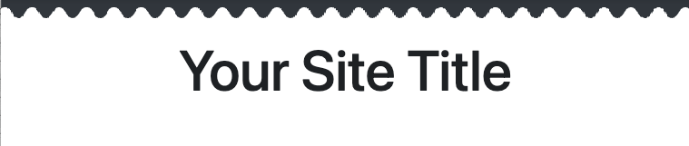
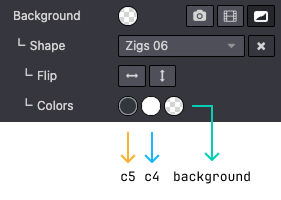
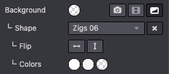

======
Shapes
======

Shapes are handy if you want to add personality to your website.

In this chapter, you will learn how to add standard and custom background and image shapes.

.. _website_themes/shapes/bg:

Background shapes
=================

Background shapes are SVG files that you can add as a decorative background in your different
sections. Each shape has one or several customizable colors, and some of them are animated.

.. warning::
    Odoo's default shapes use the Odoo default colors palette map as reference. This way, colors
    will be automatically adapted to a new palette everytime it changes:

    .. code-block:: scss

        default_palette = {
            '1': '#3AADAA',
            '2': '#7C6576',
            '3': '#F6F6F6',
            '4': '#FFFFFF',
            '5': '#383E45',
        }

.. _website_themes/shapes/bg/standard:

Standard
--------

A large selection of default background shapes is available.

**Use**

.. code-block:: xml

   <section data-oe-shape-data="{'shape':'web_editor/Zigs/06'}">
       

       

           <!-- Content -->
        

   </section>

`data-oe-shape-data` is a JSON object containing information about your shape like the location
of the SVG file, the repeat and flip options, etc.

For example, you can **flip the shape** horizontally or vertically by using the X or Y axis like
this:

.. code-block:: xml

   <section data-oe-shape-data="{'shape':'web_editor/Zigs/06','flip':[x,y]}">
       

       

           <!-- Content -->
       

   </section>

.. _website_themes/shapes/bg/standard/colors:

Colors mapping
~~~~~~~~~~~~~~

You can also change the default colors mapping of your shape either by switching colors in the
current map or by creating a alternate map without modifying the initial one.

.. _website_themes/shapes/bg/standard/colors/switch:

Switch colors mapping
*********************

First, we can use a shape like this:

.. code-block:: xml

    <svg xmlns="http://www.w3.org/2000/svg" xmlns:xlink="http://www.w3.org/1999/xlink" preserveAspectRatio="none" width="100%" height="100%">
        <defs>
            <svg id="zigs06_top" viewBox="0 0 30 30" preserveAspectRatio="xMinYMin meet" fill="#383E45" width="100%">
                <path d="M30,7.9C22.5,7.9,22.5,20,15,20S7.5,7.9,0,7.9V0h30V7.9z"/>
            </svg>
            <svg id="zigs06_bottom" viewBox="0 0 30 30" preserveAspectRatio="xMinYMax meet" fill="#FFFFFF" width="100%">
                <path d="M0,22.1C7.5,22.1,7.5,10,15,10s7.5,12.1,15,12.1V30H0V22.1z"/>
            </svg>
        </defs>
        <svg>
            <use xlink:href="#zigs06_top"/>
            <use xlink:href="#zigs06_bottom"/>
        </svg>
    </svg>

Here, we use `#383E45`  and `#FFFFFF` which corresponds to the 5th and 4th colors in the Odoo's
default color palette.

The shape is declared as follows in SCSS:

.. code-block:: sass
   :caption: ``/website_airproof/static/src/scss/primary_variables.scss``

   'Zigs/06': ('position': bottom, 'size': 30px 100%, 'colors': (4, 5), 'repeat-x': true),

The blackish color is used at the top (`c5`), the lightish (`c4`) at the bottom and in between,
the shape is simply transparent.

We are going to rewrite the `colors` map with some `key: value` couples:

**With color palette reference and custom color**

.. code-block:: scss
   :caption: ``/website_airproof/static/src/scss/primary_variables.scss``

    $o-bg-shapes: change-shape-colors-mapping('web_editor', 'Zigs/06', (4: 3, 5: rgb(187, 27, 152)))

**Or just with references**

.. code-block:: scss
   :caption: ``/website_airproof/static/src/scss/primary_variables.scss``

    $o-bg-shapes: change-shape-colors-mapping('web_editor', 'Zigs/06', (4: 3, 5: 1));

The `c4` (white) will be replaced by `c3` (whitish) and `c5` (black) by `c1` (white).

**Results**

.. _website_themes/shapes/bg/standard/colors/extra:

Add extra colors mapping
************************

Adding extra color mapping allows you to add a color variant to the template of a shape while
keeping the original.

.. code-block:: scss
   :caption: ``/website_airproof/static/src/scss/boostrap_overridden.scss``

   $o-bg-shapes: add-extra-shape-colors-mapping('web_editor', 'Zigs/06', 'second', (4: 3, 5: 1));

.. code-block:: xml

   <section data-oe-shape-data="{'shape':'web_editor/Zigs/06'}">
       

       

           <!-- Content -->
       

   </section>

.. _website_themes/shapes/bg/custom:

Custom
------

Sometimes, your design might require creating one or several custom shapes.

Firstly, you need to create an SVG file for your shape.

.. code-block:: xml
   :caption: ``/website_airproof/static/shapes/hexagons/01.svg``

   <svg version="1.1" xmlns="http://www.w3.org/2000/svg" width="86" height="100">
       <polygon points="0 25, 43 0, 86 25, 86 75, 43 100, 0 75" style="fill: #3AADAA;"/>
   </svg>

Make sure to use colors from the default Odoo palette for your shape (as explained :ref:`above <website_themes/shapes/bg>`).

.. code-block:: scss

   default_palette = {
       '1': '#3AADAA',
       '2': '#7C6576',
       '3': '#F6F6F6',
       '4': '#FFFFFF',
       '5': '#383E45',
   }
.. _website_themes/shapes/bg/custom/attachment:

Attachment
~~~~~~~~~~

Declare your shape file.

.. code-block:: xml
   :caption: ``/website_airproof/data/shapes.xml``

   <record id="shape_hexagon_01" model="ir.attachment">
       <field name="name">01.svg</field>
       <field name="datas" type="base64" file="website_airproof/static/shapes/hexagons/01.svg"/>
       <field name="url">/web_editor/shape/illustration/hexagons/01.svg</field>
       <field name="public" eval="True"/>
   </record>

.. list-table::
   :header-rows: 1
   :stub-columns: 1
   :widths: 20 80

   * - Field
     - Description
   * - name
     - Name of the shape
   * - datas
     - Path to the shape
   * - url
     - The location of your shape in the web editor. The file is automatically duplicated in
       `/web_editor/shape/illustration` by the Website Builder.
   * - public
     - Makes the shape available for later editing.

.. _website_themes/shapes/bg/custom/scss:

SCSS
~~~~

Define the styles of your shape.

.. code-block:: scss
   :caption: ``/website_airproof/static/src/scss/primary_variables.scss``

   $o-bg-shapes: map-merge($o-bg-shapes,
       (
           'illustration': map-merge(
               map-get($o-bg-shapes, 'illustration') or (),
               (
                   'hexagons/01': ('position': center center, 'size': auto 100%, 'colors': (1), 'repeat-x': true, 'repeat-y': true),
               ),
           ),
       )
   );

.. list-table::
   :header-rows: 1
   :stub-columns: 1
   :widths: 20 80

   * - Key
     - Description
   * - File location
     - `hexagons/01` corresponds to the location of your file in the `shapes` folder.
   * - position
     - Defines the position of your shape.
   * - size
     - Defines the size of your shape.
   * - colors
     - Defines the color c* you want it to have (this will override the color you specified in your
       SVG).
   * - repeat-x
     - Defines if the shape is repeated horizontally. This key is optional and only needs to be
       defined if set to `true`.
   * - repeat-y
     - Defines if the shape is repeated vertically. This key is optional and only needs to be
       defined if set to `true`.

.. _website_themes/shapes/bg/custom/option:

Add the option
~~~~~~~~~~~~~~

Lastly, add your shape to the list of shapes available on the Website Builder.

.. code-block:: xml
   :caption: ``/website_airproof/views/snippets/options.xml``

   <template id="snippet_options_background_options" inherit_id="website.snippet_options_background_options" name="Airproof - Shapes">
      <xpath expr="//*[hasclass('o_we_bg_shape_menu')]/header[hasclass('o_pager_nav')]//*[hasclass('o_pager_nav_btn')][last()]" position="after">
         <button type="button" class="o_pager_nav_btn p-0 text-uppercase" data-scroll-to="x_wd_scroll_bgshapes_aiproof">
            Airproof
         </button>
      </xpath>
      <xpath expr="//*[hasclass('o_we_bg_shape_menu')]/div[hasclass('o_pager_container')]" position="inside">
         

            <we-title>Airproof</we-title>
            <we-select-page string="Airproof">
               <we-button data-shape="illustration/airproof/01" data-select-label="Airproof 01"/>
            </we-select-page>
         

      </xpath>
   </template>

.. _website_themes/shapes/bg/custom/use:

Use it into your pages
~~~~~~~~~~~~~~~~~~~~~~

In your XML pages, you can use your shape in the same way as the others.

.. code-block:: xml

    <section class="..." data-oe-shape-data="{'shape': 'illustration/airproof/01', 'colors': 'c4': '#8595A2', 'c5': 'rgba(0, 255, 0)'}">
        

        

            <!-- Content -->
        

    </section>

You can also redefine colors using the `data-oe-shape-data attribute`, but this is optional.

