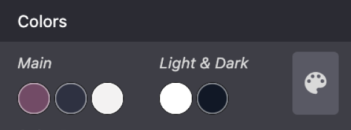
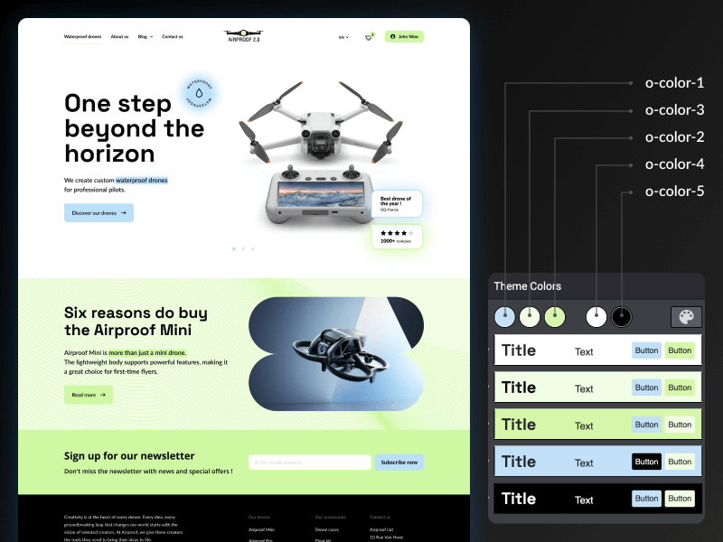
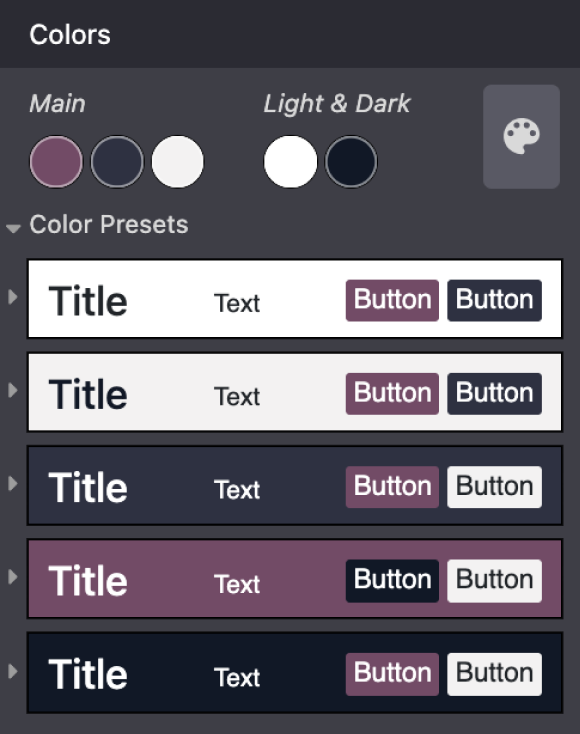

=======
Theming
=======

After your development environment is fully set up, you can start building the skeleton of your
theme module. In this chapter, you will discover how to:

- Enable/disable the Website Builder's standard options and templates.
- Define the colors and fonts to use for your design.
- Get the most out of Bootstrap variables.
- Add custom styles and JavaScript.

Theme module
============

Odoo comes with a default theme that provides minimal structure and layout. When you create a new
theme, you are extending the default theme.

Remember to add the directory containing your module to the `addons-path` command-line argument
when running Odoo in your development environment.

Technical naming
----------------

The first step is to create a new directory.

.. code-block:: xml

   website_airproof

.. note::
   Prefix it with `website_` and use only lowercase ASCII alphanumeric characters and underscores.

   In this documentation, we will use **Airproof** (a fictional project) as an example.

File structure
--------------

Themes are packaged like any Odoo module. Even if you are designing a basic website, you need to
package its theme like a module.

::

    website_airproof
    ├── data
    ├── i18n
    ├── lib
    ├── static
    │   ├── description
    │   ├── fonts
    │   ├── image_shapes // Shapes for images
    │   ├── shapes // Shapes for background
    │   └── src
    │       ├── img
    │       │   ├── content // For those used in the pages of your website
    │       │   └── wbuilder // For those used in the builder
    │       ├── js
    │       ├── scss
    │       └── snippets // custom snippets
    ├── views
    ├── __init__.py
    └── __manifest__.py

.. list-table::
   :header-rows: 1
   :stub-columns: 1
   :widths: 20 80

   * - Folder
     - Description
   * - data
     - Presets, menus, pages, images, shapes, … (`*.xml`)
   * - i18n
     - Translations (`*.po`, `*.pot`)
   * - lib
     - External libraries (`*.js`)
   * - static
     - Custom assets (`*.jpg`, `*.gif`, `*.png`, `*.svg`, `*.pdf`, `*.scss`, `*.js`)
   * - views
     - Custom views and templates (`*.xml`)

Initialization
--------------

An Odoo module is also a Python package with a :file:`__init__.py` file containing import
instructions for various Python files in the module. This file can remain empty for now.

Declaration
-----------

An Odoo module is declared by its manifest file. This file declares a Python package as an Odoo
module and specifies the module's metadata. It must at least contain the `name` field, which is
always required. It usually contains much more information.

.. code-block:: python
   :caption: ``/website_airproof/__manifest__.py``

   {
      'name': 'Airproof Theme',
      'description': '...',
      'category': 'Website/Theme',
      'version': '15.0.0',
      'author': '...',
      'license': '...',
      'depends': ['website'],
      'data': [
         # ...
      ],
      'assets': {
         # ...
      },
   }

.. list-table::
   :header-rows: 1
   :stub-columns: 1
   :widths: 20 80

   * - Field
     - Description
   * - name
     - Human-readable name of the module (required)
   * - description
     - Extended description of the module, in `reStructuredText
       <https://en.wikipedia.org/wiki/ReStructuredText>`_
   * - category
     - Classification category within Odoo
   * - version
     - Odoo version this module is addressing
   * - author
     - Name of the module author
   * - license
     - Distribution license for the module
   * - depends
     - Odoo modules must be loaded before this one, either because this module uses features
       they create or because it alters resources they define
   * - data
     - List of XML files
   * - assets
     - List of SCSS and JS files

.. note::
   To create a website theme, you only need to install the Website app. If you need other apps
   (Blogs, Events, eCommerce, ...), you can also add them.

Default options
===============

First, try to construct your theme by using Odoo's default options. This ensures two things:

#. You do not re-invent something which already exists. For example, as Odoo provides an option to
   add a border on the footer, you shouldn't recode it yourself. Instead, enable the default option
   first, then extend it if needed.
#. The user can still use all of Odoo's features with your theme. For example, if you recode the
   border on the footer, you may break the default option or make it useless, giving the user a bad
   experience. Also, your recode might not work as well as the default option, as other Odoo
   features may rely on it.

.. tip::
   - Use four spaces per indentation level.
   - Do not use tabs.
   - Never mix spaces and tabs.

.. seealso::
   :doc:`Odoo coding guidelines <../../../contributing/development/coding_guidelines>`

Odoo variables
--------------

Odoo declares many CSS rules, most entirely customizable by overriding the related SCSS variables.
To do so, create a :file:`primary_variables.scss` file and add it to the `_assets_primary_variables`
bundle.

**Declaration**

.. code-block:: python
   :caption: ``/website_airproof/__manifest__.py``

   'assets': {
      'web._assets_primary_variables': [
         ('prepend', 'website_airproof/static/src/scss/primary_variables.scss'),
      ],
   },

By reading the source code, variables related to options are easily noticeable.

.. code-block:: xml

   <we-button title="..."
      data-name="..."
      data-customize-website-views="..."
      data-customize-website-variable="'Sidebar'"
      data-img="..."/>

These variables can be overridden through the `$o-website-value-palettes` map, for example.

Global
~~~~~~

**Declaration**

.. code-block:: scss
   :caption: ``/website_airproof/static/src/scss/primary_variables.scss``

   $o-website-values-palettes: (
      (
         // Templates
         // Colors
         // Fonts
         // Buttons
         // ...
      ),
   );

.. tip::
   That file must only contain definitions and overrides of SCSS variables and mixins.

.. seealso::
   `Primary variables SCSS
   <https://github.com/odoo/odoo/blob/34c0c9c1ae00aba391932129d4cefd027a9c6bbd/addons/website/static/src/scss/primary_variables.scss#L1954>`_

Fonts
~~~~~

You can embed any font on your website. The Website Builder automatically makes them available in
the font selector.

**Declaration**

.. code-block:: scss
   :caption: ``/website_airproof/static/src/scss/primary_variables.scss``

   $o-theme-font-configs: (
      <font-name>: (
         'family': <css font family list>,
         'url' (optional): <related part of Google fonts URL>,
         'properties' (optional): (
            <font-alias>: (
               <website-value-key>: <value>,
               ...,
            ),
         ...,
      )
   )

**Use**

.. code-block:: scss
   :caption: ``/website_airproof/static/src/scss/primary_variables.scss``

   $o-website-values-palettes: (
      (
         'font':                             '<font-name>',
         'headings-font':                    '<font-name>',
         'navbar-font':                      '<font-name>',
         'buttons-font':                     '<font-name>',
      ),
   );

Google fonts
************

.. code-block:: scss
   :caption: ``/website_airproof/static/src/scss/primary_variables.scss``

   $o-theme-font-configs: (
      'Poppins': (
         'family':                         ('Poppins', sans-serif),
         'url':                            'Poppins:400,500',
         'properties' : (
            'base': (
               'font-size-base':           1rem,
            ),
         ),
      ),
   );

Custom fonts
************

First, create a specific SCSS file to declare your custom font(s).

.. code-block:: python
   :caption: ``/website_airproof/__manifest__.py``

   'assets': {
      'web.assets_frontend': [
         'website_airproof/static/src/scss/font.scss',
      ],
   },

Then, use the `@font-face` rule to allow you custom font(s) to be loaded on your website.

.. code-block:: scss
   :caption: ``/website_airproof/static/src/scss/font.scss``

   @font-face {
      font-family: '<font-name>';
      ...
   }

.. code-block:: scss
   :caption: ``/website_airproof/static/src/scss/primary_variables.scss``

   $o-theme-font-configs: (
      'Proxima Nova': (
         'family':                         ('Proxima Nova', sans-serif),
         'properties' : (
            'base': (
               'font-size-base':           1rem,
            ),
         ),
      ),
   );

.. tip::
   It is recommended to use the .woff format for your fonts.

Colors
~~~~~~

The Website Builder relies on palettes composed of five named colors. Defining those in your theme
ensures it stays consistent.

.. list-table::
   :header-rows: 1
   :stub-columns: 1
   :widths: 20 80

   * - Color
     - Description
   * - o-color-1
     - Primary
   * - o-color-2
     - Secondary
   * - o-color-3
     - Extra
   * - o-color-4
     - Whitish
   * - o-color-5
     - Blackish

**Declaration**

.. code-block:: scss
   :caption: ``/website_airproof/static/src/scss/primary_variables.scss``

   $o-color-palettes: map-merge($o-color-palettes,
      (
         'airproof': (
            'o-color-1':                    #bedb39,
            'o-color-2':                    #2c3e50,
            'o-color-3':                    #f2f2f2,
            'o-color-4':                    #ffffff,
            'o-color-5':                    #000000,
         ),
      )
   );

Add the created palette to the list of palettes offered by the Website Builder.

.. code-block:: scss

   $o-selected-color-palettes-names: append($o-selected-color-palettes-names, 'airproof');

**Use**

.. code-block:: scss
   :caption: ``/website_airproof/static/src/scss/primary_variables.scss``

   $o-website-values-palettes: (
      (
         'color-palettes-name':              'airproof',
      ),
   );

**Color combinations**

Based on the previously defined five color palettes, the Website Builder automatically generates
five color combinations, each defining a color for the background, text, headings, links, primary
buttons, and secondary buttons. These colors can be customized later by the user.

The colors used in a color combination are accessible and can be overridden through the BS
`$colors map` using a specific prefix (`o-cc` for `color combination`).

.. code-block:: scss
   :caption: ``/website_airproof/static/src/scss/primary_variables.scss``

   $o-color-palettes: map-merge($o-color-palettes,
      (
         'airproof': (

            'o-cc*-bg':                     'o-color-*',
            'o-cc*-text':                   'o-color-*',
            'o-cc*-headings':               'o-color-*',
            'o-cc*-h2':                     'o-color-*',
            'o-cc*-h3':                     'o-color-*',
            'o-cc*-h4':                     'o-color-*',
            'o-cc*-h5':                     'o-color-*',
            'o-cc*-h6':                     'o-color-*',
            'o-cc*-link':                   'o-color-*',
            'o-cc*-btn-primary':            'o-color-*',
            'o-cc*-btn-primary-border':     'o-color-*',
            'o-cc*-btn-secondary':          'o-color-*',
            'o-cc*-btn-secondary-border':   'o-color-*',

         ),
      )
   );

.. note::
   For each `o-cc*`, replace the `*` with the digit (1 - 5) corresponding to the desired color
   combination.

   The default text color is `o-color-5`. If the background is too dark, it will automatically
   change to the `o-color-4` color.

.. seealso::
   `Color combinations SCSS
   <https://github.com/odoo/odoo/blob/34c0c9c1ae00aba391932129d4cefd027a9c6bbd/addons/web_editor/static/src/scss/web_editor.common.scss#L711>`_

.. admonition:: Demo page

   The Website Builder automatically generates a page to view the color combinations of the theme
   color palette: http://localhost:8069/website/demo/color-combinations

Bootstrap variables
-------------------

Odoo includes Bootstrap by default. You can use all variables and mixins of the framework.

If Odoo does not provide the variable you are looking for, there could be a Bootstrap variable that
allows it. Indeed all Odoo layouts respect Bootstrap structures and use Bootstrap components or
their extensions. If you customize a Bootstrap variable, you add a generic style for the whole user
website.

Use a dedicated file added to the :file:`_assets_frontend_helpers` bundle to override Bootstrap
values and *not* the :file:`primary_variables.scss` file.

**Declaration**

.. code-block:: python
   :caption: ``/website_airproof/__manifest__.py``

   'assets': {
      'web._assets_frontend_helpers': [
         ('prepend', 'website_airproof/static/src/scss/bootstrap_overridden.scss'),
      ],
   },

**Use**

.. code-block:: scss
   :caption: ``/website_airproof/static/src/scss/bootstrap_overridden.scss``

   // Typography
   $h1-font-size:                 4rem !default;

   // Navbar
   $navbar-nav-link-padding-x:    1rem!default;

   // Buttons + Forms
   $input-placeholder-color:      o-color('o-color-1') !default;

   // Cards
   $card-border-width:            0 !default;

.. tip::
   That file must only contain definitions and overrides of SCSS variables and mixins.

.. warning::
   Don't override Bootstrap variables that depend on Odoo variables. Otherwise, you might break the
   possibility for the user to customize them using the Website Builder.

.. seealso::
   `Bootstrap overridden SCSS
   <{GITHUB_PATH}/addons/website/static/src/scss/bootstrap_overridden.scss>`_

.. admonition:: Demo page

   http://localhost:8069/website/demo/bootstrap

Views
-----

For some options, in addition to the Website Builder variable, you also have to activate a specific
view.

By reading the source code, templates related to options are easily found.

.. code-block:: xml

   <we-button title="..."
      data-name="..."
      data-customize-website-views="website.template_header_default"
      data-customize-website-variable="'...'"
      data-img="..."/>

.. code-block:: xml

   <template id="..." inherit_id="..." name="..." active="True"/>
   <template id="..." inherit_id="..." name="..." active="False"/>

.. example::
   **Changing the menu items' horizontal alignment**

   .. code-block:: xml
      :caption: ``/website_airproof/data/presets.xml``

      <record id="website.template_header_default_align_center" model="ir.ui.view">
         <field name="active" eval="True"/>
      </record>

   The same logic can be used for others Odoo apps as well.

   **eCommerce - Display products categories**

   .. code-block:: xml

       <record id="website_sale.products_categories" model="ir.ui.view">
          <field name="active" eval="False"/>
       </record>

   **Portal - Disable the language selector**

   .. code-block:: xml

      <record id="portal.footer_language_selector" model="ir.ui.view">
         <field name="active" eval="False"/>
      </record>

Assets
======

For this part, we will refer to the `assets_frontend` bundle located in the web module. This bundle
specifies the list of assets loaded by the Website Builder, and the goal is to add your SCSS and JS
files to the bundle.

Styles
------

The Website Builder together with Bootstrap are great for defining the basic styles of your website.
But to design something unique, you should go a step further. For this, you can easily add any SCSS
file to your theme.

**Declaration**

.. code-block:: python
   :caption: ``/website_airproof/__manifest__.py``

   'assets': {
      'web.assets_frontend': [
         'website_airproof/static/src/scss/theme.scss',
      ],
   },

Feel free to reuse the variables from your Bootstrap file and the ones used by Odoo in your
:file:`theme.scss` file.

.. example::
   .. code-block:: javascript
      :caption: ``/website_airproof/static/src/scss/theme.scss``

       blockquote {
         border-radius: $rounded-pill;
         color: o-color('o-color-3');
         font-family: o-website-value('headings-font');
       }

Interactivity
-------------

Odoo supports three different kinds of JavaScript files:

- :ref:`plain JavaScript files <frontend/modules/plain_js>` (no module system),
- :ref:`native JavaScript module <frontend/modules/native_js>`, and
- :ref:`Odoo modules <frontend/modules/odoo_module>` (using a custom module system).

Most new Odoo JavaScript codes should use the native JavaScript module system. It's simpler and
brings the benefit of a better developer experience with better integration with the IDE.

.. important::
   Odoo needs to know which files should be translated into :ref:`Odoo modules
   <frontend/js_modules>` and which files should not. It's an opt-in system: Odoo looks at the first
   line of a JavaScript file and checks if it contains the string `@odoo-module`. If so,
   it will automatically be converted to an Odoo module.

.. code-block:: javascript

   /** @odoo-module **/

**Declaration**

.. code-block:: python
   :caption: ``/website_airproof/__manifest__.py``

   'assets': {
      'web.assets_frontend': [
         'website_airproof/static/src/js/theme.js',
      ],
   },

.. note::
   If you want to include files from an external library, you can add them to the :file:`/lib`
   folder of your module.

.. tip::
   - Use a linter (JSHint, ...).
   - Never add minified JavaScript libraries.
   - Add `'use strict';` on top of every Odoo JavaScript module.
   - Variables and functions should be *camelcased* (`myVariable`) instead of *snakecased*
     (`my_variable`).
   - Do not name a variable `event`; use `ev.` instead. This is to avoid bugs on non-Chrome
     browsers, as Chrome is magically assigning a global event variable (so if you use the event
     variable without declaring it, it will work fine on Chrome but crash on every other browser).
   - Use strict comparisons (`===` instead of `==`).
   - Use double quotes for all textual strings (such as `"Hello"`) and single quotes for all other
     strings, such as a CSS selector `.x_nav_item`.
   - Always use `this._super.apply(this, arguments)`.

.. seealso::
   - `Odoo JavaScript coding guidelines <https://github.com/odoo/odoo/wiki/Javascript-coding-guidelines>`_
   - :doc:`Overview of the Odoo JavaScript framework
     <../../reference/frontend/javascript_reference>`
   - `Odoo Experience Talk: 10 Tips to take your website design to the next level! <https://www.youtube.com/watch?v=vAgE_fPVXUQ&ab_channel=Odoo>`_
