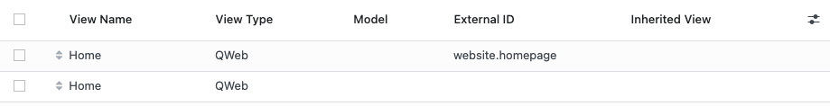
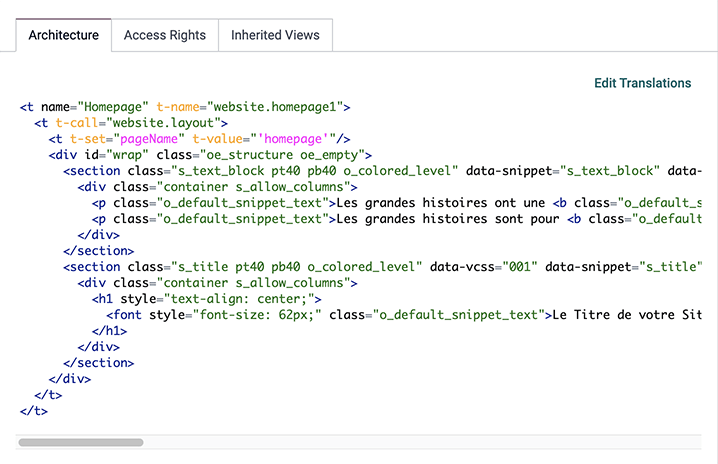

============
Translations
============

With Odoo, you can translate your website into different languages.

In this chapter, you will learn how to:

- Translate the content of a module.
- Import and export translations.
- Integrate translations to a module.

.. _website_themes/translations/frontend:

Frontend
========

To translate your pages with the Website Builder, go to your website and click on the language
selector to switch to it. If your website was never translated to the target language, click
:guilabel:`Add a language...`, select it in the pop-up window, and click :guilabel:`Add`.

Click :guilabel:`Translate` to start translating. Depending on the language, some text is
automatically translated and highlighted in green, while everything that should be translated
manually is highlighted in yellow.

However, you have to understand what's happening under the hood when you translate something
through the Website Builder.

.. _website_themes/translations/frontend/default_pages:

Default pages
-------------

Odoo creates a base view once the Website is installed. If you edit the page with the Builder, a
duplicated view will be created and all your modifications will be saved into this one (and your
translations also). The only exception concerns the homepage (by default, Odoo creates a base and
duplicated view even before you've edited anything).

We recommend to be very careful about the order in which you will carry out translations or
modifications in the source language, either if you created the page through the Website Builder or
through the source code with a record. Note that every single modification of the source language
(`Edit master`) will break the link between the source language and the existing translations. In
other words, you'll have to re-create the translations if you edit the source language.

.. _website_themes/translations/frontend/strings:

Translatable strings
--------------------

.. _website_themes/translations/frontend/strings/t-att:

t-att- / t-attf-
~~~~~~~~~~~~~~~~

If you want to set a translatable string, use preferably `t-attf-` instead of `t-att-` whenever
possible.

**Example**

To write “Hello *username*”, you can do it in the following way:

.. code-block:: xml

   

.. warning::

   You could also achieve the same result with an `t-att-title` like the example below. However,
   the result won't be considered natively as a translatable string:

   .. code-block:: xml

      

.. _website_themes/translations/frontend/strings/exception:

Exception: t-value / t-valuef
~~~~~~~~~~~~~~~~~~~~~~~~~~~~~

`t-value` and `t-valuef` are a bit different. None of them are explicitly translatable, so you
could write something like this:

.. code-block:: xml

   <t t-set=”additional_title”>My Page Title Shown in the Browser Tab</t>

As we are writing XML context, text located between two XML tags are translatable.

.. _website_themes/translations/frontend/strings/mixing:

Mixing translatable and non-translatable
~~~~~~~~~~~~~~~~~~~~~~~~~~~~~~~~~~~~~~~~

In a situation where we need to set a translatable text in only one single
place:

.. code-block:: xml

   <t t-set=”title”>Foo</t>

And then we need to call it in different locations:

.. code-block:: xml

    

    ...
    <nav t-att-title=”label” />

Here we just called the translatable content into a non-translatable attribute (`t-att-title`). So
the `t-att-title` is not translatable but the casted variable is.

.. _website_themes/translations/backend:

Backend
=======

Translating pages directly from the backend allows you to translate several languages at the same
time. To do so, go to :menuselection:`Settings --> Technical --> User Interface: Views`, search for
the name of the page you want to translate, and click the :guilabel:`Edit Translations` button.

.. _website_themes/translations/export:

Export
======

Once you are done translating, you need to export the translations to integrate them into your
module. To export everything at once, open your database, activate :ref:`developer mode
<developer-mode>`, and go to :menuselection:`Settings --> Translations --> Export Translation`.
Select the :guilabel:`Language` you translated, *PO File* under :guilabel:`File Format`, and
*website_airproof* as the :guilabel:`Apps To Export`.

Download the file and move it to the :file:`i18n` folder. If needed, you can manually edit the
:file:`.po` file afterward.

.. _website_themes/translations/po:

PO file
=======

You can translate directly by editing a :file:`.po` file or creating the file yourself. Check out
the :doc:`translating modules documentation <../translations>` to write your translations.

.. code-block:: po
   :caption: ``/website_coconuts/i18n/fr_BE.po``

   #. module: website_airproof
   #: model_terms:ir.ui.view,arch_db:website_airproof.s_custom_snippet
   msgid "..."
   msgstr "..."

.. _website_themes/translations/import:

Import
======

To import your translation files into Odoo, go to :menuselection:`Settings --> Translations -->
Import Translation` and upload them.
