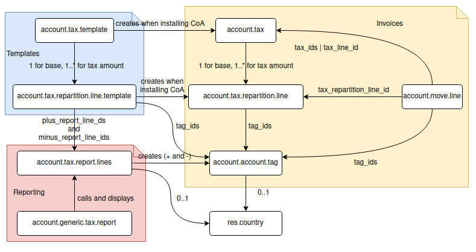

=======================
Accounting Localization
=======================

.. warning::

    This tutorial requires knowledges about how to build a module in Odoo (see
    :doc:`/developer/howtos/backend`).

How localization works
======================

On installing the `account <https://github.com/odoo/odoo/tree/15.0/addons/account>`__ module, the localization module corresponding to the country code of the company is installed automatically.
In case of no country code set or no localization module found, the `l10n_generic_coa <https://github.com/odoo/odoo/tree/15.0/addons/l10n_generic_coa>`__ (US) localization module is installed by default.
Check `post init hook <https://github.com/odoo/odoo/blob/15.0/addons/account/__init__.py>`__ for details.

For example, `l10n_ch <https://github.com/odoo/odoo/tree/15.0/addons/l10n_ch>`__ will be installed if the company has ``Switzerland`` as country.

Building a localization module
==============================

Structure of a basic ``l10n_XX`` module may be described as following ``__manifest__.py`` file:

.. code-block:: py

    {
        "name": "COUNTRY - Accounting",
        "version": "1.0.0",
        "category": "Accounting/Localizations/Account Charts",
        "license": "LGPL-3",
        "depends": [
            "account",
            # "l10n_multilang",
        ],
        "data": [
            # Chart of Accounts
            "data/account_chart_template_data.xml",
            "data/account_account_tag_data.xml",
            "data/account_account_template_data.xml",
            "data/account.group.template.csv",
            "data/l10n_XX_chart_post_data.xml",
            "data/account_chart_template_configure_data.xml",

            # Taxes
            "data/account_tax_group_data.xml",
            "data/account_tax_report_data.xml",
            "data/account_tax_template_data.xml",
            "data/account_fiscal_position_template_data.xml",
        ],
        "demo": [
            "demo/demo_company.xml",
        ]
    }

In the first file `data/account_chart_template_data.xml` we give name for the Chart of Accounts and set some basic fields. For example, for Swiss localization the file looks as following

.. code-block:: xml

    <?xml version="1.0" encoding="utf-8"?>
    <odoo>
        <record id="l10nch_chart_template" model="account.chart.template">
            <field name="name">Plan comptable 2015 (Suisse)</field>
            <field name="code_digits">4</field>
            <field name="bank_account_code_prefix">102</field>
            <field name="cash_account_code_prefix">100</field>
            <field name="transfer_account_code_prefix">1090</field>
            <field name="currency_id" ref="base.CHF"/>
            <field name="country_id" ref="base.ch"/>
            <field name="use_anglo_saxon" eval="False"/>
            <field name="spoken_languages" eval="'it_IT;de_DE;de_CH;fr_FR;fr_CH'"/>
        </record>
    </odoo>

.. note::

    Recommended **xmlid** for the record is `l10n_XX_chart_template`.
    It will be used for field `chart_template_id`, for example.
    If you need many chart of accounts, you can add some suffixes, i.e. `l10n_XX_chart_template_XXX`.

    **Number of digits** to use for account codes is specified in `code_digits` parameter.

    **Bank/cash code** prefixes are used to create *Suspense Account*, *Outstanding Payments*, *Outstanding Receipts* accounts, if those are not set implicitly in the chart template (see note below about `account_journal_suspense_account_id` field). It may be also used to create `default_account_id` in a new `account.journal` record.

    **Transfer code** is used to create a transfer account that is an intermediary
    account used when moving money from a liquidity account to another,
    e.g. internal transfer from one bank account to another bank account.

    **Spoken languages** instructs to load translations for Chart of Accounts on module installations. It's useful for countries with several official languages. To use this option you must add `l10n_multilang` to the module dependencies. List of supported lang codes can be found in `base/data/res.lang.csv <https://github.com/odoo/odoo/blob/15.0/odoo/addons/base/data/res.lang.csv>`__.

   To check the **currency** codes open `base/data/res_currency_data.xml <https://github.com/odoo/odoo/blob/15.0/odoo/addons/base/data/res_currency_data.xml>`__. And the **country** codes are listed in `base/data/res_country_data.xml <https://github.com/odoo/odoo/blob/15.0/odoo/addons/base/data/res_country_data.xml>`__.

Next settings for the chart of accounts are set in a separate file, because we need to provide `list of accounts <#accounts>`__ first. In `data/l10n_XX_chart_post_data.xml` we set some default accounts:

.. code-block:: xml

    <record id="l10n_XX_chart_template" model="account.chart.template">

      <!-- Receivable/payable accounts. -->
      <field name="property_account_receivable_id" ref="..."/>
      <field name="property_account_payable_id" ref="..."/>

      <!-- Default Income/Expense Account for a Product Template. -->
      <field name="property_account_income_id" ref="..."/>
      <field name="property_account_expense_id" ref="..."/>

      <!-- Default Income/Expense Account for a Product Category. -->
      <field name="property_account_income_categ_id" ref="..."/>
      <field name="property_account_expense_categ_id" ref="..."/>

      <!-- Cash loss/gain accounts. They correspond profit_account_id / loss_account_id fields -->
      <field name="default_cash_difference_income_account_id" ref="..."/>
      <field name="default_cash_difference_expense_account_id" ref="..."/>

      <!-- Loss/gain exchange rate accounts. -->
      <field name="income_currency_exchange_account_id" ref="..."/>
      <field name="expense_currency_exchange_account_id" ref="..."/>

      <!-- Stock valuation accounts. -->
      <field name="property_stock_account_input_categ_id" ref="..."/>
      <field name="property_stock_account_output_categ_id" ref="..."/>
      <field name="property_stock_valuation_account_id" ref="..."/>

      <!-- Tax accounts to  balance current/advance tax payments. -->
      <!-- It's used in `env['account.generic.tax.report']._generate_tax_closing_entries` -->
      <field name="property_tax_payable_account_id" ref="..."/>
      <field name="property_tax_receivable_account_id" ref="..."/>
      <field name="property_advance_tax_payment_account_id" ref="..."/>

      <!-- Base Tax Received Account -->
      <!-- Corresponds to `account_cash_basis_base_account_id` field. -->
      <!-- It's used for taxes with `tax_exigibility` equal to `on_payment` -->
      <field name="property_cash_basis_base_account_id" ref="..."/>

      <!-- POS account. -->
      <field name="default_pos_receivable_account_id" ref="..."/>

      <!-- Payment accounts. -->
      <!--
           Suspense account is used to register an unreconciled bank entries created via bank statement.
           Once it's reconciled, the suspense account in `account.move` will be replaced with a proper account.
           Suspense account is an exceptional case when an account is supposed to be replaced in the transaction.
           The new account depends on `account.payment` records. There are two cases
           1. `account.payment' exists before reconciliation aka Blue lines in reconciliation wizard
           2. `account.payment' is created on reconciliation aka regular Black lines in reconciliation wizard

           For case n.1 the new account is Outstanding Receipts/Payments account and the workflow is following:

           Initial transactions:
           * Invoice/bill: Payable/Receivable vs Expenses/Sales
           * Payment:             Outstanding vs Payable/Receivable
           After creating bank statement
           * Bank entry:                 Bank vs Suspense
           After reconciliation:
           * Bank entry:                 Bank vs Outstanding

           For case n.2 the new account is Payable/Receivable account from invoice/bill and the workflow is following:

           Initial transactions:
           * Invoice/bill: Payable/Receivable vs Expenses/Sales
           After creating bank statement
           * Bank entry:                 Bank vs Suspense
           After reconciliation:
           * Bank entry:                 Bank vs Payable/Receivable
      -->
      <field name="account_journal_suspense_account_id" ref="..."/>
      <!-- Outstanding Receipts Account -->
      <field name="account_journal_payment_debit_account_id" ref="..."/>
      <!-- Outstanding Payments Account -->
      <field name="account_journal_payment_credit_account_id" ref="..."/>

    </record>

For example, the Swiss file `data/l10n_ch_chart_post_data.xml` looks as following:

.. code-block:: xml

    <record id="l10nch_chart_template" model="account.chart.template">
        <field name="property_account_receivable_id" ref="ch_coa_1100"/>
        <field name="property_account_payable_id" ref="ch_coa_2000"/>
        <field name="property_account_expense_categ_id" ref="ch_coa_4200"/>
        <field name="property_account_income_categ_id" ref="ch_coa_3200"/>
        <field name="income_currency_exchange_account_id" ref="ch_coa_3806"/>
        <field name="expense_currency_exchange_account_id" ref="ch_coa_4906"/>
        <field name="default_pos_receivable_account_id" ref="ch_coa_1101" />
    </record>

The last step on installing Chart of Accounts is applying it on current company. File `data/account_chart_template_configure_data.xml` is responsible for that:

.. code-block:: xml

   <function model="account.chart.template" name="try_loading">
      <value eval="[ref('l10n_XX.l10n_XX_chart_template')]"/>
   </function>

Finally, you may add a demo company, so the localization can be easily tested in demo mode. Check `l10n_ch/demo/demo_company.xml <https://github.com/odoo/odoo/blob/15.0/addons/l10n_ch/demo/demo_company.xml>`__ for example.

Chart of Accounts
=================

Accounts
--------

Obviously, *Chart of Accounts* cannot exist without *Accounts*. You need to specify them in `data/account_account_template_data.xml`.

.. code-block:: xml

    <record id="..." model="account.account.template">
        <!-- Required fields -->
        <field name="name">XXX</field>
        <field name="code">XXX</field>
        <field name="user_type_id" ref="account.data_account_type_XXX" />
        <field name="chart_template_id" ref="l10n_XX_chart_template"/>

        <!-- [Optional] Extra information about account. -->
        <field name="note">This account is used for ...</field>

        <!-- [Optional] Specify a secondary currency for each account.move.line linked to this account. -->
        <field name="currency_id" ref="base.XXX"/>

        <!-- [Optional] Boolean to allow the user to reconcile entries in this account. True by default. -->
        <field name="reconcile" eval="False"/>

        <!-- [Optional] Account tags. -->
        <field name="tag_ids" eval="[(6, 0, [ref('l10n_XX.account_tag_XXX'), ref('l10n_XX.account_tag_YYY')])]" />
    </record>

.. note::

     You may use csv format instead. Check `l10n_ch/data/account.account.template.csv <https://github.com/odoo/odoo/blob/15.0/addons/l10n_ch/data/account.account.template.csv>`__ for example.

The ``user_type_id`` field requires a value of type ``account.account.type``.
Although some additional types could be created in a localization module, we encourage the usage of the existing types in the `account/data/data_account_type.xml <https://github.com/odoo/odoo/blob/15.0/addons/account/data/data_account_type.xml>`_ file.
The usage of these generic types ensures the generic reports working correctly in addition to those that you could create in your localization module.

.. warning::

    Avoid the usage of liquidity ``account.account.type``!
    Indeed, the bank & cash accounts are created directly at the installation of the localization module and then, are linked to an ``account.journal``.

.. warning::

    Only one account of type payable/receivable is enough.

.. warning::

    Don't create too much accounts: 200-300 is enough.

Account tags
------------

Tags is a way to sort accounts.
For example, imagine you want to create a financial report having multiple lines but you have no way to find a rule to dispatch the accounts according their ``code`` or ``name``.
The solution is the usage of tags, one for each report line, to filter accounts like you want.

Put the tags in `data/account_account_tag_data.xml` file:

.. code-block:: xml

    <record id="..." model="account.account.tag">
        <field name="name">...</field>

        <!-- Applicability: 'accounts', 'taxes' or 'products'. By default it's equal to 'accounts'. -->
        <field name="applicability">accounts</field>

        <!-- integer between 1 and 11 -->
        <field name="color" eval="8"/>

    </record>

Then apply tags on some accounts (field `tag_ids`). Examples:

* csv: `l10n_lt/data/account.account.template.csv <https://github.com/odoo/odoo/blob/15.0/addons/l10n_lt/data/account.account.template.csv>`__
* xml: `l10n_at/data/account_account_template.xml <https://github.com/odoo/odoo/blob/15.0/addons/l10n_at/data/account_account_template.xml>`__

Account groups
--------------

Account groups allows to describe structure of chart of accounts. Just check example from `l10n_il/data/account.group.template.csv <https://github.com/odoo/odoo/blob/15.0/addons/l10n_il/data/account.group.template.csv>`__:

+-----------------+-------------------+-----------------+-------------------------+---------------------------+
| id              | code_prefix_start | code_prefix_end | name                    | chart_template_id/id      |
+-----------------+-------------------+-----------------+-------------------------+---------------------------+
| il_group_100100 |            100100 |          100499 | Fixed Assets            | l10n_il.il_chart_template |
+-----------------+-------------------+-----------------+-------------------------+---------------------------+
| il_group_101110 |            101110 |          101400 | Current Assets          | l10n_il.il_chart_template |
+-----------------+-------------------+-----------------+-------------------------+---------------------------+
| il_group_101401 |            101401 |          101799 | Bank And Cash           | l10n_il.il_chart_template |
+-----------------+-------------------+-----------------+-------------------------+---------------------------+
| il_group_111000 |            111000 |          111999 | Current Liabilities     | l10n_il.il_chart_template |
+-----------------+-------------------+-----------------+-------------------------+---------------------------+
| il_group_112000 |            112000 |          112210 | Non-current Liabilities | l10n_il.il_chart_template |
+-----------------+-------------------+-----------------+-------------------------+---------------------------+
| il_group_200000 |            200000 |          200199 | Sales Income            | l10n_il.il_chart_template |
+-----------------+-------------------+-----------------+-------------------------+---------------------------+
| il_group_200200 |            200200 |          200300 | Other Income            | l10n_il.il_chart_template |
+-----------------+-------------------+-----------------+-------------------------+---------------------------+
| il_group_201000 |            201000 |          201299 | Cost of Goods           | l10n_il.il_chart_template |
+-----------------+-------------------+-----------------+-------------------------+---------------------------+
| il_group_202000 |            202000 |          220900 | Expenses                | l10n_il.il_chart_template |
+-----------------+-------------------+-----------------+-------------------------+---------------------------+
| il_group_300000 |            300000 |          399999 | Capital And Shares      | l10n_il.il_chart_template |
+-----------------+-------------------+-----------------+-------------------------+---------------------------+

Taxes
-----

To add taxes you first need to specify tax groups. It has just two fields: name and country. Create file `data/account_tax_group_data.xml` and list the groups:

.. code-block:: xml

    <?xml version="1.0" encoding="utf-8"?>
    <odoo>
        <data noupdate="1">
            <record id="tax_group_tva_0" model="account.tax.group">
                <field name="name">TVA 0%</field>
                <field name="country_id" ref="base.ch"/>
            </record>

            ...
        </data>
    </odoo>

Examples:

* xml: `l10n_ch/data/account_tax_group_data.xml <https://github.com/odoo/odoo/blob/15.0/addons/l10n_ch/data/account_tax_group_data.xml>`__
* csv: `l10n_uk/data/account.tax.group.csv <https://github.com/odoo/odoo/blob/15.0/addons/l10n_uk/data/account.tax.group.csv>`__

Now you can add the taxes via `data/account_tax_template_data.xml` file:

.. code-block:: xml

    <record id="tax_XXX" model="account.tax.template">
        <!-- [Required] Specify the name to display for this tax. -->
        <field name="name">XXX</field>

        <!-- [Required] Set the CoA owning this tax. -->
        <field name="chart_template_id" ref="l10n_XX_chart_template"/>

        <!-- [Optional] Define a tax group used to display the sums of taxes in the invoices. -->
        <field name="tax_group_id" ref="tax_group_XXX"/>

        <!-- [Required] Specify the amount.
        E.g. 7 with fixed amount_type means v + 7 if v is the amount on which the tax is applied.
         If amount_type is 'percent', the tax amount is v * 0.07. -->
        <field name="amount" eval="7"/>

        <!-- [Optional] Define the type of amount:
        * 'percent' for a classic percentage of price (default)
        * 'division' for percentage of Price Tax Included.
        * 'fixed' for a tax with a fixed amount,
        * 'group' for a group of taxes,
        By default, the type of amount is percentage. -->
        <field name="amount_type">percent</field>

        <!-- [Optional] Define some children taxes.
        /!\ Should be used only with an amount_type with 'group' set. -->
        <field name="children_tax_ids" eval="[(6,0,[ref('tax_XXX'), ref('tax_YYY')])]"/>

        <!-- [Optional] Define the tax's type:
        * 'sale' (default)
        * 'purchase'
        * 'none' - if tax can't be used by itself, but only in a group.
        -->
        <field name="type_tax_use">sale</field>

        <!-- [Optional] The sequence field is used to define order in which the tax lines are applied.
        By default, sequence = 1. -->
        <field name="sequence" eval="1"/>

        <!-- [Optional] Specify a short text to be displayed on invoices.
        For example, a tax named "15% on Services" can have the following label on invoice "15%". -->
        <field name="description">VAT 20%</field>

        <!-- [Optional] Boolean that indicates if the amount should be considered as included in price. False by default.
        E.g. Suppose v = 132 and a tax amount of 20.
        If price_include = False, the computed tax amount will be 132 * 0.2 = 26.4.
        If price_include = True, the computed tax amount will be 132 - (132 / 1.2) = 132 - 110 = 22. -->
        <field name="price_include" eval="False"/>

        <!-- [Optional] Boolean to set to include the amount to the base. False by default.
         If True, the subsequent taxes will be computed based on the base tax amount plus the amount of this tax.
         E.g. suppose v = 100, t1, a tax of 10% and another tax t2 with 20%.
         If t1 doesn't affects the base,
         t1 amount = 100 * 0.1 = 10 and t2 amount = 100 * 0.2 = 20.
         If t1 affects the base,
         t1 amount = 100 * 0.1 = 10 and t2 amount = 110 * 0.2 = 22.  -->
        <field name="include_base_amount" eval="False"/>

        <!-- [Optional] Boolean false by default.
         If set, the amount computed by this tax will be assigned to the same analytic account as the invoice line (if any). -->
        <field name="analytic" eval="False"/>

        <!-- [Optional] Define the tax exigibility:
          * 'on_invoice' - based on invoice (default value)
          * 'on_payment' - based on payment
        -->
        <field name="tax_exigibility">on_invoice</field>

        <!-- [Optional] Define a cash basis account in case of tax exigibility 'on_payment'.
          The account will contain the tax amount as long as the original invoice has not been reconciled;
          at reconciliation, this amount cancelled on this account and put on the regular tax account
          -->
        <field name="cash_basis_transition_account_id" ref="..."/>

        <!-- [Optional] Distribution when the tax is used on an invoice / a refund.
          Each distribution has following parameters:
          * `factor_percent` - Factor to apply on the account move lines generated from this distribution line, in percents
          * `repartition_type` - either 'base' or 'tax'
          * `account_id` - Account on which to post the tax amount
          * `plus_report_line_ids` - Tax report lines whose '+' tag will be assigned to move lines by this repartition line
          * `minus_report_line_ids` - Tax report lines whose '-' tag will be assigned to move lines by this repartition line
          -->
        <field name="invoice_repartition_line_ids" eval="[(5, 0, 0),
            (0,0, {
                'factor_percent': 100,
                'repartition_type': 'base',
                'plus_report_line_ids': [ref('tax_XXX'), ref('tax_YYY')],
            }),
        ]"/>
        <field name="refund_repartition_line_ids" eval="..."/>
    </record>

Check `l10n_ae/data/account_tax_template_data.xml <https://github.com/odoo/odoo/blob/15.0/addons/l10n_ae/data/account_tax_template_data.xml>`__ for example.

Tax Report
----------

In previous section you noticed fields `invoice_repartition_line_ids` / `refund_repartition_line_ids` and probably understand nothing about it. Good news: you are not alone on this incomprehension. Bad news: you have to figure it out a bit. The topic is complicated indeed:

But lucky we have a presentation explaining the tax reports in details:

.. youtube:: PuXE_NyFRTM
    :align: right
    :width: 700
    :height: 394

So, once you have properly configured taxes, you just need to add `data/account_tax_report_data.xml` file with a single record for `account.tax.report` in beginning:

.. code-block:: xml

    <?xml version="1.0" encoding="utf-8"?>
    <odoo>
        <record id="tax_report" model="account.tax.report">
            <field name="name">Tax Report</field>
            <field name="country_id" ref="base.XX"/>
        </record>

        ...
    </odoo>

... following by a list of records for `account.tax.report.line`. Check for example `l10n_au/data/account_tax_report_data.xml <https://github.com/odoo/odoo/blob/15.0/addons/l10n_au/data/account_tax_report_data.xml>`__. Meaning of the fields can be found directly in the `code <https://github.com/odoo/odoo/blob/15.0/addons/account/models/account_tax_report.py#L96>`__:

.. code-block:: py

    class AccountTaxReportLine(models.Model):
        _name = "account.tax.report.line"
        _description = "Account Tax Report Line"
        _order = "sequence"
        _parent_store = True

        name = fields.Char(
            string="Name",
            required=True,
            help="Complete name for this report line, to be used in report.",
        )
        tag_ids = fields.Many2many(
            string="Tags",
            comodel_name="account.account.tag",
            relation="account_tax_report_line_tags_rel",
            help="Tax tags populating this line",
        )
        report_action_id = fields.Many2one(
            string="Report Action",
            comodel_name="ir.actions.act_window",
            help="The optional action to call when clicking on this line in accounting reports.",
        )
        children_line_ids = fields.One2many(
            string="Children Lines",
            comodel_name="account.tax.report.line",
            inverse_name="parent_id",
            help="Lines that should be rendered as children of this one",
        )
        parent_id = fields.Many2one(
            string="Parent Line", comodel_name="account.tax.report.line"
        )
        sequence = fields.Integer(
            string="Sequence",
            required=True,
            help="Sequence determining the order of the lines in the report (smaller ones come first). "
                 "This order is applied locally per section "
                 "(so, children of the same line are always rendered one after the other).",
        )
        parent_path = fields.Char(index=True)
        report_id = fields.Many2one(
            string="Tax Report",
            required=True,
            comodel_name="account.tax.report",
            ondelete="cascade",
            help="The parent tax report of this line",
        )

        # helper to create tags (positive and negative) on report line creation
        tag_name = fields.Char(
            string="Tag Name",
            help="Short name for the tax grid corresponding to this report line. "
                 "Leave empty if this report line should not correspond to any such grid.",
        )

        # fields used in specific localization reports,
        # where a report line isn't simply the given by the sum of account.move.line with selected tags
        code = fields.Char(
            string="Code",
            help="Optional unique code to refer to this line in total formulas",
        )
        formula = fields.Char(
            string="Formula",
            help="Python expression used to compute the value of a total line. "
                 "This field is mutually exclusive with tag_name, setting it turns the line to a total line. "
                 "Tax report line codes can be used as variables in this expression to refer to the balance "
                 "of the corresponding lines in the report. A formula cannot refer to another line using a formula.",
        )

        # fields used to carry over amounts between periods

        # The selection should be filled in localizations using the system
        carry_over_condition_method = fields.Selection(
            selection=[
                ("no_negative_amount_carry_over_condition", "No negative amount"),
                ("always_carry_over_and_set_to_0", "Always carry over and set to 0"),
            ],
            string="Method",
            help="The method used to determine if this line should be carried over.",
        )
        carry_over_destination_line_id = fields.Many2one(
            string="Destination",
            comodel_name="account.tax.report.line",
            domain="[('report_id', '=', report_id)]",
            help="The line to which the value of this line will be carried over to if needed."
            " If left empty the line will carry over to itself.",
        )
        carryover_line_ids = fields.One2many(
            string="Carryover lines",
            comodel_name="account.tax.carryover.line",
            inverse_name="tax_report_line_id",
        )
        is_carryover_persistent = fields.Boolean(
            string="Persistent",
            help="Defines how this report line creates carry over lines when performing tax closing."
            "If true, the amounts carried over will always be added on top of each other: "
            "for example, a report line with a balance of 10 with an existing carryover of 50 "
            "will add an additional 10 to it when doing the closing, making a total carryover of 60. "
            "If false, the total carried over amount will be forced to the total of this report line: "
            "a report line with a balance of 10 with an existing carryover of 50 will create a new "
            "carryover line of -40, so that the total carryover becomes 10.",
            default=True,
        )
        is_carryover_used_in_balance = fields.Boolean(
            string="Used in line balance",
            help="If set, the carryover amount for this line will be used when calculating its balance in the report."
            "This means that the carryover could affect other lines if they are using this one in their computation.",
        )

Fiscal positions
----------------

.. note::

    If you need more information about what is a fiscal position and how it works in Odoo,
    please refer to :doc:`/applications/finance/accounting/taxation/taxes/fiscal_positions`.

Specify fiscal positions in `data/account_fiscal_position_template_data.xml` file as following:

.. code-block:: xml

    <record id="..." model="account.fiscal.position.template">
        <!-- [Required] Specify the name to display for this fiscal position. -->
        <field name="name">...</field>

        <!-- [Required] Set the CoA owning this fiscal position. -->
        <field name="chart_template_id" ref="l10n_XX_chart_template"/>

        <!-- [Optional] Can be used to specify priorities of the fiscal positions.
             When few fiscal positions are available, the one with lowest value is used.
             Zero by default -->
        <field name="sequence">10</field>

        <!-- [Optional] Add some additional notes. -->
        <field name="note">...</field>

        <!-- [Optional] Apply automatically this fiscal position. False by default-->
        <field name="auto_apply" eval="False"/>

        <!-- [Optional] When set to True, it can be applied only if partner has VAT number. False by default -->
        <field name="vat_required" eval="True"/>

        <!-- [Optional] Different ways to restrict fiscal position usage depending on delivery address.
             All values are empty by default.
        -->
        <field name="country_id" ref="base.es"/>
        <field name="zip_from">...</field>
        <field name="zip_to">...</field>
        <!-- You can also set country group. In this case counry_id, zip_from, zip_to are supposed to be empty
        <field name="country_group_id" ref="base.europe"/>
        -->
    </record>

You may have as many fiscal position as you need. Check `l10n_es/data/account_fiscal_position_template_data.xml <https://github.com/odoo/odoo/blob/15.0/addons/l10n_es/data/account_fiscal_position_template_data.xml>`__ for example.

Accounting reports
==================

Accounting reports should be added via a separate module **l10n_XX_reports** that should go to the `enterprise repository <https://github.com/odoo/enterprise>`__.

Basic `__manifest__.py` file for such a module looks as following:

.. code-block:: py

    {
        "name": "COUNTRY - Accounting Reports",
        "category": "Accounting/Localizations/Reporting",
        "version": "1.0.0",
        "license": "OEEL-1",
        "depends": [
            "l10n_XX", "account_reports"
        ],
        "data": [
            "data/account_financial_html_report_data.xml",
        ],
        "auto_install": True,
    }

Functional overview of financial reports is here: :doc:`/applications/finance/accounting/reporting/overview/main_reports`.

Some good examples:

* `l10n_ch_reports/data/account_financial_html_report_data.xml <https://github.com/odoo/enterprise/blob/15.0/l10n_ch_reports/data/account_financial_html_report_data.xml>`__
* `l10n_be_reports/data/account_financial_html_report_data.xml <https://github.com/odoo/enterprise/blob/15.0/l10n_be_reports/data/account_financial_html_report_data.xml>`__

For the fields meaning dive directly to the source:

* `account.financial.html.report (v15) <https://github.com/odoo/enterprise/blob/d4eff9d39469cf3fe18589a1547cb0cdb93f4ae9/account_reports/models/account_financial_report.py#L59-L75>`__
* `account.financial.html.report.line (v15) <https://github.com/odoo/enterprise/blob/d4eff9d39469cf3fe18589a1547cb0cdb93f4ae9/account_reports/models/account_financial_report.py#L931-L964>`__

Menu for the new report is created automatically. By default it's located under *Accounting >> Reporting* menu.
To create a dedicated section in Reporting menu, you need to create new `ir.ui.menu` record (usually in the main `l10n_XX` module) and set it as `parent_id` field in `account.financial.html.report` model. Example for Belgium localization:

* `ir.ui.menu record in l10n_be <https://github.com/odoo/odoo/blob/15.0/addons/l10n_be/data/menuitem_data.xml>`__
* `parent_id field in l10n_be_reports (v15) <https://github.com/odoo/enterprise/blob/d4eff9d39469cf3fe18589a1547cb0cdb93f4ae9/l10n_be_reports/data/account_financial_html_report_data.xml#L11>`__
