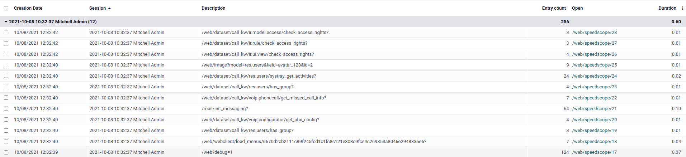
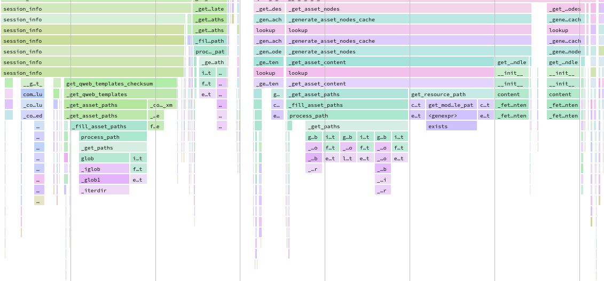
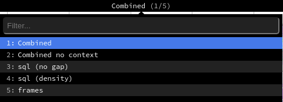

:custom-css: performance.css

===========
Performance
===========

.. _performance/profiling:

Profiling
=========

.. currentmodule:: odoo.tools.profiler

Profiling is about analysing the execution of a program and measure aggregated data. These data can
be the elapsed time for each function, the executed SQL queries...

While profiling does not improve the performance of a program by itself, it can prove very helpful
in finding performance issues and identifying which part of the program is responsible for them.

Odoo provides an integrated profiling tool that allows recording all executed queries and stack
traces during execution. It can be used to profile either a set of requests of a user session, or a
specific portion of code. Profiling results can be either inspected with the integrated `speedscope
<https://github.com/jlfwong/speedscope>`_ :dfn:`open source app allowing to visualize a flamegraph`
view or analyzed with custom tools by first saving them in a JSON file or in the database.

.. _performance/profiling/enable:

Enable the profiler
-------------------

The profiler can either be enabled from the user interface, which is the easiest way to do so but
allows profiling only web requests, or from Python code, which allows profiling any piece of code
including tests.

.. tabs::

   .. tab:: Enable from the user interface

      #. :ref:`Enable the developer mode <developer-mode>`.
      #. Before starting a profiling session, the profiler must be enabled globally on the database.
         This can be done in two ways:

         - Open the :ref:`developer mode tools <developer-mode/tools>`, then toggle the
           :guilabel:`Enable profiling` button. A wizard suggests a set of expiry times for the
           profiling. Click on :guilabel:`ENABLE PROFILING` to enable the profiler globally.

           .. image:: performance/enable_profiling_wizard.png

         - Go to :guilabel:`Settings --> General Settings --> Performance` and set the desired time to
           the field :guilabel:`Enable profiling until`.

      #. After the profiler is enabled on the database, users can enable it on their session. To do
         so, toggle the :guilabel:`Enable profiling` button in the :ref:`developer mode tools
         <developer-mode/tools>` again. By default, the recommended options :guilabel:`Record
         sql` and :guilabel:`Record traces` are enabled. To learn more about the different options,
         head over to :ref:`performance/profiling/collectors`.

         .. image:: performance/profiling_debug_menu.png

      When the profiler is enabled, all the requests made to the server are profiled and saved into
      an `ir.profile` record. Such records are grouped into the current profiling session which
      spans from when the profiler was enabled until it is disabled.

      .. note::
         Odoo Online databases cannot be profiled.

   .. tab:: Enable from Python code

      Starting the profiler manually can be convenient to profile a specific method or a part of the
      code. This code can be a test, a compute method, the entire loading, etc.

      To start the profiler from Python code, call it as a context manager. You may specify *what*
      you want to record through the parameters. A shortcut is available for profiling test classes:
      :code:`self.profile()`. See :ref:`performance/profiling/collectors` for more information on
      the `collectors` parameter.

      .. example::

         .. code-block:: python

            with Profiler():
                do_stuff()

      .. example::

         .. code-block:: python

            with Profiler(collectors=['sql', PeriodicCollector(interval=0.1)]):
                do_stuff()

      .. example::

         .. code-block:: python

            with self.profile():
                with self.assertQueryCount(__system__=1211):
                    do_stuff()

         .. note::
            The profiler is called outside of the `assertQueryCount` in order to catch queries made
            when exiting the context manager (e.g., flush).

      .. autoclass:: Profiler()
         :special-members: __init__

      When the profiler is enabled, all executions of a test method are profiled and saved into an
      `ir.profile` record. Such records are grouped into a single profiling session. This is
      especially useful when using the :code:`@warmup` and :code:`@users` decorators.

      .. tip::
         It can be complicated to analyze profiling results of a method that is called several times
         because all the calls are grouped together in the stack trace. Add an **execution context**
         as a context manager to break down the results into multiple frames.

         .. example::

            .. code-block:: python

               for index in range(max_index):
                   with ExecutionContext(current_index=index):  # Identify each call in speedscope results.
                       do_stuff()

.. _performance/profiling/analyse:

Analyse the results
-------------------

To browse the profiling results, make sure that the :ref:`profiler is enabled globally on the
database <performance/profiling/enable>`, then open the :ref:`developer mode tools
<developer-mode/tools>` and click on the button in the top-right corner of the profiling
section. A list view of the `ir.profile` records grouped by profiling session opens.

Each record has a clickable link that opens the speedscope results in a new tab.

Speedscope falls out of the scope of this documentation but there are a lot of tools to try: search,
highlight of similar frames, zoom on frame, timeline, left heavy, sandwich view...

Depending on the profiling options that were activated, Odoo generates different view modes that you
can access from the top menu.

- The :guilabel:`Combined` view shows all the SQL queries and traces merged togethers.
- The :guilabel:`Combined no context` view shows the same result but ignores the saved execution
  context <performance/profiling/enable>`.
- The :guilabel:`sql (no gap)` view shows all the SQL queries as if they were executed one after
  another, without any Python logic. This is useful for optimizing SQL only.
- The :guilabel:`sql (density)` view shows only all the SQL queries, leaving gap between them. This
  can be useful to spot if eiter SQL or Python code is the problem, and to identify zones in where
  many small queries could be batched.
- The :guilabel:`frames` view shows the results of only the :ref:`periodic collector
  <performance/profiling/collectors/periodic>`.

.. important::
   Even though the profiler has been designed to be as light as possible, it can still impact
   performance, especially when using the :ref:`Sync collector
   <performance/profiling/collectors/sync>`. Keep that in mind when analyzing speedscope results.

.. _performance/profiling/collectors:

Collectors
----------

Whereas the profiler is about the *when* of profiling, the collectors take care of the *what*.

Each collector specializes in collecting profiling data in its own format and manner. They can be
individually enabled from the user interface through their dedicated toggle button in the
:ref:`developer mode tools <developer-mode/tools>`, or from Python code through their key or
class.

There are currently four collectors available in Odoo:

.. list-table::
   :header-rows: 1

   * - Name
     - Toggle button
     - Python key
     - Python class
   * - :ref:`SQL collector <performance/profiling/collectors/sql>`
     - :guilabel:`Record sql`
     - `sql`
     - `SqlCollector`
   * - :ref:`Periodic collector <performance/profiling/collectors/periodic>`
     - :guilabel:`Record traces`
     - `traces_async`
     - `PeriodicCollector`
   * - :ref:`QWeb collector <performance/profiling/collectors/qweb>`
     - :guilabel:`Record qweb`
     - `qweb`
     - `QwebCollector`
   * - :ref:`Sync collector <performance/profiling/collectors/sync>`
     - No
     - `traces_sync`
     - `SyncCollector`

By default, the profiler enables the SQL and the Periodic collectors. Both when it is enabled from
the user interface or Python code.

.. _performance/profiling/collectors/sql:

SQL collector
~~~~~~~~~~~~~

The SQL collector saves all the SQL queries made to the database in the current thread (for all
cursors), as well as the stack trace. The overhead of the collector is added to the analysed thread
for each query, which means that using it on a lot of small queries may impact execution time and
other profilers.

It is especially useful to debug query counts, or to add information to the :ref:`Periodic collector
<performance/profiling/collectors/periodic>` in the combined speedscope view.

.. autoclass:: SQLCollector

.. _performance/profiling/collectors/periodic:

Periodic collector
~~~~~~~~~~~~~~~~~~

This collector runs in a separate thread and saves the stack trace of the analysed thread at every
interval. The interval (by default 10 ms) can be defined through the :guilabel:`Interval` option in
the user interface, or the `interval` parameter in Python code.

.. warning::
   If the interval is set at a very low value, profiling long requests will generate memory issues.
   If the interval is set at a very high value, information on short function executions will be
   lost.

It is one of the best way to analyse performance as it should have a very low impact on the
execution time thanks to its separate thread.

.. autoclass:: PeriodicCollector

.. _performance/profiling/collectors/qweb:

QWeb collector
~~~~~~~~~~~~~~

This collector saves the Python execution time and queries of all directives. As for the :ref:`SQL
collector <performance/profiling/collectors/sql>`, the overhead can be important when executing a
lot of small directives. The results are different from other collectors in terms of collected data,
and can be analysed from the `ir.profile` form view using a custom widget.

It is mainly useful for optimizing views.

.. autoclass:: QwebCollector

.. _performance/profiling/collectors/sync:

Sync collector
~~~~~~~~~~~~~~

This collector saves the stack for every function's call and return and runs on the same thread,
which greatly impacts performance.

It can be useful to debug and understand complex flows, and follow their execution in the code. It
is however not recommended for performance analysis because the overhead is high.

.. autoclass:: SyncCollector

.. _performance/profiling/pitfalls:

Performance pitfalls
--------------------

- Be careful with randomness. Multiple executions may lead to different results. E.g., a garbage
  collector being triggered during execution.
- Be careful with blocking calls. In some cases, external `c_call` may take some time before
  releasing the GIL, thus leading to unexpected long frames with the :ref:`Periodic collector
  <performance/profiling/collectors/periodic>`. This should be detected by the profiler and give a
  warning. It is possible to trigger the profiler manually before such calls if needed.
- Pay attention to the cache. Profiling before that the `view`/`assets`/... are in cache can lead to
  different results.
- Be aware of the profiler's overhead. The :ref:`SQL collector
  <performance/profiling/collectors/sql>`'s overhead can be important when a lot of small queries
  are executed. Profiling is practical to spot a problem but you may want to disable the profiler in
  order to measure the real impact of a code change.
- Profiling results can be memory intensive. In some cases (e.g., profiling an install or a long
  request), it is possible that you reach memory limit, especially when rendering the speedscope
  results, which can lead to an HTTP 500 error. In this case, you may need to start the server with
  a higher memory limit: `--limit-memory-hard $((8*1024**3))`.

.. _performance/good_practices:

Good practices
==============

.. _performance/good_practices/batch:

Batch operations
----------------

When working with recordsets, it is almost always better to batch operations.

.. example::
   Don't call a method that runs SQL queries while looping over a recordset because it will do so
   for each record of the set.

   .. rst-class:: bad-example
   .. code-block:: python

      def _compute_count(self):
          for record in self:
              domain = [('related_id', '=', record.id)]
              record.count = other_model.search_count(domain)

   Instead, replace the `search_count` with a `_read_group` to execute one SQL query for the entire
   batch of records.

   .. rst-class:: good-example
   .. code-block:: python

      def _compute_count(self):
          domain = [('related_id', 'in', self.ids)]
          counts_data = other_model._read_group(domain, ['related_id'], ['__count'])
          mapped_data = dict(counts_data)
          for record in self:
              record.count = mapped_data.get(record, 0)

   .. note::
      This example is not optimal nor correct in all cases. It is only a substitute for a
      `search_count`. Another solution could be to prefetch and count the inverse `One2many` field.

.. example::
   Don't create records one after another.

   .. rst-class:: bad-example
   .. code-block:: python

      for name in ['foo', 'bar']:
          model.create({'name': name})

   Instead, accumulate the create values and call the `create` method on the batch. Doing so has
   mostly no impact and helps the framework optimize fields computation.

   .. rst-class:: good-example
   .. code-block:: python

      create_values = []
      for name in ['foo', 'bar']:
          create_values.append({'name': name})
      records = model.create(create_values)

.. example::
   Fail to prefetch the fields of a recordset while browsing a single record inside a loop.

   .. rst-class:: bad-example
   .. code-block:: python

      for record_id in record_ids:
          model.browse(record_id)
          record.foo  # One query is executed per record.

   Instead, browse the entire recordset first.

   .. rst-class:: good-example
   .. code-block:: python

      records = model.browse(record_ids)
      for record in records:
          record.foo  # One query is executed for the entire recordset.

   We can verify that the records are prefetched in batch by reading the field `prefetch_ids` which
   includes each of the record ids.browsing all records together is unpractical,

   If needed, the `with_prefetch` method can be used to disable batch prefetching:

   .. code-block:: python

      for values in values_list:
          message = self.browse(values['id']).with_prefetch(self.ids)

.. _performance/good_practices/algorithmic_complexity:

Reduce the algorithmic complexity
---------------------------------

Algorithmic complexity is a measure of how long an algorithm would take to complete in regard to the
size `n` of the input. When the complexity is high, the execution time can grow quickly as the input
becomes larger. In some cases, the algorithmic complexity can be reduced by preparing the input's
data correctly.

.. example::
   For a given problem, let's consider a naive algorithm crafted with two nested loops for which the
   complexity in in O(n²).

   .. rst-class:: bad-example
   .. code-block:: python

      for record in self:
          for result in results:
              if results['id'] == record.id:
                  record.foo = results['foo']
                  break

   Assuming that all results have a different id, we can prepare the data to reduce the complexity.

   .. rst-class:: good-example
   .. code-block:: python

      mapped_result = {result['id']: result['foo'] for result in results}
      for record in self:
          record.foo = mapped_result.get(record.id)

.. example::
   Choosing the bad data structure to hold the input can lead to quadratic complexity.

   .. rst-class:: bad-example
   .. code-block:: python

      invalid_ids = self.search(domain).ids
      for record in self:
          if record.id in invalid_ids:
              ...

   If `invalid_ids` is a list-like data structure, the complexity of the algorithm may be quadratic.

   Instead, prefer using set operations like casting `invalid_ids` to a set.

   .. rst-class:: good-example
   .. code-block:: python

      invalid_ids = set(invalid_ids)
      for record in self:
          if record.id in invalid_ids:
              ...

   Depending on the input, recordset operations can also be used.

   .. rst-class:: good-example
   .. code-block:: python

      invalid_ids = self.search(domain)
      for record in self - invalid_ids:
          ...

.. _performance/good_practices/index:

Use indexes
-----------

Database indexes can help fasten search operations, be it from a search in the or through the user
interface.

.. code-block:: python

   name = fields.Char(string="Name", index=True)

.. warning::
   Be careful not to index every field as indexes consume space and impact on performance when
   executing one of `INSERT`, `UPDATE`, and `DELETE`.
