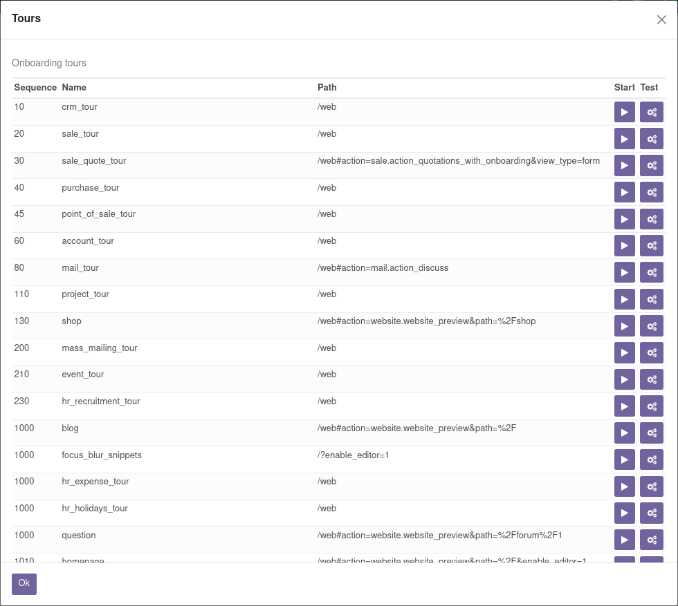

.. _reference/testing:

============
Testing Odoo
============

There are many ways to test an application.  In Odoo, we have three kinds of
tests

- Python unit tests (see `Testing Python code`_): useful for testing model business logic
- JS unit tests (see `Testing JS code`_): useful to test the javascript code in isolation
- Tours (see `Integration Testing`_): tours simulate a real situation. They ensures that the
  python and the javascript parts properly talk to each other.

.. _testing/python:

Testing Python code
===================

Odoo provides support for testing modules using `Python's unittest library
<https://docs.python.org/3/library/unittest.html>`_.

To write tests, simply define a ``tests`` sub-package in your module, it will
be automatically inspected for test modules. Test modules should have a name
starting with ``test_`` and should be imported from ``tests/__init__.py``,
e.g.

.. code-block:: text

    your_module
    ├── ...
    ├── tests
    |   ├── __init__.py
    |   ├── test_bar.py
    |   └── test_foo.py

and ``__init__.py`` contains::

    from . import test_foo, test_bar

.. warning::

    test modules which are not imported from ``tests/__init__.py`` will not be
    run

The test runner will simply run any test case, as described in the official
`unittest documentation`_, but Odoo provides a number of utilities and helpers
related to testing Odoo content (modules, mainly):

.. autoclass:: odoo.tests.TransactionCase
    :members: browse_ref, ref

.. autoclass:: odoo.tests.SingleTransactionCase
    :members: browse_ref, ref

.. autoclass:: odoo.tests.HttpCase
    :members: browse_ref, ref, url_open, browser_js

.. autofunction:: odoo.tests.tagged

By default, tests are run once right after the corresponding module has been
installed. Test cases can also be configured to run after all modules have
been installed, and not run right after the module installation::

  # coding: utf-8
  from odoo.tests import HttpCase, tagged

  # This test should only be executed after all modules have been installed.
  @tagged('-at_install', 'post_install')
  class WebsiteVisitorTests(HttpCase):
    def test_create_visitor_on_tracked_page(self):
        Page = self.env['website.page']

The most common situation is to use
:class:`~odoo.tests.TransactionCase` and test a property of a model
in each method::

    class TestModelA(TransactionCase):
        def test_some_action(self):
            record = self.env['model.a'].create({'field': 'value'})
            record.some_action()
            self.assertEqual(
                record.field,
                expected_field_value)

        # other tests...

.. note::

    Test methods must start with ``test_``

.. autoclass:: odoo.tests.Form
    :members:

.. autoclass:: odoo.tests.M2MProxy
    :members: add, remove, clear

.. autoclass:: odoo.tests.O2MProxy
    :members: new, edit, remove

Running tests
-------------

Tests are automatically run when installing or updating modules if
:option:`--test-enable <odoo-bin --test-enable>` was enabled when starting the
Odoo server.

.. _unittest documentation: https://docs.python.org/3/library/unittest.html

.. _developer/reference/testing/selection:

Test selection
--------------

In Odoo, Python tests can be tagged to facilitate the test selection when
running tests.

Subclasses of :class:`odoo.tests.BaseCase` (usually through
:class:`~odoo.tests.TransactionCase` or
:class:`~odoo.tests.HttpCase`) are automatically tagged with
``standard`` and ``at_install`` by default.

Invocation
~~~~~~~~~~

:option:`--test-tags <odoo-bin --test-tags>` can be used to select/filter tests
to run on the command-line. It implies :option:`--test-enable <odoo-bin --test-enable>`,
so it's not necessary to specify :option:`--test-enable <odoo-bin --test-enable>`
when using :option:`--test-tags <odoo-bin --test-tags>`.

This option defaults to ``+standard`` meaning tests tagged ``standard``
(explicitly or implicitly) will be run by default when starting Odoo
with :option:`--test-enable <odoo-bin --test-enable>`.

When writing tests, the :func:`~odoo.tests.tagged` decorator can be
used on **test classes** to add or remove tags.

The decorator's arguments are tag names, as strings.

.. danger:: :func:`~odoo.tests.tagged` is a class decorator, it has no
            effect on functions or methods

Tags can be prefixed with the minus (``-``) sign, to *remove* them instead of
add or select them e.g. if you don't want your test to be executed by
default you can remove the ``standard`` tag:

.. code-block:: python

    from odoo.tests import TransactionCase, tagged

    @tagged('-standard', 'nice')
    class NiceTest(TransactionCase):
        ...

This test will not be selected by default, to run it the relevant tag will
have to be selected explicitly:

.. code-block:: console

    $ odoo-bin --test-tags nice

Note that only the tests tagged ``nice`` are going to be executed. To run
*both* ``nice`` and ``standard`` tests, provide multiple values to
:option:`--test-tags <odoo-bin --test-tags>`: on the command-line, values
are *additive* (you're selecting all tests with *any* of the specified tags)

.. code-block:: console

    $ odoo-bin --test-tags nice,standard

The config switch parameter also accepts the ``+`` and ``-`` prefixes. The
``+`` prefix is implied and therefore, totally optional. The ``-`` (minus)
prefix is made to deselect tests tagged with the prefixed tags, even if they
are selected by other specified tags e.g. if there are ``standard`` tests which
are also tagged as ``slow`` you can run all standard tests *except* the slow
ones:

.. code-block:: console

    $ odoo-bin --test-tags 'standard,-slow'

When you write a test that does not inherit from the
:class:`~odoo.tests.BaseCase`, this test will not have the default tags,
you have to add them explicitly to have the test included in the default test
suite.  This is a common issue when using a simple ``unittest.TestCase`` as
they're not going to get run:

.. code-block:: python

    import unittest
    from odoo.tests import tagged

    @tagged('standard', 'at_install')
    class SmallTest(unittest.TestCase):
        ...

Besides tags you can also specify specific modules, classes or functions to
test. The full syntax of the format accepted by :option:`--test-tags <odoo-bin --test-tags>`
is:

.. code-block:: text

    [-][tag][/module][:class][.method]

So if you want to test the `stock_account` module, you can use:

    .. code-block:: console

        $ odoo-bin --test-tags /stock_account

If you want to test a specific function with a unique name, it can be specified
directly:

    .. code-block:: console

        $ odoo-bin --test-tags .test_supplier_invoice_forwarded_by_internal_user_without_supplier

This is equivalent to

    .. code-block:: console

        $ odoo-bin --test-tags /account:TestAccountIncomingSupplierInvoice.test_supplier_invoice_forwarded_by_internal_user_without_supplier

if the name of the test is unambiguous. Multiple modules, classes and functions
can be specified at once separated by a `,` like with regular tags.

.. _reference/testing/tags:

Special tags
~~~~~~~~~~~~

- ``standard``: All Odoo tests that inherit from
  :class:`~odoo.tests.BaseCase` are implicitly tagged standard.
  :option:`--test-tags <odoo-bin --test-tags>` also defaults to ``standard``.

  That means untagged test will be executed by default when tests are enabled.
- ``at_install``: Means that the test will be executed right after the module
  installation and before other modules are installed. This is a default
  implicit tag.
- ``post_install``: Means that the test will be executed after all the modules
  are installed. This is what you want for HttpCase tests most of the time.

  Note that this is *not exclusive* with ``at_install``, however since you
  will generally not want both ``post_install`` is usually paired with
  ``-at_install`` when tagging a test class.

Examples
~~~~~~~~

.. important::

    Tests will be executed only in installed modules. If you're starting from
    a clean database, you'll need to install the modules with the
    :option:`-i <odoo-bin -i>` switch at least once. After that it's no longer
    needed, unless you need to upgrade the module, in which case
    :option:`-u <odoo-bin -u>` can be used. For simplicity, those switches are
    not specified in the examples below.

Run only the tests from the sale module:

.. code-block:: console

    $ odoo-bin --test-tags /sale

Run the tests from the sale module but not the ones tagged as slow:

.. code-block:: console

    $ odoo-bin --test-tags '/sale,-slow'

Run only the tests from stock or tagged as slow:

.. code-block:: console

    $ odoo-bin --test-tags '-standard, slow, /stock'

.. note:: ``-standard`` is implicit (not required), and present for clarity

Testing JS code
===============

Testing a complex system is an important safeguard to prevent regressions and to
guarantee that some basic functionality still works. Since Odoo has a non trivial
codebase in Javascript, it is necessary to test it. In this section, we will
discuss the practice of testing JS code in isolation: these tests stay in the
browser, and are not supposed to reach the server.

.. _reference/testing/qunit:

Qunit test suite
----------------

The Odoo framework uses the QUnit_ library testing framework as a test runner.
QUnit defines the concepts of *tests* and *modules* (a set of related tests),
and gives us a web based interface to execute the tests.

For example, here is what a pyUtils test could look like:

.. code-block:: javascript

    QUnit.module('py_utils');

    QUnit.test('simple arithmetic', function (assert) {
        assert.expect(2);

        var result = pyUtils.py_eval("1 + 2");
        assert.strictEqual(result, 3, "should properly evaluate sum");
        result = pyUtils.py_eval("42 % 5");
        assert.strictEqual(result, 2, "should properly evaluate modulo operator");
    });

The main way to run the test suite is to have a running Odoo server, then
navigate a web browser to ``/web/tests``.  The test suite will then be executed
by the web browser Javascript engine.

.. image:: testing/tests.png
    :align: center

The web UI has many useful features: it can run only some submodules, or
filter tests that match a string. It can show every assertions, failed or passed,
rerun specific tests, ...

.. warning::

    While the test suite is running, make sure that:

    - your browser window is focused,
    - it is not zoomed in/out. It needs to have exactly 100% zoom level.

    If this is not the case, some tests will fail, without a proper explanation.

Testing Infrastructure
----------------------

Here is a high level overview of the most important parts of the testing
infrastructure:

- there is an asset bundle named `web.qunit_suite`_.  This bundle contains
  the main code (assets common + assets backend), some libraries, the QUnit test
  runner and the test bundles listed below.

- a bundle named `web.tests_assets`_ includes most of the assets and utils required
  by the test suite: custom QUnit asserts, test helpers, lazy loaded assets, etc.

- another asset bundle, `web.qunit_suite_tests`_, contains all the test scripts.
  This is typically where the test files are added to the suite.

- there is a `controller`_ in web, mapped to the route */web/tests*. This controller
  simply renders the *web.qunit_suite* template.

- to execute the tests, one can simply point its browser to the route */web/tests*.
  In that case, the browser will download all assets, and QUnit will take over.

- there is some code in `qunit_config.js`_ which logs in the console some
  information when a test passes or fails.

- we want the runbot to also run these tests, so there is a test (in `test_js.py`_)
  which simply spawns a browser and points it to the *web/tests* url.  Note that
  the browser_js method spawns a Chrome headless instance.

Modularity and testing
----------------------

With the way Odoo is designed, any addon can modify the behaviour of other parts
of the system.  For example, the *voip* addon can modify the *FieldPhone* widget
to use extra features.  This is not really good from the perspective of the
testing system, since this means that a test in the addon web will fail whenever
the voip addon is installed (note that the runbot runs the tests with all addons
installed).

At the same time, our testing system is good, because it can detect whenever
another module breaks some core functionality.  There is no complete solution to
this issue.  For now, we solve this on a case by case basis.

Usually, it is not a good idea to modify some other behaviour.  For our voip
example, it is certainly cleaner to add a new *FieldVOIPPhone* widget and
modify the few views that needs it.  This way, the *FieldPhone* widget is not
impacted, and both can be tested.

Adding a new test case
----------------------

Let us assume that we are maintaining an addon *my_addon*, and that we
want to add a test for some javascript code (for example, some utility function
myFunction, located in *my_addon.utils*). The process to add a new test case is
the following:

1. create a new file *my_addon/static/tests/utils_tests.js*. This file contains the basic code to
   add a QUnit module *my_addon > utils*.

    .. code-block:: javascript

        odoo.define('my_addon.utils_tests', function (require) {
        "use strict";

        var utils = require('my_addon.utils');

        QUnit.module('my_addon', {}, function () {

            QUnit.module('utils');

        });
        });

2. In *my_addon/assets.xml*, add the file to the main test assets:

    .. code-block:: xml

        <?xml version="1.0" encoding="utf-8"?>
        <odoo>
            <template id="qunit_suite_tests" name="my addon tests" inherit_id="web.qunit_suite_tests">
                <xpath expr="//script[last()]" position="after">
                    <script type="text/javascript" src="/my_addon/static/tests/utils_tests.js"/>
                </xpath>
            </template>
        </odoo>

3. Restart the server and update *my_addon*, or do it from the interface (to
   make sure the new test file is loaded)

4. Add a test case after the definition of the *utils* sub test suite:

    .. code-block:: javascript

        QUnit.test("some test case that we want to test", function (assert) {
            assert.expect(1);

            var result = utils.myFunction(someArgument);
            assert.strictEqual(result, expectedResult);
        });

5. Visit */web/tests/* to make sure the test is executed

Helper functions and specialized assertions
-------------------------------------------

Without help, it is quite difficult to test some parts of Odoo. In particular,
views are tricky, because they communicate with the server and may perform many
rpcs, which needs to be mocked.  This is why we developed some specialized
helper functions, located in `test_utils.js`_.

- Mock test functions: these functions help setting up a test environment. The
  most important use case is mocking the answers given by the Odoo server. These
  functions use a `mock server`_. This is a javascript class that simulates
  answers to the most common model methods: read, search_read, nameget, ...

- DOM helpers: useful to simulate events/actions on some specific target. For
  example, testUtils.dom.click performs a click on a target.  Note that it is
  safer than doing it manually, because it also checks that the target exists,
  and is visible.

- create helpers: they are probably the most important functions exported by
  `test_utils.js`_.  These helpers are useful to create a widget, with a mock
  environment, and a lot of small detail to simulate as much as possible the
  real conditions.  The most important is certainly `createView`_.

- `qunit assertions`_: QUnit can be extended with specialized assertions. For
  Odoo, we frequently test some DOM properties. This is why we made some
  assertions to help with that.  For example, the *containsOnce* assertion takes
  a widget/jQuery/HtmlElement and a selector, then checks if the target contains
  exactly one match for the css selector.

For example, with these helpers, here is what a simple form test could look like:

.. code-block:: javascript

    QUnit.test('simple group rendering', function (assert) {
        assert.expect(1);

        var form = testUtils.createView({
            View: FormView,
            model: 'partner',
            data: this.data,
            arch: '<form string="Partners">' +
                    '<group>' +
                        '<field name="foo"/>' +
                    '</group>' +
                '</form>',
            res_id: 1,
        });

        assert.containsOnce(form, 'table.o_inner_group');

        form.destroy();
    });

Notice the use of the testUtils.createView helper and of the containsOnce
assertion.  Also, the form controller was properly destroyed at the end of
the test.

Best Practices
--------------

In no particular order:

- all test files should be added in *some_addon/static/tests/*
- for bug fixes, make sure that the test fails without the bug fix, and passes
  with it.  This ensures that it actually works.
- try to have the minimal amount of code necessary for the test to work.
- usually, two small tests are better than one large test.  A smaller test is
  easier to understand and to fix.
- always cleanup after a test.  For example, if your test instantiates a widget,
  it should destroy it at the end.
- no need to have full and complete code coverage.  But adding a few tests helps
  a lot: it makes sure that your code is not completely broken, and whenever a
  bug is fixed, it is really much easier to add a test to an existing test suite.
- if you want to check some negative assertion (for example, that a HtmlElement
  does not have a specific css class), then try to add the positive assertion in
  the same test (for example, by doing an action that changes the state). This
  will help avoid the test to become dead in the future (for example, if the css
  class is changed).

Tips
----

- running only one test: you can (temporarily!) change the *QUnit.test(...)*
  definition into *QUnit.only(...)*.  This is useful to make sure that QUnit
  only runs this specific test.
- debug flag: most create utility functions have a debug mode (activated by the
  debug: true parameter).  In that case, the target widget will be put in the DOM
  instead of the hidden qunit specific fixture, and more information will be
  logged. For example, all mocked network communications will be available in the
  console.
- when working on a failing test, it is common to add the debug flag, then
  comment the end of the test (in particular, the destroy call).  With this, it
  is possible to see the state of the widget directly, and even better, to
  manipulate the widget by clicking/interacting with it.

.. _reference/testing/integration-testing:

Integration Testing
===================

Testing Python code and JS code separately is very useful, but it does not prove that the web client
and the server work together.  In order to do that, we can write another kind of test: tours.  A
tour is a mini scenario of some interesting business flow.  It explains a sequence of steps that
should be followed.  The test runner will then create a PhantomJs browser, point it to the proper
url and simulate the click and inputs, according to the scenario.

Writing a test tour
-------------------

Structure
~~~~~~~~~

To write a test tour for `your_module`, start with creating the required files:

.. code-block:: text

    your_module
    ├── ...
    ├── static
    |   └── tests
    |       └── tours
    |           └── your_tour.js
    ├── tests
    |   ├── __init__.py
    |   └── test_calling_the_tour.py
    └── __manifest__.py

You can then:

- update :file:`__manifest__.py` to add :file:`your_tour.js` in the assets.

  .. code-block:: python

     'assets': {
         'web.assets_tests': [
             'your_module/static/tests/tours/your_tour.js',
         ],
     },

- update :file:`__init__.py` in the folder :file:`tests` to import :file:`test_calling_the_tour`.

.. seealso::
   - :ref:`Assets Bundle <reference/assets_bundle>`
   - :ref:`testing/python`

Javascript
~~~~~~~~~~

#. Setup your tour by registering it.

   .. code-block:: javascript

      /** @odoo-module **/
      import tour from 'web_tour.tour';
      tour.register('rental_product_configurator_tour', {
          url: '/web',  // Here, you can specify any other starting url
          test: true,
      }, [
          // Your sequence of steps
      ]);

#. Add any step you want.

Every step contains at least a trigger. You can either use the `predefined steps
<{GITHUB_PATH}/addons/web_tour/static/src/tour_service/tour_utils.js#L426>`_ or write your own personalized
step.

Here are some example of steps:

.. example::

   .. code-block:: javascript

      // First step
      tour.stepUtils.showAppsMenuItem(),
      // Second step
      {
          trigger: '.o_app[data-menu-xmlid="your_module.maybe_your_module_menu_root"]',
          edition: 'community'  // Optional
      }, {
          // Third step
      },

.. example::

   .. code-block:: javascript

      {
          trigger: '.js_product:has(strong:contains(Chair floor protection)) .js_add',
          extra_trigger: '.oe_advanced_configurator_modal',  // This ensure we are in the wizard
      },

.. example::

   .. code-block:: javascript

      {
          trigger: 'a:contains("Add a product")',
          // Extra-trigger to make sure a line is added before trying to add another one
          extra_trigger: '.o_field_many2one[name="product_template_id"] .o_external_button',
      },

Here are some possible arguments for your personalized steps:

- **trigger**: Selector/element to ``run`` an action on. The tour will
  wait until the element exists and is visible before ``run``-ing the
  action *on it*.
- **extra_trigger**: Optional secondary condition for the step to
  ``run``. Will be waited for like the **trigger** element but the
  action will not run on the extra trigger.

  Useful to have a precondition, or two different and unrelated
  conditions.
- **run**: Action to perform on the *trigger* element.

  By default, tries to set the **trigger**'s content to ``Text`` if
  it's an ``input``, otherwise ``click`` it.

  The action can also be:

  - A function, synchronous, executed with the trigger's ``Tip`` as
    context (``this``) and the action helpers as parameter.
  - The name of one of the action helpers, which will be run on the
    trigger element:

    .. rst-class::  o-definition-list

    ``click``
        Clicks the element, performing all the relevant intermediate
        events.
    :samp:`text {content}`
        Clicks (focuses) the element then sets ``content`` as the
        element's value (if an input), option (if a select), or
        content.
    ``dblclick``, ``tripleclick``
        Same as ``click`` with multiple repetitions.
    ``clicknoleave``
        By default, ``click`` (and variants) will trigger "exit"
        events on the trigger element (mouseout, mouseleave). This
        helper suppresses those (note: further clicks on other
        elements will not trigger those events implicitly).
    ``text_blur``
        Similar to ``text`` but follows the edition with ``focusout``
        and ``blur`` events.
    :samp:`drag_and_drop {target}`
       Simulates the dragging of the **trigger** element over to the
       ``target``.
- **edition**: Optional,

  - If you don't specify an edition, the step will be active in both community and enterprise.
  - Sometimes, a step will be different in enterprise or in community. You can then write two
    steps, one for the enterprise edition and one for the community one.
  - Generally, you want to specify an edition for steps that use the main menu as the main
    menus are different in community and enterprise.
- **position**: Optional, ``"top"``, ``"right"``, ``"bottom"``, or
  ``"left"``. Where to position the tooltip relative to the **target**
  when running interactive tours.
- **content**: Optional but recommended, the content of the tooltip in
  interactive tours, also logged to the console so very useful to
  trace and debug automated tours.
- **auto**: Whether the tour manager should wait for the user to
  perform the action if the tour is interactive, defaults to
  ``false``.
- **in_modal**: If set the **trigger** element will be searched only
  in the top modal window, defaults to ``false``.
- **timeout**: How long to wait until the step can ``run``, in
  milliseconds, 10000 (10 seconds).

.. important::

   The last step(s) of a tour should always return the client to a
   "stable" state (e.g. no ongoing editions) and ensure all
   side-effects (network requests) have finished running to avoid race
   conditions or errors during teardown.

.. seealso::
   - `jQuery documentation about find <https://api.jquery.com/find/>`_

Python
~~~~~~

To start a tour from a python test, make the class inherit from
:class:`~odoo.tests.HTTPCase`, and call `start_tour`:

.. code-block:: python

   def test_your_test(self):
       # Optional Setup
       self.start_tour("/web", 'your_module.your_tour_name', login="admin")
       # Optional verifications

Debugging tips
--------------

Observing tours in a browser
~~~~~~~~~~~~~~~~~~~~~~~~~~~~

There are two ways with different tradeoffs:

``watch=True``
**************

When running a tour locally via the test suite, the ``watch=True``
parameter can be added to the ``browser_js`` or ``start_tour``
call::

    self.start_tour("/web", code, watch=True)

This will automatically open a Chrome window with the tour being
run inside it.

**Advantages**
  - always works if the tour has Python setup / surrounding code, or multiple steps
  - runs entirely automatically (just select the test which launches the tour)
  - transactional (*should* always be runnable multiple times)
**Drawbacks**
  - only works locally
  - only works if the test / tour can run correctly locally

Run via browser
***************

Tours can also be launched via the browser UI, either by calling

.. code-block:: javascript

    odoo.startTour(tour_name);

in the javascript console, or by enabling :ref:`tests mode
<frontend/framework/tests_debug_mode>` by setting ``?debug=tests`` in
the URL, then selecting **Start Tour** in the debug menu and picking a
tour:

**Advantages**
  - easier to run
  - can be used on production or test sites, not just local instances
  - allows running in "Onboarding" mode (manual steps)
**Drawbacks**
  - harder to use with test tours involving Python setup
  - may not work multiple times depending on tour side-effects

.. tip::

   It's possible to use this method to observe or interact with tours
   which require Python setup:

   - add a *python* breakpoint before the relevant tour is started
     (``start_tour`` or ``browser_js`` call)
   - when the breakpoint is hit, open the instance in your browser
   - run the tour

   At this point the Python setup will be visible to the browser, and
   the tour will be able to run.

   You may want to comment the ``start_tour`` or ``browser_js`` call
   if you also want the test to continue afterwards, depending on the
   tour's side-effects.

Screenshots and screencasts during browser_js tests
~~~~~~~~~~~~~~~~~~~~~~~~~~~~~~~~~~~~~~~~~~~~~~~~~~~

When running tests that use ``HttpCase.browser_js`` from the command line, the Chrome
browser is used in headless mode. By default, if a test fails, a PNG screenshot is
taken at the moment of the failure and written in

.. code-block:: console

  '/tmp/odoo_tests/{db_name}/screenshots/'

Two new command line arguments were added since Odoo 13.0 to control this behavior:
:option:`--screenshots <odoo-bin --screenshots>` and :option:`--screencasts <odoo-bin --screencasts>`

Introspecting / debugging steps
~~~~~~~~~~~~~~~~~~~~~~~~~~~~~~~

When trying to fix / debug a tour, the screenshots (on failure) are
not necessarily sufficient. In that case it can be useful to see
what's happening at some or each step.

While this is pretty easy when in an "onboarding" (as they're mostly
driven explicitly by the user) it's more complicated when running
"test" tours, or when running tours through the test suite. In that
case there are two main tricks:

- Have a step with a ``run() { debugger; }`` action.

  This can be added to an existing step, or can be a new dedicated
  step. Once the step's **trigger** is matched, the execution will
  stop all javascript execution.

  **Advantages**
    - very simple
    - the tour restarts as soon as you resume execution
  **Drawbacks**
    - page interaction is limited as all javascript is blocked
    - debugging the inside of the tour manager is not very useful
- Add a step with a trigger which never succeeds and a very long
  ``timeout``.

  The browser will wait for the **trigger** until the ``timeout``
  before it fails the tour, this allows inspecting and interacting
  with the page until the developer is ready to resume, by manually
  enabling the **trigger** (a nonsense class is useful there, as it
  can be triggered by adding the class to any visible element of the
  page).

  **Advantages**
    - allows interacting with the page
    - easy to apply to a step which times out (just add a long
      ``timeout`` then look around)
    - no useless (for this situation) debugger UI
  **Drawbacks**
    - more manual, especially when resuming

Performance Testing
===================

Query counts
------------

One of the ways to test performance is to measure database queries. Manually, this can be tested with the
`--log-sql` CLI parameter. If you want to establish the maximum number of queries for an operation,
you can use the :meth:`~odoo.tests.BaseCase.assertQueryCount` method, integrated in Odoo test classes.

.. code-block:: python

    with self.assertQueryCount(11):
        do_something()

.. _qunit: https://qunitjs.com/
.. _qunit_config.js: https://github.com/odoo/odoo/blob/51ee0c3cb59810449a60dae0b086b49b1ed6f946/addons/web/static/tests/helpers/qunit_config.js#L49
.. _web.tests_assets: https://github.com/odoo/odoo/blob/51ee0c3cb59810449a60dae0b086b49b1ed6f946/addons/web/views/webclient_templates.xml#L594
.. _web.qunit_suite: https://github.com/odoo/odoo/blob/51ee0c3cb59810449a60dae0b086b49b1ed6f946/addons/web/views/webclient_templates.xml#L660
.. _web.qunit_suite_tests: https://github.com/odoo/odoo/blob/51ee0c3cb59810449a60dae0b086b49b1ed6f946/addons/web/views/webclient_templates.xml#L680
.. _controller: https://github.com/odoo/odoo/blob/51ee0c3cb59810449a60dae0b086b49b1ed6f946/addons/web/controllers/main.py#L637
.. _test_js.py: https://github.com/odoo/odoo/blob/51ee0c3cb59810449a60dae0b086b49b1ed6f946/addons/web/tests/test_js.py#L13
.. _test_utils.js: https://github.com/odoo/odoo/blob/51ee0c3cb59810449a60dae0b086b49b1ed6f946/addons/web/static/tests/helpers/test_utils.js
.. _mock server: https://github.com/odoo/odoo/blob/51ee0c3cb59810449a60dae0b086b49b1ed6f946/addons/web/static/tests/helpers/mock_server.js
.. _qunit assertions: https://github.com/odoo/odoo/blob/51ee0c3cb59810449a60dae0b086b49b1ed6f946/addons/web/static/tests/helpers/qunit_asserts.js
.. _createView: https://github.com/odoo/odoo/blob/51ee0c3cb59810449a60dae0b086b49b1ed6f946/addons/web/static/tests/helpers/test_utils_create.js#L267
