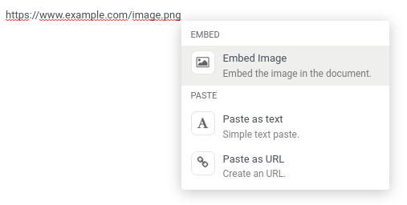
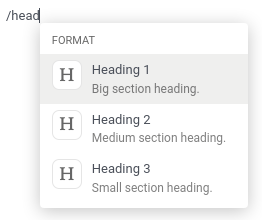

===========
Odoo Editor
===========

Odoo Editor is Odoo's own rich text editor. Its sources can be found in the
`odoo-editor directory
<{GITHUB_PATH}/addons/web_editor/static/src/js/editor/odoo-editor>`_.

Powerbox
========

The Powerbox is a piece of user interface that contains
:ref:`commands <reference/frontend/odoo_editor/powerbox/command>` organized
into :ref:`categories <reference/frontend/odoo_editor/powerbox/category>`. It
appears when typing `/` in the editor. The commands can be filtered when the
user inputs text, and navigated with the arrow keys.

.. image:: odoo_editor/powerbox.png
   :align: center
   :alt: The Powerbox opened after typing "/".

Modifying the Powerbox
----------------------

Only one Powerbox should be instantiated at the time, and that job is done by
the editor itself. Its Powerbox instance can be found in its `powerbox` instance
variable.
To change the Powerbox's contents and options, change the options passed to the
editor before it gets instantiated.

.. important::
   Never instantiate the Powerbox yourself. Always use the current editor's own
   instance instead.

.. example::
    Say we want to add a new command `Document` to the Powerbox, just for the
    `mass_mailing` module. We want to add it to a new category called
    `Documentation` and we want it all the way at the top of the Powerbox.

    `mass_mailing` `extends
    <{GITHUB_PATH}/addons/mass_mailing/static/src/js/wysiwyg.js>`_
    `web_editor`'s `Wysiwyg class
    <{GITHUB_PATH}/addons/web_editor/static/src/js/wysiwyg/wysiwyg.js>`_, which
    instantiates the editor in its `start` method. Before doing so, it
    calls its own `_getPowerboxOptions` method, which can conveniently be
    overridden to add our new commands.

    Since `mass_mailing` already overrides `_getPowerboxOptions`, let's just add
    our new command to it:

    .. code-block:: javascript

      _getPowerboxOptions: function () {
          const options = this._super();
          // (existing code before the return statement)
          options.categories.push({
              name: _t('Documentation'),
              priority: 300,
          });
          options.commands.push({
              name: _t('Document'),
              category: _t('Documentation'),
              description: _t("Add this text to your mailing's documentation"),
              fontawesome: 'fa-book',
              priority: 1, // This is the only command in its category anyway.
          });
          return options;
      }

    .. important::
      In order to allow the names and descriptions of your commands and
      categories to be translated, make sure to wrap them in the `_t` function.

    .. tip::
      To avoid out-of-control escalations, don't use random numbers for your
      priorities: look at which other priorities already exist and choose your
      value accordingly (like you would do for a `z-index`).

Opening a custom Powerbox
-------------------------

It is possible to open the Powerbox with a custom set of categories and
commands, bypassing all pre-existing ones. To do that, call the `open` method of
the Powerbox and pass it your custom commands and categories.

         image URL.

.. example::
    We need the current instance of the Powerbox, which can be found in the
    current editor. In the `Wysiwyg class
    <{GITHUB_PATH}/addons/web_editor/static/src/js/wysiwyg/wysiwyg.js>`_, you
    will find it as `this.odooEditor.powerbox`.

    Now to open it with our custom "Document" command in a custom
    "Documentation" category:

    .. code-block:: javascript

      this.odooEditor.powerbox.open(
          [{
              name: _t('Document'),
              category: _t('Documentation'),
              description: _t("Add this text to your mailing's documentation"),
              fontawesome: 'fa-book',
              priority: 1, // This is the only command in its category anyway.
          }],
          [{
              name: _t('Documentation'),
              priority: 300,
          }]
      );

Filtering commands
------------------

There are three ways to filter commands:

#. Via the `powerboxFilters`
   :ref:`Powerbox option <reference/frontend/odoo_editor/powerbox/options>`.
#. Via a given
   :ref:`command <reference/frontend/odoo_editor/powerbox/command>`'s
   `isDisabled` entry.
#. The user can filter commands by simply typing text after opening the
   Powerbox. It will fuzzy-match that text with the names of the categories and
   commands.

Reference
---------

.. _reference/frontend/odoo_editor/powerbox/category:

Category
~~~~~~~~

.. list-table::
    :widths: 20 20 60
    :header-rows: 1

    * - Name
      - Type
      - Description
    * - `name`
      - `string`
      - the name of the category
    * - `priority`
      - `number`
      - used to order the category: a category with a higher priority is
        displayed higher into the Powerbox (categories with the same priority
        are ordered alphabetically)

.. note::
    If several categories exist with the same name, they will be grouped into
    one. Its priority will be that defined in the version of the category that
    was declared last.

.. _reference/frontend/odoo_editor/powerbox/command:

Command
~~~~~~~

.. list-table::
    :widths: 20 20 60
    :header-rows: 1

    * - Name
      - Type
      - Description
    * - `name`
      - `string`
      - the name of the command
    * - `category`
      - `string`
      - the name of the category the command belongs to
    * - `description`
      - `string`
      - a short text to describe the command
    * - `fontawesome`
      - `string`
      - the name of a *Font Awesome* that will serve as the command's icon
    * - `priority`
      - `number`
      - used to order the command: a command with a higher priority is displayed
        higher into the Powerbox (commands with the same priority are ordered
        alphabetically)
    * - `callback`
      - `function` (`() => void`)
      - the function to execute when the command is picked (can be asynchronous)
    * - `isDisabled` (optional)
      - `function` (`() => void`)
      - a function used to disable the command under certain conditions (when it
        returns `true`, the command will be disabled)

.. note::
    If the command points to a category that doesn't exist yet, that category
    will be created and appended at the end of the Powerbox.

.. _reference/frontend/odoo_editor/powerbox/options:

Options
~~~~~~~

The following options can be passed to OdooEditor, that will then be passed to
the instance of the Powerbox:

.. list-table::
    :widths: 20 20 60
    :header-rows: 1

    * - Name
      - Type
      - Description
    * - `commands`
      - `array of commands`
      - commands to add to the default defined by the editor
    * - `categories`
      - `array of categories`
      - categories to add to the default defined by the editor
    * - `powerboxFilters`
      - `array of functions` (`commands => commands`)
      - functions used to filter commands displayed in the Powerbox
    * - `getContextFromParentRect`
      - `function` (`() => DOMRect`)
      - a function that returns the `DOMRect` of an ancestor of the editor (can
        be useful when the editor is in an iframe)
