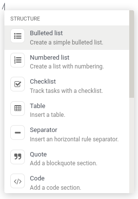

===========
Odoo Editor
===========

Odoo Editor is Odoo's own rich text editor. Its sources can be found in the
`odoo-editor directory
<{GITHUB_PATH}/addons/web_editor/static/src/js/editor/odoo-editor>`_.

Tests
=====

The editor comes with its own series of unit tests that can be seen at the route
*/web_editor/tests*.

Powerbox
========

The Powerbox is a piece of user interface that contains *commands* organized
into *categories*. The commands can be filtered when the user inputs text, and
navigated with the arrow keys.

Instantiation
-------------

:file:`OdooEditor.js` instantiates the Powerbox in its own constructor and stores it
in its `powerbox` instance variable.

Odoo Editor passes it a set of default commands and categories, along with any
Powerbox options passed to the editor (see :file:`OdooEditor.js`'s
`_createPowerbox` method).

Options
-------

The following options can be passed to OdooEditor, that will then be passed to
the instance of the Powerbox:

- `commands`: an *array of commands* to add to the default defined by the editor
  (more details on commands below).
- `categories`: an *array of categories* to add to the default defined by the
  editor (more details on commands below).
- `powerboxFilters`: an *array of functions* (*commands => commands*) used to
  filter commands displayed in the Powerbox (more details on filters below).
- `getContextFromParentRect`: a *function* that returns the `DOMRect` of an
  ancestor of the editor. Can be useful when the editor is in an iframe.

Commands
--------

A command is the basic building block of the Powerbox. It's an object with the
following keys:

- `category`: a *string* pointing to the name of the category the command
  belongs to.
- `priority`: a *number* used to order the command. A command with a higher
  priority is displayed higher into the Powerbox. Commands with the same
  category are ordered alphabetically.
- `name`: a *string* to name the command.
- `description`: a *string* to describe the command.
- `fontawesome`: a *string* containing the fontawesome class name to the
  command's icon.
- `callback`: a *function* (*() => void*) to execute when the command is picked.
  Can be asynchronous.
- `isDisabled`: an *optional function* (*() => boolean*) used to disable the
  command under certain conditions. When the function returns `true`, the
  command will be disabled.

.. note::
    If the command points to a category that doesn't exist yet, that category
    will be created and appended at the end of the Powerbox.

Categories
----------

A category is used to group commands together. It's an object with the following
keys:

- `name`: a *string* to name the category.
- `priority`: a *number* used to order the category. A category with a higher
  priority is displayed higher into the Powerbox. Categories with the same
  category are ordered alphabetically.

.. note::
    If several categories exist with the same name, they will be grouped into
    one. Its priority will be that defined in the version of the category that
    was declared last.

Filters
-------

There are three ways to filter commands:

#. Via the `powerboxFilters` Powerbox option. It's a *function* that takes the
   current commands and returns them filtered.
#. Via a given command's `isDisabled` entry. It's a *function* that simply
   returns `true` when the command should be disabled.
#. The user can filter commands by simply typing text after opening the
   Powerbox. It will fuzzy-match that text with the names of the categories and
   commands.

Opening the Powerbox
--------------------

Odoo Editor *opens* it whenever the user inputs the character `/` (after an
`input` event). The editor itself then handles the removal of the character and
optional filter characters (via hooks to the Powerbox that revert the history).

The Powerbox can also be opened programmatically by simply calling its `open`
method. The `open` method takes two optional arguments `commands` and
`categories` which make it possible to replace the Powerbox instance's commands
and categories.
