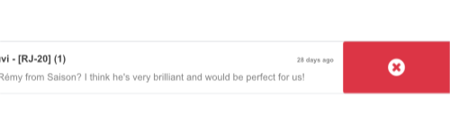

.. _frontend/components:

==============
Owl components
==============

The Odoo Javascript framework uses a custom component framework called Owl. It
is a declarative component system, loosely inspired by Vue and React. Components
are defined using :doc:`QWeb templates <qweb>`, enriched with some Owl
specific directives. The official
`Owl documentation <https://github.com/odoo/owl/blob/master/doc/readme.md>`_
contains a complete reference and a tutorial.

.. important::

   Although the code can be found in the `web` module, it is maintained from a
   separate GitHub repository. Any modification to Owl should therefore be made
   through a pull request on https://github.com/odoo/owl.

.. note::
   Currently, all Odoo versions (starting in version 14) share the same Owl version.

Using Owl components
====================

The `Owl documentation`_ already documents in detail the Owl framework, so this
page will only provide Odoo specific information. But first, let us see how we
can make a simple component in Odoo.

.. code-block:: javascript

    import { Component, xml, useState } from "@odoo/owl";

    class MyComponent extends Component {
        static template = xml`
            

                <t t-esc="state.value">
            

        `;

        setup() {
            this.state = useState({ value: 1 });
        }

        increment() {
            this.state.value++;
        }
    }

This example shows that Owl is available as a library in the global namespace as
`owl`: it can simply be used like most libraries in Odoo. Note that we
defined here the template as a static property, but without using the `static`
keyword, which is not available in some browsers (Odoo javascript code should
be Ecmascript 2019 compliant).

We define here the template in the javascript code, with the help of the `xml`
helper. However, it is only useful to get started. In practice, templates in
Odoo should be defined in an xml file, so they can be translated. In that case,
the component should only define the template name.

In practice, most components should define 2 or 3 files, located at the same
place: a javascript file (`my_component.js`), a template file (`my_component.xml`)
and optionally a scss (or css) file (`my_component.scss`). These files should
then be added to some assets bundle. The web framework will take care of
loading the javascript/css files, and loading the templates into Owl.

Here is how the component above should be defined:

.. code-block:: javascript

    import { Component, useState } from "@odoo/owl";

    class MyComponent extends Component {
        static template = 'myaddon.MyComponent';

        ...
    }

And the template is now located in the corresponding xml file:

.. code-block:: xml

    <?xml version="1.0" encoding="UTF-8" ?>
    <templates xml:space="preserve">

    <t t-name="myaddon.MyComponent">
      

        <t t-esc="state.value"/>
      

    </t>

    </templates>

.. note::

   Template names should follow the convention `addon_name.ComponentName`.

.. seealso::
    - `Owl Repository <https://github.com/odoo/owl>`_

.. _frontend/owl/best_practices:

Best practices
==============

First of all, components are classes, so they have a constructor. But constructors
are special methods in javascript that are not overridable in any way. Since this
is an occasionally useful pattern in Odoo, we need to make sure that no component
in Odoo directly uses the constructor method. Instead, components should use the
`setup` method:

.. code-block:: javascript

    // correct:
    class MyComponent extends Component {
        setup() {
            // initialize component here
        }
    }

    // incorrect. Do not do that!
    class IncorrectComponent extends Component {
        constructor(parent, props) {
            // initialize component here
        }
    }

Another good practice is to use a consistent convention for template names:
`addon_name.ComponentName`. This prevents name collision between odoo addons.

Reference List
==============

The Odoo web client is built with `Owl <https://github.com/odoo/owl>`_ components.
To make it easier, the Odoo javascript framework provides a suite of generic
components that can be reused in some common situations, such as dropdowns,
checkboxes or datepickers. This page explains how to use these generic components.

.. list-table::
   :widths: 30 70
   :header-rows: 1

   * - Technical Name
     - Short Description
   * - :ref:`ActionSwiper <frontend/owl/actionswiper>`
     - a swiper component to perform actions on touch swipe
   * - :ref:`CheckBox <frontend/owl/checkbox>`
     - a simple checkbox component with a label next to it
   * - :ref:`ColorList <frontend/owl/colorlist>`
     - a list of colors to choose from
   * - :ref:`Dropdown <frontend/owl/dropdown>`
     - full-featured dropdown
   * - :ref:`Notebook <frontend/owl/notebook>`
     - a component to navigate between pages using tabs
   * - :ref:`Pager <frontend/pager>`
     - a small component to handle pagination
   * - :ref:`SelectMenu <frontend/select_menu>`
     - a dropdown component to choose between different options
   * - :ref:`TagsList <frontend/tags_list>`
     - a list of tags displayed in rounded pills

.. _frontend/owl/actionswiper:

ActionSwiper
------------

Location
~~~~~~~~

`@web/core/action_swiper/action_swiper`

Description
~~~~~~~~~~~

This is a component that can perform actions when an element is swiped
horizontally. The swiper is wrapping a target element to add actions to it.
The action is executed once the user has released the swiper passed
a portion of its width.

.. code-block:: xml

  <ActionSwiper onLeftSwipe="Object" onRightSwipe="Object">
    <SomeElement/>
  </ActionSwiper>

The simplest way to use the component is to use it around your target element directly
in an xml template as shown above. But sometimes, you may want to extend an existing element
and would not want to duplicate the template. It is possible to do just that.

If you want to extend the behavior of an existing element, you must place the element
inside, by wrapping it directly. Also, you can conditionnally add props to manage when the
element might be swipable, its animation and the minimum portion to swipe to perform the action.

You can use the component to interact easily with records, messages, items in lists and much more.

The following example creates a basic ActionSwiper component.
Here, the swipe is enabled in both directions.

.. code-block:: xml

  <ActionSwiper
    onRightSwipe="
      {
        action: '() => Delete item',
        icon: 'fa-delete',
        bgColor: 'bg-danger',
      }"
    onLeftSwipe="
      {
        action: '() => Star item',
        icon: 'fa-star',
        bgColor: 'bg-warning',
      }"
  >
    

      Swipable item
    

  </ActionSwiper>

.. note:: Actions are permuted when using right-to-left (RTL) languages.

Props
~~~~~

.. list-table::
    :widths: 20 20 60
    :header-rows: 1

    * - Name
      - Type
      - Description
    * - `animationOnMove`
      - `Boolean`
      - optional boolean to determine if a translate effect is present during the swipe
    * - `animationType`
      - `String`
      - optional animation that is used after the swipe ends (`bounce` or `forwards`)
    * - `onLeftSwipe`
      - `Object`
      - if present, the actionswiper can be swiped to the left
    * - `onRightSwipe`
      - `Object`
      - if present, the actionswiper can be swiped to the right
    * - `swipeDistanceRatio`
      - `Number`
      - optional minimum width ratio that must be swiped to perform the action

You can use both `onLeftSwipe` and `onRightSwipe` props at the same time.

The `Object`'s used for the left/right swipe must contain:

    - `action`, which is the callable `Function` serving as a callback.
      Once the swipe has been completed in the given direction, that action
      is performed.
    - `icon` is the icon class to use, usually to represent the action.
      It must be a `string`.
    - `bgColor` is the background color, given to decorate the action.
      can be one of the following `bootstrap contextual color
      <https://getbootstrap.com/docs/3.3/components/#available-variations>`_ (`danger`,
      `info`, `secondary`, `success` or `warning`).

    Those values must be given to define the behavior and the visual aspect
    of the swiper.

Example: Extending existing components
~~~~~~~~~~~~~~~~~~~~~~~~~~~~~~~~~~~~~~

In the following example, you can use `xpath`'s to wrap an existing element
in the ActionSwiper component. Here, a swiper has been added to mark
a message as read in mail.

.. code-block:: xml

  <xpath expr="//*[hasclass('o_Message')]" position="after">
    <ActionSwiper
      onRightSwipe="messaging.device.isMobile and messageView.message.isNeedaction ?
        {
          action: () => messageView.message.markAsRead(),
          icon: 'fa-check-circle',
          bgColor: 'bg-success',
        } : undefined"
    />
  </xpath>
  <xpath expr="//ActionSwiper" position="inside">
    <xpath expr="//*[hasclass('o_Message')]" position="move"/>
  </xpath>

.. _frontend/owl/checkbox:

CheckBox
--------

Location
~~~~~~~~

`@web/core/checkbox/checkbox`

Description
~~~~~~~~~~~

This is a simple checkbox component with a label next to it. The checkbox is
linked to the label: the checkbox is toggled whenever the label is clicked.

.. code-block:: xml

  <CheckBox value="boolean" disabled="boolean" t-on-change="onValueChange">
    Some Text
  </CheckBox>

Props
~~~~~

.. list-table::
    :widths: 20 20 60
    :header-rows: 1

    * - Name
      - Type
      - Description
    * - `value`
      - `boolean`
      - if true, the checkbox is checked, otherwise it is unchecked
    * - `disabled`
      - `boolean`
      - if true, the checkbox is disabled, otherwise it is enabled

.. _frontend/owl/colorlist:

ColorList
---------

Location
~~~~~~~~

`@web/core/colorlist/colorlist`

Description
~~~~~~~~~~~

The ColorList let you choose a color from a predefined list. By default, the component displays the current
selected color, and is not expandable until the `canToggle` props is present. Different props can change its
behavior, to always expand the list, or make it act as a toggler once it is clicked, to display the list of
available colors until a choice is selected.

Props
~~~~~

.. list-table::
    :widths: 20 20 60
    :header-rows: 1

    * - Name
      - Type
      - Description
    * - `canToggle`
      - `boolean`
      - optional. Whether the colorlist can expand the list on click
    * - `colors`
      - `array`
      - list of colors to display in the component. Each color has a unique `id`
    * - `forceExpanded`
      - `boolean`
      - optional. If true, the list is always expanded
    * - `isExpanded`
      - `boolean`
      - optional. If true, the list is expanded by default
    * - `onColorSelected`
      - `function`
      - callback executed once a color is selected
    * - `selectedColor`
      - `number`
      - optional. The color `id` that is selected

Color `id`'s are the following:

.. list-table::
    :header-rows: 1

    * - Id
      - Color
    * - `0`
      - `No color`
    * - `1`
      - `Red`
    * - `2`
      - `Orange`
    * - `3`
      - `Yellow`
    * - `4`
      - `Light blue`
    * - `5`
      - `Dark purple`
    * - `6`
      - `Salmon pink`
    * - `7`
      - `Medium blue`
    * - `8`
      - `Dark blue`
    * - `9`
      - `Fuchsia`
    * - `12`
      - `Green`
    * - `11`
      - `Purple`

.. _frontend/owl/dropdown:

Dropdown
--------

Location
~~~~~~~~

`@web/core/dropdown/dropdown` and `@web/core/dropdown/dropdown_item`

Description
~~~~~~~~~~~

The Dropdown lets you show a menu with a list of items when a toggle is
clicked on. They can be combined with DropdownItems to invoke callbacks
and close the menu when items are selected.

Dropdowns are surprisingly complicated components, the list of features they
provide is as follow:

- Toggle the item list on click
- Close on outside click
- Call a function when items are selected
- Optionally close the item list when an item is selected
- SIY: style it yourself
- Support sub dropdowns, up to any level
- Configurable hotkey to open/close a dropdown or select a dropdown item
- Keyboard navigation (arrows, tab, shift+tab, home, end, enter and escape)
- Reposition itself whenever the page scrolls or is resized
- Smartly chose the direction it should open (right-to-left direction is automatically handled).
- Direct siblings dropdowns: when one is open, toggle others on hover

To properly use a `<Dropdown/>` component, you need to populate two
`OWL slots <https://github.com/odoo/owl/blob/master/doc/reference/slots.md>`_ :

- `default` slot: it contains the *toggle* elements of your dropdown. By default, click events will
  be attached to this element to open and close the dropdown.
- `content` slot: it contains the *elements* of the dropdown menu itself and is rendered inside a popover.
  Although it is not mandatory, you can put some `DropdownItem` inside this slot, the dropdown will
  automatically close when these items are selected.

.. code-block:: xml

  <Dropdown>
    <!-- The content of the "default" slot is the component's toggle -->
    <button class="my-btn" type="button">
      Click me to toggle the dropdown menu!
    </button>

    <!-- The "content" slot is rendered inside the menu that pops up next to the toggle -->
    <t t-set-slot="content">
      <DropdownItem onSelected="selectItem1">Menu Item 1</DropdownItem>
      <DropdownItem onSelected="selectItem2">Menu Item 2</DropdownItem>
    </t>
  </Dropdown>

Dropdown Props
~~~~~~~~~~~~~~

.. list-table::
    :widths: 20 20 60
    :header-rows: 1

    * - Name
      - Type
      - Description
    * - `menuClass`
      - `String`
      - Optional classname added to the dropdown's menu
    * - `disabled`
      - `Boolean`
      - Optional, if true, disables the dropdown so the user is not able to open it anymore. (default: `false`)
    * - `items`
      - `Array`
      - Optional list of items to be displayed as DropdownItems inside the dropdown's menu
    * - `position`
      - `String`
      - Optionally defines the desired menu opening position. RTL direction is automatically applied. Should be a valid :ref:`usePosition <frontend/hooks/useposition>` hook position. (default: `bottom-start`)
    * - `beforeOpen`
      - `Function`
      - Optional function called just before opening. May be asynchronous.
    * - `onOpened`
      - `Function`
      - Optional function called just after opening.
    * - `onStateChanged`
      - `Function`
      - Optional function called after opening or closing (gives a boolean as single argument that represents whether the dropdown is open or not).
    * - `state`
      - `Object`
      - Optional object with `open()`, `close()` and `isOpen` properties to manually control when the dropdown opens and closes.
    * - `manual`
      - `Boolean`
      - Optional, when true, the Dropdown component will not add click event listeners to the toggler. This allows for more control as when to open the dropdown. (This should be used in tandem with the `state` prop)
    * - `navigationOptions`
      - `Boolean`
      - Optionally overrides the navigation options of the dropdown, (see `web/core/navigation/navigation`).
    * - `holdOnHover`
      - `Boolean`
      - Optional, if true, keeps the Dropdown's menu at the same position while the mouse is hovering it, creating a better UX when the menu's content changes.
    * - `menuRef`
      - `Function`
      - Optional, allows to get a ref of the dropdown's menu, (expects a function returned from `useChildRef`)

DropdownItem Props
~~~~~~~~~~~~~~~~~~

.. list-table::
    :widths: 20 20 60
    :header-rows: 1

    * - Name
      - Type
      - Description
    * - `class`
      - `String` or `Object`
      - Optional value added to the root span classname (supports both strings and `OWL classname object notation <https://github.com/odoo/owl/blob/master/doc/reference/templates.md#dynamic-class-attribute>`_).
    * - `onSelected`
      - `Function`
      - Optional function called when the dropdown item is selected.
    * - `closingMode`
      - `"none"` | `"closest"` | `"all"`
      - Optional, controls which parent dropdown should close when the item is selected:
        `none`: the dropdown will not close, `closest`: the direct parent will close, `all`: every nested parent dropdown will close (default: `all`)
    * - `attrs`
      - `Object`
      - Optional object representing attributes that are added to the root element. `<DropdownItem attrs="{ title: 'A tooltip', 'data-hotkey': 'shift+a' }">`. (If `href` is set, the element will automatically become an `a` element).

.. important::
   When writing custom css for you components, do not forget that the menu elements are not next to the toggle
   but inside the overlay container, at the bottom of the document. Thus, use the `menuClass` and `class` props to more
   easily write your selectors. (This DOM magic let us avoid lots of z-index issues.)

Nested Dropdown
~~~~~~~~~~~~~~~

Dropdown can be nested, to do this simply put new Dropdown components inside other dropdown's content slot. When the parent
dropdown is open, child dropdowns will open automatically on hover.

By default, selecting a DropdownItem will close the whole Dropdown tree.

.. example::

   This example shows how one could make a nested File dropdown menu, with submenus for the New sub elements.

   .. code-block:: xml

    <Dropdown>
      <button>File</button>
      <t t-set-slot="content">
        <DropdownItem onSelected="() => this.onItemSelected('file-save')">Save</DropdownItem>
        <DropdownItem onSelected="() => this.onItemSelected('file-open')">Open</DropdownItem>

        <Dropdown>
          <button>New</button>
          <t t-set-slot="content">
            <DropdownItem onSelected="() => this.onItemSelected('file-new-document')">Document</DropdownItem>
            <DropdownItem onSelected="() => this.onItemSelected('file-new-spreadsheet')">Spreadsheet</DropdownItem>
          </t>
        </Dropdown>
      </t>
    </Dropdown>

   In the example bellow, we recursively call a template to display a tree-like structure.

   .. code-block:: xml

    <t t-name="addon.MainTemplate">
      

        <t t-call="addon.RecursiveDropdown">
          <t t-set="name" t-value="'Main Menu'" />
          <t t-set="items" t-value="state.menuItems" />
        </t>
      

    </t>

    <t t-name="addon.RecursiveDropdown">
      <Dropdown>
        <button t-esc="name"></button>
        <t t-set-slot="content">
          <t t-foreach="items" t-as="item" t-key="item.id">

            <!-- If this item has no child: make it a <DropdownItem/> -->
            <DropdownItem t-if="!item.childrenTree.length" onSelected="() => this.onItemSelected(item)" t-esc="item.name"/>

            <!-- Else: recursively call the current dropdown template. -->
            <t t-else="" t-call="addon.RecursiveDropdown">
              <t t-set="name" t-value="item.name" />
              <t t-set="items" t-value="item.childrenTree" />
            </t>
          </t>
        </t>
      </Dropdown>
    </t>

Controlled Dropdown
~~~~~~~~~~~~~~~~~~~

If needed, you can also open or close the dropdown using code. To do this you must use the `useDropdownState` hook along
with the `state` prop. `useDropdownState` returns an object that has an `open` and a `close` method (as well as an `isOpen` getter).
Give the object to the `state` prop of the dropdown you want to control and calling the respective functions should now open and
close your dropdown.

You can also set `manual` to `true` if you don't want the default click handlers to be added on the toggle.

.. example::

   The following example shows a dropdown that opens automatically when mounted and only has a 50% chance
   of closing when clicking on the button inside.

   .. code-block:: javascript

    import { Component, onMounted } from "@odoo/owl";
    import { Dropdown } from "@web/core/dropdown/dropdown";
    import { DropdownItem } from "@web/core/dropdown/dropdown_item";
    import { useDropdownState } from "@web/core/dropdown/dropdown_hooks";

    class MyComponent extends Component {

      static components = { Dropdown, DropdownItem };
      static template = xml`
        <Dropdown state="this.dropdown">
          
My Dropdown

          <t t-set-slot="content">
            <button t-on-click="() => this.mightClose()">Close It!<button>
          </t>
        </Dropdown>
      `;

      setup() {
        this.dropdown = useDropdownState();

        onMounted(() => {
          this.dropdown.open();
        });
      }

      mightClose() {
        if (Math.random() > 0.5) {
          this.dropdown.close();
        }
      }
    }

DropdownGroup
~~~~~~~~~~~~~

**Location:** `@web/core/dropdown/dropdown_group`

You can use the DropdownGroup component to make Dropdowns share a common group, this means that when
one of these Dropdown is open, the others will automatically open themselves on mouse hover, without
the need for a click.

To do this, either surround all the Dropdowns with a single DropdownGroup or surround them with
DropdownGroups with the same `group` key.

.. example::
   In the example bellow, all dropdown in the snippet bellow will share the same group:

   .. code-block:: xml

    <DropdownGroup>
      <Dropdown>...</Dropdown>
      <Dropdown>...</Dropdown>
      <Dropdown>...</Dropdown>
    </DropdownGroup>

   Whereas in the following snippet, only the first, second and fourth dropdown share the same group:

   .. code-block:: xml

    <DropdownGroup group="'my-group'">
      <Dropdown>...</Dropdown>
      <Dropdown>...</Dropdown>
    </DropdownGroup>

    <DropdownGroup group="'my-other-group'">
      <Dropdown>...</Dropdown>
    </DropdownGroup>

    <DropdownGroup group="'my-group'">
      <Dropdown>...</Dropdown>
    </DropdownGroup>

.. _frontend/owl/notebook:

Notebook
--------

Location
~~~~~~~~

`@web/core/notebook/notebook`

Description
~~~~~~~~~~~

The Notebook is made to display multiple pages in a tabbed interface. Tabs can be located
at the top of the element to display horizontally, or at the left for a vertical layout.

There are two ways to define your Notebook pages to instanciate, either by using `slot`'s,
or by passing a dedicated `props`.

A page can be disabled with the `isDisabled` attribute, set directly on the slot node, or
in the page declaration, if the Notebook is used with the `pages` given as props. Once disabled,
the corresponding tab is greyed out and set as inactive as well.

Props
~~~~~

.. list-table::
    :widths: 20 20 60
    :header-rows: 1

    * - Name
      - Type
      - Description
    * - `anchors`
      - `object`
      - optional. Allow anchors navigation to elements inside tabs that are not visible.
    * - `className`
      - `string`
      - optional. Classname set on the root of the component.
    * - `defaultPage`
      - `string`
      - optional. Page `id` to display by default.
    * - `icons`
      - `array`
      - optional. List of icons used in the tabs.
    * - `orientation`
      - `string`
      - optional. Whether tabs direction is `horizontal` or `vertical`.
    * - `onPageUpdate`
      - `function`
      - optional. Callback executed once the page has changed.
    * - `pages`
      - `array`
      - optional. Contain the list of `page`'s to populate from a template.

.. example::

   The first approach is to set the pages in the slots of the component.

   .. code-block:: xml

    <Notebook orientation="'vertical'">
      <t t-set-slot="page_1" title="'Page 1'" isVisible="true">
        <h1>My First Page</h1>
        
It's time to build Owl components. Did you read the documentation?

      </t>
      <t t-set-slot="page_2" title="'2nd page'" isVisible="true">
        
Wise owl's silent flight. Through the moonlit forest deep, guides my path to code

      </t>
    </Notebook>

   The other way to define your pages is by passing the props. This can be useful if some pages share
   the same structure. Create first a component for each page template that you may use.

   .. code-block:: javascript

      import { Component, xml } from "@odoo/owl";
      import { Notebook } from "@web/core/notebook/notebook";

      class MyTemplateComponent extends Component {
        static template = xml`
          <h1 t-esc="props.title" />
          

        `;
      }

      class MyComponent extends Component {
        static template = xml`
          <Notebook defaultPage="'page_2'" pages="pages" />
        `;

        get pages() {
          return [
            {
              Component: MyTemplateComponent,
              title: "Page 1",
              props: {
                title: "My First Page",
                text: "This page is not visible",
              },
            },
            {
              Component: MyTemplateComponent,
              id: "page_2",
              title: "Page 2",
              props: {
                title: "My second page",
                text: "You're at the right place!",
              },
            },
          ]
        }
      }

  Both examples are shown here:

  .. image:: owl_components/notebook.png
     :width: 400 px
     :alt: Examples with vertical and horizontal layout
     :align: center

.. _frontend/pager:

Pager
-----

Location
~~~~~~~~

`@web/core/pager/pager`

Description
~~~~~~~~~~~

The Pager is a small component to handle pagination. A page is defined by an `offset` and a `limit` (the size of the page). It displays the current page and the `total` number of elements, for instance, "9-12 / 20". In the previous example, `offset` is 8, `limit` is 4 and `total` is 20. It has two buttons ("Previous" and "Next") to navigate between pages.

.. note::
    The pager can be used anywhere but its main use is in the control panel. See the :ref:`usePager <frontend/hooks/usepager>` hook in order to manipulate the pager of the control panel.

.. code-block:: xml

  <Pager offset="0" limit="80" total="50" onUpdate="doSomething" />

Props
~~~~~

.. list-table::
    :widths: 20 20 60
    :header-rows: 1

    * - Name
      - Type
      - Description
    * - `offset`
      - `number`
      - Index of the first element of the page. It starts with 0 but the pager displays `offset + 1`.
    * - `limit`
      - `number`
      - Size of the page. The sum of `offset` and `limit` corresponds to the index of the last element of the page.
    * - `total`
      - `number`
      - Total number of elements the page can reach.
    * - `onUpdate`
      - `function`
      - Function that is called when page is modified by the pager. This function can be async, the pager cannot be edited while this function is executing.
    * - `isEditable`
      - `boolean`
      - Allows to click on the current page to edit it (`true` by default).
    * - `withAccessKey`
      - `boolean`
      - Binds access key `p` on the previous page button and `n` on the next page one (`true` by default).

.. _frontend/select_menu:

SelectMenu
----------

Location
~~~~~~~~

`@web/core/select_menu/select_menu`

Description
~~~~~~~~~~~

This component can be used when you want to do more than using the native `select` element. You can define your own option template, allowing to search
between your options, or group them in subsections.

.. note::
    Prefer the native HTML `select` element, as it provides by default accessibility features, and has a better user interface on mobile devices.
    This component is designed to be used for more complex use cases, to overcome limitations of the native element.

Props
~~~~~

.. list-table::
    :widths: 20 20 60
    :header-rows: 1

    * - Name
      - Type
      - Description
    * - `choices`
      - `array`
      - optional. List of `choice`'s to display in the dropdown.
    * - `class`
      - `string`
      - optional. Classname set on the root of the SelectMenu component.
    * - `groups`
      - `array`
      - optional. List of `group`'s, containing `choices` to display in the dropdown.
    * - `multiSelect`
      - `boolean`
      - optional. Enable multiple selections. When multiple selection is enabled, selected values are displayed as :ref:`tag <frontend/tags_list>`'s in the SelectMenu input.
    * - `togglerClass`
      - `string`
      - optional. classname set on the toggler button.
    * - `required`
      - `boolean`
      - optional. Whether the selected value can be unselected.
    * - `searchable`
      - `boolean`
      - optional. Whether a search box is visible in the dropdown.
    * - `searchPlaceholder`
      - `string`
      - optional. Text displayed as the search box placeholder.
    * - `value`
      - `any`
      - optional. Current selected value. It can be from any kind of type.
    * - `onSelect`
      - `function`
      - optional. Callback executed when an option is chosen.

The shape of a `choice` is the following:

    - `value` is actual value of the choice. It is usually a technical string, but can be from `any` type.
    - `label` is the displayed text associated with the option. This one is usually a more friendly and translated `string`.

The shape of a `group` is the following:

    - `choices` is the list of `choice`'s to display for this group.
    - `label` is the displayed text associated with the group. This is a `string` displayed at the top of the group.

.. example::

   In the following example, the SelectMenu will display four choices. One of them is displayed on top of the options,
   since no groups are associated with it, but the other ones are separated by the label of their group.

   .. code-block:: javascript

      import { Component, xml } from "@odoo/owl";
      import { SelectMenu } from "@web/core/select_menu/select_menu";

      class MyComponent extends Component {
        static template = xml`
          <SelectMenu
            choices="choices"
            groups="groups"
            value="'value_2'"
          />
        `;

        get choices() {
          return [
              {
                value: "value_1",
                label: "First value"
              }
          ]
        }
        get groups() {
          return [
            {
                label: "Group A",
                choices: [
                    {
                      value: "value_2",
                      label: "Second value"
                    },
                    {
                      value: "value_3",
                      label: "Third value"
                    }
                ]
            },
            {
                label: "Group B",
                choices: [
                    {
                      value: "value_4",
                      label: "Fourth value"
                    }
                ]
            }
          ]
        }
      }

   You can also customize the appearance of the toggler and set a custom template for the choices, using the appropriate component `slot`'s.

   .. code-block:: xml

      <SelectMenu
        choices="choices"
        groups="groups"
        value="'value_2'"
      >
        Make a choice!
        <t t-set-slot="choice" t-slot-scope="choice">
          
        </t>
      </SelectMenu>

   .. image:: owl_components/select_menu.png
      :width: 400 px
      :alt: Example of SelectMenu usage and customization
      :align: center

   When SelectMenu is used with multiple selection, the `value` props must be an `Array` containing the values of the selected choices.

   .. image:: owl_components/select_menu_multiSelect.png
      :width: 350 px
      :alt: Example of SelectMenu used with multiple selection
      :align: center

   For more advanced use cases, you can customize the bottom area of the dropdown, using the `bottomArea` slot. Here, we choose to display
   a button with the corresponding value set in the search input.

   .. code-block:: xml

      <SelectMenu
          choices="choices"
      >
          Select something
          <t t-set-slot="bottomArea" t-slot-scope="select">
              

                  <button class="btn text-primary" t-on-click="() => this.onCreate(select.data.searchValue)">
                      Create this article "<i t-esc="select.data.searchValue" />"
                  </button>
              

          </t>
      </SelectMenu>

   .. image:: owl_components/select_menu_bottomArea.png
      :width: 400 px
      :alt: Example of SelectMenu's bottom area customization
      :align: center

.. _frontend/tags_list:

TagsList
--------

Location
~~~~~~~~

`@web/core/tags_list/tags_list`

Description
~~~~~~~~~~~

This component can display a list of tags in rounded pills. Those tags can either simply list a few values, or can be editable, allowing the removal of items.
It can be possible to limit the number of displayed items using the `itemsVisible` props. If the list is longer than this limit, the number of additional items is
shown in a circle next to the last tag.

Props
~~~~~

.. list-table::
    :widths: 20 20 60
    :header-rows: 1

    * - Name
      - Type
      - Description
    * - `displayBadge`
      - `boolean`
      - optional. Whether the tag is displayed as a badge.
    * - `displayText`
      - `boolean`
      - optional. Whether the tag is displayed with a text or not.
    * - `itemsVisible`
      - `number`
      - optional. Limit of visible tags in the list.
    * - `tags`
      - `array`
      - list of `tag`'s elements given to the component.

The shape of a `tag` is the following:

    - `colorIndex` is an optional color id.
    - `icon` is an optional icon displayed just before the displayed text.
    - `id` is a unique identifier for the tag.
    - `img` is an optional image displayed in a circle, just before the displayed text.
    - `onClick` is an optional callback that can be given to the element. This allows the parent element to handle any functionality depending on the tag clicked.
    - `onDelete` is an optional callback that can be given to the element. This makes the removal of the item from the list of tags possible, and must be handled by the parent element.
    - `text` is the displayed `string` associated with the tag.

.. example::

   In the next example, a TagsList component is used to display multiple tags.
   It's at the developer to handle from the parent what would happen when the tag is pressed, or when the delete button is clicked.

   .. code-block:: javascript

      import { Component, xml } from "@odoo/owl";
      import { TagsList } from "@web/core/tags_list/tags_list";

      class Parent extends Component {
        static template = xml`<TagsList tags="tags" />`;
        static components = { TagsList };

        setup() {
          this.tags = [{
              id: "tag1",
              text: "Earth"
          }, {
              colorIndex: 1,
              id: "tag2",
              text: "Wind",
              onDelete: () => {...}
          }, {
              colorIndex: 2,
              id: "tag3",
              text: "Fire",
              onClick: () => {...},
              onDelete: () => {...}
          }];
        }
      }

   Depending the attributes given to each tag, their appearance and behavior will differ.

   .. image:: owl_components/tags_list.png
      :width: 350 px
      :alt: Examples of TagsList using different props and attributes
      :align: center
