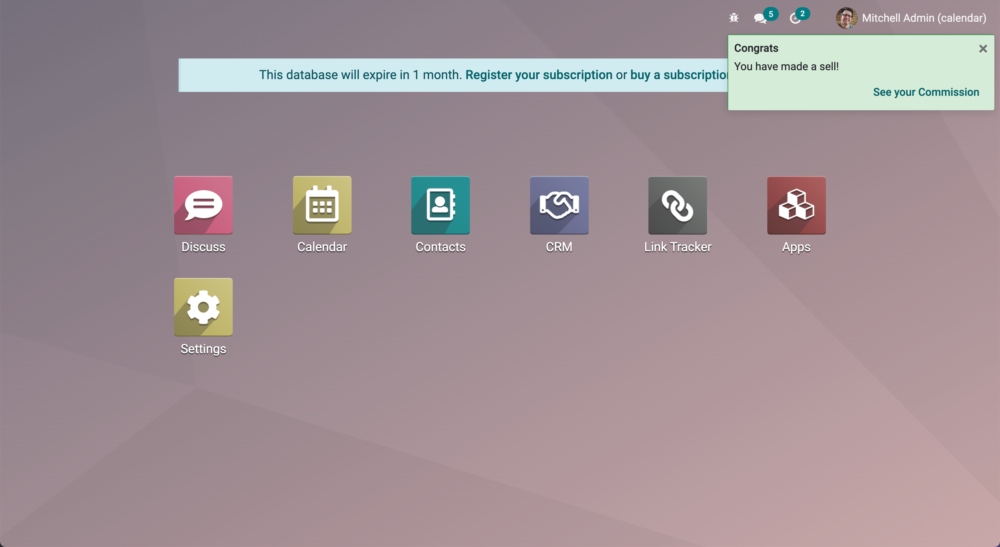

.. _frontend/services:

========
Services
========

Services are long lived pieces of code that provide a feature. They may be
imported by components (with ``useService``) or by other services. Also, they
can declare a set of dependencies. In that sense, services are basically a
DI :dfn:`dependency injection` system. For example, the ``notification`` service
provides a way to display a notification, or the ``rpc`` service is the proper
way to perform a request to the Odoo server.

The following example registers a simple service that displays a notification
every 5 seconds:

.. code-block:: javascript

    import { registry } from "@web/core/registry";

    const myService = {
        dependencies: ["notification"],
        start(env, { notification }) {
            let counter = 1;
            setInterval(() => {
                notification.add(`Tick Tock ${counter++}`);
            }, 5000);
        }
    };

    registry.category("services").add("myService", myService);

At startup, the web client starts all services present in the `services`
registry. Note that the name used in the registry is the name of the service.

.. note::

   Most code that is not a component should be *packaged* in a service, in
   particular if it performs some side effect.  This is very useful for testing
   purposes: tests can choose which services are active, so there are less chance
   for unwanted side effects interfering with the code being tested.

Defining a service
==================

A service needs to implement the following interface:

.. js:data:: dependencies

    Optional list of strings. It is the list of all dependencies (other services)
    that this service needs

.. js:function:: start(env, deps)

    :param Environment env: the application environment
    :param Object deps: all requested dependencies
    :returns: value of service or Promise<value of service>

    This is the main definition for the service. It can return either a value or
    a promise. In that case, the service loader simply waits for the promise to
    resolve to a value, which is then the value of the service.

    Some services do not export any value. They may just do their work without a
    need to be directly called by other code. In that case, their value will be
    set to ``null`` in ``env.services``.

.. js:data:: async

    Optional value. If given, it should be `true` or a list of strings.

    Some services need to provide an asynchronous API. For example, the `rpc`
    service is an asynchronous function, or the `orm` service provides a set of
    functions to call the Odoo server.

    In that case, it is possible for components that use a service to be
    destroyed before the end of an asynchronous function call. Most of the time,
    the asynchronous function call needs to be ignored. Doing otherwise is
    potentially very risky, because the underlying component is no longer active.
    The `async` flag is a way to do just that: it signals to the service creator
    that all asynchronous calls coming from components should be left pending if
    the component is destroyed.

Using a service
===============

A service that depends on other services and has properly declared its
``dependencies`` simply receives a reference to the corresponding services
in the second argument of the ``start`` method.

The ``useService`` hook is the proper way to use a service in a component. It
simply returns a reference to the service value, that can then be used by the
component later. For example:

.. code-block:: javascript

    import { rpc } from "@web/core/network/rpc";

    class MyComponent extends Component {
      setup() {
        onWillStart(async () => {
          const result = await rpc(...);
        })
      }
    }

Reference List
==============

.. list-table::
   :widths: 25 75
   :header-rows: 1

   * - Technical Name
     - Short Description
   * - :ref:`cookie <frontend/services/cookie>`
     - read or modify cookies
   * - :ref:`effect <frontend/services/effect>`
     - display graphical effects
   * - :ref:`http <frontend/services/http>`
     - perform low level http calls
   * - :ref:`notification <frontend/services/notification>`
     - display notifications
   * - :ref:`router <frontend/services/router>`
     - manage the browser url
   * - :ref:`rpc <frontend/services/rpc>`
     - send requests to the server
   * - :ref:`scroller <frontend/services/scroller>`
     - handle clicks on anchors elements
   * - :ref:`title <frontend/services/title>`
     - read or modify the window title
   * - :ref:`user <frontend/services/user>`
     - provides some information related to the current user

.. _frontend/services/cookie:

Cookie service
--------------

Overview
~~~~~~~~

- Technical name: `cookie`
- Dependencies: none

Provides a way to manipulate cookies. For example:

.. code-block:: javascript

   cookieService.setCookie("hello", "odoo");

API
~~~

.. js:data:: current

   Object representing each cookie and its value if any (or empty string)

.. js:function:: setCookie(name[, value, ttl])

    :param string name: the name of the cookie that should be set
    :param any value: optional. If given, the cookie will be set to that value
    :param number ttl: optional. the time in seconds before the cookie will be deleted (default=1 year)

    Sets the cookie `name` to the value `value` with a max age of `ttl`

.. js:function:: deleteCookie(name)

    :param string name: name of the cookie

    Deletes the cookie `name`.

.. _frontend/services/effect:

Effect service
--------------

Overview
~~~~~~~~

* Technical name: `effect`
* Dependencies: None

Effects are graphical elements that can be temporarily displayed on top of the page, usually to provide feedback to the user that something interesting happened.

A good example would be the rainbow man:

.. image:: services/rainbow_man.png
    :alt: The rainbow man effect
    :width: 600
    :align: center

Here's how this can be displayed:

.. code-block:: javascript

    const effectService = useService("effect");
    effectService.add({
      type: "rainbow_man", // can be omitted, default type is already "rainbow_man"
      message: "Boom! Team record for the past 30 days.",
    });

.. warning ::
    The hook `useEffect` is not related to the effect service.

API
~~~

.. js:function:: effectService.add(options)

  :param object options: the options for the effect. They will get passed along to the underlying effect component.

  Display an effect.

The options are defined by:

.. code-block:: ts

  interface EffectOptions {
    // The name of the desired effect
    type?: string;
    [paramName: string]: any;
  }

Available effects
~~~~~~~~~~~~~~~~~

Currently, the only effect is the rainbow man.

RainbowMan
**********

.. code-block:: javascript

  effectService.add({ type: "rainbow_man" });

.. list-table::
    :widths: 20 40 40
    :header-rows: 1

    * - Name
      - Type
      - Description
    * - `params.Component`
      - `owl.Component?`
      - Component class to instantiate inside the RainbowMan (will replace the message).
    * - `params.props`
      - `object?={}`
      - If params.Component is given, its props can be passed with this argument.
    * - `params.message`
      - `string?="Well Done!"`
      - Message is the notice the rainbowman holds.

        If effects are disabled for the user, the rainbowman won't appear and a simple notification
        will get displayed as a fallback.

        If effects are enabled and params.Component is given, params.message is not used.

        The message is a simple string or a string representing html
        (prefer using params.Component if you want interactions in the DOM).
    * - `params.messageIsHtml`
      - `boolean?=false`
      - Set to true if the message represents html, s.t. it will be correctly inserted into the DOM.
    * - `params.img_url`
      - `string?=/web/static/img/smile.svg`
      - The url of the image to display inside the rainbow.
    * - `params.fadeout`
      - `("slow"|"medium"|"fast"|"no")?="medium"`
      - Delay for rainbowman to disappear.

        `"fast"` will make rainbowman dissapear quickly.

        `"medium"` and `"slow"` will wait little longer before disappearing (can be used when `params.message` is longer).

        `"no"` will keep rainbowman on screen until user clicks anywhere outside rainbowman.

How to add an effect
~~~~~~~~~~~~~~~~~~~~

.. _frontend/services/effect_registry:

The effects are stored in a registry called `effects`.
You can add new effects by providing a name and a function.

.. code-block:: javascript

  const effectRegistry = registry.category("effects");
  effectRegistry.add("rainbow_man", rainbowManEffectFunction);

The function must follow this API:

.. js:function:: <newEffectFunction>(env, params)

    :param Env env: the environment received by the service

    :param object params: the params received from the add function on the service.

    :returns: `({Component, props} | void)` A component and its props or nothing.

This function must create a component and return it. This component is mounted inside the
effect component container.

Example
~~~~~~~

Let's say we want to add an effect that add a sepia look at the page.

.. code-block:: javascript

  import { registry } from "@web/core/registry";
  import { Component, xml } from "@odoo/owl";

  class SepiaEffect extends Component {
    static template = xml`
      

    `;
  }

  export function sepiaEffectProvider(env, params = {}) {
      return {
          Component: SepiaEffect,
      };
  }

  const effectRegistry = registry.category("effects");
  effectRegistry.add("sepia", sepiaEffectProvider);

And then, call it somewhere you want and you will see the result.
Here, it is called in webclient.js to make it visible everywhere for the example.

.. code-block:: javascript

  const effectService = useService("effect");
  effectService.add({ type: "sepia" });

.. image:: services/odoo_sepia.png
    :alt: Odoo in sepia
    :width: 600
    :align: center

.. _frontend/services/http:

Http Service
------------

Overview
~~~~~~~~

* Technical name: `http`
* Dependencies: None

While most interactions between the client and the server in odoo are `RPCs` (`XMLHTTPRequest`), lower level
control on requests may sometimes be required.

This service provides a way to send `get` and `post` `http requests <https://developer.mozilla.org/en-US/docs/Web/HTTP/Methods>`_.

API
~~~

.. js:function:: async get(route[,readMethod = "json"])

  :param string route: the url to send the request to
  :param string readMethod: the response content type. Can be "text", "json", "formData", "blob", "arrayBuffer".
  :returns: the result of the request with the format defined by the readMethod argument.

  Sends a get request.

.. js:function:: async post(route [,params = {}, readMethod = "json"])

  :param string route: the url to send the request to
  :param object params: key value data to be set in the form data part of the request
  :param string readMethod: the response content type. Can be "text", "json", "formData", "blob", "arrayBuffer".
  :returns: the result of the request with the format defined by the readMethod argument.

  Sends a post request.

Example
~~~~~~~

.. code-block:: javascript

  const httpService = useService("http");
  const data = await httpService.get("https://something.com/posts/1");
  // ...
  await httpService.post("https://something.com/posts/1", { title: "new title", content: "new content" });

.. _frontend/services/notification:

Notification service
--------------------

Overview
~~~~~~~~

* Technical name: `notification`
* Dependencies: None

The `notification` service allows to display notifications on the screen.

.. code-block:: javascript

  const notificationService = useService("notification");
  notificationService.add("I'm a very simple notification");

API
~~~

.. js:function:: add(message[, options])

    :param string message: the notification message to display
    :param object options: the options of the notification
    :returns: a function to close the notification

    Shows a notification.

    The options are defined by:

    .. list-table::
      :widths: 15 30 55
      :header-rows: 1

      * - Name
        - Type
        - Description
      * - `title`
        - string
        - Add a title to the notification
      * - `type`
        - `warning` | `danger` | `success` | `info`
        - Changes the background color according to the type
      * - `sticky`
        - boolean
        - Whether or not the notification should stay until dismissed
      * - `className`
        - string
        - additional css class that will be added to the notification
      * - `onClose`
        - function
        - callback to be executed when the notification closes
      * - `buttons`
        - button[] (see below)
        - list of button to display in the notification
      * - `autocloseDelay`
        - number
        - duration in milliseconds before the notification is closed automatically

    The buttons are defined by:

    .. list-table::
      :widths: 15 30 55
      :header-rows: 1

      * - Name
        - Type
        - Description
      * - `name`
        - string
        - The button text
      * - `onClick`
        - function
        - callback to execute when the button is clicked
      * - `primary`
        - boolean
        - whether the button should be styled as a primary button

Examples
~~~~~~~~

A notification for when a sale deal is made with a button to go some kind of commission page.

.. code-block:: javascript

  // in setup
  this.notificationService = useService("notification");
  this.actionService = useService("action");

  // later
  this.notificationService.add("You closed a deal!", {
    title: "Congrats",
    type: "success",
    buttons: [
        {
            name: "See your Commission",
            onClick: () => {
                this.actionService.doAction("commission_action");
            },
        },
    ],
  });

A notification that closes after a second:

.. code-block:: javascript

  const notificationService = useService("notification");
  const close = notificationService.add("I will be quickly closed");
  setTimeout(close, 1000);

.. _frontend/services/router:

Router Service
--------------

Overview
~~~~~~~~

- Technical name: `router`
- Dependencies: none

The `router` service provides three features:

* information about the current route
* a way for the application to update the url, depending on its state
* listens to every hash change, and notifies the rest of the application

API
~~~

.. js:data:: current
   :noindex:

   The current route can be accessed with the ``current`` key. It is an object
   with the following information:

   * `pathname (string)`: the path for the current location (most likely `/web` )
   * `search (object)`: a dictionary mapping each search keyword (the querystring)
     from the url to its value. An empty string is the value if no value was
     explicitely given
   * `hash (object)`: same as above, but for values described in the hash.

For example:

.. code-block:: javascript

  // url = /web?debug=assets#action=123&owl&menu_id=174
  const { pathname, search, hash } = env.services.router.current;
  console.log(pathname); //   /web
  console.log(search); //   { debug="assets" }
  console.log(hash); //   { action:123, owl: "", menu_id: 174 }

Updating the URL is done with the  `pushState` method:

.. js:function:: pushState(hash: object[, replace?: boolean])

  :param Object hash: object containing a mapping from some keys to some values
  :param boolean replace: if true, the url will be replaced, otherwise only
    key/value pairs from the `hash` will be updated.

  Updates the URL with each key/value pair from the `hash` object. If a value is
  set to an empty string, the key is added to the url without any corresponding
  value.

  If true, the `replace` argument tells the router that the url hash should be
  completely replaced (so values not present in the `hash` object will be removed).

  This method call does not reload the page. It also does not trigger a
  `hashchange` event, nor a `ROUTE_CHANGE` in the :ref:`main bus <frontend/framework/bus>`.
  This is because this method is intended to only updates the url. The code calling
  this method has the responsibility to make sure that the screen is updated as
  well.

For example:

.. code-block:: javascript

  // url = /web#action_id=123
  routerService.pushState({ menu_id: 321 });
  // url is now /web#action_id=123&menu_id=321
  routerService.pushState({ yipyip: "" }, replace: true);
  // url is now /web#yipyip

Finally, the `redirect` method will redirect the browser to a specified url:

.. js:function:: redirect(url[, wait])

  :param string url: a valid url
  :param boolean wait: if true, wait for the server to be ready, and redirect after

  Redirect the browser to `url`. This method reloads the page. The `wait`
  argument is rarely used: it is useful in some cases where we know that the
  server will be unavailable for a short duration, typically just after an addon
  update or install operation.

.. note::
   The router service emits a `ROUTE_CHANGE` event on the :ref:`main bus <frontend/framework/bus>`
   whenever the current route has changed.

.. _frontend/services/rpc:

RPC service
-----------

Overview
~~~~~~~~

- Technical name: `rpc`
- Dependencies: none

The `rpc` service provides a single asynchronous function to send requests to
the server. Calling a controller is very simple: the route should be the first
argument and optionally, a ``params`` object can be given as a second argument.

.. code-block:: javascript

  import { rpc } from "@web/core/network/rpc";

   // somewhere else, in an async function:
   const result = await rpc("/my/route", { some: "value" });

.. note::

    Note that the ``rpc`` service is considered a low-level service. It should
    only be used to interact with Odoo controllers. To work with models (which
    is by far the most important usecase), one should use the ``orm`` service
    instead.

API
~~~

.. js:function:: rpc(route, params, settings)

    :param string route: route targeted by the request
    :param Object params: (optional) parameters sent to the server
    :param Object settings: (optional) request settings (see below)

    The ``settings`` object can contain:

    - ``xhr``, which should be a ``XMLHTTPRequest`` object. In that case,
      the ``rpc`` method will simply use it instead of creating a new one. This
      is useful when one accesses advanced features of the `XMLHTTPRequest` API.
    - ``silent (boolean)`` If set to ``true``, the web client will not provide
      a feedback that there is a pending rpc.

The ``rpc`` service communicates with the server by using a ``XMLHTTPRequest``
object, configured to work with the ``application/json`` content type. So clearly
the content of the request should be JSON serializable. Each request done by
this service uses the ``POST`` http method.

Server errors actually return the response with an http code 200. But the ``rpc``
service will treat them as error.

Error Handling
~~~~~~~~~~~~~~

An rpc can fail for two main reasons:

* either the odoo server returns an error (so, we call this a ``server`` error).
  In that case the http request will return with an http code 200 BUT with a
  response object containing an ``error`` key.

* or there is some other kind of network error

When a rpc fails, then:

* the promise representing the rpc is rejected, so the calling code will crash,
  unless it handles the situation
* an event ``RPC_ERROR`` is triggered on the main application bus. The event payload
  contains a description of the cause of the error:

  If it is a server error (the server code threw an exception). In that case
  the event payload will be an object with the following keys:

  * ``type = 'server'``
  * ``message(string)``
  *
    ``code(number)``

  *
    ``name(string)`` (optional, used by the error service to look for an appropriate
    dialog to use when handling the error)

  * ``subType(string)`` (optional, often used to determine the dialog title)
  * ``data(object)`` (optional object that can contain various keys among which
    ``debug`` : the main debug information, with the call stack)

  If it is a network error, then the error description is simply an object
  ``{type: 'network'}``.
  When a network error occurs, a :ref:`notification <frontend/services/notification>` is
  displayed and the server is regularly contacted until it responds. The
  notification is closed as soon as the server responds.

.. _frontend/services/scroller:

Scroller service
----------------

Overview
~~~~~~~~

- Technical name: `scroller`
- Dependencies: none

Whenever the user clicks on an anchor in the web client, this service automatically scrolls
to the target (if appropriate).

The service adds an event listener to get `click`'s on the document. The service checks
if the selector contained in its href attribute is valid to distinguish anchors and Odoo
actions (e.g. ``). It does nothing if it is not the case.

An event `SCROLLER:ANCHOR_LINK_CLICKED` is triggered on the main application bus if the click seems to be
targeted at an element. The event contains a custom event containing the `element` matching and its `id` as a reference.
It may allow other parts to handle a behavior relative to anchors themselves. The original event is also
given as it might need to be prevented. If the event is not prevented, then the user interface will
scroll to the target element.

API
~~~

The following values are contained in the `anchor-link-clicked` custom event explained above.

.. list-table::
    :widths: 25 25 50
    :header-rows: 1

    * - Name
      - Type
      - Description
    * - `element`
      - `HTMLElement | null`
      - The anchor element targeted by the href
    * - `id`
      - `string`
      - The id contained in the href
    * - `originalEv`
      - `Event`
      - The original click event

.. note::
   The scroller service emits a `SCROLLER:ANCHOR_LINK_CLICKED` event on the :ref:`main bus <frontend/framework/bus>`.
   To avoid the default scroll behavior of the scroller service, you must use `preventDefault()` on the event given
   to the listener so that you can implement your own behavior correctly from the listener.

.. _frontend/services/title:

Title Service
-------------

Overview
~~~~~~~~

- Technical name: `title`
- Dependencies: none

The `title` service offers a simple API that allows to read/modify the document
title. For example, if the current document title is "Odoo", we can change it
to "Odoo 15 - Apple" by using the following command:

.. code-block:: javascript

   // in some component setup method
   const titleService = useService("title");

   titleService.setParts({ odoo: "Odoo 15", fruit: "Apple" });

API
~~~

The ``title`` service manipulates the following interface:

.. code-block:: ts

   interface Parts {
       [key: string]: string | null;
   }

Each key represents the identity of a part of the title, and each value is the
string that is displayed, or `null` if it has been removed.

Its API is:

.. js:data:: current
   :noindex:

   This is a string representing the current title. It is structured in the
   following way: ``value_1 - ... - value_n`` where each `value_i` is a (non null)
   value found in the `Parts` object (returned by the `getParts` function)

.. js:function:: getParts

   :returns: Parts the current `Parts` object maintained by the title service

.. js:function:: setParts(parts)

   :param Parts parts: object representing the required change

   The ``setParts`` method allows to add/replace/delete several parts of the title.
   Delete a part (a value) is done by setting the associated key value to `null`.

   Note that one can only modify a single part without affecting the other
   parts. For example, if the title is composed of the following parts:

   .. code-block:: javascript

      { odoo: "Odoo", action: "Import" }

   with ``current`` value being ``Odoo - Import`` , then

   .. code-block:: javascript

      setParts({
        action: null,
      });

   will change the title to ``Odoo``.

.. _frontend/services/user:

User service
------------

Overview
~~~~~~~~

* Technical name: `user`
* Dependencies: `rpc`

The `user` service provides a bunch of data and a few helper functions concerning
the connected user.

API
~~~

.. list-table::
    :widths: 25 25 50
    :header-rows: 1

    * - Name
      - Type
      - Description
    * - ``context``
      - ``Object``
      - The :ref:`user context<frontend/framework/user_context>`
    * - ``db``
      - ``Object``
      - Info about the database
    * - ``home_action_id``
      - ``(number | false)``
      - Id of the action used as home for the user
    * - ``isAdmin``
      - ``boolean``
      - Whether the user is an admin (group `base.group_erp_manager` or superuser)
    * - ``isSystem``
      - ``boolean``
      - Whether the user is part of the system group (`base.group_system`)
    * - ``lang``
      - ``string``
      - language used
    * - ``name``
      - ``string``
      - Name of the user
    * - ``partnerId``
      - ``number``
      - Id of the partner instance of the user
    * - ``tz``
      - ``string``
      - The timezone of the user
    * - ``userId``
      - ``number``
      - Id of the user
    * - ``userName``
      - ``string``
      - Alternative nick name of the user

.. js:function:: updateContext(update)

    :param object update: the object to update the context with

    update the :ref:`user context<frontend/framework/user_context>` with the given object.

    .. code-block:: javascript

      userService.updateContext({ isFriend: true })

.. js:function:: removeFromContext(key)

    :param string key: the key of the targeted attribute

    remove the value with the given key from the :ref:`user context<frontend/framework/user_context>`

    .. code-block:: javascript

      userService.removeFromContext("isFriend")

.. js:function:: hasGroup(group)

    :param string group: the xml_id of the group to look for

    :returns: `Promise<boolean>` is the user in the group

    check if the user is part of a group

    .. code-block:: javascript

      const isInSalesGroup = await userService.hasGroup("sale.group_sales")
