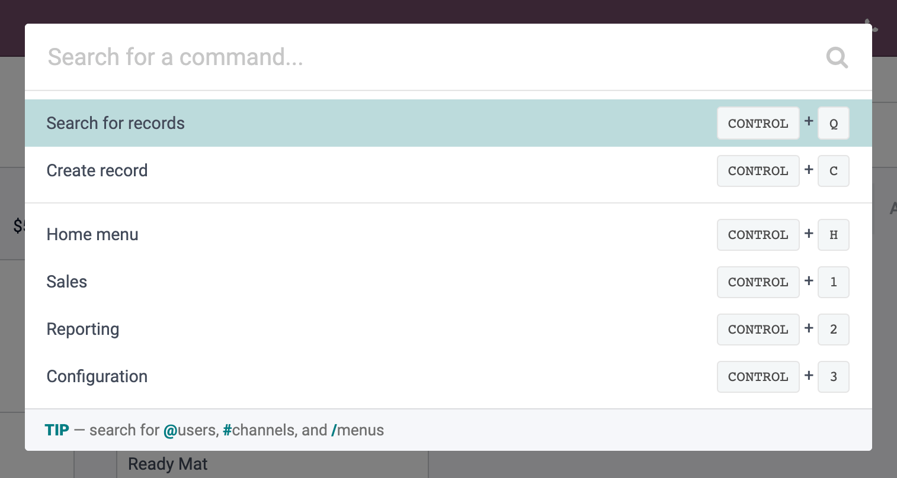

=========================
Command & Command Palette
=========================

Overview
========

A command is a link between an action (piece of code) and a possible hotkey. 
It can be registered and then called when its hotkey is pressed.
Commands also appear in the Command Palette, a convenient tool to quickly access and trigger things in Odoo.
Commands without hotkey can only be triggered with the Command Palette.

Command
=======

A command is defined as:

.. code-block:: ts

    type Command = { 
        name: string,
        action: () => (void | CommandConfiguration),
        category?: string, 
        hotkey?: string 
    }

.. code-block:: js

    // example of a command
    const sayHelloCommand = {
        "Say Hello Command",
        () => console.log("hello"),
        "useless category", 
        "ctrl-h"
    };

The most important part of the command is the action, which is a function to execute when the command
is triggered. If the action doesn't return anything, the command palette will close after the execution. 
If it returns a ``CommandPaletteConfig``, it updates the palette content based on this config. More on that 
later.

Command Palette
===============

Commands also appear in the Command Palette.
Commands without hotkey can only be triggered with the Command Palette.

Fundamentally, the Command Palette exposes a list of command items. A simple component that 
holds a command. 

It can be opened by pressing the hotkey ``Control+K``.

By default, it displays:

    * the commands you registered in the dedicated service
    * any visible elements in the ``ui.activeElement`` that are accessible through a ``[data-hotkey]`` attribute

.. _command Service:

Command Service
===============

.. list-table::
   :header-rows: 1

   * - Technical name
     - Dependencies
   * - ``command``
     - ``dialog`` , ``hotkey`` , ``ui``

The ``command`` service offers a way to register new commands.

API
---

.. code-block:: ts

    add(name: string, action: () => void, options: Object?): () => void;

Register a command to the command palette. It returns a cleanup function that can be called to
unregister the command. 

+-----------------------+------------------------------+---------------------------------------------------------+
| key                   | type                         | description                                             |
+=======================+==============================+=========================================================+
| name                  | ``string``                   | Command name                                            |
+-----------------------+------------------------------+---------------------------------------------------------+
| action                | ``Function``                 | Action to execute on command triggering                 |
+-----------------------+------------------------------+---------------------------------------------------------+
| options.category      | ``string?``                  | Define the category of the command                      |
+-----------------------+------------------------------+---------------------------------------------------------+
| options.hokey         | ``string?``                  | Hotkey to trigger the command                           |
+-----------------------+------------------------------+---------------------------------------------------------+
| options.activeElement |  ``HtmlElement?``            | HTMLElement from which commands and hotkey are fetched  |
+-----------------------+------------------------------+---------------------------------------------------------+
| options.global        | ``boolean?``                 | Ignore the active element and make it always accessible |
+-----------------------+------------------------------+---------------------------------------------------------+

.. note:: 

    A command is scoped to a DOM element. This is why there is this idea of activeElement.

.. code-block:: ts

    getCommands(activeElement): Command[] 

Get all the commands scoped to the activeElement.

+----------------+---------------+---------------------------------------------------------+
| key            | type          | description                                             |
+================+===============+=========================================================+
| activeElement  |  HtmlElement  | HTMLElement from which commands are scoped and fetched  |  
+----------------+---------------+---------------------------------------------------------+

.. code-block:: js

    const commandService = useService("command");
    const commandCleanUp = commandService.add({ "My Command 1", () => { /* do stuff */ } });
    commandCleanUp(); // If you want to unregister it

.. code-block:: ts

    openPalette(config: Object): void

Opens a command palette with the given configuration. See Later.

+-----------------------------------+------------------------------+-----------------------------------------------------------------+
| key                               | type                         | description                                                     |
+===================================+==============================+=================================================================+
| config.providers                  | ``() => (void | config)``    | Command item providers                                          |
+-----------------------------------+------------------------------+-----------------------------------------------------------------+
| config.placeholder                | ``string?``                  | Search placeholder                                              |
+-----------------------------------+------------------------------+-----------------------------------------------------------------+
| config.namespace                  | ``string?``                  | Add a starting namespace in the search                          |
+-----------------------------------+------------------------------+-----------------------------------------------------------------+
| config.categoriesByNamespace      | ``{[namespace]: string[]}?`` | Map between the namespaces and the categories                   |
+-----------------------------------+------------------------------+-----------------------------------------------------------------+
| config.emptyMessageByNamespace    |  ``{[namespace]: string}?``  | Map between the namespaces and their message for empty content  |
+-----------------------------------+------------------------------+-----------------------------------------------------------------+
| config.footerTemplate             | ``string?``                  | Owl template identifier for the footer                          |
+-----------------------------------+------------------------------+-----------------------------------------------------------------+

.. _useCommand hook:

Hook: useCommand 
================

A hook that ensures your registration exists only when your component is mounted by registering it 
and unregistering it at the right lifecycle time.

.. note::

    As long as you only need to add commands to the default command palette and you're inside an Owl Component,
    you should use this.

    If you wish to add more complex behavior like namespace symbols or actions opening other palettes, you should go
    to the advanced section.

API
---

.. code-block:: js

    useCommand(command: Command): void

Register a command.

Usage
-----

.. code-block:: js

   class MyComponent extends Component {
       setup() {
           useCommand({
               name: "My Command 1",
               action: () => {
                   // code when command 1 is executed
               }
           });
           useCommand({
               name: "My Super Command",
               hotkey: "shift-home",
               action: () => {
                   // code when super command is executed
                   // note that the super command can also get executed with the hotkey "shift-home"
               }
           });
       }
   }

.. _commandCategory Registry:

Registry: Command Category 
==========================

The ``command_categories`` gathers the command categories.

The keys in this registry can be used in two differents ways in order to organize the command palette:

* 
  when registering a new command: ``useCommand({ category: "key", ... })``.

* 
  applied as an attribute in the document: ``[data-command-category="key"]``.
  N.B.: if an element should appear in the command palette
  (e.g. it has a ``[data-hotkey]`` attribute), the closest parent (including itself)
  having a ``[data-command-category]`` will provide the category key to seek for in the registry.

API
---
!! does it still exist ? !!
!! there seem to be a namespace !!

Usage
------

.. code-block:: js

    import { registry } from "@web/core/registry";
    registry.category("command_categories").add("new_category")
    registry.category("command_categories").add("another_new_category", { label: "Name of the category" })

Available Categories
--------------------

.. list-table::
   :header-rows: 1

   * - Key
     - Sequence
     - Description
   * - ``main``
     - 10
     - Main Commands
   * - ``app``
     - 20
     - Current App Commands
   * - ``actions``
     - 30
     - More Actions
   * - ``navbar``
     - 40
     - NavBar
   * - ``default``
     - 100
     - Other commands

.. note::
   The sequence is a registry option, to define an order.

.. _commandProvider Registry:

Registry: Command Provider 
==========================

API
---

Usage
-----

.. _commandEmptyList Registry:

Registry: Command Empty List 
============================

API
---

Usage
-----

Advanced Topics
===============

The Command Palette therefore requires a configuration to be opened. However, there exists a default configuration. 
This `default` palette can be opened by . The ``CommandPaletteConfig`` part is left for 
the advanced section.

A ``CommandPaletteConfig`` is defined as 

.. code-block:: js

    type CommandPaletteConfig = {
        categoriesByNamespace?: {[namespace]: string[]};
        namespace?: string;
        emptyMessageByNamespace?: {[namespace]: string};
        footerTemplate?: string;
        placeholder?: string;
        providers: Provider[];
    }

