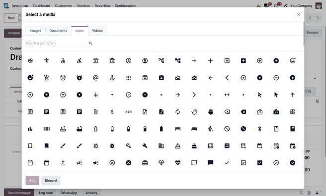

.. _reference/user_interface/ui_icons:

========
UI icons
========

Odoo's UI relies on two icon systems:

- **Material Symbols** (`Google Fonts <https://fonts.google.com/icons>`_) is the primary icon
  library. It covers the vast majority of interface needs.
- **Odoo UI Icons (OI)** is a supplementary library for icons not available in Material Symbols —
  custom view icons, brand logos (e.g. Facebook, GitHub), and other Odoo-specific glyphs.

Both systems share the same ``.oi`` base class and use a ``data-icon`` attribute to specify the
icon to render.

.. _ui/material-symbols:

Material Symbols
================

`Material Symbols Rounded <https://fonts.google.com/icons>`_ is loaded in the Odoo webclient. Use
it for any standard icon: actions, navigation, status indicators, and so on.

Pass the icon's ligature name (as listed on `fonts.google.com/icons <https://fonts.google.com/icons>`_)
to the ``data-icon`` attribute:

.. code-block:: html

   <i class="oi" data-icon="check"/>
   <i class="oi" data-icon="settings"/>
   <i class="oi" data-icon="arrow_forward"/>

Use the `Material Symbols library <https://fonts.google.com/icons>`_ or the Odoo
media library (see below) to browse and search available icons.

.. note::
   Odoo bundles only a subset of Material Symbols rather than the full library. The list of
   supported icons is maintained in
   `odoo/addons/web/tooling/icons/icons_wishlist.txt <{GITHUB_PATH}/addons/web/tooling/icons/icons_wishlist.txt>`_.

.. _ui/odoo-ui-icons:

Odoo UI icons
=============

The OI library covers icons not available in Material Symbols: brand logos, custom kanban-view
icons, and other Odoo-specific glyphs. OI icons use the ``oi_`` prefix in the ``data-icon``
attribute:

.. code-block:: html

   <i class="oi" data-icon="oi_odoo"/>
   <i class="oi" data-icon="oi_view-kanban"/>
   <i class="oi" data-icon="oi_facebook"/>

Like `Material Symbols library <https://fonts.google.com/icons>`_ , Odoo custom
icons are available via Odoo media library.

.. rubric:: Odoo

.. raw:: html

   <section class="row">
      

          

              <i class="oi fs-1 p-3" data-icon="oi_odoo"></i>
              <code class="pb-3">oi_odoo</code>
          

      

      

          

              <i class="oi fs-1 p-3" data-icon="oi_studio"></i>
              <code class="pb-3">oi_studio</code>
          

      

      

          

              <i class="oi fs-1 p-3" data-icon="oi_view-kanban"></i>
              <code class="pb-3">oi_view-kanban</code>
          

      

      

          

              <i class="oi fs-1 p-3" data-icon="oi_view-pivot"></i>
              <code class="pb-3">oi_view-pivot</code>
          

      

      

          

              <i class="oi fs-1 p-3" data-icon="oi_view-cohort"></i>
              <code class="pb-3">oi_view-cohort</code>
          

      

      

          

              <i class="oi fs-1 p-3" data-icon="oi_app_documents"></i>
              <code class="pb-3">oi_app_documents</code>
          

      

      

          

              <i class="oi fs-1 p-3" data-icon="oi_threads"></i>
              <code class="pb-3">oi_threads</code>
          

      

   </section>

.. rubric:: Social

.. raw:: html

   <section class="row">
      

          

              <i class="oi fs-1 p-3" data-icon="oi_bandcamp"></i>
              <code class="pb-3">oi_bandcamp</code>
          

      

      

          

              <i class="oi fs-1 p-3" data-icon="oi_behance"></i>
              <code class="pb-3">oi_behance</code>
          

      

      

          

              <i class="oi fs-1 p-3" data-icon="oi_behance-square"></i>
              <code class="pb-3">oi_behance-square</code>
          

      

      

          

              <i class="oi fs-1 p-3" data-icon="oi_bluesky"></i>
              <code class="pb-3">oi_bluesky</code>
          

      

      

          

              <i class="oi fs-1 p-3" data-icon="oi_deviantart"></i>
              <code class="pb-3">oi_deviantart</code>
          

      

      

          

              <i class="oi fs-1 p-3" data-icon="oi_digg"></i>
              <code class="pb-3">oi_digg</code>
          

      

      

          

              <i class="oi fs-1 p-3" data-icon="oi_discord"></i>
              <code class="pb-3">oi_discord</code>
          

      

      

          

              <i class="oi fs-1 p-3" data-icon="oi_dribbble"></i>
              <code class="pb-3">oi_dribbble</code>
          

      

      

          

              <i class="oi fs-1 p-3" data-icon="oi_facebook"></i>
              <code class="pb-3">oi_facebook</code>
          

      

      

          

              <i class="oi fs-1 p-3" data-icon="oi_facebook-square"></i>
              <code class="pb-3">oi_facebook-square</code>
          

      

      

          

              <i class="oi fs-1 p-3" data-icon="oi_flickr"></i>
              <code class="pb-3">oi_flickr</code>
          

      

      

          

              <i class="oi fs-1 p-3" data-icon="oi_foursquare"></i>
              <code class="pb-3">oi_foursquare</code>
          

      

      

          

              <i class="oi fs-1 p-3" data-icon="oi_google-plus"></i>
              <code class="pb-3">oi_google-plus</code>
          

      

      

          

              <i class="oi fs-1 p-3" data-icon="oi_imdb"></i>
              <code class="pb-3">oi_imdb</code>
          

      

      

          

              <i class="oi fs-1 p-3" data-icon="oi_instagram"></i>
              <code class="pb-3">oi_instagram</code>
          

      

      

          

              <i class="oi fs-1 p-3" data-icon="oi_kickstarter"></i>
              <code class="pb-3">oi_kickstarter</code>
          

      

      

          

              <i class="oi fs-1 p-3" data-icon="oi_lastfm"></i>
              <code class="pb-3">oi_lastfm</code>
          

      

      

          

              <i class="oi fs-1 p-3" data-icon="oi_linkedin"></i>
              <code class="pb-3">oi_linkedin</code>
          

      

      

          

              <i class="oi fs-1 p-3" data-icon="oi_linkedin-square"></i>
              <code class="pb-3">oi_linkedin-square</code>
          

      

      

          

              <i class="oi fs-1 p-3" data-icon="oi_medium"></i>
              <code class="pb-3">oi_medium</code>
          

      

      

          

              <i class="oi fs-1 p-3" data-icon="oi_meetup"></i>
              <code class="pb-3">oi_meetup</code>
          

      

      

          

              <i class="oi fs-1 p-3" data-icon="oi_mixcloud"></i>
              <code class="pb-3">oi_mixcloud</code>
          

      

      

          

              <i class="oi fs-1 p-3" data-icon="oi_odnoklassniki"></i>
              <code class="pb-3">oi_odnoklassniki</code>
          

      

      

          

              <i class="oi fs-1 p-3" data-icon="oi_pinterest"></i>
              <code class="pb-3">oi_pinterest</code>
          

      

      

          

              <i class="oi fs-1 p-3" data-icon="oi_pinterest-square"></i>
              <code class="pb-3">oi_pinterest-square</code>
          

      

      

          

              <i class="oi fs-1 p-3" data-icon="oi_product-hunt"></i>
              <code class="pb-3">oi_product-hunt</code>
          

      

      

          

              <i class="oi fs-1 p-3" data-icon="oi_qq"></i>
              <code class="pb-3">oi_qq</code>
          

      

      

          

              <i class="oi fs-1 p-3" data-icon="oi_quora"></i>
              <code class="pb-3">oi_quora</code>
          

      

      

          

              <i class="oi fs-1 p-3" data-icon="oi_reddit"></i>
              <code class="pb-3">oi_reddit</code>
          

      

      

          

              <i class="oi fs-1 p-3" data-icon="oi_reddit-square"></i>
              <code class="pb-3">oi_reddit-square</code>
          

      

      

          

              <i class="oi fs-1 p-3" data-icon="oi_skype"></i>
              <code class="pb-3">oi_skype</code>
          

      

      

          

              <i class="oi fs-1 p-3" data-icon="oi_slack"></i>
              <code class="pb-3">oi_slack</code>
          

      

      

          

              <i class="oi fs-1 p-3" data-icon="oi_snapchat"></i>
              <code class="pb-3">oi_snapchat</code>
          

      

      

          

              <i class="oi fs-1 p-3" data-icon="oi_soundcloud"></i>
              <code class="pb-3">oi_soundcloud</code>
          

      

      

          

              <i class="oi fs-1 p-3" data-icon="oi_spotify"></i>
              <code class="pb-3">oi_spotify</code>
          

      

      

          

              <i class="oi fs-1 p-3" data-icon="oi_steam"></i>
              <code class="pb-3">oi_steam</code>
          

      

      

          

              <i class="oi fs-1 p-3" data-icon="oi_strava"></i>
              <code class="pb-3">oi_strava</code>
          

      

      

          

              <i class="oi fs-1 p-3" data-icon="oi_telegram"></i>
              <code class="pb-3">oi_telegram</code>
          

      

      

          

              <i class="oi fs-1 p-3" data-icon="oi_tiktok"></i>
              <code class="pb-3">oi_tiktok</code>
          

      

      

          

              <i class="oi fs-1 p-3" data-icon="oi_tumblr"></i>
              <code class="pb-3">oi_tumblr</code>
          

      

      

          

              <i class="oi fs-1 p-3" data-icon="oi_twitch"></i>
              <code class="pb-3">oi_twitch</code>
          

      

      

          

              <i class="oi fs-1 p-3" data-icon="oi_vimeo"></i>
              <code class="pb-3">oi_vimeo</code>
          

      

      

          

              <i class="oi fs-1 p-3" data-icon="oi_vk"></i>
              <code class="pb-3">oi_vk</code>
          

      

      

          

              <i class="oi fs-1 p-3" data-icon="oi_weibo"></i>
              <code class="pb-3">oi_weibo</code>
          

      

      

          

              <i class="oi fs-1 p-3" data-icon="oi_whatsapp"></i>
              <code class="pb-3">oi_whatsapp</code>
          

      

      

          

              <i class="oi fs-1 p-3" data-icon="oi_x"></i>
              <code class="pb-3">oi_x</code>
          

      

      

          

              <i class="oi fs-1 p-3" data-icon="oi_x-square"></i>
              <code class="pb-3">oi_x-square</code>
          

      

      

          

              <i class="oi fs-1 p-3" data-icon="oi_xing"></i>
              <code class="pb-3">oi_xing</code>
          

      

      

          

              <i class="oi fs-1 p-3" data-icon="oi_yelp"></i>
              <code class="pb-3">oi_yelp</code>
          

      

      

          

              <i class="oi fs-1 p-3" data-icon="oi_youtube"></i>
              <code class="pb-3">oi_youtube</code>
          

      

      

          

              <i class="oi fs-1 p-3" data-icon="oi_youtube-play"></i>
              <code class="pb-3">oi_youtube-play</code>
          

      

      

          

              <i class="oi fs-1 p-3" data-icon="oi_youtube-square"></i>
              <code class="pb-3">oi_youtube-square</code>
          

      

   </section>

.. rubric:: Technologies

.. raw:: html

   <section class="row">
      

          

              <i class="oi fs-1 p-3" data-icon="oi_amazon"></i>
              <code class="pb-3">oi_amazon</code>
          

      

      

          

              <i class="oi fs-1 p-3" data-icon="oi_android"></i>
              <code class="pb-3">oi_android</code>
          

      

      

          

              <i class="oi fs-1 p-3" data-icon="oi_angellist"></i>
              <code class="pb-3">oi_angellist</code>
          

      

      

          

              <i class="oi fs-1 p-3" data-icon="oi_apple"></i>
              <code class="pb-3">oi_apple</code>
          

      

      

          

              <i class="oi fs-1 p-3" data-icon="oi_bitbucket"></i>
              <code class="pb-3">oi_bitbucket</code>
          

      

      

          

              <i class="oi fs-1 p-3" data-icon="oi_bitbucket-square"></i>
              <code class="pb-3">oi_bitbucket-square</code>
          

      

      

          

              <i class="oi fs-1 p-3" data-icon="oi_chrome"></i>
              <code class="pb-3">oi_chrome</code>
          

      

      

          

              <i class="oi fs-1 p-3" data-icon="oi_codepen"></i>
              <code class="pb-3">oi_codepen</code>
          

      

      

          

              <i class="oi fs-1 p-3" data-icon="oi_creative-commons"></i>
              <code class="pb-3">oi_creative-commons</code>
          

      

      

          

              <i class="oi fs-1 p-3" data-icon="oi_css3"></i>
              <code class="pb-3">oi_css3</code>
          

      

      

          

              <i class="oi fs-1 p-3" data-icon="oi_dropbox"></i>
              <code class="pb-3">oi_dropbox</code>
          

      

      

          

              <i class="oi fs-1 p-3" data-icon="oi_drupal"></i>
              <code class="pb-3">oi_drupal</code>
          

      

      

          

              <i class="oi fs-1 p-3" data-icon="oi_edge"></i>
              <code class="pb-3">oi_edge</code>
          

      

      

          

              <i class="oi fs-1 p-3" data-icon="oi_git"></i>
              <code class="pb-3">oi_git</code>
          

      

      

          

              <i class="oi fs-1 p-3" data-icon="oi_github"></i>
              <code class="pb-3">oi_github</code>
          

      

      

          

              <i class="oi fs-1 p-3" data-icon="oi_github-square"></i>
              <code class="pb-3">oi_github-square</code>
          

      

      

          

              <i class="oi fs-1 p-3" data-icon="oi_gitlab"></i>
              <code class="pb-3">oi_gitlab</code>
          

      

      

          

              <i class="oi fs-1 p-3" data-icon="oi_google"></i>
              <code class="pb-3">oi_google</code>
          

      

      

          

              <i class="oi fs-1 p-3" data-icon="oi_google-play"></i>
              <code class="pb-3">oi_google-play</code>
          

      

      

          

              <i class="oi fs-1 p-3" data-icon="oi_hacker-news"></i>
              <code class="pb-3">oi_hacker-news</code>
          

      

      

          

              <i class="oi fs-1 p-3" data-icon="oi_html5"></i>
              <code class="pb-3">oi_html5</code>
          

      

      

          

              <i class="oi fs-1 p-3" data-icon="oi_joomla"></i>
              <code class="pb-3">oi_joomla</code>
          

      

      

          

              <i class="oi fs-1 p-3" data-icon="oi_linux"></i>
              <code class="pb-3">oi_linux</code>
          

      

      

          

              <i class="oi fs-1 p-3" data-icon="oi_opera"></i>
              <code class="pb-3">oi_opera</code>
          

      

      

          

              <i class="oi fs-1 p-3" data-icon="oi_safari"></i>
              <code class="pb-3">oi_safari</code>
          

      

      

          

              <i class="oi fs-1 p-3" data-icon="oi_stack-overflow"></i>
              <code class="pb-3">oi_stack-overflow</code>
          

      

      

          

              <i class="oi fs-1 p-3" data-icon="oi_trello"></i>
              <code class="pb-3">oi_trello</code>
          

      

      

          

              <i class="oi fs-1 p-3" data-icon="oi_windows"></i>
              <code class="pb-3">oi_windows</code>
          

      

      

          

              <i class="oi fs-1 p-3" data-icon="oi_wordpress"></i>
              <code class="pb-3">oi_wordpress</code>
          

      

      

          

              <i class="oi fs-1 p-3" data-icon="oi_yahoo"></i>
              <code class="pb-3">oi_yahoo</code>
          

      

   </section>

.. rubric:: Payment methods

.. raw:: html

   <section class="row">
      

          

              <i class="oi fs-1 p-3" data-icon="oi_paypal"></i>
              <code class="pb-3">oi_paypal</code>
          

      

      

          

              <i class="oi fs-1 p-3" data-icon="oi_cc-paypal"></i>
              <code class="pb-3">oi_cc-paypal</code>
          

      

      

          

              <i class="oi fs-1 p-3" data-icon="oi_cc-amex"></i>
              <code class="pb-3">oi_cc-amex</code>
          

      

      

          

              <i class="oi fs-1 p-3" data-icon="oi_cc-diners-club"></i>
              <code class="pb-3">oi_cc-diners-club</code>
          

      

      

          

              <i class="oi fs-1 p-3" data-icon="oi_cc-discover"></i>
              <code class="pb-3">oi_cc-discover</code>
          

      

      

          

              <i class="oi fs-1 p-3" data-icon="oi_cc-jcb"></i>
              <code class="pb-3">oi_cc-jcb</code>
          

      

      

          

              <i class="oi fs-1 p-3" data-icon="oi_cc-mastercard"></i>
              <code class="pb-3">oi_cc-mastercard</code>
          

      

      

          

              <i class="oi fs-1 p-3" data-icon="oi_cc-stripe"></i>
              <code class="pb-3">oi_cc-stripe</code>
          

      

      

          

              <i class="oi fs-1 p-3" data-icon="oi_cc-visa"></i>
              <code class="pb-3">oi_cc-visa</code>
          

      

   </section>

RTL adaptations
---------------

Some OI view icons have :abbr:`RTL (right-to-left)` adaptations that flip the glyph 180° when an
RTL language is active. Material Symbols directional icons (arrows, chevrons, etc.) also include RTL adaptations; refer to
the ``$ms-rtl-icons`` list in ``icons.scss`` for the full set.

.. _ui/odoo-ui-icons/utility-classes:

Utility classes
===============

The following utility classes can be combined with ``.oi``:

``oi-fw``
   Fixed width — useful for aligning icons in lists or menus.

   .. code-block:: html

      <i class="oi oi-fw" data-icon="check"></i>

``oi-spin``
   Continuous 360° rotation (2s, linear). Useful for loading indicators.

   .. code-block:: html

      <i class="oi oi-spin" data-icon="progress_activity"></i>

``oi-pulse``
   8-step pulsing rotation (1s). Alternative to ``oi-spin`` for a stepped animation.

   .. code-block:: html

      <i class="oi oi-pulse" data-icon="progress_activity"></i>

``oi-filled``
   By default, Material Symbols are rendered in their outline style. Add ``oi-filled`` to render
   the filled variant of the icon.

   .. code-block:: html

      <i class="oi oi-filled" data-icon="favorite"></i>

Size classes
   ``oi-lg``, ``oi-2x`` … ``oi-10x`` scale the icon relative to the current font size.

   .. code-block:: html

      <i class="oi oi-2x" data-icon="check"></i>

CSS variables
   The icon rendering can be adjusted via CSS custom properties:

   - ``--oi-font-size`` — overrides the icon's font size.

Setting an icon from CSS
   To set the icon's glyph directly from CSS (rather than the ``data-icon`` attribute), use the
   icon's ligature name as the ``content`` value. To use the filled variant, append ``_f`` to the
   name.

   .. code-block:: css

      /* Outline variant */
      .my-element::before { content: "favorite"; }

      /* Filled variant */
      .my-element::before { content: "favorite_f"; }

.. _ui/migration-font-awesome:

Migration from Font Awesome
===========================

Font Awesome has been replaced by Material Symbols as the primary icon system. Temporary
compatibility mappings translate legacy ``fa-*`` class names to their Material
Symbols or OI equivalents, so existing code continues to render without immediate changes. See the
`fa_to_ms.scss <https://github.com/odoo/odoo/blob/3e15a7be69/addons/web/static/src/webclient/icons_mappings/fa_to_ms.scss>`_
and `oi_to_ms.scss <https://github.com/odoo/odoo/blob/3e15a7be69/addons/web/static/src/webclient/icons_mappings/oi_to_ms.scss>`_
mapping files for the full set of equivalences.

.. example::

   The following are equivalent after the compatibility mapping is applied:

   .. code-block:: html

      <!-- Legacy (Font Awesome) -->
      <i class="fa fa-check"></i>

      <!-- New system -->
      <i class="oi" data-icon="check"></i>

.. important::

   The compatibility mapping is temporary and will be removed once the migration is complete.
   Update usages to the new system as soon as possible.

**Migration steps:**

1. Replace ``class="fa fa-<name>"`` with ``class="oi" data-icon="<ms-name>"`` where ``<ms-name>``
   is the corresponding `Material Symbols ligature name <https://fonts.google.com/icons>`_.
2. For icons not available in Material Symbols (brands, custom Odoo glyphs), use the OI library:
   ``class="oi" data-icon="oi_<name>"``.
3. Remove any ``fa-*`` size classes (``fa-2x``, etc.) and replace them with the equivalent
   ``oi-*`` size classes.

.. _ui/odoo-spreadsheet-icons:

Odoo Spreadsheet icons
======================

The `Odoo Spreadsheet <{GITHUB_PATH}/addons/spreadsheet/static/src/o_spreadsheet>`_ icons are
defined as `<svg>` elements and rendered using QWeb `templates
<{OWL_PATH}/doc/v2/reference/templates.md>`_.

.. example::

   .. code-block:: html

      <t t-name="o-spreadsheet-Icon.GLOBAL_FILTERS">
          <svg width="20" height="20" viewbox="0 0 20 20">
              <path fill="currentColor" d="M1 3h12L7 9M5.5 6h3v11l-3-3M14 4h4v2h-4m-3 3h7v2h-7m0 3h7v2h-7"/>
          </svg>
      </t>

.. raw:: html

   <section class="row">

        

            

                

                    <svg class="os-icon" aria-hidden="true" role="img">
                        <use href="#see-records"/>
                    </svg>
                

                <code>SEE_RECORDS</code>
            

        

        

            

                

                    <svg class="os-icon" aria-hidden="true" role="img">
                        <use href="#global-filters"/>
                    </svg>
                

                <code>GLOBAL_FILTERS</code>
            

        

        

            

                

                    <svg class="os-icon" aria-hidden="true" role="img">
                        <use href="#new"/>
                    </svg>
                

                <code>NEW</code>
            

        

        

            

                

                    <svg class="os-icon" aria-hidden="true" role="img">
                        <use href="#copy-file"/>
                    </svg>
                

                <code>COPY_FILE</code>
            

        

        

            

                

                    <svg class="os-icon" aria-hidden="true" role="img">
                        <use href="#save"/>
                    </svg>
                

                <code>SAVE</code>
            

        

        

            

                

                    <svg class="os-icon" aria-hidden="true" role="img">
                        <use href="#version-history"/>
                    </svg>
                

                <code>VERSION_HISTORY</code>
            

        

        

            

                

                    <svg class="os-icon" aria-hidden="true" role="img">
                        <use href="#camera"/>
                    </svg>
                

                <code>CAMERA</code>
            

        

        

            

                

                    <svg class="os-icon" aria-hidden="true" role="img">
                        <use href="#download-as-json"/>
                    </svg>
                

                <code>DOWNLOAD_AS_JSON</code>
            

        

        

            

                

                    <svg class="os-icon" aria-hidden="true" role="img">
                        <use href="#add-to-dashboard"/>
                    </svg>
                

                <code>ADD_TO_DASHBOARD</code>
            

        

        

            

                

                    <svg class="os-icon" aria-hidden="true" role="img">
                        <use href="#odoo-list"/>
                    </svg>
                

                <code>ODOO_LIST</code>
            

        

        

            

                

                    <svg class="os-icon" aria-hidden="true" role="img">
                        <use href="#insert-list"/>
                    </svg>
                

                <code>INSERT_LIST</code>
            

        

        

            

                

                    <svg class="os-icon" aria-hidden="true" role="img">
                        <use href="#refresh-data"/>
                    </svg>
                

                <code>REFRESH_DATA</code>
            

        

        

            

                

                    <svg class="os-icon" aria-hidden="true" role="img">
                        <use href="#comments"/>
                    </svg>
                

                <code>COMMENTS</code>
            

        

        

            

                

                    <svg class="os-icon" aria-hidden="true" role="img">
                        <use href="#line-chart"/>
                    </svg>
                

                <code>LINE_CHART</code>
            

        

        

            

                

                    <svg class="os-icon" aria-hidden="true" role="img">
                        <use href="#stacked-line-chart"/>
                    </svg>
                

                <code>STACKED_LINE_CHART</code>
            

        

        

            

                

                    <svg class="os-icon" aria-hidden="true" role="img">
                        <use href="#area-chart"/>
                    </svg>
                

                <code>AREA_CHART</code>
            

        

        

            

                

                    <svg class="os-icon" aria-hidden="true" role="img">
                        <use href="#stacked-area-chart"/>
                    </svg>
                

                <code>STACKED_AREA_CHART</code>
            

        

        

            

                

                    <svg class="os-icon" aria-hidden="true" role="img">
                        <use href="#column-chart"/>
                    </svg>
                

                <code>COLUMN_CHART</code>
            

        

        

            

                

                    <svg class="os-icon" aria-hidden="true" role="img">
                        <use href="#stacked-column-chart"/>
                    </svg>
                

                <code>STACKED_COLUMN_CHART</code>
            

        

        

            

                

                    <svg class="os-icon" aria-hidden="true" role="img">
                        <use href="#bar-chart"/>
                    </svg>
                

                <code>BAR_CHART</code>
            

        

        

            

                

                    <svg class="os-icon" aria-hidden="true" role="img">
                        <use href="#stacked-bar-chart"/>
                    </svg>
                

                <code>STACKED_BAR_CHART</code>
            

        

        

            

                

                    <svg class="os-icon" aria-hidden="true" role="img">
                        <use href="#combo-chart"/>
                    </svg>
                

                <code>COMBO_CHART</code>
            

        

        

            

                

                    <svg class="os-icon" aria-hidden="true" role="img">
                        <use href="#pie-chart"/>
                    </svg>
                

                <code>PIE_CHART</code>
            

        

        

            

                

                    <svg class="os-icon" aria-hidden="true" role="img">
                        <use href="#doughnut-chart"/>
                    </svg>
                

                <code>DOUGHNUT_CHART</code>
            

        

        

            

                

                    <svg class="os-icon" aria-hidden="true" role="img">
                        <use href="#scatter-chart"/>
                    </svg>
                

                <code>SCATTER_CHART</code>
            

        

        

            

                

                    <svg class="os-icon" aria-hidden="true" role="img">
                        <use href="#gauge-chart"/>
                    </svg>
                

                <code>GAUGE_CHART</code>
            

        

        

            

                

                    <svg class="os-icon" aria-hidden="true" role="img">
                        <use href="#scorecard-chart"/>
                    </svg>
                

                <code>SCORECARD_CHART</code>
            

        

        

            

                

                    <svg class="os-icon" aria-hidden="true" role="img">
                        <use href="#waterfall-chart"/>
                    </svg>
                

                <code>WATERFALL_CHART</code>
            

        

        

            

                

                    <svg class="os-icon" aria-hidden="true" role="img">
                        <use href="#population-pyramid-chart"/>
                    </svg>
                

                <code>POPULATION_PYRAMID_CHART</code>
            

        

        

            

                

                    <svg class="os-icon" aria-hidden="true" role="img">
                        <use href="#radar-chart"/>
                    </svg>
                

                <code>RADAR_CHART</code>
            

        

        

            

                

                    <svg class="os-icon" aria-hidden="true" role="img">
                        <use href="#filled-radar-chart"/>
                    </svg>
                

                <code>FILLED_RADAR_CHART</code>
            

        

        

            

                

                    <svg class="os-icon" aria-hidden="true" role="img">
                        <use href="#geo-chart"/>
                    </svg>
                

                <code>GEO_CHART</code>
            

        

        

            

                

                    <svg class="os-icon" aria-hidden="true" role="img">
                        <use href="#funnel-chart"/>
                    </svg>
                

                <code>FUNNEL_CHART</code>
            

        

        

            

                

                    <svg class="os-icon" aria-hidden="true" role="img">
                        <use href="#sunburst-chart"/>
                    </svg>
                

                <code>SUNBURST_CHART</code>
            

        

        

            

                

                    <svg class="os-icon" aria-hidden="true" role="img">
                        <use href="#tree-map-chart"/>
                    </svg>
                

                <code>TREE_MAP_CHART</code>
            

        

        

            

                

                    <svg class="os-icon" aria-hidden="true" role="img">
                        <use href="#clear-and-reload"/>
                    </svg>
                

                <code>CLEAR_AND_RELOAD</code>
            

        

        

            

                

                    <svg class="os-icon" aria-hidden="true" role="img">
                        <use href="#export-xlsx"/>
                    </svg>
                

                <code>EXPORT_XLSX</code>
            

        

        

            

                

                    <svg class="os-icon" aria-hidden="true" role="img">
                        <use href="#open-read-only"/>
                    </svg>
                

                <code>OPEN_READ_ONLY</code>
            

        

        

            

                

                    <svg class="os-icon" aria-hidden="true" role="img">
                        <use href="#open-dashboard"/>
                    </svg>
                

                <code>OPEN_DASHBOARD</code>
            

        

        

            

                

                    <svg class="os-icon" aria-hidden="true" role="img">
                        <use href="#open-read-write"/>
                    </svg>
                

                <code>OPEN_READ_WRITE</code>
            

        

        

            

                

                    <svg class="os-icon" aria-hidden="true" role="img">
                        <use href="#import-xlsx"/>
                    </svg>
                

                <code>IMPORT_XLSX</code>
            

        

        

            

                

                    <svg class="os-icon" aria-hidden="true" role="img">
                        <use href="#undo"/>
                    </svg>
                

                <code>UNDO</code>
            

        

        

            

                

                    <svg class="os-icon" aria-hidden="true" role="img">
                        <use href="#redo"/>
                    </svg>
                

                <code>REDO</code>
            

        

        

            

                

                    <svg class="os-icon" aria-hidden="true" role="img">
                        <use href="#cut"/>
                    </svg>
                

                <code>CUT</code>
            

        

        

            

                

                    <svg class="os-icon" aria-hidden="true" role="img">
                        <use href="#copy-as-image"/>
                    </svg>
                

                <code>COPY_AS_IMAGE</code>
            

        

        

            

                

                    <svg class="os-icon" aria-hidden="true" role="img">
                        <use href="#paste"/>
                    </svg>
                

                <code>PASTE</code>
            

        

        

            

                

                    <svg class="os-icon" aria-hidden="true" role="img">
                        <use href="#clear"/>
                    </svg>
                

                <code>CLEAR</code>
            

        

        

            

                

                    <svg class="os-icon" aria-hidden="true" role="img">
                        <use href="#freeze"/>
                    </svg>
                

                <code>FREEZE</code>
            

        

        

            

                

                    <svg class="os-icon" aria-hidden="true" role="img">
                        <use href="#unfreeze"/>
                    </svg>
                

                <code>UNFREEZE</code>
            

        

        

            

                

                    <svg class="os-icon" aria-hidden="true" role="img">
                        <use href="#formula"/>
                    </svg>
                

                <code>FORMULA</code>
            

        

        

            

                

                    <svg class="os-icon" aria-hidden="true" role="img">
                        <use href="#hide-row"/>
                    </svg>
                

                <code>HIDE_ROW</code>
            

        

        

            

                

                    <svg class="os-icon" aria-hidden="true" role="img">
                        <use href="#unhide-row"/>
                    </svg>
                

                <code>UNHIDE_ROW</code>
            

        

        

            

                

                    <svg class="os-icon" aria-hidden="true" role="img">
                        <use href="#hide-col"/>
                    </svg>
                

                <code>HIDE_COL</code>
            

        

        

            

                

                    <svg class="os-icon" aria-hidden="true" role="img">
                        <use href="#unhide-col"/>
                    </svg>
                

                <code>UNHIDE_COL</code>
            

        

        

            

                

                    <svg class="os-icon" aria-hidden="true" role="img">
                        <use href="#insert-row"/>
                    </svg>
                

                <code>INSERT_ROW</code>
            

        

        

            

                

                    <svg class="os-icon" aria-hidden="true" role="img">
                        <use href="#insert-row-before"/>
                    </svg>
                

                <code>INSERT_ROW_BEFORE</code>
            

        

        

            

                

                    <svg class="os-icon" aria-hidden="true" role="img">
                        <use href="#insert-row-after"/>
                    </svg>
                

                <code>INSERT_ROW_AFTER</code>
            

        

        

            

                

                    <svg class="os-icon" aria-hidden="true" role="img">
                        <use href="#insert-col"/>
                    </svg>
                

                <code>INSERT_COL</code>
            

        

        

            

                

                    <svg class="os-icon" aria-hidden="true" role="img">
                        <use href="#insert-col-after"/>
                    </svg>
                

                <code>INSERT_COL_AFTER</code>
            

        

        

            

                

                    <svg class="os-icon" aria-hidden="true" role="img">
                        <use href="#insert-col-before"/>
                    </svg>
                

                <code>INSERT_COL_BEFORE</code>
            

        

        

            

                

                    <svg class="os-icon" aria-hidden="true" role="img">
                        <use href="#insert-cell"/>
                    </svg>
                

                <code>INSERT_CELL</code>
            

        

        

            

                

                    <svg class="os-icon" aria-hidden="true" role="img">
                        <use href="#insert-cell-shift-down"/>
                    </svg>
                

                <code>INSERT_CELL_SHIFT_DOWN</code>
            

        

        

            

                

                    <svg class="os-icon" aria-hidden="true" role="img">
                        <use href="#insert-cell-shift-right"/>
                    </svg>
                

                <code>INSERT_CELL_SHIFT_RIGHT</code>
            

        

        

            

                

                    <svg class="os-icon" aria-hidden="true" role="img">
                        <use href="#delete-cell-shift-up"/>
                    </svg>
                

                <code>DELETE_CELL_SHIFT_UP</code>
            

        

        

            

                

                    <svg class="os-icon" aria-hidden="true" role="img">
                        <use href="#delete-cell-shift-left"/>
                    </svg>
                

                <code>DELETE_CELL_SHIFT_LEFT</code>
            

        

        

            

                

                    <svg class="os-icon" aria-hidden="true" role="img">
                        <use href="#insert-dropdown"/>
                    </svg>
                

                <code>INSERT_DROPDOWN</code>
            

        

        

            

                

                    <svg class="os-icon" aria-hidden="true" role="img">
                        <use href="#insert-sheet"/>
                    </svg>
                

                <code>INSERT_SHEET</code>
            

        

        

            

                

                    <svg class="os-icon" aria-hidden="true" role="img">
                        <use href="#paint-format"/>
                    </svg>
                

                <code>PAINT_FORMAT</code>
            

        

        

            

                

                    <svg class="os-icon" aria-hidden="true" role="img">
                        <use href="#conditional-format"/>
                    </svg>
                

                <code>CONDITIONAL_FORMAT</code>
            

        

        

            

                

                    <svg class="os-icon" aria-hidden="true" role="img">
                        <use href="#clear-format"/>
                    </svg>
                

                <code>CLEAR_FORMAT</code>
            

        

        

            

                

                    <svg class="os-icon" aria-hidden="true" role="img">
                        <use href="#bold"/>
                    </svg>
                

                <code>BOLD</code>
            

        

        

            

                

                    <svg class="os-icon" aria-hidden="true" role="img">
                        <use href="#italic"/>
                    </svg>
                

                <code>ITALIC</code>
            

        

        

            

                

                    <svg class="os-icon" aria-hidden="true" role="img">
                        <use href="#underline"/>
                    </svg>
                

                <code>UNDERLINE</code>
            

        

        

            

                

                    <svg class="os-icon" aria-hidden="true" role="img">
                        <use href="#strike"/>
                    </svg>
                

                <code>STRIKE</code>
            

        

        

            

                

                    <svg class="os-icon" aria-hidden="true" role="img">
                        <use href="#text-color"/>
                    </svg>
                

                <code>TEXT_COLOR</code>
            

        

        

            

                

                    <svg class="os-icon" aria-hidden="true" role="img">
                        <use href="#fill-color"/>
                    </svg>
                

                <code>FILL_COLOR</code>
            

        

        

            

                

                    <svg class="os-icon" aria-hidden="true" role="img">
                        <use href="#merge-cell"/>
                    </svg>
                

                <code>MERGE_CELL</code>
            

        

        

            

                

                    <svg class="os-icon" aria-hidden="true" role="img">
                        <use href="#align-left"/>
                    </svg>
                

                <code>ALIGN_LEFT</code>
            

        

        

            

                

                    <svg class="os-icon" aria-hidden="true" role="img">
                        <use href="#align-center"/>
                    </svg>
                

                <code>ALIGN_CENTER</code>
            

        

        

            

                

                    <svg class="os-icon" aria-hidden="true" role="img">
                        <use href="#align-right"/>
                    </svg>
                

                <code>ALIGN_RIGHT</code>
            

        

        

            

                

                    <svg class="os-icon" aria-hidden="true" role="img">
                        <use href="#align-top"/>
                    </svg>
                

                <code>ALIGN_TOP</code>
            

        

        

            

                

                    <svg class="os-icon" aria-hidden="true" role="img">
                        <use href="#align-middle"/>
                    </svg>
                

                <code>ALIGN_MIDDLE</code>
            

        

        

            

                

                    <svg class="os-icon" aria-hidden="true" role="img">
                        <use href="#align-bottom"/>
                    </svg>
                

                <code>ALIGN_BOTTOM</code>
            

        

        

            

                

                    <svg class="os-icon" aria-hidden="true" role="img">
                        <use href="#wrapping-overflow"/>
                    </svg>
                

                <code>WRAPPING_OVERFLOW</code>
            

        

        

            

                

                    <svg class="os-icon" aria-hidden="true" role="img">
                        <use href="#wrapping-wrap"/>
                    </svg>
                

                <code>WRAPPING_WRAP</code>
            

        

        

            

                

                    <svg class="os-icon" aria-hidden="true" role="img">
                        <use href="#wrapping-clip"/>
                    </svg>
                

                <code>WRAPPING_CLIP</code>
            

        

        

            

                

                    <svg class="os-icon" aria-hidden="true" role="img">
                        <use href="#borders"/>
                    </svg>
                

                <code>BORDERS</code>
            

        

        

            

                

                    <svg class="os-icon" aria-hidden="true" role="img">
                        <use href="#border-hv"/>
                    </svg>
                

                <code>BORDER_HV</code>
            

        

        

            

                

                    <svg class="os-icon" aria-hidden="true" role="img">
                        <use href="#border-h"/>
                    </svg>
                

                <code>BORDER_H</code>
            

        

        

            

                

                    <svg class="os-icon" aria-hidden="true" role="img">
                        <use href="#border-v"/>
                    </svg>
                

                <code>BORDER_V</code>
            

        

        

            

                

                    <svg class="os-icon" aria-hidden="true" role="img">
                        <use href="#border-external"/>
                    </svg>
                

                <code>BORDER_EXTERNAL</code>
            

        

        

            

                

                    <svg class="os-icon" aria-hidden="true" role="img">
                        <use href="#border-left"/>
                    </svg>
                

                <code>BORDER_LEFT</code>
            

        

        

            

                

                    <svg class="os-icon" aria-hidden="true" role="img">
                        <use href="#border-top"/>
                    </svg>
                

                <code>BORDER_TOP</code>
            

        

        

            

                

                    <svg class="os-icon" aria-hidden="true" role="img">
                        <use href="#border-right"/>
                    </svg>
                

                <code>BORDER_RIGHT</code>
            

        

        

            

                

                    <svg class="os-icon" aria-hidden="true" role="img">
                        <use href="#border-bottom"/>
                    </svg>
                

                <code>BORDER_BOTTOM</code>
            

        

        

            

                

                    <svg class="os-icon" aria-hidden="true" role="img">
                        <use href="#border-clear"/>
                    </svg>
                

                <code>BORDER_CLEAR</code>
            

        

        

            

                

                    <svg class="os-icon" aria-hidden="true" role="img">
                        <use href="#border-type"/>
                    </svg>
                

                <code>BORDER_TYPE</code>
            

        

        

            

                

                    <svg class="os-icon" aria-hidden="true" role="img">
                        <use href="#border-color"/>
                    </svg>
                

                <code>BORDER_COLOR</code>
            

        

        

            

                

                    <svg class="os-icon" aria-hidden="true" role="img">
                        <use href="#border-no-color"/>
                    </svg>
                

                <code>BORDER_NO_COLOR</code>
            

        

        

            

                

                    <svg class="os-icon" aria-hidden="true" role="img">
                        <use href="#plus"/>
                    </svg>
                

                <code>PLUS</code>
            

        

        

            

                

                    <svg class="os-icon" aria-hidden="true" role="img">
                        <use href="#minus"/>
                    </svg>
                

                <code>MINUS</code>
            

        

        

            

                

                    <svg class="os-icon" aria-hidden="true" role="img">
                        <use href="#list"/>
                    </svg>
                

                <code>LIST</code>
            

        

        

            

                

                    <svg class="os-icon" aria-hidden="true" role="img">
                        <use href="#arrow-down"/>
                    </svg>
                

                <code>ARROW_DOWN</code>
            

        

        

            

                

                    <svg class="os-icon" aria-hidden="true" role="img">
                        <use href="#arrow-up"/>
                    </svg>
                

                <code>ARROW_UP</code>
            

        

        

            

                

                    <svg class="os-icon" aria-hidden="true" role="img">
                        <use href="#arrow-right"/>
                    </svg>
                

                <code>ARROW_RIGHT</code>
            

        

        

            

                

                    <svg class="os-icon" aria-hidden="true" role="img">
                        <use href="#smile"/>
                    </svg>
                

                <code>SMILE</code>
            

        

        

            

                

                    <svg class="os-icon" aria-hidden="true" role="img">
                        <use href="#meh"/>
                    </svg>
                

                <code>MEH</code>
            

        

        

            

                

                    <svg class="os-icon" aria-hidden="true" role="img">
                        <use href="#frown"/>
                    </svg>
                

                <code>FROWN</code>
            

        

        

            

                

                    <svg class="os-icon" aria-hidden="true" role="img">
                        <use href="#green-dot"/>
                    </svg>
                

                <code>GREEN_DOT</code>
            

        

        

            

                

                    <svg class="os-icon" aria-hidden="true" role="img">
                        <use href="#yellow-dot"/>
                    </svg>
                

                <code>YELLOW_DOT</code>
            

        

        

            

                

                    <svg class="os-icon" aria-hidden="true" role="img">
                        <use href="#red-dot"/>
                    </svg>
                

                <code>RED_DOT</code>
            

        

        

            

                

                    <svg class="os-icon" aria-hidden="true" role="img">
                        <use href="#small-dot-right-align"/>
                    </svg>
                

                <code>SMALL_DOT_RIGHT_ALIGN</code>
            

        

        

            

                

                    <svg class="os-icon" aria-hidden="true" role="img">
                        <use href="#sort-range"/>
                    </svg>
                

                <code>SORT_RANGE</code>
            

        

        

            

                

                    <svg class="os-icon" aria-hidden="true" role="img">
                        <use href="#filter-icon"/>
                    </svg>
                

                <code>FILTER_ICON</code>
            

        

        

            

                

                    <svg class="os-icon" aria-hidden="true" role="img">
                        <use href="#check"/>
                    </svg>
                

                <code>CHECK</code>
            

        

        

            

                

                    <svg class="os-icon" aria-hidden="true" role="img">
                        <use href="#number-formats"/>
                    </svg>
                

                <code>NUMBER_FORMATS</code>
            

        

        

            

                

                    <svg class="os-icon" aria-hidden="true" role="img">
                        <use href="#font-size"/>
                    </svg>
                

                <code>FONT_SIZE</code>
            

        

        

            

                

                    <svg class="os-icon" aria-hidden="true" role="img">
                        <use href="#split-text"/>
                    </svg>
                

                <code>SPLIT_TEXT</code>
            

        

        

            

                

                    <svg class="os-icon" aria-hidden="true" role="img">
                        <use href="#display-header"/>
                    </svg>
                

                <code>DISPLAY_HEADER</code>
            

        

        

            

                

                    <svg class="os-icon" aria-hidden="true" role="img">
                        <use href="#cog"/>
                    </svg>
                

                <code>COG</code>
            

        

        

            

                

                    <svg class="os-icon" aria-hidden="true" role="img">
                        <use href="#plus-in-box"/>
                    </svg>
                

                <code>PLUS_IN_BOX</code>
            

        

        

            

                

                    <svg class="os-icon" aria-hidden="true" role="img">
                        <use href="#minus-in-box"/>
                    </svg>
                

                <code>MINUS_IN_BOX</code>
            

        

        

            

                

                    <svg class="os-icon" aria-hidden="true" role="img">
                        <use href="#group-rows"/>
                    </svg>
                

                <code>GROUP_ROWS</code>
            

        

        

            

                

                    <svg class="os-icon" aria-hidden="true" role="img">
                        <use href="#ungroup-rows"/>
                    </svg>
                

                <code>UNGROUP_ROWS</code>
            

        

        

            

                

                    <svg class="os-icon" aria-hidden="true" role="img">
                        <use href="#group-columns"/>
                    </svg>
                

                <code>GROUP_COLUMNS</code>
            

        

        

            

                

                    <svg class="os-icon" aria-hidden="true" role="img">
                        <use href="#ungroup-columns"/>
                    </svg>
                

                <code>UNGROUP_COLUMNS</code>
            

        

        

            

                

                    <svg class="os-icon" aria-hidden="true" role="img">
                        <use href="#data-validation"/>
                    </svg>
                

                <code>DATA_VALIDATION</code>
            

        

        

            

                

                    <svg class="os-icon" aria-hidden="true" role="img">
                        <use href="#thin-drag-handle"/>
                    </svg>
                

                <code>THIN_DRAG_HANDLE</code>
            

        

        

            

                

                    <svg class="os-icon" aria-hidden="true" role="img">
                        <use href="#short-thin-drag-handle"/>
                    </svg>
                

                <code>SHORT_THIN_DRAG_HANDLE</code>
            

        

        

            

                

                    <svg class="os-icon" aria-hidden="true" role="img">
                        <use href="#edit-table"/>
                    </svg>
                

                <code>EDIT_TABLE</code>
            

        

        

            

                

                    <svg class="os-icon" aria-hidden="true" role="img">
                        <use href="#delete-table"/>
                    </svg>
                

                <code>DELETE_TABLE</code>
            

        

        

            

                

                    <svg class="os-icon" aria-hidden="true" role="img">
                        <use href="#paint-table"/>
                    </svg>
                

                <code>PAINT_TABLE</code>
            

        

        

            

                

                    <svg class="os-icon" aria-hidden="true" role="img">
                        <use href="#circle-info"/>
                    </svg>
                

                <code>CIRCLE_INFO</code>
            

        

        

            

                

                    <svg class="os-icon" aria-hidden="true" role="img">
                        <use href="#pivot"/>
                    </svg>
                

                <code>PIVOT</code>
            

        

        

            

                

                    <svg class="os-icon" aria-hidden="true" role="img">
                        <use href="#insert-pivot"/>
                    </svg>
                

                <code>INSERT_PIVOT</code>
            

        

        

            

                

                    <svg class="os-icon" aria-hidden="true" role="img">
                        <use href="#move-sheet-left"/>
                    </svg>
                

                <code>MOVE_SHEET_LEFT</code>
            

        

        

            

                

                    <svg class="os-icon" aria-hidden="true" role="img">
                        <use href="#move-sheet-right"/>
                    </svg>
                

                <code>MOVE_SHEET_RIGHT</code>
            

        

        

            

                

                    <svg class="os-icon" aria-hidden="true" role="img">
                        <use href="#rename-sheet"/>
                    </svg>
                

                <code>RENAME_SHEET</code>
            

        

        

            

                

                    <svg class="os-icon" aria-hidden="true" role="img">
                        <use href="#carousel"/>
                    </svg>
                

                <code>CAROUSEL</code>
            

        

   </section>
