=========================
Chapter 1: Owl components
=========================

This chapter introduces the `Owl framework <https://github.com/odoo/owl>`_, a tailor-made component
system for Odoo. The main building blocks of OWL are `components
<{OWL_PATH}/doc/reference/component.md>`_ and `templates <{OWL_PATH}/doc/reference/templates.md>`_.

In Owl, every part of user interface is managed by a component: they hold the logic and define the
templates that are used to render the user interface. In practice, a component is represented by a
small JavaScript class subclassing the `Component` class.

To get started, you need a running Odoo server and a development environment setup. Before getting
into the exercises, make sure you have followed all the steps described in this
:ref:`tutorial introduction <tutorials/discover_js_framework/setup>`.

.. tip::
   If you use Chrome as your web browser, you can install the `Owl Devtools` extension. This
   extension provides many features to help you understand and profile any Owl application.

   `Video: How to use the DevTools <https://www.youtube.com/watch?v=IUyQjwnrpzM>`_

In this chapter, we use the `awesome_owl` addon, which provides a simplified environment that
only contains Owl and a few other files. The goal is to learn Owl itself, without relying on Odoo
web client code. To get started, open the `/awesome_owl` route with your browser: it
should display an Owl component with the text *hello world*.

.. spoiler:: Solutions

   The solutions for each exercise of the chapter are hosted on the `official Odoo tutorials
   repository
   <https://github.com/odoo/tutorials/commits/{CURRENT_MAJOR_BRANCH}-discover-js-framework-solutions/awesome_owl>`_. It
   is recommended to try to solve them first without looking at the solution!

Example: a `Counter` component
==============================

First, let us have a look at a simple example. The `Counter` component shown below is a component
that maintains an internal number value, displays it, and updates it whenever the user clicks on the
button.

.. code-block:: js

   import { Component, useState } from "@odoo/owl";

   class Counter extends Component {
       static template = "my_module.Counter";

       setup() {
           this.state = useState({ value: 0 });
       }

       increment() {
           this.state.value++;
       }
   }

The `Counter` component specifies the name of a template that represents its html. It is written in XML
using the QWeb language:

.. code-block:: xml

   <templates xml:space="preserve">
      <t t-name="my_module.Counter">
         
Counter: <t t-esc="state.value"/>

         <button class="btn btn-primary" t-on-click="increment">Increment</button>
      </t>
   </templates>

1. Displaying a counter
=======================

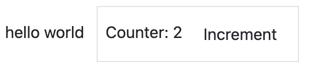

As a first exercise, let us modify the `Playground` component located in
:file:`awesome_owl/static/src/` to turn it into a counter. To see the result, you can go to the
`/awesome_owl` route with your browser.

#. Modify :file:`playground.js` so that it acts as a counter like in the example above. You will
   need to use the `useState hook
   <{OWL_PATH}/doc/reference/hooks.md#usestate>`_ so that the component is re-rendered
   whenever any part of the state object that has been read by this component is modified.
#. In the same component, create an `increment` method.
#. Modify the template in :file:`playground.xml` so that it displays your counter variable. Use
   `t-esc <{OWL_PATH}/doc/reference/templates.md#outputting-data>`_ to output the data.
#. Add a button in the template and specify a `t-on-click
   <{OWL_PATH}/doc/reference/event_handling.md#event-handling>`_ attribute in the button to
   trigger the `increment` method whenever the button is clicked.

.. tip::
   The Odoo JavaScript files downloaded by the browser are minified. For debugging purpose, it's
   easier when the files are not minified. Switch to
   :ref:`debug mode with assets <developer-mode/url>` so that the files are not minified.

This exercise showcases an important feature of Owl: the `reactivity system <{OWL_PATH}/doc/reference/reactivity.md>`_.
The `useState` function wraps a value in a proxy so Owl can keep track of which component
needs which part of the state, so it can be updated whenever a value has been changed. Try
removing the `useState` function and see what happens.

2. Extract `Counter` in a sub component
=======================================

For now we have the logic of a counter in the `Playground` component, but it is not reusable. Let us
see how to create a `sub-component <{OWL_PATH}/doc/reference/component.md#sub-components>`_ from it:

#. Extract the counter code from the `Playground` component into a new `Counter` component.
#. You can do it in the same file first, but once it's done, update your code to move the
   `Counter` in its own folder and file. Import it relatively from `./counter/counter`. Make sure
   the template is in its own file, with the same name.
#. Add two counters in your playground.

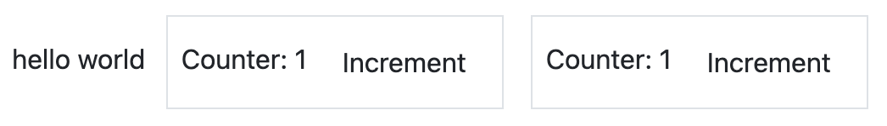

.. tip::
   By convention, most components code, template and css should have the same snake-cased name
   as the component. For example, if we have a `TodoList` component, its code should be in
   `todo_list.js`, `todo_list.xml` and if necessary, `todo_list.scss`

.. important::
   Don't forget :code:`/** @odoo-module **/` in your JavaScript files. More information on this can
   be found :ref:`here <frontend/modules/native_js>`.

.. _tutorials/discover_js_framework/simple_card:

3. A simple `Card` component
============================

Components are really the most natural way to divide a complicated user interface into multiple
reusable pieces. But to make them truly useful, it is necessary to be able to communicate
some information between them. Let us see how a parent component can provide information to a
sub component by using attributes (most commonly known as `props <{OWL_PATH}/doc/reference/props.md>`_).

The goal of this exercise is to create a `Card` component, that takes two props: `title` and `content`.
For example, here is how it could be used:

.. code-block:: xml

   <Card title="'my title'" content="'some content'"/>

The above example should produce some html using bootstrap that look like this:

.. code-block:: html

         

             

                 <h5 class="card-title">my title</h5>
                 

                  some content
                 

             

         

#. Create a `Card` component
#. Import it in `Playground` and display a few cards in its template

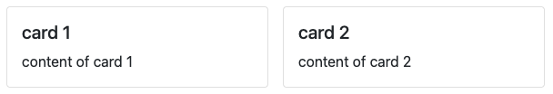

4. Using `markup` to display html
=================================

If you used `t-esc` in the previous exercise, then you may have noticed that Owl will automatically escape
its content. For example, if you try to display some html like this: `<Card title="'my title'" content="this.html"/>`
with `this.html = "
some content
""`,
the resulting output will simply display the html as a string.

In this case, since the `Card` component may be used to display any kind of content, it makes sense
to allow the user to display some html. This is done with the
`t-out directive <{OWL_PATH}/doc/reference/templates.md#outputting-data>`_.

However, displaying arbitrary content as html is dangerous, it could be used to inject malicious code, so
by default, Owl will always escape a string unless it has been explicitely marked as safe with the `markup`
function.

#. Update `Card` to use `t-out`
#. Update `Playground` to import `markup`, and use it on some html values
#. Make sure that you see that normal strings are always escaped, unlike markuped strings.

.. note::

   The `t-esc` directive can still be used in Owl templates. It is slightly faster than `t-out`.

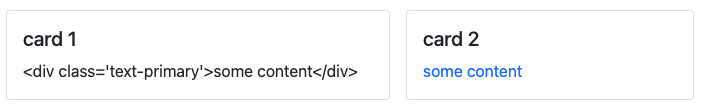

5. Props validation
===================

The `Card` component has an implicit API. It expects to receive two strings in its props: the `title`
and the `content`. Let us make that API more
explicit. We can add a props definition that will let Owl perform a validation step in `dev mode
<{OWL_PATH}/doc/reference/app.md#dev-mode>`_. You can activate the dev mode in the `App
configuration <{OWL_PATH}/doc/reference/app.md#configuration>`_ (but it is activated by default
on the `awesome_owl` playground).

It is a good practice to do props validation for every component.

#. Add `props validation <{OWL_PATH}/doc/reference/props.md#props-validation>`_ to the `Card`
   component.
#. Rename the `title` props into something else in the playground template, then check in the
   :guilabel:`Console` tab of your browser's dev tools that you can see an error.

6. The sum of two `Counter`
===========================

We saw in a previous exercise that `props` can be used to provide information from a parent
to a child component. Now, let us see how we can communicate information in the opposite
direction: in this exercise, we want to display two `Counter` components, and below them, the sum of
their values. So, the parent component (`Playground`) need to be informed whenever one of
the `Counter` value is changed.

This can be done by using a `callback prop <{OWL_PATH}/doc/reference/props.md#binding-function-props>`_:
a prop that is a function meant to be called back. The child component can choose to call
that function with any argument. In our case, we will simply add an optional `onChange` prop that will
be called whenever the `Counter` component is incremented.

#. Add prop validation to the `Counter` component: it should accept an optional `onChange`
   function prop.
#. Update the `Counter` component to call the `onChange` prop (if it exists) whenever it
   is incremented.
#. Modify the `Playground` component to maintain a local state value (`sum`), initially
   set to 2, and display it in its template
#. Implement an `incrementSum` method in `Playground`
#. Give that method as a prop to two (or more!) sub `Counter` components.

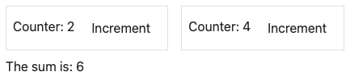

.. important::

   There is a subtlety with callback props: they usually should be defined with the `.bind`
   suffix. See the `documentation <{OWL_PATH}/doc/reference/props.md#binding-function-props>`_

7. A todo list
==============

Let us now discover various features of Owl by creating a todo list.  We need two components: a
`TodoList` component that will display a list of `TodoItem` components. The list of todos is a
state that should be maintained by the `TodoList`.

For this tutorial, a `todo` is an object that contains three values: an `id` (number), a `description`
(string) and a flag `isCompleted` (boolean):

.. code-block:: js

   { id: 3, description: "buy milk", isCompleted: false }

#. Create a `TodoList` and a `TodoItem` components
#. The `TodoItem` component should receive a `todo` as a prop, and display its `id` and `description` in a `div`.
#. For now, hardcode the list of todos:

   .. code-block:: js

      // in TodoList
      this.todos = useState([{ id: 3, description: "buy milk", isCompleted: false }]);

#. Use `t-foreach <{OWL_PATH}/doc/reference/templates.md#loops>`_ to display each todo in a `TodoItem`
#. Display a `TodoList` in the playground
#. Add props validation to `TodoItem`

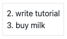

Note that the `t-foreach` directive is not exactly the same in Owl as the QWeb python implementation: it
requires a `t-key` unique value, so Owl can properly reconciliate each element.

.. tip::

   Since the `TodoList` and `TodoItem` components are so tightly coupled, it makes
   sense to put them in the same folder

8. Use dynamic attributes
=========================

For now, the `TodoItem` component does not visually show if the `todo` is completed. Let us do that by
using a `dynamic attributes <{OWL_PATH}/doc/reference/templates.md#dynamic-attributes>`_.

#. Add the Bootstrap classes `text-muted` and `text-decoration-line-through` on the `TodoItem` root element
   if it is completed.
#. Change the hardcoded `todo` value to check that it is properly displayed.

Even though the directive is named `t-att` (for attribute), it can be used to set a `class` value (and
html properties such as the `value` of an input).

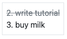

.. tip::

   Owl let you combine static class values with dynamic values. The following example will work as expected:

   .. code-block:: xml

      

   See also: `Owl: Dynamic class attributes <{OWL_PATH}/doc/reference/templates.md#dynamic-class-attribute>`_

9. Adding a todo
================

So far, the todos in our list are hard-coded. Let us make it more useful by allowing the user to add
a todo to the list.

#. Remove the hardcoded values in the `TodoList` component

   .. code-block:: javascript

      this.todos = useState([]);

#. Add an input above the task list with placeholder *Enter a new task*.
#. Add an `event handler <{OWL_PATH}/doc/reference/event_handling.md>`_ on the `keyup` event
   named `addTodo`.
#. Implement `addTodo` to check if enter was pressed (:code:`ev.keyCode === 13`), and in that
   case, create a new todo with the current content of the input as the description and clear the
   input of all content.
#. Make sure the todo has a unique id. It can be just a counter that increments at each todo.
#. Bonus point: don't do anything if the input is empty.

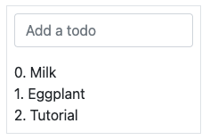

.. seealso::
   `Owl: Reactivity <{OWL_PATH}/doc/reference/reactivity.md>`_

Theory: Component lifecycle and hooks
=====================================

So far, we have seen one example of a hook function: `useState`. A `hook <{OWL_PATH}/doc/reference/hooks.md>`_
is a special function that *hook into* the internals of the component. In the case of
`useState`, it generates a proxy object linked to the current component. This is why
hook functions have to be called in the `setup` method, and no later!

.. flowchart LR

..     classDef hook fill:#ccf

..     subgraph "creation"
..     direction TB
..     A:::hook
..     B:::hook
..     M:::hook
..     A[setup]-->B
..     B[onWillStart] --> C(render)
..     C --> D("mount (in DOM)")
..     D --> M[onMounted]
..     end

..     subgraph updates
..     direction TB
..     E:::hook
..     F:::hook
..     H:::hook
..     E["(onWillUpdateProps)"] --> L(render)
..     L --> F[onWillPatch]
..     F --> G(patch DOM)
..     G --> H[onPatched]
..     end

..     subgraph destruction
..     direction TB
..     I:::hook
..     J:::hook
..     I[onWillUnmount] --> J[onWillDestroy]
..     J --> N(removed from DOM)

..     end

..     creation --> updates
..     updates --> destruction


An Owl component goes through a lot of phases: it can be instantiated, rendered,
mounted, updated, detached, destroyed, ... This is the `component lifecycle <{OWL_PATH}/doc/reference/component.md#lifecycle>`_.
The figure above show the most important events in the life of a component (hooks are shown in purple).
Roughly speaking, a component is created, then updated (potentially many times), then is destroyed.

Owl provides a variety of built-in `hooks functions <{OWL_PATH}/doc/reference/hooks.md>`_. All of them have to be called in
the `setup` function. For example, if you want to execute some code when your component is mounted, you can use the `onMounted`
hook:

.. code-block:: javascript

   setup() {
     onMounted(() => {
       // do something here
     });
   }

.. tip::

   All hook functions start with `use` or `on`. For example: `useState` or `onMounted`.

10. Focusing the input
======================

Let's see how we can access the DOM with `t-ref <{OWL_PATH}/doc/reference/refs.md>`_ and `useRef
<{OWL_PATH}/doc/reference/hooks.md#useref>`_. The main idea is that you need to mark
the target element in the component template with a `t-ref`:

.. code-block:: xml

   
hello

Then you can access it in the JS with the `useRef hook <{OWL_PATH}/doc/reference/hooks.md#useref>`_.
However, there is a problem if you think about it: the actual html element for a
component does not exist when the component is created. It only exists when the
component is mounted. But hooks have to be called in the `setup` method. So, `useRef`
return an object that contains a `el` (for element) key that is only defined when the
component is mounted.

.. code-block:: js

   setup() {
      this.myRef = useRef('some_name');
      onMounted(() => {
         console.log(this.myRef.el);
      });
   }

#. Focus the `input` from the previous exercise. This this should be done from the
   `TodoList` component (note that there is a `focus` method on the input html element).
#. Bonus point: extract the code into a specialized `hook <{OWL_PATH}/doc/reference/hooks.md>`_
   `useAutofocus` in a new :file:`awesome_owl/utils.js` file.

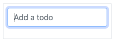

.. tip::

   Refs are usually suffixed by `Ref` to make it obvious that they are special objects:

   .. code-block:: js

      this.inputRef = useRef('refname');

11. Toggling todos
==================

Now, let's add a new feature: mark a todo as completed. This is actually trickier than one might
think. The owner of the state is not the same as the component that displays it. So, the `TodoItem`
component needs to communicate to its parent that the todo state needs to be toggled. One classic
way to do this is by using a `callback prop
<{OWL_PATH}/doc/reference/props.md#binding-function-props>`_ `toggleState`.

#. Add an input with the attribute :code:`type="checkbox"` before the id of the task, which must
   be checked if the state `isCompleted` is true.

   .. tip::
      Owl does not create attributes computed with the `t-att` directive if it evaluates to a
      falsy value.

#. Add a callback props `toggleState` to `TodoItem`.
#. Add a `click` event handler on the input in the `TodoItem` component and make sure it calls the
   `toggleState` function with the todo id.
#. Make it work!

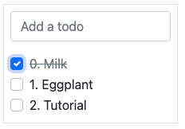

12. Deleting todos
==================

The final touch is to let the user delete a todo.

#. Add a new callback prop `removeTodo` in `TodoItem`.
#. Insert :code:`` in the template of the `TodoItem` component.
#. Whenever the user clicks on it, it should call the `removeTodo` method.
#. Make it work!

   .. tip::
      If you're using an array to store your todo list, you can use the JavaScript `splice`
      function to remove a todo from it.

.. code-block::

   // find the index of the element to delete
   const index = list.findIndex((elem) => elem.id === elemId);
   if (index >= 0) {
         // remove the element at index from list
         list.splice(index, 1);
   }

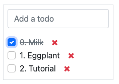

.. _tutorials/discover_js_framework/generic_card:

13. Generic `Card` with slots
=============================

In a :ref:`previous exercise <tutorials/discover_js_framework/simple_card>`, we built
a simple `Card` component. But it is honestly quite limited. What if we want
to display some arbitrary content inside a card, such as a sub component? Well,
it does not work, since the content of the card is described by a string. It would
however be very convenient if we could describe the content as a piece of template.

This is exactly what Owl `slot <{OWL_PATH}/doc/reference/slots.md>`_ system is designed
for: allowing to write generic components.

Let us modify the `Card` component to use slots:

#. Remove the `content` prop
#. Use the default slot to define the body
#. Insert a few cards with arbitrary content, such as a `Counter` component
#. (bonus) Add prop validation

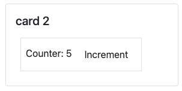

.. seealso::
   `Bootstrap: documentation on cards <https://getbootstrap.com/docs/5.2/components/card/>`_

14. Minimizing card content
===========================

Finally, let's add a feature to the `Card` component, to make it more interesting: we
want a button to toggle its content (show it or hide it)

#. Add a state to the `Card` component to track if it is open (the default) or not
#. Add a `t-if` in the template to conditionally render the content
#. Add a button in the header, and modify the code to flip the state when the button is clicked

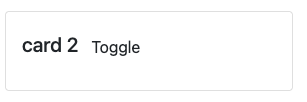
