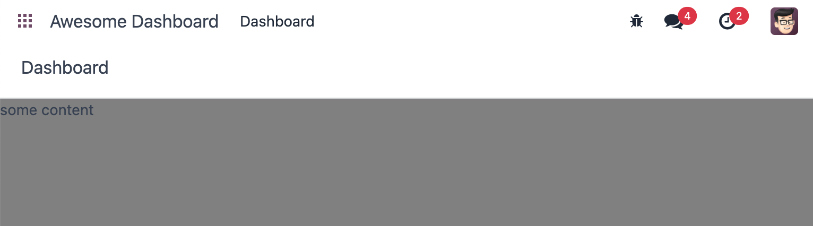
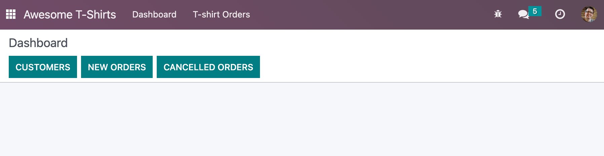
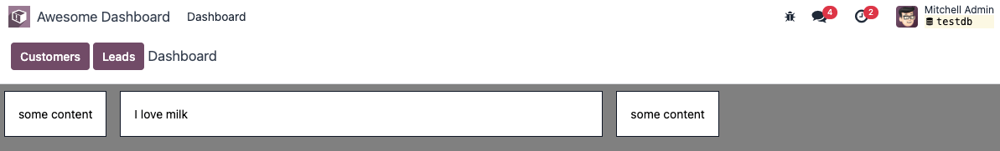
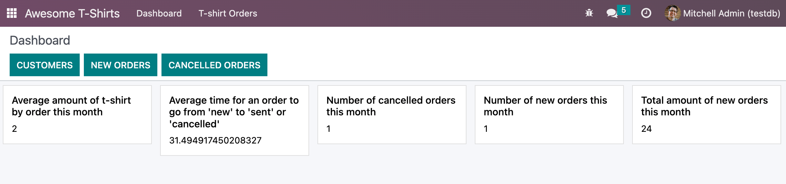

============================
Chapter 2: Build a dashboard
============================

The first part of this tutorial introduced you to most of Owl ideas. It is now time to learn
about the Odoo JavaScript framework in its entirety, as used by the web client.

.. graph TD
..     subgraph "Owl"
..         C[Component]
..         T[Template]
..         H[Hook]
..         S[Slot]
..         E[Event]
..     end

..     odoo[Odoo JavaScript framework] --> Owl

.. figure:: 02_web_framework/previously_learned.svg
   :align: center
   :width: 50%

To get started, you need a running Odoo server and a development environment setup. Before getting
into the exercises, make sure you have followed all the steps described in this
:ref:`tutorial introduction <tutorials/discover_js_framework/setup>`. For this chapter, we will start
from the empty dashboard provided by the `awesome_dashboard` addon. We will progressively add
features to it, using the Odoo JavaScript framework.

.. admonition:: Goal

   .. image:: 02_web_framework/overview_02.png
      :align: center

.. spoiler:: Solutions

   The solutions for each exercise of the chapter are hosted on the
   `official Odoo tutorials repository
   <https://github.com/odoo/tutorials/commits/{CURRENT_MAJOR_BRANCH}-discover-js-framework-solutions/awesome_dashboard>`_.

1. A new Layout
===============

Most screens in the Odoo web client uses a common layout: a control panel on top, with some buttons,
and a main content zone just below. This is done using the `Layout component
<{GITHUB_PATH}/addons/web/static/src/search/layout.js>`_, available in `@web/search/layout`.

#. Update the `AwesomeDashboard` component located in :file:`awesome_dashboard/static/src/` to use the
   `Layout` component. You can use
   :code:`{controlPanel: {} }` for the `display` props of
   the `Layout` component.
#. Add a `className` prop to `Layout`: `className="'o_dashboard h-100'"`
#. Add a `dashboard.scss` file in which you set the background-color of `.o_dashboard` to gray (or your
   favorite color)

Open http://localhost:8069/web, then open the :guilabel:`Awesome Dashboard` app, and see the
result.

.. seealso::

   - `Example: use of Layout in client action
     <{GITHUB_PATH}/addons/web/static/src/webclient/actions/reports/report_action.js>`_ and
     `template <{GITHUB_PATH}/addons/web/static/src/webclient/actions/reports/report_action.xml>`_
   - `Example: use of Layout in kanban view
     <{GITHUB_PATH}/addons/web/static/src/views/kanban/kanban_controller.xml>`_

.. _tutorials/discover_js_framework/services:

Theory: Services
================

In practice, every component (except the root component) may be destroyed at any time and replaced
(or not) with another component. This means that each component internal state is not persistent.
This is fine in many cases, but there certainly are situations where we want to keep some data around.
For example, all discuss messages should not be reloaded every time we display a channel.

Also, it may happen that we need to write some code that is not a component. Maybe something that
process all barcodes, or that manages the user configuration (context, ...).

The Odoo framework defines the idea of a :ref:`service <frontend/services>`, which is a persistent
piece of code that exports state and/or functions. Each service can depend on other services, and
components can import a service.

The following example registers a simple service that displays a notification every 5 seconds:

.. code-block:: js

   import { registry } from "@web/core/registry";

   const myService = {
   dependencies: ["notification"],
   start(env, { notification }) {
      let counter = 1;
      setInterval(() => {
         notification.add(`Tick Tock ${counter++}`);
      }, 5000);
   },
   };

   registry.category("services").add("myService", myService);

Services can be accessed by any component. Imagine that we have a service to maintain some shared
state:

.. code-block:: js

   import { registry } from "@web/core/registry";

   const sharedStateService = {
   start(env) {
      let state = {};

      return {
         getValue(key) {
         return state[key];
         },
         setValue(key, value) {
         state[key] = value;
         },
      };
   },
   };

   registry.category("services").add("shared_state", sharedStateService);

Then, any component can do this:

.. code-block:: js

   import { useService } from "@web/core/utils/hooks";

   setup() {
      this.sharedState = useService("shared_state");
      const value = this.sharedState.getValue("somekey");
      // do something with value
   }

2. Add some buttons for quick navigation
========================================

One important service provided by Odoo is the `action` service: it can execute
all kind of standard actions defined by Odoo. For example, here is how one
component could execute an action by its xml id:

.. code-block:: js

   import { useService } from "@web/core/utils/hooks";
   ...
   setup() {
         this.action = useService("action");
   }
   openSettings() {
         this.action.doAction("base_setup.action_general_configuration");
   }
   ...

Let us now add two buttons to our control panel:

#. A button `Customers`, which opens a kanban view with all customers (this action already
   exists, so you should use `its xml id
   <https://github.com/odoo/odoo/blob/1f4e583ba20a01f4c44b0a4ada42c4d3bb074273/odoo/addons/base/views/res_partner_views.xml#L510>`_).

#. A button `Leads`, which opens a dynamic action on the `crm.lead` model with a list and a form view.

.. seealso::
   - `Example: doAction use
     <{GITHUB_PATH}/addons/account/static/src/components/journal_dashboard_activity
     /journal_dashboard_activity.js#L35>`_
   - `Code: action service
     <{GITHUB_PATH}/addons/web/static/src/webclient/actions/action_service.js>`_

3. Add a DashboardItem
======================

Let us now improve our content.

#. Create a generic `DashboardItem` component that display its default slot in a nice card layout
   It should take an optional `size` number props, that default to `1`
   The width should be hardcoded to `(18*size)rem`.
#. Add a few cards in the dashboard, with no size and a size of 2.

.. seealso::
   - `Owl slot system <{OWL_PATH}/doc/reference/slots.md>`_

4. Call the server, add some statistics
=======================================

Let's improve the dashboard by adding a few dashboard items to display *real* business data.
The *awesome_dashboard* addon provides a `/awesome_dashboard/statistics` route that is meant
to return some interesting information.

To call a specific controller, we need to use the :ref:`rpc service <frontend/services/rpc>`.
It only exports a single function that perform the request: :code:`rpc(route, params, settings)`.
A basic request could look like this:

.. code-block:: js

   setup() {
         this.rpc = useService("rpc");
         onWillStart(async () => {
            const result = await this.rpc("/my/controller", {a: 1, b: 2});
            // ...
         });
   }

#. Update `Dashboard` so that it uses the `rpc` service.
#. Call the statistics route `/awesome_dashboard/statistics` in the `onWillStart` hook.
#. Display a few cards in the dashboard containing:

   - Number of new orders this month
   - Total amount of new orders this month
   - Average amount of t-shirt by order this month
   - Number of cancelled orders this month
   - Average time for an order to go from 'new' to 'sent' or 'cancelled'

.. seealso::

   - `Code: rpc service <{GITHUB_PATH}/addons/web/static/src/core/network/rpc_service.js>`_
   - `Example: calling a route in onWillStart
     <https://github.com/odoo/odoo/blob/1f4e583ba20a01f4c44b0a4ada42c4d3bb074273/
     addons/lunch/static/src/views/search_model.js#L21>`_

5. Cache network calls, create a service
========================================

If you open the :guilabel:`Network` tab of your browser's dev tools, you will see that the call to
`/awesome_dashboard/statistics` is done every time the client action is displayed. This is because the
`onWillStart` hook is called each time the `Dashboard` component is mounted. But in this case, we
would prefer to do it only the first time, so we actually need to maintain some state outside of the
`Dashboard` component. This is a nice use case for a service!

#. Register and import a new `awesome_dashboard.statistics` service.
#. It should provide a function `loadStatistics` that, once called, performs the actual rpc, and
   always return the same information.
#. Use the `memoize <https://github.com/odoo/odoo/blob/1f4e583ba20a01f4c44b0a4ada42c4d3bb074273/
   addons/web/static/src/core/utils/functions.js#L11>`_ utility function from
   `@web/core/utils/functions` that will allow caching the statistics.
#. Use this service in the `Dashboard` component.
#. Check that it works as expected

.. seealso::
   - `Example: simple service <{GITHUB_PATH}/addons/web/static/src/core/network/http_service.js>`_
   - `Example: service with a dependency
     <{GITHUB_PATH}/addons/web/static/src/core/user_service.js>`_

6. Display a pie chart
======================

Everyone likes charts (!), so let us add a pie chart in our dashboard. It will display the
proportions of t-shirts sold for each size: S/M/L/XL/XXL.

For this exercise, we will use `Chart.js <https://www.chartjs.org/>`_. It is the chart library used
by the graph view. However, it is not loaded by default, so we will need to either add it to our
assets bundle, or lazy load it. Lazy loading is usually better since our users will not have to load
the chartjs code every time if they don't need it.

#. Create a `PieChart` component
#. In its `onWillStart` method, load chartjs, you can use the `loadJs
   <https://github.com/odoo/odoo/blob/1f4e583ba20a01f4c44b0a4ada42c4d3bb074273/
   addons/web/static/src/core/assets.js#L23>`_ function to load
   :file:`/web/static/lib/Chart/Chart.js`.
#. Use the `PieChart` component in a `DashboardItem` to display a `pie chart
   <https://www.chartjs.org/docs/2.8.0/charts/doughnut.html>`_ that shows the
   correct quantity for each sold t-shirts in each size (that information is available in the
   statistics route). Note that you can use the `size` property to make it look larger
#. The `PieChart` component will need to render a canvas, and draw on it using `chart.js`.
#. Make it work!

.. image:: 02_web_framework/pie_chart.png
   :align: center
   :scale: 80%

.. seealso::
   - `Example: lazy loading a js file
     <https://github.com/odoo/odoo/blob/1f4e583ba20a01f4c44b0a4ada42c4d3bb074273/
     addons/web/static/src/views/graph/graph_renderer.js#L57>`_
   - `Example: rendering a chart in a component
     <https://github.com/odoo/odoo/blob/1f4e583ba20a01f4c44b0a4ada42c4d3bb074273/
     addons/web/static/src/views/graph/graph_renderer.js#L618>`_

7. Real life update
===================

Since we moved the data loading in a cache, it does not ever updates. But let us say that we
are looking at fast moving data, so we want to periodically (for example, every 10min) reload
fresh data.

This is quite simple to implement, with a `setTimeout` or `setInterval` in the dashboard service.
However, here is the tricky part: if the dashboard is currently being displayed, it should be
updated immediately.

To do that, one can use a `reactive` object: it is just like the proxy returned by `useState`,
but not linked to any component. A component can then do a `useState` on it to subscribe to its
changes.

#. Update the dashboard service to reload data every 10 minutes (to test it, use 10s instead!)
#. Modify it to return a `reactive <{OWL_PATH}/doc/reference/reactivity.md#reactive>`_ object.
   Reloading data should update the reactive object in place.
#. The `Dashboard` component can now use it with a `useState`

.. seealso::
  - `Documentation on reactivity <{OWL_PATH}/doc/reference/reactivity.md>`_
  - `Example: Use of reactive in a service
    <https://github.com/odoo/odoo/blob/1f4e583ba20a01f4c44b0a4ada42c4d3bb074273/
    addons/web/static/src/core/debug/profiling/profiling_service.js#L30>`_

8. Lazy loading the dashboard
=============================

Let us imagine that our dashboard is getting quite big, and is only of interest to some
of our users. In that case, it could make sense to lazy load our dashboard, and all
related assets, so we only pay the cost of loading the code when we actually want to
look at it.

To do that, we will need to create a new bundle containing all our dashboard assets,
then use the `LazyComponent` (located in `@web/core/assets`).

#. Move all dashboard assets into a sub folder `/dashboard` to make it easier to
   add to a bundle.
#. Create a `awesome_dashboard.dashboard` assets bundle containing all content of
   the `/dashboard` folder
#. Modify `dashboard.js` to register itself in the `lazy_components` registry, and not
   in the `action` registry.
#. Add in `src/` a file `dashboard_action` that import `LazyComponent` and register
   it to the `action` registry

9. Making our dashboard generic
===============================

So far, we have a nice working dashboard. But it is currently hardcoded in the dashboard
template. What if we want to customize our dashboard? Maybe some users have different
needs, and want to see some other data.

So, the next step is then to make our dashboard generic: instead of hardcoding its content
in the template, it can just iterate over a list of dashboard items. But then, many
questions comes up: how to represent a dashboard item, how to register it, what data
should it receive, and so on. There are many different ways to design such a system,
with different trade offs.

For this tutorial, we will say that a dashboard item is an object with the folowing structure:

.. code-block:: js

   const item = {
      id: "average_quantity",
      description: "Average amount of t-shirt",
      Component: StandardItem,
      // size and props are optionals
      size: 3,
      props: (data) => ({
         title: "Average amount of t-shirt by order this month",
         value: data.average_quantity
      }),
   };

The `description` value will be useful in a later exercise to show the name of items that the
user can choose to add to his dashboard. The `size` number is optional, and simply describes
the size of the dashboard item that will be displayed. Finally, the `props` function is optional.
If not given, we will simply give the `statistics` object as data. But if it is defined, it will
be used to compute specific props for the component.

The goal is to replace the content of the dashboard with the following snippet:

.. code-block:: xml

   <t t-foreach="items" t-as="item" t-key="item.id">
      <DashboardItem size="item.size || 1">
         <t t-set="itemProp" t-value="item.props ? item.props(statistics) : {'data': statistics}"/>
         <t t-component="item.Component" t-props="itemProp" />
      </DashboardItem>
   </t>

Note that the above example features two advanced features of Owl: dynamic components, and dynamic props.

We currently have two kinds of item components: number cards, with a title and a number, and pie cards, with
some label and a pie chart.

#. create and implement two components: `NumberCard` and `PieChartCard`, with the corresponding props
#. create a file `dashboard_items.js` in which you define and export a list of items, using `NumberCard`
   and `PieChartCard` to recreate our current dashboard
#. import that list of items in our `Dashboard` component, add it to the component, and update the template
   to use a `t-foreach` like shown above

   .. code-block:: js

         setup() {
            this.items = items;
         }

And now, our dashboard template is generic!

10. Making our dashboard extensible
===================================

However, the content of our item list is still hardcoded. Let us fix that by using a registry:

#. Instead of exporting a list, register all dashboard items in a `awesome_dashboard` registry
#. Import all the items of the `awesome_dashboard` registry in the `Dashboard` component

The dashboard is now easily extensible. Any other odoo addon that want to register a new item to the
dashboard can just add it to the registry.

11. Add and remove dashboard items
==================================

Let us see how we can make our dashboard customizable. To make it simple, we will save the user
dashboard configuration in the local storage, so it is persistent, but we don't have to deal
with the server for now.

The dashboard configuration will be saved as a list of removed item ids.

#. Add a button in the control panel with a gear icon, to indicate that it is a settings button
#. Clicking on that button should open a dialog
#. In that dialog, we want to see a list of all existing dashboard items, each with a checkbox
#. There should be a `Apply` button in the footer. Clicking on it will build a list of all item ids
   that are unchecked
#. We want to store that value in the local storage
#. And modify the `Dashboard` component to filter the current items by removing the ids of items
   from the configuration

.. image:: 02_web_framework/items_configuration.png
   :width: 80%
   :align: center

12. Going further
=================

Here is a list of some small improvements you could try to do if you have the time:

#. Make sure your application can be :ref:`translated <reference/translations>` (with
   `env._t`).
#. Clicking on a section of the pie chart should open a list view of all orders which have the
   corresponding size.
#. Save the content of the dashboard in a user settings on the server!
#. Make it responsive: in mobile mode, each card should take 100% of the width

.. seealso::
   - `Example: use of env._t function
     <https://github.com/odoo/odoo/blob/1f4e583ba20a01f4c44b0a4ada42c4d3bb074273/
     addons/account/static/src/components/bills_upload/bills_upload.js#L64>`_
   - `Code: translation code in web/
     <https://github.com/odoo/odoo/blob/1f4e583ba20a01f4c44b0a4ada42c4d3bb074273/
     addons/web/static/src/core/l10n/translation.js#L16>`_
