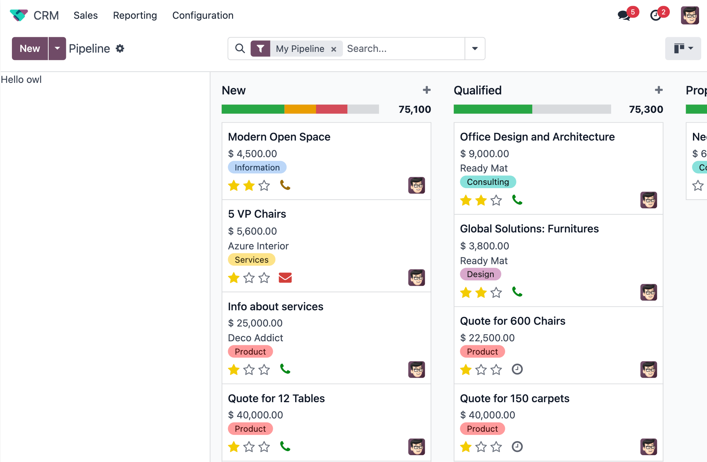
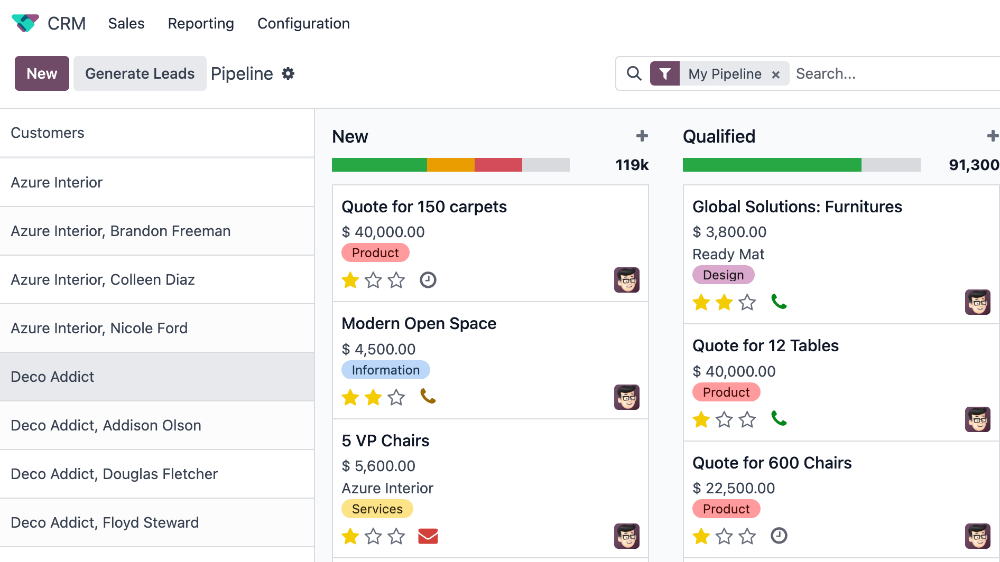
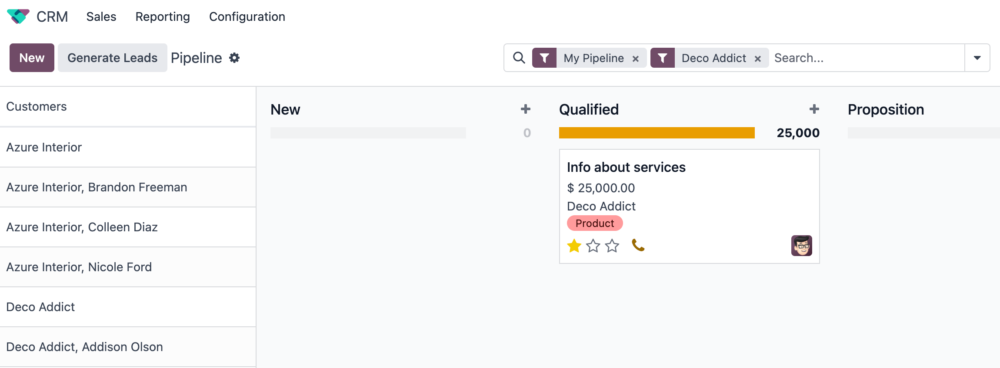
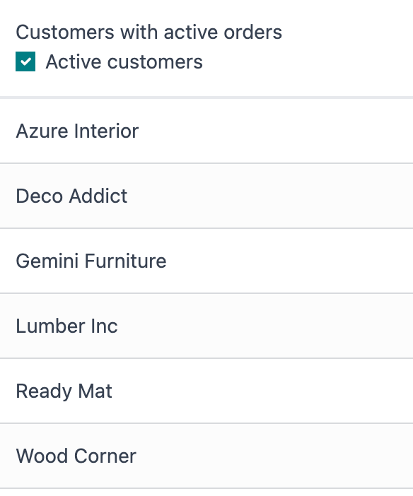
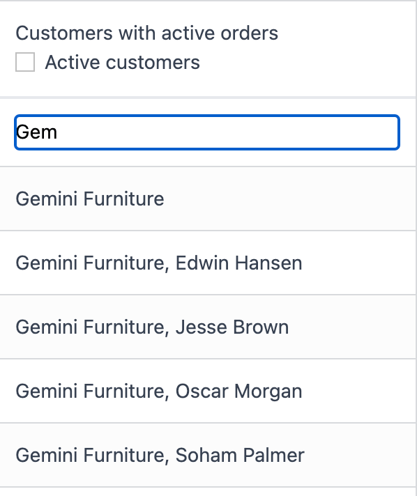

==================================
Chapter 3: Customize a kanban view
==================================

We have gained an understanding of the numerous capabilities offered by the Odoo web framework. As a
next step, we will customize a kanban view. This is a more complicated project that will showcase
some non trivial aspects of the framework. The goal is to practice composing views, coordinating
various aspects of the UI, and doing it in a maintainable way.

Bafien had the greatest idea ever: a mix of a kanban view and a list view would be perfect for your
needs! In a nutshell, he wants a list of customers on the left of the CRM kanban view. When you
click on a customer on the left sidebar, the kanban view on the right is filtered to only display
leads linked to that customer.

.. admonition:: Goal

   .. image:: 03_customize_kanban_view/overview.png
      :align: center

.. spoiler:: Solutions

   The solutions for each exercise of the chapter are hosted on the
   `official Odoo tutorials repository
   <https://github.com/odoo/tutorials/commits/{CURRENT_MAJOR_BRANCH}-master-odoo-web-framework-solutions/awesome_kanban>`_.

1. Create a new kanban view
===========================

Since we are customizing the kanban view, let us start by extending it and using our extension in
the kanban view of CRM.

#. Create a new empty component that extends the `KanbanController` component from
   :file:`@web/views/kanban/kanban_controller`.
#. Create a new view object and assign all keys and values from `kanbanView` from
   :file:`@web/views/kanban/kanban_view`. Override the Controller key by putting your newly
   created controller.
#. Register it in the views registry under `awesome_kanban`.
#. Update the crm kanban arch in :file:`awesome_kanban/views/views.xml` to use the extended view.
   This can be done by specifying the `js_class` attribute in the kanban node.

.. seealso::

   `Example: Create a new view by extending a pre-existing one <https://github.com/odoo/odoo/blob/0a59f37e7dd73daff2e9926542312195b3de4154/addons/todo/static/src/views/todo_conversion_form/todo_conversion_form_view.js>`_

2. Create a CustomerList component
==================================

We will need to display a list of customers, so we might as well create the component.

#. Create a `CustomerList` component which only displays a `div` with some text for now.
#. It should have a `selectCustomer` prop.
#. Create a new template extending (XPath) the kanban controller template `web.KanbanView` to add
   the `CustomerList` next to the kanban renderer. Give it an empty function as `selectCustomer`
   for now.

   .. tip::

      You can use this xpath inside the template to add a div before the renderer component.

      .. code-block:: xml

            <xpath expr="//t[@t-component='props.Renderer']" position="before">
               ...
            </xpath>

#. Subclass the kanban controller to add `CustomerList` in its sub-components.
#. Make sure you see your component in the kanban view.

.. seealso::

   :ref:`Template inheritance <reference/qweb/template_inheritance>`

3. Load and display data
========================

#. Modify the `CustomerList` component to fetch a list of all customers in `onWillStart`.
#. Display the list in the template with a `t-foreach`.
#. Whenever a customer is selected, call the `selectCustomer` function prop.

.. seealso::

   - `Example: fetching records from a model <https://github.com/odoo/odoo/blob/986c00c1bd1b3ca16a04ab25f5a2504108136112/addons/project/static/src/views/burndown_chart/burndown_chart_model.js#L26-L31>`_

4. Update the main kanban view
==============================

#. Implement `selectCustomer` in the kanban controller to add the proper domain.

   .. tip::

      Since it is not trivial to interact with the search view, here is a snippet to create a
      filter:

      .. code-block:: js

         this.env.searchModel.createNewFilters([{
               description: partner_name,
               domain: [["partner_id", "=", partner_id]],
               isFromAwesomeKanban: true, // this is a custom key to retrieve our filters later
         }])

#. By clicking on multiple customers, you can see that the old customer filter is not replaced.
   Make sure that by clicking on a customer, the old filter is replaced by the new one.

   .. tip::

      You can use this snippet to get the customers filters and toggle them.

      .. code-block:: js

         const customerFilters = this.env.searchModel.getSearchItems((searchItem) =>
               searchItem.isFromAwesomeKanban
         );

         for (const customerFilter of customerFilters) {
            if (customerFilter.isActive) {
                  this.env.searchModel.toggleSearchItem(customerFilter.id);
            }
         }

#. Modify the template to give the real function to the `CustomerList` `selectCustomer` prop.

.. note::

   You can use `Symbol
   <https://developer.mozilla.org/en-US/docs/Web/JavaScript/Reference/Global_Objects/Symbol>`_
   to make sure that the custom `isFromAwesomeKanban` key will not collide with keys any other
   code might add to the object.

5. Only display customers which have an active order
====================================================

There is a `opportunity_ids` field on `res.partner`. Let us allow the user to filter results on
customers with at least one opportunity.

#. Add an input of type checkbox in the `CustomerList` component, with a label "Active customers"
   next to it.
#. Changing the value of the checkbox should filter the list of customers.

6. Add a search bar to the customer list
========================================

Add an input above the customer list that allows the user to enter a string and to filter the
displayed customers, according to their name.

.. tip::
   You can use the `fuzzyLookup` from :file:`@web/core/utils/search` function to perform the
   filter.

.. seealso::

   - `Code: The fuzzylookup function <https://github.com/odoo/odoo/blob/235fc69280a18a5805d8eb84d76ada91ba49fe67/addons/web/static/src/core/utils/search.js#L41-L54>`_
   - `Example: Using fuzzyLookup
     <https://github.com/odoo/odoo/blob/1f4e583ba20a01f4c44b0a4ada42c4d3bb074273/
     addons/web/static/tests/core/utils/search_test.js#L17>`_

7. Refactor the code to use `t-model`
=====================================

To solve the previous two exercises, it is likely that you used an event listener on the inputs. Let
us see how we could do it in a more declarative way, with the `t-model
<{OWL_PATH}/doc/reference/input_bindings.md>`_ directive.

#. Make sure you have a reactive object that represents the fact that the filter is active
   (something like
   :code:`this.state = useState({ displayActiveCustomers: false, searchString: ''})`).
#. Modify the code to add a getter `displayedCustomers` which returns the currently active list
   of customers.
#. Modify the template to use `t-model`.

8. Paginate customers!
======================

#. Add a :ref:`pager <frontend/pager>` in the `CustomerList`, and only load/render the first 20
   customers.
#. Whenever the pager is changed, the customer list should update accordingly.

This is actually pretty hard, in particular in combination with the filtering done in the
previous exercise. There are many edge cases to take into account.

.. image:: 03_customize_kanban_view/customer_pager.png
   :align: center
   :scale: 60%
