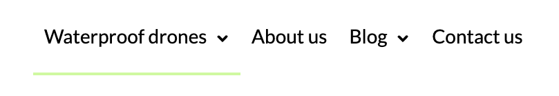
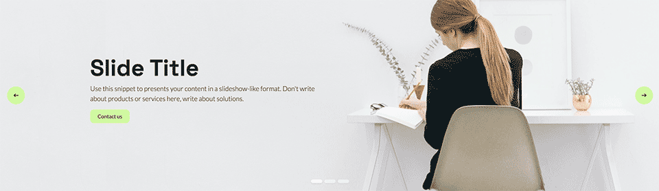
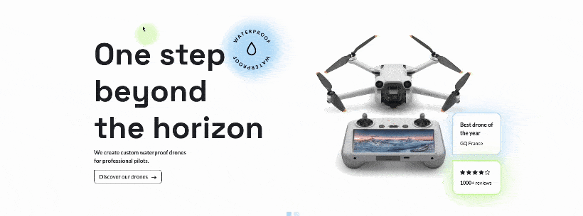
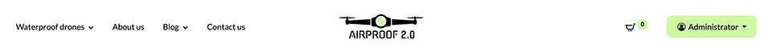
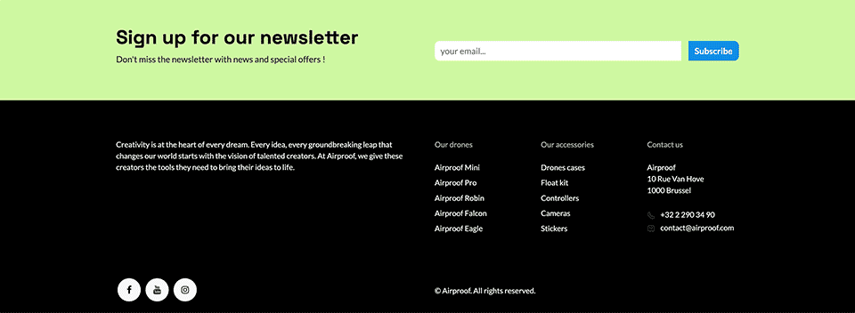

.. _website/customisation_part1:

=================================
Chapter 3 - Customisation, Part I
=================================

.. _website/customisation_part1/custom_scss:

Add custom SCSS
===============

You've adjusted Odoo and Bootstrap variables and set presets, yet you still notice disparities
between your website and the client's design. The only solution is to incorporate custom SCSS.

In :file:`theme.scss`, reproduce the following design elements:

- Add a **green underline** on active nav items.
- Modify the **arrow** for collapsible nav items.
- Modify the **slider’s arrows** by adding a green background and changing their design.

You will find the various media `here <{GITHUB_PATH}img/content/icons>`_.

.. note::
   | It’s always preferable to include all your SCSS rules in `#wrapwrap`. This ID is applied to the
     div that groups the :guilabel:`header`, :guilabel:`footer`, and :guilabel:`main` content of all
     your pages.
   | So you will be sure that your rules will only have an impact on the website parts.

.. seealso::
   Documentation on :ref:`<ANCOR website_themes/theming/styles>`.

.. _website/customisation_part1/custom_js:

Add custom JS
=============

Now, let's add a mouse follower to the website. This interactive element will enhance the browsing
experience, making it more engaging and visually appealing.

Use your JavaScript skills to implement this.

.. seealso::
   Documentation on :ref:`<ANCOR website_themes/theming/interactivity>`.

.. spoiler:: Solutions

   Find the solution in our Airproof example on `mouse_follower.js <{GITHUB_PATH}>`_ and
   `mouse_follower.scss <{GITHUB_PATH}>`_.

.. _website/customisation_part1/custom_header:

Create a custom header
======================

With variables, presets, and custom SCSS in place, it’s time to refine the layout and add key
cross-page elements, starting with the header.

Based on the Airproof design, create a custom header with the following elements:

- A centered logo. Ensure to :ref:`declare the company logo <ANCHOR>` so that it appears
  automatically in the header.
- A custom shopping cart icon.
- A login/user as a button.
- Navigation text to 14px.

You can find the `logo <{GITHUB_PATH}img/content/branding>`_,
`cart icon <{GITHUB_PATH}img/content/icons>`_ and
`template illustration <{GITHUB_PATH}img/wbuilder>`_. 

.. tip::
   - Base yourself on the code of existing header templates that you can find in
     `odoo/addons/website/views/website_templates.xml
     <{GITHUB_PATH}/addons/website/views/website_templates.xml>`_.
   - | To modify the cart icon, you can use an `XPath`.
     | Just as you did for the custom header (in :file:`website_templates.xml`), create a file to
       put all sale-related elements, such as the cart icon.
     | It will be the same principle for the blog views (:file:`website_blog_templates.xml`), event
       (:file:`website_event_templates.xml`), etc.
   - Don't forget to continue making as many modifications as you can through the :file:`Bootstrap
     variables` and :file:`primary variables` (font, colors, size...). You can use them to help you
     with this exercise.

.. seealso::
   Documentation on :ref:`<ANCOR website_themes/layout/header>` and
   :ref:`<ANCOR website_themes/layout/xpath>`.

.. _website/customisation_part1/custom_footer:

Create a custom footer
======================

The client is delighted with the new header, as it aligns perfectly with the provided design. Now,
he wants a matching custom footer.

Based on the Airproof design, create a custom footer with the following elements:

- A section for newsletter subscription.
- A section for the copyright and social media.

You will find the icons `here <{GITHUB_PATH}img/content/icons>`_. 

.. tip::
   - You can enable or disable the copyright section via the presets.
   - For the newsletter section to work, you need to install the `website_mass_mailing` application.

.. seealso::
   Documentation on :ref:`<ANCOR website_themes/layout/footer>` and
   :ref:`<ANCOR website_themes/layout/copyright>`.

.. _website/customisation_part1/custom_building_blocks:

Create your custom building blocks
==================================

To allow your client to further customize his website, create tailor-made building blocks that he
can freely drag & drop onto different pages.

Based on the Airproof design, create a custom carousel snippet to showcase drones. Then, add it as
cover section on your homepage.

#. | Create the snippet template.
   | And add it to the list of building blocks available in the website builder.
   | Here you will find the `images <{GITHUB_PATH}img/snippets/s_airproof_caroussel>`_ and `snippet
     <{GITHUB_PATH}img/wbuilder>`_ illustration. 
   
   .. image:: 03_customisation_part1/custom-building-block.png

#. Add an option available in the website builder to be able to choose blue or green for the bubble
   shadow.

   .. image:: 03_customisation_part1/custom-building-block-option.png
      :scale: 75%

#. Add the snippet on your homepage.

.. tip::
   Don't forget to always properly declare your new files in your :file:`__manifest__.py` and follow
   the good :ref:`folder structure <ANCOR website_themes/theming/theme module>` seen previously.

.. seealso::
   Documentation on :ref:`custom building blocks <ANCOR website_themes/building_blocks/Custom>`.

.. _website/customisation_part1/custom_building_blocks:

Create a template to add in dynamic snippets
============================================

| Useful building blocks are the dynamic snippets. These allow you to fetch information from the
  backend and display it on the website according to certain filters.
| There are already several layout templates for displaying dynamic snippets. However, none of the
  existing templates fully match your client’s needs.

Based on the Airproof design, create a custom template that you will apply to a product dynamic
snippet on the homepage.

#. First, create a custom template that includes the following elements:

   - Add a :guilabel:`Discover more` link
   - Add a hover effect on cards
   - Move the navigation arrows

   .. image:: 03_customisation_part1/custom-template.png

#. | Apply this template to the list of dynamic products templates.
   | You will find the icons `here <{GITHUB_PATH}img/content/icons>`_.

#. Then add a product dynamic snippet with the template you just created on the homepage.

.. tip::
   You can verify in the website builder that your template appears in the list of available
   templates for the product dynamic snippet.

.. seealso::
   Documentation on :ref:`<ANCOR website_themes/building_blocks/dynamic_content_templates>`.

