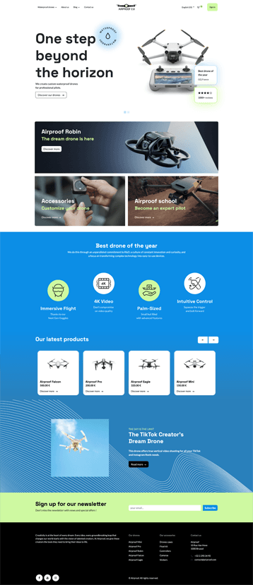

:show-content:
:show-toc:
:hide-page-toc:

=====================
Build a website theme
=====================

| For this project, we'll collaborate on creating a custom website theme fully integrated with Odoo.
| Our client, Airproof, has provided their latest design for their waterproof drone e-commerce,
  which we'll replicate.

To start, you must have :doc:`installed Odoo locally <../../../administration/on_premise/source>`.
You will also need some knowledge in:

- XML
- JavaScript (not mandatory)
- Bootstrap 5.1.3
- SCSS
- QWeb (Odoo's own templating system)
- OWL (JavaScript framework, not mandatory)

| **Goal**
| Replicate the Airproof design.

| In the :file:`README.md` of this `Airproof module
  <https://github.com/odoo/tutorials/tree/{CURRENT_MAJOR_BRANCH}/website_airproof>`_, you can find
  the various Airproof designs that you will replicate throughout the different exercises of this
  tutorial.
| You can also find all the code necessary for creating the Airproof website there. You should also
  obtain this by the end of the tutorial. It is recommended to try to solve the exercices first
  without looking at the solution!

| **Don't go too fast!**
| Follow the exercises step by step and you will reach the final design at the end of the exercises.

Read the documentation linked in the :doc:`How-to guide: Website theme <../howtos/website_themes>`.

Ready? Let's get started!

.. toctree::
    :maxdepth: 2

    website_theme/01_theming
    website_theme/02_build_website
    website_theme/03_customisation_part1
    website_theme/04_customisation_part2
    website_theme/05_dynamic_templates
    website_theme/06_going_live