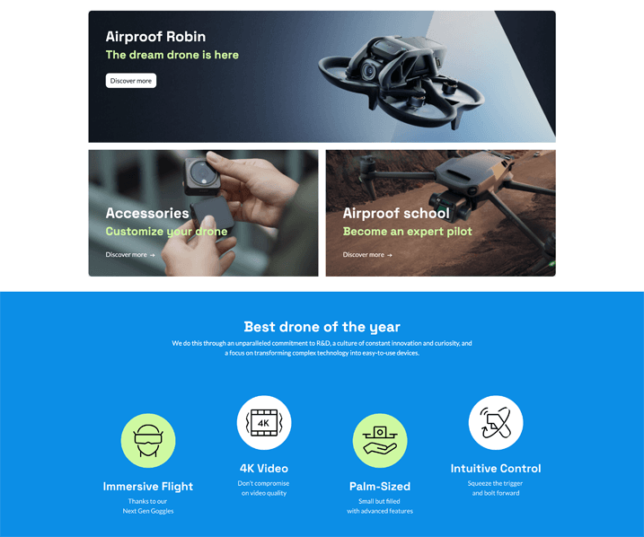
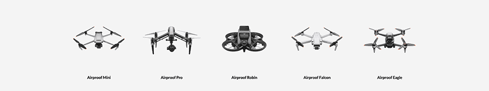

==============================
Chapter 2 - Build your website
==============================

.. _tutorials/website_theme/build_website/page:

Create a page
=============

Now that the theme has been set up, let's move on to creating the content.

First of all, start by creating your first theme page: the home page. For now, only indicate “Hello”
as content in the page.

.. tip::
   You will need to deactivate the default homepage.

.. seealso::
   Documentation on :ref:`website_themes/pages/default` and :ref:`website_themes/pages/theme_pages`.

.. spoiler:: Solutions

   .. code-block:: python
         :caption: ``/website_airproof/__manifest__.py``

         'data': [
            # Pages
            'data/pages/home.xml',
         ]

   .. code-block:: xml
      :caption: ``/website_airproof/data/pages/home.xml``

      <?xml version="1.0" encoding="utf-8"?>
      <odoo>
         <data noupdate="1">
            <!-- Deactivate default homepage -->
            <record id="website.homepage" model="ir.ui.view">
               <field name="active" eval="False"/>
            </record>
            <!-- Home -->
            <record id="page_home" model="website.page">
               <field name="name">Home</field>
               <field name="is_published" eval="True"/>
               <field name="key">website_airproof.page_home</field>
               <field name="url">/</field>
               <field name="type">qweb</field>
               <field name="arch" type="xml">
                  <t t-name="website_airproof.page_home">
                     <t t-call="website.layout">
                        <!-- Title -->
                        <t t-set="additional_title">One step beyond the horizon | Airproof</t>
                        <!-- Content -->
                        

                           
Hello

                        

                     </t>
                  </t>
               </field>
            </record>
         </data>
      </odoo>

.. _tutorials/website_theme/build_website/media:

Add a media
===========

If you want the client to be able to reuse certain pictures that you are going to add on the
website, they must be added to the image library.

| To do the test, declare the drone image to add it in the library. You will find the
  `drone picture here
  <https://github.com/odoo/tutorials/tree/{CURRENT_MAJOR_BRANCH}/website_airproof/static/src/img/content/drone-robin.png>`_.
| Go to the :guilabel:`website builder`, double click on the :guilabel:`logo`, you will see the
  drone image in the library.

.. seealso::
   Documentation on :ref:`website_themes/media/images`.

.. spoiler:: Solutions

   To complete this exercise, you need to:

   #. Put your PNG in the right image folder.
   #. Create your :file:`images.xml` file. You can find all the necessary information
      in the `images.xml
      <https://github.com/odoo/tutorials/tree/{CURRENT_MAJOR_BRANCH}/website_airproof/data/images.xml>`_
      file from our example module.
   #. Declare your file in the :file:`__manifest__.py`.

.. _tutorials/website_theme/build_website/building_blocks:

Add building blocks
===================

Now, let's get into the real work. Start adding content to the pages.

In an Odoo website, we create the content of a page using building blocks. These can be compared to
snippets editable by the user using the Website Builder. The standard main container of any snippet
is a `section`.

Based on the Airproof design, add the following elements to the homepage :

- Create a section with the 3 boxes using the :guilabel:`Big boxes` building block.

  - Ensure that it cannot be edited via the website builder.
  - Put an opacity filter on the background image of the 3 boxes.

- Create another section containing the title and icons.

You will find `images here
<https://github.com/odoo/tutorials/tree/{CURRENT_MAJOR_BRANCH}/website_airproof/static/src/img/content>`_
and the `icons here
<https://github.com/odoo/tutorials/tree/{CURRENT_MAJOR_BRANCH}/website_airproof/static/src/img/content/icons>`_.

.. tip::
   To determine the code needed to create your building blocks :

   - | Create a test page via the website builder.
     | Drag & drop the building block that interests you and give it the right design.
     | Use the code generated via :guilabel:`Editor HTML/SCSS` in the menu.
   - You can also find the original building block code in Odoo :
     :file:`odoo/addons/website/views/snippets/**.xml`.

.. seealso::
   Documentation on :ref:`website_themes/building_blocks/layout`.

.. spoiler:: Solutions

   Find the solution in our Airproof example on `home.xml
   <https://github.com/odoo/tutorials/tree/{CURRENT_MAJOR_BRANCH}/website_airproof/data/pages/home.xml>`_.

.. _tutorials/website_theme/build_website/navigation:

Navigation
==========

For now, the client is fine with the default header but has requested some navigation adjustments.

The client has requested the following changes:

- Remove the link to the homepage and the shop.
- Add a link to the future “About us” page.
- Replace the default blog item with a dropdown to display the different blogs: “Our latest news”
  and “Tutorials”.
- Add a mega-menu “Waterproof drones” to display the different products.

.. tip::
   - Make sure the Blog app is installed and create the two different blogs in the backend.
   - | Create the different products via the backend.
     | You will find some `product pictures here
       <https://github.com/odoo/tutorials/tree/{CURRENT_MAJOR_BRANCH}/website_airproof/static/src/img/content>`_.

.. seealso::
   - You can find the original mega-menu templates code in Odoo :
     :file:`odoo/addons/website/views/snippets/s_mega_menu_**.xml`
   - Documentation on :doc:`/developer/howtos/website_themes/navigation`.

.. spoiler:: Solutions

   Find the solution in our Airproof example on `menu.xml
   <https://github.com/odoo/tutorials/tree/{CURRENT_MAJOR_BRANCH}/website_airproof/data/menu.xml>`_.
