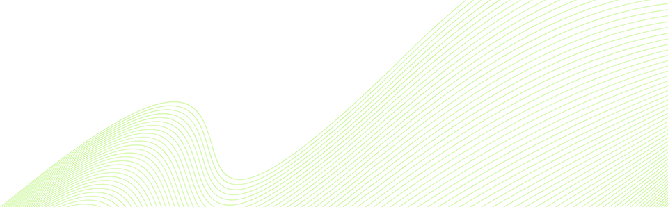
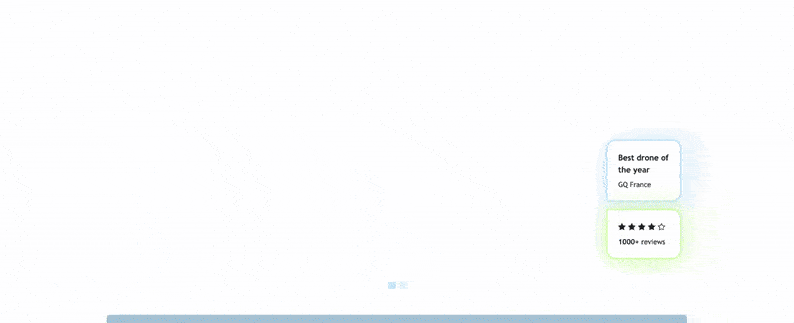

==================================
Chapter 4 - Customisation, Part II
==================================

.. _tutorials/website_theme/customisation_part2/background_shape:

Create a custom background shape
================================

Shapes are decorative elements that can be applied to backgrounds or images. These are SVG files
that can be animated and customized with different colors.

#. To better align with the website’s desired atmosphere, create a custom background shape that the
   client can reuse on different blocks.

   Create your custom shape using the following setup :

   - | Declare your shape.
     | You can find the `SVG shape here <https://github.com/odoo/tutorials/tree/16.0/website_airproof/shape-waves.svg>`_.
   - Set the base color of the shape to the theme's green, and add it to the list of available
     shapes.

.. tip::
   | **Be careful,** there is a trick!
   | In your shape SVG file, you have to use the colors from the default Odoo palette.
   | Here, I want it to match my primary color 3 (`#CEF8A1`). Therefore, in the SVG file, you must
     use color 3 from Odoo’s default palette (`#F6F6F6`).

.. seealso::
   Documentation on :ref:`custom background shapes <website_themes/shapes/bg/custom>`.

.. spoiler:: Solutions

   Find the solution in our Airproof example for:

   - the shape declaration on `shapes.xml <https://github.com/odoo/tutorials/tree/16.0/website_airproof/data/shapes.xml>`_.
   - adding the shape to the list thanks to
     `primary_variable.scss <https://github.com/odoo/tutorials/tree/16.0/website_airproof/static/src/scss/primary_variables.scss>`_
     and `option.xml <https://github.com/odoo/tutorials/tree/16.0/website_airproof/views/snippets/options.xml>`_.

2. Based on the Airproof design, apply the shape you just added to a `Text-Image` building block on
   the homepage :

   - Ensure the shape is in the right position.
   - Set its color to the theme’s light blue.

.. tip::
   Unlike a standard Odoo shapes, when applying a custom shape to a section, replace `web_editor`
   with `illustration` in the shape class.

.. seealso::
   Documentation on how to use :ref:`background shapes <website_themes/shapes/bg/custom/use>`.

.. spoiler:: Solutions

   .. code-block:: xml
      :caption: ``/website_airproof/data/pages/home.xml``

      <!-- Text-image block & Background shape -->
      <section class="s_text_image o_cc o_cc5 o_colored_level pt120 pb96"
      data-snippet="s_image_text" data-name="Image - Text" style="background-color: rgb(41, 128,
      187);" data-oe-shape-data="{'shape': 'illustration/airproof/waves', 'colors': {'c3': '#BBE1FA'},
      'flip': ['x']}">
         

         [...]
      </section>

.. _tutorials/website_theme/customisation_part2/background_gradient:

Add a background gradient
=========================

Apply a custom background gradient to your ”*Latest products*” block, transitioning from blue
`rgb(11, 142, 230)` to dark blue `rgb(41, 128, 187)`.

.. seealso::
   Documentation on :doc:`/developer/howtos/website_themes/gradients`.

.. spoiler:: Solutions

   .. code-block:: xml
      :caption: ``/website_airproof/data/pages/home.xml``

      <!-- Latest products section -->
      <section class="s_parallax o_colored_level o_cc o_cc5 s_parallax_no_overflow_hidden pt40 pb32"
      data-scroll-background-ratio="0" data-snippet="s_parallax" data-name="Parallax"
      style="background-image: linear-gradient(0deg, rgb(41, 128, 187) 0%, rgb(11, 142, 230) 100%)
      !important;">
         [...]
      </section>

.. _tutorials/website_theme/customisation_part2/animations:

Animations
==========

The client loves the overall design but finds the page a bit static. Enhance page interactivity with
animations such as `fade-in`, `rotate`, `bounce`, etc. These can be applied to columns, images,
texts, buttons…

Based on the airproof design, animate the following elements:

- the text of the first slide of the carousel.
- the sticker and the photo of the drone from the first slide.
- the 4 columns with icons.

Adjust animation delays for smoother transitions.

.. seealso::
   Documentation on :doc:`/developer/howtos/website_themes/animations`.

.. spoiler:: Solutions

   Find the solution in our Airproof example on
   `home.xml <https://github.com/odoo/tutorials/tree/16.0/website_airproof/data/pages/home.xml>`_.

   .. code-block:: xml
      :caption: Image animation

      

      

   .. code-block:: xml
      :caption: Text animation

      One
      step

   .. code-block:: xml
      :caption: Columns animation

      

      

.. _tutorials/website_theme/customisation_part2/forms:

Forms
=====

The forms in Odoo are very powerful. They can send emails directly to a personal inbox or integrate
directly with other Odoo applications.

This is great, as one of your client's main priorities is after-sales service. Therefore, the
contact form must be properly configured.

| Based on the airproof design, create a contact page. Remember to disable the default one and add
  the new page link to the menu.
| The client has the following requests for their contact form:

- *Name* and *email address* field.
- *Company name* field.
- *Conditional VAT* field displayed only if *Company name* is filled in.
- All fields should be mandatory, except for *Company name*.
- Form submission must trigger an email.
- After form submission, the `thank-you message` should remain visible on the contact page.

.. tip::
   To determine the correct code for your form :

   - | Create a test page via the website builder.
     | Drag & drop the building block that interests you and give it the right design.
     | Use the code generated through :guilabel:`Editor HTML/SCSS`.
   - You can also find the original building block code in Odoo :
     `odoo/addons/website/views/snippets/s_website_form.xml
     <{GITHUB_PATH}/addons/website/views/snippets/s_website_form.xml>`_.

.. seealso::
   | For page creation, refer to the documentation on

     - :ref:`website_themes/pages/default`,
     - :ref:`website_themes/pages/theme_pages`,
     - :ref:`website_themes/navigation/menu`.

   | And see documentation on :doc:`/developer/howtos/website_themes/forms`.

.. spoiler:: Solutions

   Find the solution in our Airproof example on `contact.xml <https://github.com/odoo/tutorials/tree/16.0/website_airproof/data/pages/contact.xml>`_.
