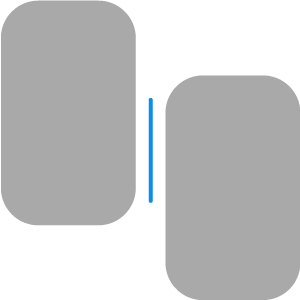
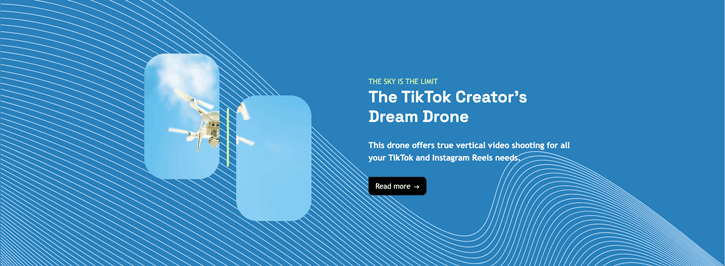
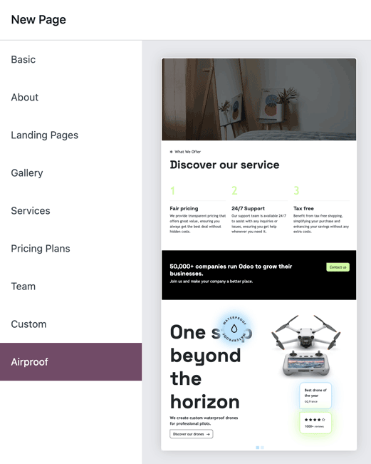

==================================
Chapter 4 - Customisation, Part II
==================================

.. _tutorials/website_theme/customisation_part2/background_shape:

Create a custom background shape
================================

Shapes are decorative elements that can be applied to backgrounds or images. They are SVG files
that can be animated and customized with different colors.

#. To better align with the website's desired atmosphere, create a custom background shape that the
   client can reuse on different blocks.

   Create your custom shape using the following setup:

   - Declare your shape. You can find the original `SVG shape here
     <{GITHUB_TUTO_PATH}/website_airproof/shape-waves.svg>`_.
   - Set the base color of the shape to the theme's green, and add it to the list of available
     shapes.

.. seealso::
   See reference documentation on how to add a :ref:`custom background shapes
   <website_themes/shapes/bg/custom>`.

.. image:: 04_customisation_part2/shape.png

.. tip::
   | **Be careful,** there is a trick!
   | In your shape SVG file, you have to use the colors from the default Odoo palette.
   | Here, I want it to match my primary color 1 (`#CEF8A1`). Therefore, in the SVG file, you must
     use color 1 from Odoo’s default palette (`#3AADAA`).

.. spoiler:: Solutions

   Find the solution in our Airproof example for:

   - the shape declaration on `shapes.xml <{GITHUB_TUTO_PATH}/website_airproof/data/shapes.xml>`_
     (once the SVG has been added to the right shapes folder).
   - the style of the shape via the `primary_variable.scss
     <{GITHUB_TUTO_PATH}/website_airproof/static/src/scss/primary_variables.scss>`_ file.
   - adding the shape to the list of shapes thanks to a new file `background_shapes_option_plugin.js
     <{GITHUB_TUTO_PATH}/website_airproof/static/src/website_builder/background_shapes_option_plugin.js>`_.
     Don't forget to declare it in the `__manifest__.py
     <{GITHUB_TUTO_PATH}/website_airproof/__manifest__.py>`_ in the `website.website_builder_assets`
     part.

2. Based on the Airproof design, apply the shape you just added to a `Text-Image` building block on
   the homepage:

   - Ensure the shape is in the right position.
   - Set its color to the theme's light blue.

.. seealso::
   See reference documentation on how to use :ref:`background shapes
   <website_themes/shapes/bg/custom/use>`.

.. tip::
   Unlike a shape applied via the Website Builder, we don't use the class `o_html_builder_xxx`. You
   have to replace `html_builder` with the name you have set for your shapes in your primary
   variables.

.. spoiler:: Solutions

   .. code-block:: xml
      :caption: ``/website_airproof/data/pages/home.xml``
      :emphasize-lines: 4-7

      <!-- Text-image block & Background shape -->
      <section class="s_text_image o_cc o_cc3 o_colored_level pt120 pb96"
      data-snippet="s_image_text" data-name="Image - Text" style="background-color: rgb(41, 128, 187);"
      data-oe-shape-data="{'shape': 'website_airproof/waves/01', 'colors': {'c1': '#BBE1FA'}, 'flip': ['x']}">
         

         [...]
      </section>

.. _tutorials/website_theme/customisation_part2/image_shape:

Create a custom image shape
===========================

In the same vein, create a custom shape for the images. A part of the work has been done for you by
already creating the `shape <{GITHUB_TUTO_PATH}/website_airproof/shape-duo.svg>`_ that you can reuse.

Now begin by integrating the shape into your theme. To do this, simply follow these few steps:

#. Create the preview for the Website Builder.
#. Apply the dark blue color from the theme to the vertical line.
#. To use it through the Website Builder, add the tag that links the image uploaded by the futur user
   to this shape.
#. Finally, add the shape to the list of shapes for the images available through the Website Builder.

.. seealso::
   See reference documentation on how to create a :ref:`custom image shape
   <website_themes/shapes/img/custom>`.

.. spoiler:: Solutions

   Find the solution in our Airproof example:

   - After adding the shape to the right folder, complete this file with the shape preview.

   .. code-block:: xml
      :caption: ``/website_airproof/static/image_shapes/duo/01.svg``

      <svg viewBox="0 0 1 1" id="preview" preserveAspectRatio="none">
         <use xlink:href="#filterPath" fill="darkgrey"/>
      </svg>

   - Adjust the color of the vertical line:

   .. code-block:: xml
      :caption: ``/website_airproof/static/image_shapes/duo/01.svg``
      :emphasize-lines: 3

      <svg viewBox="0 0 1 1" preserveAspectRatio="none">
        <rect class="background" x="0.494" y="0.325" width="0.0125" height="0.35" rx="0.00625" ry="0.00625"
        fill="#7C6576"/>
      </svg>

   - Add the image tag

   .. code-block:: xml
      :caption: ``/website_airproof/static/image_shapes/duo/01.svg``

      <image xlink:href="" clip-path="url(#clip-path)">
         <animateMotion dur="1ms" repeatCount="indefinite"/>
      </image>

   - Add it to the list of image shapes with this JS file `image_shapes_option_plugin.js
     <{GITHUB_TUTO_PATH}/website_airproof/static/src/website_builder/image_shapes_option_plugin.js>`_.

Once this is done, apply this shape on the image of the building block you created for the previous
exercise. And apply the green color to the vertical line of the shape.

.. seealso::
   See reference documentation on how to :ref:`use image shapes
   <website_themes/shapes/img/custom/use>`.

.. spoiler:: Solutions

   .. code-block:: xml
      :caption: ``/website_airproof/data/pages/home.xml``

      

.. _tutorials/website_theme/customisation_part2/custom_gradient:

Create a custom gradient
========================

Next, let's add gradients to backgrounds. To enhance the page's dynamism, apply a gradient from blue
`rgb(11, 142, 230)` to dark blue `rgb(41, 128, 187)` to your ”*Latest products*” block. But before
that, add the gradient to the website builder so that the client can easily reuse it.

.. seealso::
   See reference documentation on how to apply :doc:`gradients
   </developer/howtos/website_themes/gradients>` and how to create :ref:`custom gradients
   <website_themes/gradients/custom>`.

.. spoiler:: Solutions

   - Create a `color_picker_gradient_tab.js
     <{GITHUB_TUTO_PATH}/website_airproof/static/src/website_builder/color_picker_gradient_tab.js>`_
     file to create and add the custom gradient to the Website Builder options.
   - Declare your file in your :file:`manifest`.

     .. warning::
        Don't forget that the files related to the Website Builder options behaviours are declared in
        the bundle `website.website_builder_assets`.

   - Apply it to the ”*Latest products*” section background on the `homepage
     <{GITHUB_TUTO_PATH}/website_airproof/data/pages/home.xml>`_.

      .. code-block:: xml
         :caption: ``/website_airproof/data/pages/home.xml``
         :emphasize-lines: 14

         <!-- Latest products section -->
         <section data-snippet="s_dynamic_snippet_products"
            data-name="Products"
            class="..."
            data-custom-template-data="{}"
            data-number-of-records="16"
            data-product-category-id="all"
            data-split-variants="true"
            data-filter-id="3"
            data-template-key="website_airproof.dynamic_filter_template_product_product_airproof"
            data-carousel-interval="5000"
            data-number-of-elements="4"
            data-number-of-elements-small-devices="2"
            style="background-image: linear-gradient(0deg, rgb(41, 128, 187) 0%, rgb(11, 142, 230) 100%) !important;
            --o-wsale-products-grid-gap: 16px;">
            [...]
         </section>

.. _tutorials/website_theme/customisation_part2/animations:

Animations
==========

The client loves the overall design but finds the page a bit static. Enhance page interactivity with
animations such as `fade-in`, `rotate`, `bounce`, etc. These can be applied to columns, images,
texts, buttons…

Based on the airproof design, animate the following elements:

- the text of the first slide of the carousel.
- the sticker and the photo of the drone from the first slide.
- the 4 columns with icons.

Adjust animation delays for smoother transitions.

.. seealso::
   See reference documentation on how to apply :doc:`/developer/howtos/website_themes/animations`.

.. image:: 04_customisation_part2/animations.gif

.. spoiler:: Solutions

   Find the solution in our Airproof example on `home.xml
   <{GITHUB_TUTO_PATH}/website_airproof/data/pages/home.xml>`_.

   .. code-block:: xml
      :caption: Image animation

      

      

   .. code-block:: xml
      :caption: Text animation

      One
      step

   .. code-block:: xml
      :caption: Columns animation

      

      

.. _tutorials/website_theme/customisation_part2/forms:

Forms
=====

The forms in Odoo are very powerful. They can send emails directly to a personal inbox or integrate
directly with other Odoo applications. This is great, as one of your client's main priorities is
after-sales service. Therefore, the contact form must be properly configured.

Based on the airproof design, create a contact page. Remember to disable the default one and add the
new page link to the menu. The client has the following requests for their contact form:

- *Name* and *email address* field.
- *Company name* field.
- *Conditional VAT* field displayed only if *Company name* is filled in.
- All fields should be mandatory, except for *Company name*.
- Form submission must trigger an email.
- After form submission, the `thank-you message` should remain visible on the contact page.

.. seealso::
   See reference documentation on how to:

     - :ref:`deactivate default pages <website_themes/pages/default>`,
     - :ref:`create a new page <website_themes/pages/theme_pages>`,
     - :ref:`add a menu item <website_themes/navigation/menu>`,
     - :doc:`create a form </developer/howtos/website_themes/forms>`.

.. tip::
   To determine the correct code for your form:

   - | Create a test page via the Website Builder.
     | Drag & drop the building block that interests you and apply the right design.
     | Use the code generated through :guilabel:`Editor HTML/SCSS`.
   - You can also find the original building block code in Odoo:
     `odoo/addons/website/views/snippets/s_website_form.xml
     <{GITHUB_PATH}/addons/website/views/snippets/s_website_form.xml>`_.

.. spoiler:: Solutions

   Find the solution in our Airproof example on `contact.xml
   <{GITHUB_TUTO_PATH}/website_airproof/data/pages/contact.xml>`_.

.. _tutorials/website_theme/customisation_part2/page_template:

Create a page template
======================

You don't have the time to create all the service pages for the client. No worries! Create a
template page that the client can use to build their own service pages.

This page should be composed as follows:

- a :guilabel:`Parallax` building block,
- a :guilabel:`Key benefits` building block with the title replaced by "*Discover our service*",
- a :guilabel:`Call to action` building block,
- your custom carousel snippet.

.. seealso::
   See reference documentation on how to create :ref:`page templates
   <website_themes/pages/theme_pages/page_templates>`.

.. spoiler:: Solutions

   #. Create your :file:`new_page_template_templates.xml` file and discover its content in our
      `Airproof example <{GITHUB_TUTO_PATH}/website_airproof/views/new_page_template_templates.xml>`_.
   #. Don't forget to declare your file in the :file:`__manifest__.py` file and define what the
      template page contains.

      .. code-block:: python
         :caption: ``/website_airproof/__manifest__.py``

         'data': [
            # ...
            'views/new_page_template_templates.xml',
         ],
         'assets': {
            # ...
         },
         'new_page_templates': {
            'airproof': {
               'services': ['s_parallax', 's_airproof_key_benefits_h2', 's_call_to_action',
               's_airproof_carousel']
            }
         },
