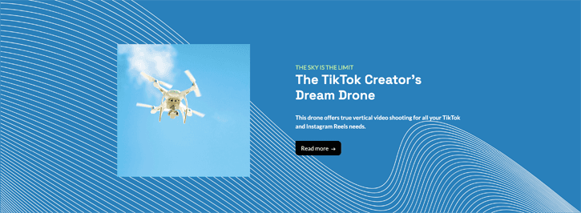

==================================
Chapter 4 - Customisation, Part II
==================================

.. _tutorials/website_theme/customisation_part2/background_shape:

Create a custom background shape
================================

Shapes are decorative elements that can be applied to backgrounds or images. They are SVG files
that can be animated and customized with different colors.

#. To better align with the website's desired atmosphere, create a custom background shape that the
   client can reuse on different blocks.

   Create your custom shape using the following setup:

   - Declare your shape. You can find the original `SVG shape here
     <{GITHUB_TUTO_PATH}/website_airproof/shape-waves.svg>`_.
   - Set the base color of the shape to the theme's green, and add it to the list of available
     shapes.

.. seealso::
   See reference documentation on how to add a :ref:`custom background shapes
   <website_themes/shapes/bg/custom>`.

.. image:: 04_customisation_part2/shape.png

.. tip::
   | **Be careful,** there is a trick!
   | In your shape SVG file, you have to use the colors from the default Odoo palette.
   | Here, I want it to match my primary color 1 (`#CEF8A1`). Therefore, in the SVG file, you must
     use color 3 from Odoo’s default palette (`#3AADAA`).

.. spoiler:: Solutions

   Find the solution in our Airproof example for:

   - the shape declaration on `shapes.xml <{GITHUB_TUTO_PATH}/website_airproof/data/shapes.xml>`_.
   - adding the shape to the list thanks to
     `primary_variable.scss
     <{GITHUB_TUTO_PATH}/website_airproof/static/src/scss/primary_variables.scss>`_ and `option.xml
     <{GITHUB_TUTO_PATH}/website_airproof/views/snippets/options.xml>`_.

2. Based on the Airproof design, apply the shape you just added to a `Text-Image` building block on
   the homepage:

   - Ensure the shape is in the right position.
   - Set its color to the theme's light blue.

.. seealso::
   See reference documentation on how to use :ref:`background shapes
   <website_themes/shapes/bg/custom/use>`.

.. tip::
   Unlike a standard Odoo shapes, when applying a custom shape to a section, replace `web_editor`
   with `illustration` in the shape class.

.. spoiler:: Solutions

   .. code-block:: xml
      :caption: ``/website_airproof/data/pages/home.xml``
      :emphasize-lines: 4-7

      <!-- Text-image block & Background shape -->
      <section class="s_text_image o_cc o_cc3 o_colored_level pt120 pb96"
      data-snippet="s_image_text" data-name="Image - Text" style="background-color: rgb(41, 128, 187);"
      data-oe-shape-data="{'shape': 'illustration/airproof/waves', 'colors': {'c1': '#BBE1FA'}, 'flip': ['x']}">
         

         [...]
      </section>

.. _tutorials/website_theme/customisation_part2/custom_gradient:

Create a custom gradient
========================

Next, let's add gradients to backgrounds. To enhance the page's dynamism, apply a gradient from blue
`rgb(11, 142, 230)` to dark blue `rgb(41, 128, 187)` to your ”*Latest products*” block. But before
that, add the gradient to the website builder so that the client can easily reuse it.

.. seealso::
   See reference documentation on how to apply :doc:`gradients
   </developer/howtos/website_themes/gradients>` and how to create :ref:`custom gradients
   <website_themes/gradients/custom>`.

.. spoiler:: Solutions

   #. Create and declare a :file:`gradients.xml` file and add the custom gradient.

      .. code-block:: python
         :caption: ``/website_airproof/__manifest__.py``

         'data': [
            # Gradients
           'data/gradients.xml',
         ]

      .. code-block:: xml
         :caption: ``/website_airproof/data/gradients.xml``

         <record id="colorpicker" model="ir.ui.view">
           <field name="key">website_airproof.colorpicker</field>
           <field name="name">Custom Gradients</field>
           <field name="type">qweb</field>
           <field name="inherit_id" ref="web_editor.colorpicker"/>
           <field name="arch" type="xml">
               <xpath expr="//div[@data-name='predefined_gradients']/t[@t-set='gradients']" position="after">
                   <t t-set="gradients" t-value="gradients + ['linear-gradient(0deg, rgb(41, 128, 187) 0%,
                   rgb(11, 142, 230) 100%)']"/>
               </xpath>
           </field>
         </record>

   #. Apply it to the ”*Latest products*” section.

      .. code-block:: xml
         :caption: ``/website_airproof/data/pages/home.xml``
         :emphasize-lines: 7

         <!-- Latest products section -->
         <section data-snippet="s_dynamic_snippet_products" class="s_dynamic_snippet_products s_dynamic
         s_dynamic_empty pt32 pb32 o_colored_level s_product_product_airproof o_dynamic_snippet_empty o_cc o_cc5"
         data-custom-template-data="{}" data-name="Produits" data-product-category-id="all"
         data-show-variants="" data-number-of-records="16" data-filter-id="3" data-carousel-interval="5000"
         data-template-key="website_airproof.dynamic_filter_template_product_product_airproof"
         style="background-image: linear-gradient(0deg, rgb(41, 128, 187) 0%, rgb(11, 142, 230) 100%) !important;">
            [...]
         </section>

.. _tutorials/website_theme/customisation_part2/animations:

Animations
==========

The client loves the overall design but finds the page a bit static. Enhance page interactivity with
animations such as `fade-in`, `rotate`, `bounce`, etc. These can be applied to columns, images,
texts, buttons…

Based on the airproof design, animate the following elements:

- the text of the first slide of the carousel.
- the sticker and the photo of the drone from the first slide.
- the 4 columns with icons.

Adjust animation delays for smoother transitions.

.. seealso::
   See reference documentation on how to apply :doc:`/developer/howtos/website_themes/animations`.

.. image:: 04_customisation_part2/animations.gif

.. spoiler:: Solutions

   Find the solution in our Airproof example on `home.xml
   <{GITHUB_TUTO_PATH}/website_airproof/data/pages/home.xml>`_.

   .. code-block:: xml
      :caption: Image animation

      

      

   .. code-block:: xml
      :caption: Text animation

      One
      step

   .. code-block:: xml
      :caption: Columns animation

      

      

.. _tutorials/website_theme/customisation_part2/forms:

Forms
=====

The forms in Odoo are very powerful. They can send emails directly to a personal inbox or integrate
directly with other Odoo applications. This is great, as one of your client's main priorities is
after-sales service. Therefore, the contact form must be properly configured.

Based on the airproof design, create a contact page. Remember to disable the default one and add the
new page link to the menu. The client has the following requests for their contact form:

- *Name* and *email address* field.
- *Company name* field.
- *Conditional VAT* field displayed only if *Company name* is filled in.
- All fields should be mandatory, except for *Company name*.
- Form submission must trigger an email.
- After form submission, the `thank-you message` should remain visible on the contact page.

.. seealso::
   See reference documentation on how to:

     - :ref:`deactivate default pages <website_themes/pages/default>`,
     - :ref:`create a new page <website_themes/pages/theme_pages>`,
     - :ref:`add a menu item <website_themes/navigation/menu>`,
     - :doc:`create a form </developer/howtos/website_themes/forms>`.

.. tip::
   To determine the correct code for your form:

   - | Create a test page via the Website Builder.
     | Drag & drop the building block that interests you and apply the right design.
     | Use the code generated through :guilabel:`Editor HTML/SCSS`.
   - You can also find the original building block code in Odoo:
     `odoo/addons/website/views/snippets/s_website_form.xml
     <{GITHUB_PATH}/addons/website/views/snippets/s_website_form.xml>`_.

.. spoiler:: Solutions

   Find the solution in our Airproof example on `contact.xml
   <{GITHUB_TUTO_PATH}/website_airproof/data/pages/contact.xml>`_.

.. _tutorials/website_theme/customisation_part2/page_template:

Create a page template
======================

You don't have the time to create all the service pages for the client. No worries! Create a
template page that the client can use to build their own service pages.

This page should be composed as follows:

- a :guilabel:`Parallax` building block,
- a :guilabel:`Key benefits` building block with the title replaced by "*Discover our service*",
- a :guilabel:`Call to action` building block,
- your custom carousel snippet.

.. seealso::
   See reference documentation on how to create :ref:`page templates
   <website_themes/pages/theme_pages/page_templates>`.

.. spoiler:: Solutions

   #. Create your :file:`new_page_template_templates.xml` file and discover its content in our
      `Airproof example <{GITHUB_TUTO_PATH}/website_airproof/views/new_page_template_templates.xml>`_.
   #. Don't forget to declare your file in the :file:`__manifest__.py` file and define what the
      template page contains.

      .. code-block:: python
         :caption: ``/website_airproof/__manifest__.py``

         'data': [
            # ...
            'views/new_page_template_templates.xml',
         ],
         'assets': {
            # ...
         },
         'new_page_templates': {
            'airproof': {
               'services': ['s_parallax', 's_airproof_key_benefits_h2', 's_call_to_action',
               's_airproof_carousel']
            }
         },
