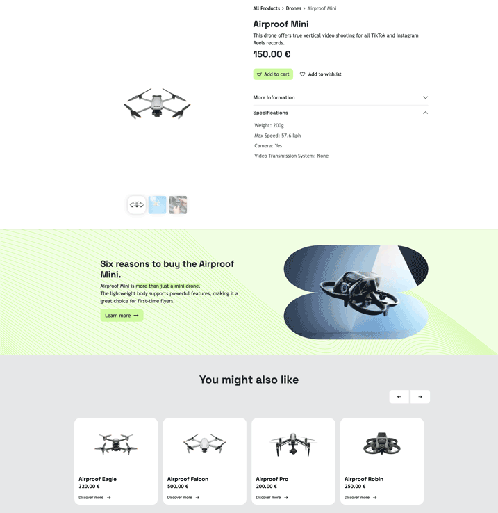

=============================
Chapter 5 - Dynamic templates
=============================

.. _tutorials/website_theme/dynamic_templates/shop:

Adapt the shop template
=======================

Now, let's adapt the dynamic sections of the website. As you may know, some pages such as those for
eCommerce are automatically generated. Pages like the shop, product, and checkout are automatically
generated when the `website_sale` application is installed. These template pages pull their
displayed information from the backend.

To modify these pages, we need to edit the standard Odoo template. This can be done using SCSS,
presets, and especially XPath. Locate the standard Odoo template you want to modify and extend it
using `XPath`. Following the Airproof design, let's begin by modifying the shop view.

#. First, locate the standard template in Odoo : :menuselection:`website_sale --> templates.xml -->
   id="products"`.
#. Apply all changes in your :file:`website_sale_templates.xml` file. Start by:

   - Add a banner.
   - Adapt the layout of the e-commerce category filtering on the left.
   - Remove the search bar (you can remove it from both the shop and the product pages at the same
     time).
   - Move the breadcrumb.
   - Hide the list or grid view option.
   - Create the appropriate design and information for the product cards.

.. tip::
   - Apply your modifications using presets, XPath and SCSS.
   - To enable attribute/variant filtering, activate the
     :doc:`/applications/sales/sales/products_prices/products/variants` option in the
     website backend settings and :doc:`configure attributes and variants
     </applications/websites/ecommerce/managing_products/variants>` for the products.

.. spoiler:: Solutions

   Find the solution in our Airproof example on `presets.xml
   <{GITHUB_TUTO_PATH}/website_airproof/data/presets.xml>`_, `website_sale_templates.xml
   <{GITHUB_TUTO_PATH}/website_airproof/views/website_sale_templates.xml>`_ part *shop page*, and
   `shop.scss <{GITHUB_TUTO_PATH}/website_airproof/static/src/scss/pages/shop.scss>`_.

.. _tutorials/website_theme/dynamic_templates/product:

Adapt the product page template
===============================

The client is thrilled with the shop modifications. Next, let's apply our design to the product
pages. Based on the Airproof design below, adapt a few elements including:

- Remove the search bar (if not done with the previous exercise).
- Remove the quantity selector, Terms and Conditions, and share icons.
- Update the :guilabel:`Add to cart` button icon.
- Insert a title above the product specifications (this section appears only when the product
  has one variant per attribute).
- Design the appropriate layout for the carousel.
- Add a title and apply the previously created product template to the `Alternative products`
  section (ensure alternative products are assigned on the product in the backend for this section
  to appear).
- Implement a new drop zone below product details, visible on all products. As a use case, add an
  `Text-Image` building block using the Website Builder (e.g.: See Airproof product page screenshot
  with “*Six reasons to buy…*”).

.. seealso::
   See reference documentation on how to create a :ref:`website_themes/layout/dropzone`.

.. tip::
   - Make your modifications using presets, XPath, and SCSS. Be sure to comment your code properly
     so you can find your way around.
   - The drop zone will be visible on all products. To create a specific dropzone per product, you
     need to add a new field to the product model.

.. spoiler:: Solutions

   Find the solution in our Airproof example on `presets.xml
   <{GITHUB_TUTO_PATH}/website_airproof/data/presets.xml>`_, `website_sale_templates.xml
   <{GITHUB_TUTO_PATH}/website_airproof/views/website_sale_templates.xml>`_ part *product page*, and
   `product_page.scss <{GITHUB_TUTO_PATH}/website_airproof/static/src/scss/pages/product_page.scss>`_.
