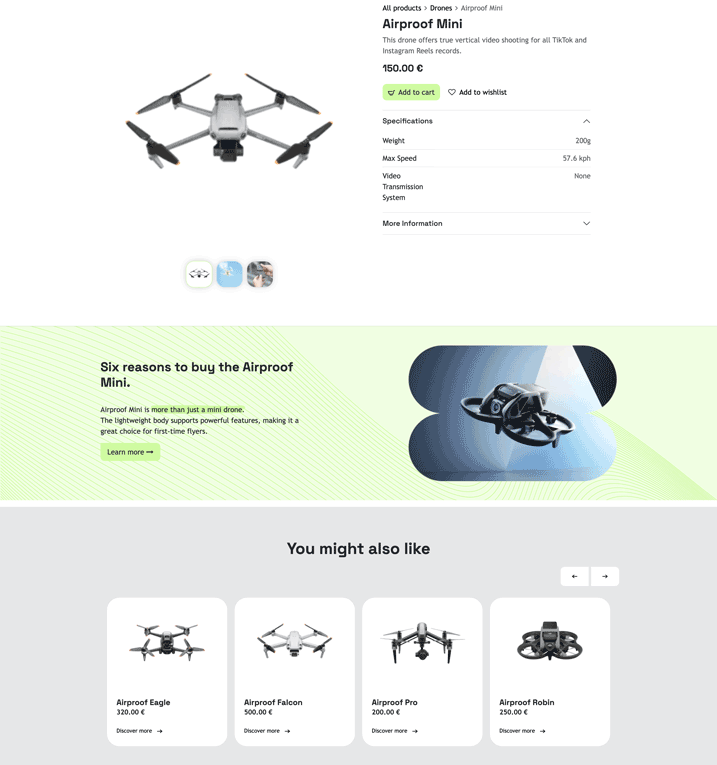

=============================
Chapter 5 - Dynamic templates
=============================

.. _tutorials/website_theme/dynamic_templates/shop:

Adapt the shop template
=======================

Now, let's adapt the dynamic sections of the website. As you may know, some pages such as those for
eCommerce are automatically generated. Pages like the shop, product, and checkout are automatically
generated when the `website_sale` application is installed. These template pages pull their
displayed information from the backend.

To modify these pages, we need to edit the standard Odoo template. This can be done using SCSS,
presets, settings, and especially XPath. Locate the standard Odoo template you want to modify and
extend it using XPath. Following the Airproof design, let's begin by modifying the shop view.

   - Add a banner.
   - Display the category title.
   - Adapt the filtering on the left.
   - Remove the search bar.
   - Adapt and move the breadcrumb.
   - Display only 3 products per row.
   - Create the appropriate design and information for the product cards.

.. tip::
   To enable attribute/variant filtering, activate the
   :doc:`/applications/sales/sales/products_prices/products/variants` option in the
   website backend settings and :ref:`configure attributes and variants
   <ecommerce/categories_variants/product-variants>` for the products.

   To adapt the entire shop page, proceed step by step:

   #. Use the **presets** to set the shop options.
   #. Use the **settings**, in :file:`website.xml`, to customise the layout of the product cards.
      You can find an overview of all the classes that can be used in `products_design_panel.xml
      <{GITHUB_PATH}/addons/website_sale/static/src/website_builder/products_design_panel.xml>`_
   #. Locate the standard shop template in Odoo : :menuselection:`website_sale --> templates.xml -->
      id="products"`. Use this as a base to make the significant changes you haven't been able to do
      yet with the previous 2 steps. Make these changes via **XPaths** that you place in a
      :file:`website_sale_templates.xml` file.
   #. Refine your design with some **SCSS**.

.. spoiler:: Solutions

   As mentioned earlier, the modifications have been made through different methods:

   - Thanks to the Bootstrap variables in `bootstrap_overridden.xml
     <{GITHUB_TUTO_PATH}/website_airproof/static/src/scss/bootstrap_overridden.scss>`_ to adapt the
     appearance of the filtering checkboxes.
   - Thanks to the presets in `presets.xml <{GITHUB_TUTO_PATH}/website_airproof/data/presets.xml>`_
     for the filtering options and the search bar.
   - Thanks to the settings in `website.xml <{GITHUB_TUTO_PATH}/website_airproof/data/website.xml>`_
     for a large part of the product card layout.
   - Thanks to the adaptation of the standard shop template in `website_sale_templates.xml
     <{GITHUB_TUTO_PATH}/website_airproof/views/website_sale_templates.xml>`_. You can find there
     the banner added, the display of the category title, the relocation of the breadcrumb, and the
     appearance of the :guilabel:`Sort by` button.
   - For better structure, we created a separate file `product_tile_templates.xml
     <{GITHUB_TUTO_PATH}/website_airproof/views/product_tile_templates.xml>`_ to add the
     :guilabel:`Discover more` link on the product card.
   - Finally, thanks to the SCSS

     - We refine the hover effect on the product cards in `product_card.scss
       <{GITHUB_TUTO_PATH}/website_airproof/static/src/scss/components/product_card.scss>`_.
     - In `shop.scss <{GITHUB_TUTO_PATH}/website_airproof/static/src/scss/pages/shop.scss>`_ you
       will find the modification of the breadcrumb's appearance combined with the modification of a
       Bootstrap variable ($breadcrumb-divider). As well as the continuation of the adaptation of
       the :guilabel:`Sort by` button.

.. _tutorials/website_theme/dynamic_templates/product:

Adapt the product page template
===============================

The client is thrilled with the shop modifications. Next, let's apply our design to the product
pages. Based on the Airproof design below, adapt a few elements including:

- Move the breadcrumb.
- Design the appropriate layout for the product images carousel.
- Remove the :guilabel:`Quantity` and :guilabel:`Compare` selector and the `Terms and Conditions`
  section.
- Update the :guilabel:`Add to cart` button icon.
- Adapt the :guilabel:`Add to whishlist` button.
- Put the product specifications into an accordion. And add the "*More information*" item in this
  accordion.
- Implement a new drop zone just below product details, visible on all products. As a use case, add
  an `Text-Image` building block using the Website Builder (e.g.: See `Airproof product page
  <{GITHUB_TUTO_PATH}/website_airproof/airproof-product-page.jpg>`_ screenshot with “*Six reasons to
  buy…*”).
- Adapt the title, remove de text and apply the previously created product template to the
  `Alternative products` section (ensure alternative products are assigned on the product in the
  backend for this section to appear).

.. seealso::
   See reference documentation on how to create a :ref:`website_themes/layout/dropzone`.

.. tip::
   - Make your modifications using presets, XPath, and SCSS. Be sure to comment your code properly
     so you can find your way around.
   - Little tip for the "More information" item of the accordion, it's actually a hidden template
     that exists in the Odoo code, which you can find under the ID `accordion_more_information`.
   - In this case, the drop zone will be visible on all products. To create a specific drop zone per
     product, you need to add a new field to the product model.

.. spoiler:: Solutions

   Find the solution in our Airproof example on `presets.xml
   <{GITHUB_TUTO_PATH}/website_airproof/data/presets.xml>`_, `website_sale_templates.xml
   <{GITHUB_TUTO_PATH}/website_airproof/views/website_sale_templates.xml>`_ part *Product page*, `website_sale_wishlist_templates.xml
   <{GITHUB_TUTO_PATH}/website_airproof/views/website_sale_wishlist_templates.xml>`_, and
   `product_page.scss <{GITHUB_TUTO_PATH}/website_airproof/static/src/scss/pages/product_page.scss>`_.
