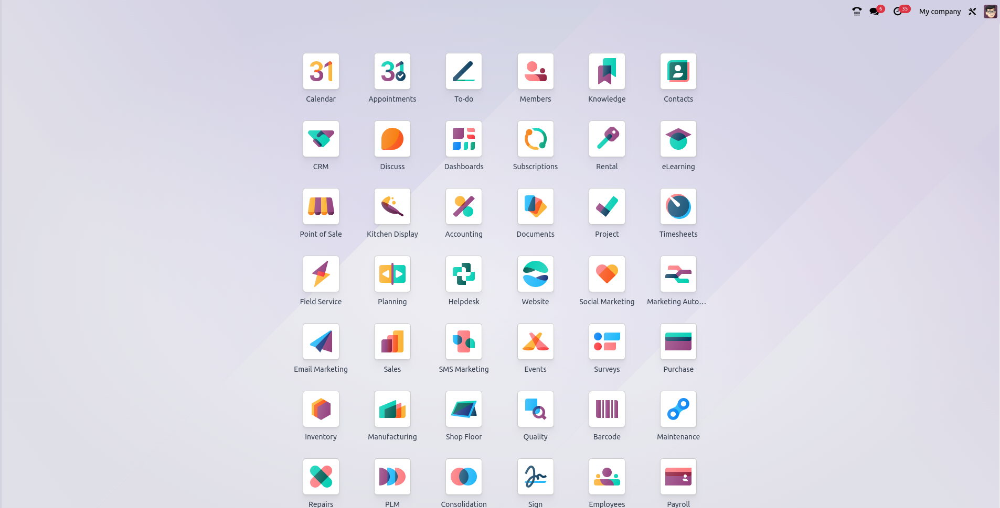
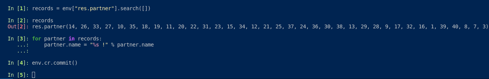

==========
Odoo Shell
==========

If you're familiar with Odoo, you probably know the user-friendly Graphical User Interface (GUI), which is the web page where you carry out your operations in Odoo, commonly referred to as the web client or front-end.

The front-end simplifies complex operations like invoice validation, product transfers, and more, often triggered by a single button click. However, beneath this simplicity lies a significant amount of code execution, sometimes involving hundreds of lines!

Occasionally, you might face situations where you need to perform a straightforward operation on numerous records, such as checking a checkbox for each project in the Project App. Manually navigating menus for such tasks can be time-consuming and tedious 🥱

At Odoo, we value efficiency, and this is where the "Odoo Shell" comes into play. For seasoned Odoo users, it's a handy trick. The Odoo Shell allows direct interaction with the Object-Relational-Mapping (ORM), enabling you to manipulate data almost as if you were working directly within Odoo's source code. With just a few lines of code, you can, for instance, update all contact names in your database by adding an exclamation mark to each. This operation would take seconds in the Odoo Shell but potentially hours in the front-end. The Odoo Shell is a true blessing ! 🙏

The Odoo Shell is essentially an extension of the `IPython shell <https://ipython.readthedocs.io/en/stable/>`_, directly connected to the Odoo database. While it's somewhat similar to creating a server or automated action and executing it, the Odoo Shell offers the flexibility to write code incrementally, exploring Odoo's inner workings. It's a valuable tool for developing migration scripts, allowing you to test the code you wrote before starting the whole upgrade process instead of risking a full database upgrade only to discover a minor coding error.

Accessing the Odoo Shell depends on your hosting type. For On-Premise databases, you can add the "shell" keyword as the first parameter when executing your instance. For instance, if you use `./odoo-bin -d my_database`, you can simply use `./odoo-bin shell -d my_database`. On Odoo SH, it's even simpler, as you have direct access to a bash terminal via the "Shell" tab. Once in the terminal, you can run the command `odoo-bin shell` to gain immediate access to your database's Odoo Shell. Convenient, isn't it?

The Odoo shell is not applicable to Odoo Online since users only have access to the web client, and not the server running their Odoo database.
