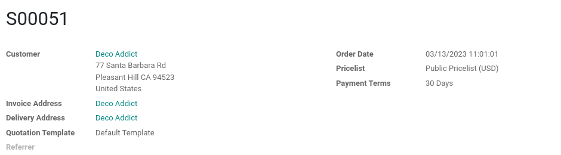

:nosearch:
:show-toc:

.. |assistance-contact| replace::
   If you need Odoo assistance on this matter, please get in touch with your Odoo Account Manager or
   our `Sales department`_.
.. _Sales department: mailto:sales@odoo.com

===============
Getting started
===============

Introduction to upgrades
------------------------

In Odoo, an upgrade is the process of moving your database from an older version of Odoo to a newer, supported version. Each new version of Odoo comes with new features, bug fixes, security patches, and improvements. Depending on your hosting type and the size of the database, the upgrade process can be very straightforward and be done automatically, or require some assistance from our Upgrade department.

Here are a few examples of supported upgrades:

* Odoo 11 to Odoo 15
* Odoo 14 to Odoo 16
* Odoo 13 to Odoo 15

.. important::
   An upgrade does not cover

   * Downgrading to a previous version of Odoo (i.e., Odoo 15 to Odoo 12)
   * Changing :ref:`editions <upgrade-faq/editions-change>` (i.e., Community to Enterprise edition)
   * Switching :ref:`hosting type <upgrade-faq/hosting-types-switch>` (i.e., On-Premise to Odoo Online or Odoo.sh)
   * Migration from another ERP to Odoo

.. note:: |assistance-contact|

Importance of regular upgrades
------------------------------

It is important to keep your database up-to-date for several reasons:

* Benefiting from the latest features of the :ref:`new major version <upgrade-faq/release-notes>` released by Odoo.
* Only :doc:`supported versions </administration/maintain/supported_versions>` of Odoo receive security patches and bug fixes.
* Benefiting from the latest performance improvements.

Please note that Odoo provides support and bug fixing only for the three last major versions of Odoo.

This is a factor to take into consideration before upgrading. If you are on an older version, we suggest you to prefer the most recent version to benefit from longer support (before having to upgrade again).

.. _upgrade/process-workflow:

Overview of the upgrade project
---------------------------------------------

An upgrade project represents the whole procedure of upgrading an Odoo database,
from the decision of the upgrade, all the way to having the database running the upgraded version.

Planning the upgrade
====================

The first step of this journey is obviously the planning. You will have to allocate some time and resources for building the planning of your upgrade, whether you are doing it by yourself or with the help of a business analyst or an upgrade support analyst here at Odoo.

Depending on the size of your database, the amount of apps installed, the amount of customization, and the availability of the Upgrade team, the time span of the upgrade can vary a lot but we usually consider between 1 and 3 month for the average database. However, please note that this estimate can very a lot based on those factors. Some very specific upgrades can take up to 6 months to be completed but that is very rare.

.. important::
   Since upgrading can bring a lot of changes to the business flow, you should also plan for a significant amount of time in testing before the upgrade of your production database. This will allow you to catch all of the possible bugs and issues that could have appeared during the upgrade, as well as to get familiar with latest changes that the new version brings. It is more convenient to discover problems during the testing phase than to have to deal with an issue when operating your database in the middle of a busy day.

Submitting your first request
=============================

Once you finished planning the upgrade, the next step is to request your first upgraded test database by following the instructions in the corresponding section of this documentation:

   - :doc:`Upgrade request for Odoo Online <../upgrade/request/odoo_online>`
   - :doc:`Upgrade request for Odoo.sh <../upgrade/request/odoo_sh>`
   - :doc:`Upgrade request for On-Premise <../upgrade/request/on_premise>`

You will then be notified of the status of your request. Once your request has been successfully process, you will be given instructions on how to access your test database. Otherwise, you might have to fix a few things in your database or contact the upgrade support of Odoo for help you with your blocked upgrade request. You can find more information in regards to the assistance Odoo provides in :ref:`upgrade/test-assistance`.

In any case, you can always request another upgraded test database at any time. It can be useful in case you significantly changed your test database or if a fix was applied to the upgrade process and you need to confirm that it is working as expected.

.. _upgrade/testing-phase:

Assessing your upgraded database and requesting help
====================================================

Once you receive your test database, it is very important to spend a significant amount of time assessing it to ensure that, once the upgrade goes live, you are not stuck in your day-to-day activities by a change in views, behavior, or an error message. 

.. admonition:: A few things you should check

   - Are there views that are deactivated in your test database but active in your production database ?
   - Are your usual views still displayed correctly ?
   - Are your reports (Invoice, Sales Order, etc.) correctly generated ?
   - Are your website pages working correctly ?
   - Are you able to create and modify records ? (Sales order, invoices, purchases, users, contacts, companies, etc ... ) 

Also, we strongly recommend to test your business flow end-to-end. This means that you should test the whole process of your business, from the creation of a sales order to the payment of the invoice for example. This will allow you to catch any issue that could have appeared during the upgrade and as an added bonus, you will get familiar with the new version of Odoo.

Examples of end-to-end testing :
   - Check a random product in your product catalog and compare its test and production data (product category, selling price, cost price, is the vendor set? Are the same accounts set ? Are the same Routes set?);
   - Buy this product (only available with Purchase App);
   - Confirm the reception of this product (only available with Inventory App);
   - Check if the route to receipt this product applies the same set in your production database (only available with Inventory App);
   - Sell this product (only available with Sales App) to a random customer;
   - Open your customer database (Contact App), select a random customer (or company) and double-check its data;
   - Ship this product (only available with Inventory App);
   - Check if the route to ship this product applies the same set in your production database (only available with Inventory App);
   - Validate a customer invoice (only available with Invoicing and/or Accounting Apps);
   - Credit the invoice (issue a credit note) and check if its behaves as your production database;
   - Check your Reports results (only available with Accounting Apps);
   - Randomly check your taxes, currencies, Bank Account. Is your fiscal year set in production database the same? (only available with Accounting Apps);
   - Proceed to an online order (only available with Website Apps) from the product selection in your shop until the checkout process and check if its behaves as your production database.

Depending on the complexity of your database, you also shouldn't forget to test : 
   - Integrations with external softwares (EDI, APIs, ...)
   - Workflows between different Apps (online sales with eCommerce, converting a lead all the way to a sales order, delivery of products, etc ... )
   - Exporting data
   - Your automated actions to make sure they work
   - Your server actions in the Action menu on form views as well as by selecting multiple records on list views

Those are non-exhaustive lists that you can extend to your other Apps based on your use of Odoo.

You should :ref:`report any issue <upgrade/test-assistance>` you encounter during your testing phase to the Odoo Upgrade Support.

.. important::
   A test database is only intended for testing and remains completely unrelated to your present or future production database. Any data you add, or changes you make, will not be reflected in your upgraded production database.

.. note::
   Test databases are neutered and features are disabled to prevent them from having an impact on the production database:

   #. Scheduled actions are disabled.
   #. Outgoing mail servers are disabled by archiving the existing ones and adding a fake/non-working one.
   #. Payment providers and delivery carriers are reset to test environment.

Upgrading your customizations
==============================

In the case that your database is running a modified version of Odoo, that is a version with custom modules or custom code, you will still have a little bit work more to do !

Since the various models and fields of Odoo might have changed during the upgrade of the database, you might have to adapt your customization to be compatible with it. Furthermore, if you do some changes to the structure of your custom code, you must not forget to migrate the data. For example if you rename a field in the code, you must also ensure that the corresponding PSQL data is renamed as well. This is usually done in migration scripts, TODO we will explain in later section

.. _upgrade/steps-production:

Upgrading your production database
==================================

Once you completed your :ref:`tests <upgrade/testing-phase>` and are confident that you can use your upgraded database as your main database without any issue, it is time to plan the Go-live day. During the upgrade of your production database, any modification done on it will not be saved. This is why we recommend not using your database during that time.

.. important::
   Going into production without first testing may lead to:

   - business interruptions (e.g., no longer having the possibility to validate an action)
   - poor customer experiences (e.g., an eCommerce website that does not work correctly)

After the upgrade
=================

Once your production database is running the upgraded version, you can continue using it as your main Odoo database as usual. If you encounter any new issue, you can still request :ref:`upgrade/production-assistance`

Factors influencing the complexity of the upgrade
-------------------------------------------------

For most databases, the upgrade process is actually very straightforward and can be done by the database administrator at any time (see :doc:`/upgrade/request`). However, for more complex databases such as those with a lot of custom modules or a lot of data, the upgrade should be executed in collaboration with a developer. This is because with each changes in the standard of Odoo, any customization (Modified reports, web pages, custom views, custom code, ... ) might be impacted by the upgrade and could potentially not work anymore.

Let's view an example by comparing screenshots from different two different versions of Odoo : Odoo 14 and Odoo 16.

.. image:: introduction/so_odoo_14.png
   :width: 49%
   :alt: Odoo 14

Apart from the fonts used and the spacing between fields, we notice a few things :

- Field 'Referrer' moved from below 'Quotation template' to below 'Customer'
- A new field named 'Recurrence' appears on the right, below 'Order Date'

Those changes might not be important to end user but for programmers developing a module, the code written is often based on the current layout of the pages, and on the current fields present. Therefore if a new field was created and placed under the field 'Referrer', since 'Referrer' changed position, our new field would followed it.

.. important::
   Changes between versions of the standard code of Odoo could impact the dependencies of your custom modules and therefore require some changes to your code.

Now, this example highlight a very minor change, as nothing is deleted, but this is not always the case between 2 versions. Sometimes, fields are renamed or removed entirely from the database, whole modules are changed, models are renamed, etc ...  Thankfully the standard code of Odoo is written in a way that it will automatically move the standard data from the old field to the new one, but this is not the case for customized fields.

In those situations, running the newest version of Odoo on an older database will probably result in issues when navigating your database, such as error messages, data loss, data showing incorrectly, values wrongly computed, and many more. Therefore, the intervention of a developer will be required for your upgrade to be successful.

