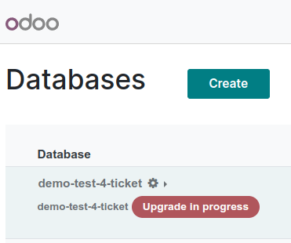

===========
Odoo Online
===========

moved

Test database
=============

moved

Once the upgrade is complete, a new test database appears on the `database manager
<https://www.odoo.com/my/databases>`_ page. To access the test database, click the drop-down arrow
(:guilabel:`⯆`) to the left of the main database's name. Doing so makes the test version appear
below it. Finally, click the green :guilabel:`Connect` button on the right side of the test
version's row to go to the database.

.. image:: odoo_online/test-database.png
   :align: center
   :alt: A test database on the database manager page.

Except for being on the newer version of Odoo, the test database is an exact copy of the one being
upgraded. It is important to do extensive testing in this database to ensure that the upgrade has
not altered or corrupted any data, and that all workflows still proceed as expected.

Production database
===================

moved
