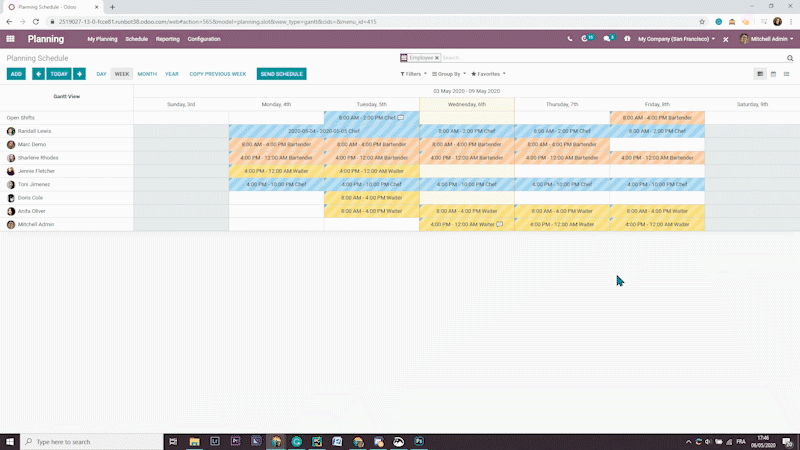

:banner: banners/contributing.png

==================
Content guidelines
==================

To give the community the best documentation possible, we listed here a few guidelines, tips and
tricks that will make your content shine at its brightest! While we encourage you to adopt your own
writing style, some rules still apply to give the reader more clarity and comprehension.

.. note::
   We strongly recommend contributors to carefully read the other documents in this *Contribution*
   section of the documentation. Good knowledge of the ins and outs of **RST writing** is required
   to write and submit your contribution. Note that it also affects your writing style itself.

   - :doc:`introduction_guide`
   - :doc:`rst_cheat_sheet`
   - :doc:`rst_guidelines`

.. _contributing/writing-style:

Writing style
=============

**Writing for documentation** isn't the same as writing for a blog or another medium. Readers are
more likely to skim read until they've found the information they are looking for. Keep in mind that
the user documentation is a place to inform and describe, not to convince and promote.

.. _contributing/consistency:

Consistency
-----------

*Consistency is key to everything.*

Make sure that your writing style remains **consistent**. If you modify an existing text, try to
match the existing tone and presentation, or rewrite it to match your own style.

.. _contributing/grammatical-tenses:

Grammatical tenses
------------------

In English, descriptions and instructions require the use of a **Present Tense**, while a *future
tense* is appropriate only when a specific event is to happen ulteriorly. This logic might be
different in other languages.

- | Good example (present):
  | *Screenshots are automatically resized to fit the content block's width.*
- | Bad example (future):
  | *When you take a screenshot, remember that it will be automatically resized to fit the content
     block's width.*

.. _contributing/paragraphing:

Paragraphing
------------

A paragraph comprises several sentences that are linked by a shared idea. They usually are two to
six lines long.

In English, a new idea implies a new paragraph, rather than having a *line break* as it is common to
do in some other languages. *Line breaks* are useful for layout purposes but shouldn't be used as a
grammatical way of separating ideas.

.. seealso::
   - :ref:`RST cheat sheet: Break the line but not the paragraph <contributing/line-break>`

.. _contributing/titles:

Titles
------

To write a good title :

- **Be concise.**
- **Avoid sentences**, questions, and titles starting with "how to."
- **Don't use pronouns** in your titles, especially 2nd person (*your*)

.. _contributing/document-structure:

Document's structure
====================

Use different **headings levels** to organize your text by sections and sub-sections. Your headings
are also displayed in a dynamic *navigation bar* on the side.

+---------------------------------------------------------------------------------------+
| | **H1: Page Title**                                                                  |
| | Your *page title* gives your reader a quick and clear understanding of what your    |
|   content is about. It is also referenced in the section's *table of contents*.       |
|                                                                                       |
| The *content* in this section describes the upcoming content from a **business point  |
| of view**, and shouldn't put the emphasis on Odoo, as this is documentation and not   |
| marketing.                                                                            |
|                                                                                       |
| Start first with a **Lead Paragraph**, which helps the reader make sure that they've  |
| found the right page, then explain the **business aspects of this topic** in the      |
| following paragraphs.                                                                 |
+-----+---------------------------------------------------------------------------------+
|     | | **H2: Section Title (configuration)**                                         |
|     | | This first H2 section is about the configuration of the feature, or the       |
|     |   prerequisites to achieve a specific goal. To add a path, make sure you        |
|     |   use the ``:menuselection:`` specialized directive (see link below).           |
|     |                                                                                 |
|     | | Example:                                                                      |
|     | | To do so, go to ``:menuselection:`App name --> Menu --> Sub-menu```, and      |
|     |   enable the XYZ feature.                                                       |
+-----+---------------------------------------------------------------------------------+
|     | | **H2: Section Title (main sections)**                                         |
|     | | Create as many main sections as you have actions or features to distinguish.  |
|     |   The title can start with a verb, but try to avoid using "Create ...".         |
+-----+-----+---------------------------------------------------------------------------+
|     |     | | **H3: Subsection**                                                      |
|     |     | | Subsections are perfect for assessing very specific points. The title   |
|     |     |   can be in the form of a question, if appropriate.                       |
+-----+-----+---------------------------------------------------------------------------+
|     | **H2: Next Section**                                                            |
+-----+---------------------------------------------------------------------------------+

.. seealso::
   - :ref:`RST cheat sheet: headings <contributing/headings>`
   - :ref:`RST cheat sheet: specialized directives <contributing/specialized-directives>`

.. _contributing/content-images:

Images
======

Adding a few images to illustrate your text helps the readers to understand and memorize your
content. However, avoid adding too many images: it isn't necessary to illustrate all steps and
features, and it may overload your page.

.. important::
   Don't forget to :ref:`compress your PNG files with pngquant <contributing/pngquant>`.

.. _contributing/screenshots:

Screenshots
-----------

Screenshots are automatically resized to fit the content block's width. This implies that
screenshots can't be too wide, else they would appear very small on-screen. Therefore, we recommend
to avoid to take screenshots of a full screen display of the app, unless it is relevant to do so.

A few tips to improve your screenshots:

#. **Zoom** in your browser. We recommend a 110% zoom for better results.
#. **Resize** your browser's width, either by *resizing the window* itself or by opening the
   *browser's developer tools* (press the ``F12`` key) and resizing the width.
#. **Select** the relevant area, rather than keeping the full window.
#. If necessary, you can **edit** the screenshot to remove unnecessary fields and to narrow even
   more Odoo's display.



.. note::
   Resizing the window's width is the most important step to do as Odoo's responsive design
   automatically resizes all fields to match the window's width.

.. _contributing/alt-tags:

ALT tags
--------

An **ALT tag** is a *text alternative* to an image. This text is displayed if the browser fails to
render the image. It is also helpful for users who are visually impaired. Finally, it helps
search engines, such as Google, to understand what the image is about and index it correctly, which
improves the :abbr:`SEO (Search Engine Optimization)` significantly.

Good ALT tags are:

- **Short** (one line maximum)
- **Not a repetition** of a previous sentence or title
- A **good description** of the action happening on the image
- Easily **understandable** if read aloud

.. seealso::
   - :ref:`RST cheat sheet: image directive <contributing/image>`