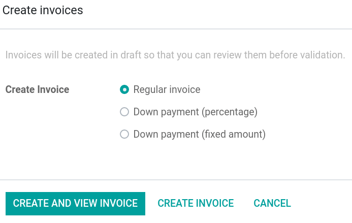

:banner: banners/contributing.png

===============
RST cheat sheet
===============

.. _contributing/headings:

Headings
========

| For each formatting line (e.g., ``===``), write as many symbols (``=``) as there are characters in
  the header.
| The symbols used for the formatting are, in fact, not important. Only the order in which they are
  written matters, as it determines the size of the decorated heading. This means that you may
  encounter different heading formatting and in a different order, in which case you should follow
  the formatting in place in the document. In any other case, use the formatting shown below.

+--------------+---------------+-------------------------------+
| Heading size | Formatting    | Min/Max number of occurrences |
+==============+===============+===============================+
| H1           | | ``=======`` | 1/1                           |
|              | | ``Heading`` |                               |
|              | | ``=======`` |                               |
+--------------+---------------+-------------------------------+
| H2           | | ``Heading`` | 0/∞                           |
|              | | ``=======`` |                               |
+--------------+---------------+-------------------------------+
| H3           | | ``Heading`` | 0/∞                           |
|              | | ``-------`` |                               |
+--------------+---------------+-------------------------------+
| H4           | | ``Heading`` | 0/∞                           |
|              | | ``~~~~~~~`` |                               |
+--------------+---------------+-------------------------------+
| H5           | | ``Heading`` | 0/∞                           |
|              | | ``*******`` |                               |
+--------------+---------------+-------------------------------+
| H6           | | ``Heading`` | 0/∞                           |
|              | | ``^^^^^^^`` |                               |
+--------------+---------------+-------------------------------+

.. _contributing/markup:

Markup
======

.. _contributing/inline-markup:

Inline markup
-------------

Use the following markups to emphasize your text to your liking:

+--------------+----------+
| \*\*Text\*\* | **Text** |
+--------------+----------+
| \*Text\*     | *Text*   |
+--------------+----------+
| \`\`Text\`\` | ``Text`` |
+--------------+----------+

.. seealso::
   - :ref:`contributing/specialized-directives`

.. _contributing/bulleted-list:

Bulleted list
-------------

.. code-block:: rst

   - This is a bulleted list.
   - It has two items, the second
     item uses two lines.

.. code-block:: rst

   * This is a bulleted list too.
   * The principle stays the same.

.. _contributing/numbered-list:

Numbered list
-------------

.. code-block:: rst

   #. This is a numbered list.
   #. Numbering is automatic.

.. code-block:: rst

   1. This is a numbered list too.
   2. Use this format to specify the numbering.

.. _contributing/nested-list:

Nested lists
------------

.. code-block:: rst

   - This is the first item of a bulleted list.

     1. It has a nested numbered list
     2. with two items.

.. _contributing/hyperlinks:

Hyperlinks
==========

.. _contributing/hyperlink-references:

Hyperlink references
--------------------

Hyperlink references are links to a URL with a custom label. They follow this syntax:
```label <URL>`_``

.. note::
   The URL can be a relative path to a file within the documentation.

Example
~~~~~~~

This excerpt of :abbr:`RST (reStructuredText)`: ``For instance, `this is a hyperlink reference
<https://odoo.com>`_.`` is rendered as follows in HTML: “For instance, `this is a hyperlink
reference <https://odoo.com>`_.”

.. _contributing/external-hyperlink-targets:

External hyperlink targets
--------------------------

| External hyperlink targets allow creating shortcuts for hyperlink references.
| The definition syntax is as follows: ``.. _target: URL``
| There are two ways to reference them, depending on the use case:

#. ``target_`` creates a hyperlink with the target name as label and the URL as reference. Note that
   the ``_`` moved after the target!
#. ```label <target_>`_`` does exactly what you expect: the label replaces the name of the target,
   and the target is replaced by the URL.

Example
~~~~~~~

RST
***

.. code-block:: rst

   .. _proof-of-concept: https://en.wikipedia.org/wiki/Proof_of_concept

   A proof-of-concept_ is a simplified version, a prototype of what is expected to agree on the main
   lines of expected changes. `PoC <proof-of-concept_>`_ is a common abbreviation.

Render
******

A `proof-of-concept <https://en.wikipedia.org/wiki/Proof_of_concept>`_ is a simplified version, a
prototype of what is expected to agree on the main lines of expected changes. `PoC
<https://en.wikipedia.org/wiki/Proof_of_concept>`_ is a common abbreviation.

.. _contributing/internal-hyperlink-targets:

Internal hyperlink targets
--------------------------

Internal hyperlink targets follow the same syntax as external hyperlink targets but without any URL.
Indeed, they are internal. They allow referencing a specific part of a document by using the target
as an anchor. When the user clicks on the reference, the documentation scrolls to the part of the
page containing the target.

.. important::
   Targets can be referenced from other files than the ones in which they are defined.

| The definition syntax is: ``.. _target:``
| There are two ways to reference them, both using the ``ref`` directive:

#. ``:ref:`target``` creates a hyperlink to the anchor with the heading defined below as label.
#. ``:ref:`label <target>``` creates a hyperlink to the anchor with the given label.

See :ref:`contributing/relative-links` to learn how to write proper relative links for internal
references.

.. note::
  Notice that there is no ``_`` at the end, as it is done with :ref:`hyperlink targets
  <contributing/hyperlink-references>`.

Example
~~~~~~~

RST
***

.. code-block:: rst

   .. _sales/quotation/start-of-page:

   This can easily be done by creating a new product, see :ref:`product` for additional help.

   .. _sales/quotation/product:

   How to create a product?
   =========================

   As explained at the :ref:`start of the page <sales/quotation/start-of-page>`, ...

Render
******

This can easily be done by creating a new product, see `How to create a product?
<https://example.com/product>`_ for additional help.

**How to create a product?**

As explained at the `start of the page <https://example.com/scroll-to-start-of-page>`_, ...

.. _contributing/implicit-hyperlink-targets:

Implicit hyperlink targets
--------------------------

| Implicit hyperlink targets are a special kind of internal hyperlink targets: they are
  automatically generated by section titles, footnotes, etc. Consequently, they don’t have a
  definition syntax.
| They can be referenced the same first way as external hyperlink targets by using the name of the
  section title as URL.

Example
~~~~~~~

RST
***

.. code-block:: rst

   This can easily be done by creating a new user, see `How to create a new user?`_ for
   additional help.  ...

Render
******

This can easily be done by creating a new user, see `How to create a new user?
<https://example.com/how-to-create-a-user>`_ for additional help. ...

.. _contributing/doc:

The ``doc`` directive
---------------------

| The ``doc`` directive allows referencing a documentation page wherever it is in the file tree
  through a relative file path.
| As usual, there are two ways to use the directive:

#. ``:doc:`path_to_doc_page``` creates a hyperlink reference to the documentation page with the
   title of the page as label.
#. ``:doc:`label <path_to_doc_page>``` creates a hyperlink reference to the documentation page with
   the given label.

Example
~~~~~~~

RST
***

.. code-block:: rst

   Please refer to :doc:`this documentation <customer_invoices>` and to
   :doc:`../sales/invoicing/proforma`.

Render
******

Please refer to `this documentation <https://example.com/doc/accounting/invoices.html>`_ and to
`Send a pro-forma invoice <https://example.com/doc/sales/proforma.html>`_.

.. _contributing/download:

The ``download`` directive
--------------------------

The ``download`` directive allows referencing files (that are not necessarily :abbr:`RST
(reStructuredText)` documents) within the source tree to be downloaded.

Example
~~~~~~~

RST
***

.. code-block:: rst

   Download this :download:`module structure template <extras/my_module.zip>` to start building your
   module in no time.

Render
******

Download this `module structure template <https://example.com/doc/odoosh/extras/my_module.zip>`_ to
start building your module in no time.

.. _contributing/image:

The ``image`` directive
-----------------------

The ``image`` directive allows inserting images in a document. It comes with a set of optional
parameter directives that can individually be omitted if considered redundant.

Example
~~~~~~~

RST
***

.. code-block:: rst

   .. image:: media/create_invoice.png
      :align: center
      :alt: Create an invoice
      :height: 100
      :width: 200
      :scale: 50
      :class: img-thumbnail
      :target: ../invoicing.html#create-an-invoice

Render
******



.. _contributing/admonitions:

Admonitions (alert blocks)
==========================

.. _contributing/seealso:

Seealso
-------

RST
~~~

.. code-block:: rst

   .. seealso::
      - :doc:`customer_invoices`
      - `Pro-forma invoices <../sales/invoicing/proforma.html#activate-the-feature>`_

Render
~~~~~~

.. seealso::
   - `Customer invoices <https://example.com/doc/accounting/invoices.html>`_
   - `Pro-forma invoices <https://example.com/doc/sales/proforma.html#activate-the-feature>`_

.. _contributing/note:

Note
----

RST
~~~

.. code-block:: rst

   .. note::
      Use this to get the attention of the reader about additional information.

Render
~~~~~~

.. note::
   Use this to get the attention of the reader about additional information.

.. _contributing/tip:

Tip
---

RST
~~~

.. code-block:: rst

   .. tip::
      Use this to inform the reader about a useful trick that requires an
      action.

Render
~~~~~~

.. tip::
   Use this to inform the reader about a useful trick that requires an
   action.

.. _contributing/important:

Important
---------

RST
~~~

.. code-block:: rst

   .. important::
      Use this to notify the reader about an important information.

Render
~~~~~~

.. important::
   Use this to notify the reader about an important information.

.. _contributing/warning:

Warning
-------

RST
~~~

.. code-block:: rst

   .. warning::
      Use this to require the reader to proceed with caution with what is
      described in the warning.

Render
~~~~~~

.. warning::
   Use this to require the reader to proceed with caution with what is
   described in the warning.

.. _contributing/danger:

Danger
------

RST
~~~

.. code-block:: rst

   .. danger::
      Use this to alarm the reader about a serious threat.

Render
~~~~~~

.. danger::
   Use this to alarm the reader about a serious threat.

.. _contributing/formatting-tips:

Formatting tips
===============

.. _contributing/banners:

Add banners on top of documents
-------------------------------

.. raw:: html

   <span class="badge" style="background-color:#AD5E99">Odoo feature</span>

The Odoo theme supports banner images at the top of documents. At the first line of your documents,
insert the directive ``:banner: banners/file_name.png``. Replace ``file_name.png`` with the file
that you placed in :file:`_static/banners` to server as a banner of your document.

.. _contributing/line-break:

Break the line but not the paragraph
------------------------------------

RST
~~~

.. code-block:: rst

   | First super long line that you break in two…
     here is rendered as a single line.
   | Second line that follows a line break.

Render
~~~~~~

| First super long line that you break in two…
  here is rendered as a single line.
| Second line that follows a line break.

.. _contributing/comments:

Add comments
------------

If you made a particular choice of writing or formatting that a future writer should be able to
understand and take into account, consider writing a comment. Comments are blocks of text that do
not count as a part of the documentation and that are used to pass a message to writers of the
source code. They consist of a line starting with two dots and a space, followed by the comment.

``.. For instance, this line will not be rendered in the documentation.``

.. _contributing/tables:

Use tables
----------

Make use of `this convenient table generator <https://www.tablesgenerator.com/text_tables>`_ to
build your tables. Then, copy-paste the generated formatting into your document.

.. _contributing/specialized-directives:

Spice your writing with specialized directives
----------------------------------------------

Use these additional directives to fine-tune your content:

+-------------------+------------------------------------------+-------------------------------------------------------------------------------------------------------------------+
| **Directive**     | **Purpose**                              | **Example**                                                                                                       |
|                   |                                          +-----------------------------------------------------------+-------------------------------------------------------+
|                   |                                          | **RST**                                                   | **HTML**                                              |
+-------------------+------------------------------------------+-----------------------------------------------------------+-------------------------------------------------------+
| ``abbr``          | Self-defining abbreviations              | ``:abbr:`SO (Sales Order)```                              | :abbr:`SO (Sales Order)`                              |
+-------------------+------------------------------------------+-----------------------------------------------------------+-------------------------------------------------------+
| ``command``       | Highlight a command                      | ``:command:`python example.py```                          | :command:`python example.py`                          |
+-------------------+------------------------------------------+-----------------------------------------------------------+-------------------------------------------------------+
| ``dfn``           | Define a term                            | ``:dfn:`a definition for a new term```                    | :dfn:`a definition for a new term`                    |
+-------------------+------------------------------------------+-----------------------------------------------------------+-------------------------------------------------------+
| ``file``          | Indicate a file path                     | ``:file:`~/odoo/odoo-bin```                               | :file:`~/odoo/odoo-bin`                               |
+-------------------+------------------------------------------+-----------------------------------------------------------+-------------------------------------------------------+
| ``menuselection`` | Guide a user through a sequence of menus | ``:menuselection:`Sales --> Configuration --> Settings``` | :menuselection:`Sales --> Configuration --> Settings` |
+-------------------+------------------------------------------+-----------------------------------------------------------+-------------------------------------------------------+

.. _contributing/escaping:

Escape markup symbols (Advanced)
--------------------------------

Markup symbols escaped with backslashes (``\``) are rendered normally. For instance, ``this
\*\*line of text\*\* with \*markup\* symbols`` is rendered as “this \*\*line of text\*\* with
\*markup\* symbols”.

When it comes to backticks (`````), which are used in many case such as :ref:`hyperlink references
<contributing/hyperlink-references>`, using backslashes for escaping is no longer an option because
the outer backticks interpret enclosed backslashes and thus prevent them from escaping inner
backticks. For instance, ```\`this formatting\```` produces an ``[UNKNOWN NODE title_reference]``
error. Instead, `````this formatting````` should be used to produce the following result:
```this formatting```.
