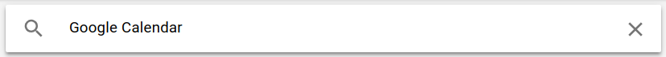
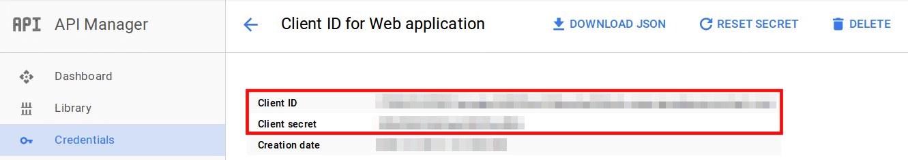

=====================================================
How to synchronize your calendar with Google Calendar
=====================================================

- Connect on your google account and go to https://console.developers.google.com/

- Click on **Create a project...** and enter a project name and change your id if you want.
  Don't forget to accept the Terms of Services 

- In the menu on left side, select the sub menu APIs (from menu APIs and auth) and click on 'Calendar API'. 
  Activate the Calendar API by clicking on the blue button 'Enable API'. 
  When it's done, the Calendar API overview will be available 

.. image:: media/google_calendar_credentials03.png
    :align: center

- In the menu on left side, select the sub menu 'Credentials' (from menu APIs and auth) and click on
  button 'Create new Client ID'

- Check that the Application type is set on 'Web Application', then click on 'Configure consent screen'. 
  Specify an email address and a product name, then save. 

You should now configure the allowed pages on which you will be redirected. To do it, you need to complete the field "Authorized redirect URI" and set as value (your own domain followed by '/google_account/authentication'): 
==> http://mydomain.odoo.com/google_account/authentication
You can now click on 'Create Client ID'

.. image:: media/google_calendar_credentials08.png
    :align: center

- Once done, you will have the both informations (Client ID and Client Secret) that you need to insert in the 2 fields below! 

