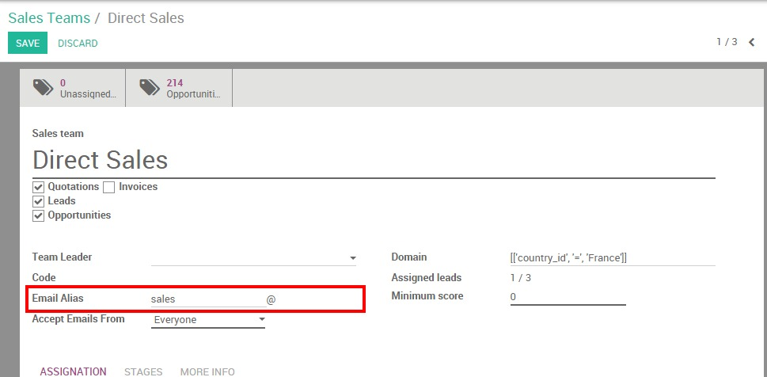

===========================================
How to generate leads from incoming emails?
===========================================

There are several ways for your company to :doc:`generate leads with Odoo CRM <manual>`.
One of them is using your company's generic email address as a trigger
to create a new lead in the system. In Odoo, each one of your sales
teams is linked to its own email address from which prospects can reach
them. For example, if the personal email address of your Direct team is
**direct@mycompany.example.com**, every email sent will automatically create a new
opportunity into the sales team.

Configuration
=============

The first thing you need to do is to configure your **outgoing email
servers** and **incoming email gateway** from the :menuselection:`Settings module --> General Settings`.

Then set up your alias domain from the field shown here below and
click on **Apply**.

.. image:: ./media/emails01.jpg
   :align: center

Set up team alias
=================

Go on the Sales module and click on **Dashboard**. You will see that the
activation of your domain alias has generated a default email alias for
your existing sales teams.

.. image:: ./media/emails02.jpg
   :align: center

You can easily personalize your sales teams aliases. Click on the More
button from the sales team of your choice, then on **Settings** to access
the sales team form. From the **Email Alias** field, enter your email
alias and click on **Save**. Make sure to allow receiving emails from
everyone.

From there, each email sent to this email address will generate a new
lead into the related sales team.

Set up catch-all email domain
=============================

Additionally to your sales team aliases, you can also create a generic
email alias (e.g. *contact@* or *info@* ) that will also generate a new
contact in Odoo CRM. Still from the Sales module, go to
:menuselection:`Configuration --> Settings` and set up your catch-all email domain.

.. tip::

	You can choose whether the contacts generated from your catch-all email
	become leads or opportunities using the radio buttons that you see on the
	screenshot here below. Note that, by default, the lead stage is not
	activated in Odoo CRM.

.. image:: ./media/emails04.jpg
   :align: center

.. seealso::

	* :doc:`manual`
	* :doc:`import`
	* :doc:`website`
