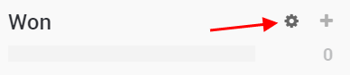
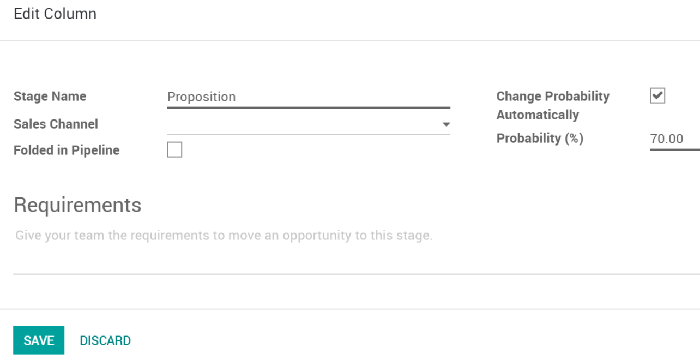
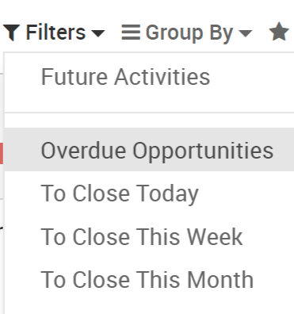

=================================
Get an accurate probable turnover
=================================

As you progress in your sales cycle, and move from one stage to another,
you can expect to have more precise information about a given
opportunity giving you an better idea of the probability of closing it,
this is important to see your expected turnover in your various reports.

Configure your kanban stages
============================

By default, Odoo Kanban view has four stages: New, Qualified,
Proposition, Won. Respectively with a 10, 30, 70 and 100% probability of
success. You can add stages as well as edit them. By refining default
probability of success for your business on stages, you can make your
probable turnover more and more accurate.

Every one of your opportunities will have the probability set by default
but you can modify them manually of course.

Set your opportunity expected revenue & closing date
====================================================

When you get information on a prospect, it is important to set an
expected revenue and expected closing date. This will let you see your
total expected revenue by stage as well as give a more accurate probable
turnover.

.. image:: media/turnover03.png
   :align: center

See the overdue or closing soon opportunities
=============================================

In your pipeline, you can filter opportunities by how soon they will be
closing, letting you prioritize.

As a sales manager, this tool can also help you see potential ways to
improve your sale process, for example a lot of opportunities in early
stages but with near closing date might indicate an issue.

View your total expected revenue and probable turnover
======================================================

While in your Kanban view you can see the expected revenue for each of
your stages. This is based on each opportunity expected revenue that you
set.

.. image:: media/turnover05.png
   :align: center

As a manager you can go to :menuselection:`CRM --> Reporting --> Pipeline Analysis`
by default *Probable Turnover* is set as a measure. This report will take
into account the revenue you set on each opportunity but also the
probability they will close. This gives you a much better idea of your
expected revenue allowing you to make plans and set targets.

.. image:: media/turnover06.png
   :align: center
