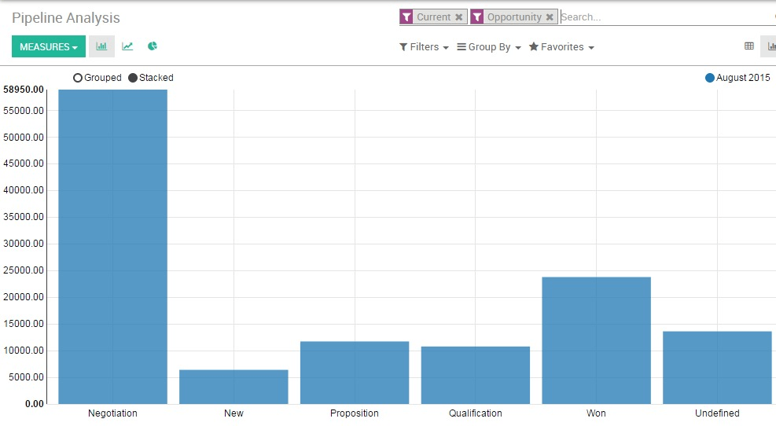

===========================================================================
How to analyze the sales performance of your team and get customize reports
===========================================================================

As a manager, you need to constantly monitor your team’s performance
in order to help you take accurate and relevant decisions for the
company. Therefore, the **Reporting** section of **Odoo Sales** represents a
very important tool that helps you get a better understanding of where
your company's strengths, weaknesses and opportunities are, showing
you trends and forecasts for key metrics such as the number of
opportunities and their expected revenue over time , the close rate by
team or the length of sales cycle for a given product or service.

Beyond these obvious tracking sales funnel metrics, there are some
other KPIs that can be very valuable to your company when it comes to
judging sales funnel success.

Review pipelines 
=================

You will have access to your sales funnel performance from the **Sales**
module, by clicking on :menuselection:`Sales --> Reports --> Pipeline analysis`. 
By default, the report groups all your opportunities by stage (learn more on how to
create and customize stage by reading :doc:`../salesteam/setup/organize_pipeline`)
and expected revenues for the current month. This report is perfect for
the **Sales Manager** to periodically review the sales pipeline with the
relevant sales teams. Simply by accessing this basic report, you can get
a quick overview of your actual sales performance.

You can add a lot of extra data to your report by clicking on the
**measures** icon, such as :

-  Expected revenue.

-  overpassed deadline.

-  Delay to assign (the average time between lead creation and lead
   assignment).

-  Delay to close (average time between lead assignment and close).

-  the number of interactions per opportunity.

-  etc.

.. image:: media/analysis02.png
   :align: center

.. tip:: 
    By clicking on the **+** and **-** icons, you can drill up and down your report
    in order to change the way your information is displayed. For example, if I 
    want to see the expected revenues of my **Direct Sales** team, I need to click 
    on the **+** icon on the vertical axis then on **Sales Team**.

Depending on the data you want to highlight, you may need to display
your reports in a more visual view. Odoo **CRM** allows you to transform
your report in just a click thanks to 3 graph views : **Pie Chart**, **Bar
Chart** and **Line Chart**. These views are accessible through the icons
highlighted on the screenshot below.

.. image:: media/analysis03.png
   :align: center

Customize reports
=================

You can easily customize your analysis reports depending on the
**KPIs** (see :doc:`../overview/main_concepts/terminologies`)
you want to access. To do so, use the **Advanced search view** located in
the right hand side of your screen, by clicking on the magnifying glass
icon at the end of the search bar button. This function allows you to
highlight only selected data on your report. The **filters** option is
very useful in order to display some categories of opportunities, while
the **Group by** option improves the readability of your reports according
to your needs. Note that you can filter and group by any existing field
from your CRM, making your customization very flexible and powerful.

.. image:: media/analysis01.png
   :align: center

.. tip::
    You can save and reuse any customized filter by clicking on 
    **Favorites** from the **Advanced search view** and then on 
    **Save current search**. The saved filter will then be accessible 
    from the **Favorites** menu.

Here are a few examples of customized reports that you can use to
monitor your sales' performances :

Evaluate the current pipeline of each of your salespeople
---------------------------------------------------------

From your pipeline analysis report, make sure first that the
**Expected revenue** option is selected under the **Measures** drop-down
list. Then, use the **+** and **-** icons and add **Salesperson** and
**Stage** to your vertical axis, and filter your desired salesperson. Then
click on the **graph view** icon to display a visual representation of
your salespeople by stage. This custom report allows you to easily
overview the sales activities of your salespeople.

Forecast monthly revenue by sales team
--------------------------------------

In order to predict monthly revenue and to estimate the short-term
performances of your teams, you need to play with two important metrics :
the **expected revenue** and the **expected closing**.

From your pipeline analysis report, make sure first that the
**Expected revenue** option is selected under the **Measures** drop-down
list. Then click on the **+** icon from the vertical axis and select
**Sales team**. Then, on the horizontal axis, click on the **+** icon and
select **Expected closing.**

.. image:: media/analysis04.png
   :align: center

.. tip::
    In order to keep your forecasts accurate and relevant, 
    make sure your salespeople correctly set up the expected closing
    and the expected revenue for each one of their opportunities

.. seealso::
    * :doc:`../salesteam/setup/organize_pipeline`
