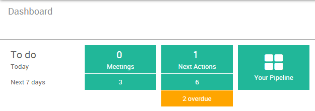
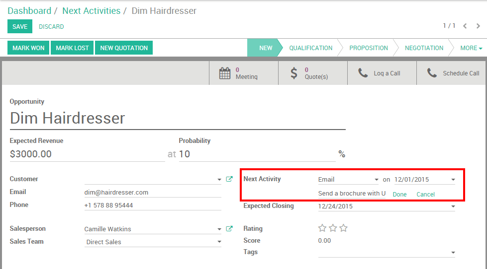

=================================================================
How to review my personal sales activities (new sales dashboard)
=================================================================

Sales professionals are struggling everyday to hit their target and
follow up on sales activities. They need to access anytime some
important metrics in order to know how they are performing and better
organize their daily work.

Within the Odoo CRM module, every team member has access to a
personalized and individual dashboard with a real-time overview of:

-   Top priorities: they instantly see their scheduled meetings and
    next actions

-   Sales performances : they know exactly how they perform compared
    to their monthly targets and last month activities.

.. image:: media/review01.png
    :align: center

Configuration
=============

Install the CRM application
---------------------------

In order to manage your sales funnel and track your opportunities, you
need to install the CRM module, from the **Apps** icon.

.. image:: media/review02.png
    :align: center

Create opportunities
--------------------

If your pipeline is empty, your sales dashboard will look like the
screenshot below. You will need to create a few opportunities to
activate your dashboard (read the related documentation 
:doc:`../leads/generate/manual` to learn more).

.. image:: media/review03.png
    :align: center

Your dashboard will update in real-time based on the informations you
will log into the CRM.

.. tip::
    you can click anywhere on the dashboard to get a detailed 
    analysis of your activities. Then, you can easily create 
    favourite reports and export to excel.

Daily tasks to process
======================

The left part of the sales dashboard (labelled **To Do**) displays the
number of meetings and next actions (for example if you need to call a
prospect or to follow-up by email) scheduled for the next 7 days.

Meetings
--------

In the example here above, I see that I have no meeting scheduled for
today and 3 meeting scheduled for the next 7 days. I just have to
click on the **meeting** button to access my calendar and have a view on
my upcoming appointments.
 
.. image:: media/review05.png
    :align: center

Next actions
------------

Back on the above example, I have 1 activity requiring an action from
me. If I click on the **Next action** green button, I will be redirected
to the contact form of the corresponding opportunity.

Under the **next activity** field, I see that I had planned to send a
brochure by email today.
As soon as the activity is completed, I can click on **done** (or
**cancel**) in order to remove this opportunity from my next actions.

.. note::
    When one of your next activities is overdue, it will appear 
    in orange in your dashboard.

Performances
============

The right part of your sales dashboard is about my sales performances. I
will be able to evaluate how I am performing compared to my targets
(which have been set up by my sales manager) and my activities of the
last month.

.. image:: media/review07.png
    :align: center

Activities done
---------------

The **activities done** correspond to the next actions that have been
completed (meaning that you have clicked on **done** under the **next
activity** field). When I click on it, I will access a detailed reporting
regarding the activities that I have completed.

.. image:: media/review08.png
    :align: center

Won in opportunities
--------------------

This section will sum up the expected revenue of all the opportunities
within my pipeline with a stage **Won**.

.. image:: media/review09.png
    :align: center

Quantity invoiced
-----------------

This section will sum up the amount invoiced to my opportunities. For
more information about the invoicing process, refer to the related
documentation: :doc:`../../accounting/receivables/customer_invoices/overview`

.. seealso::
    * :doc:`analysis`