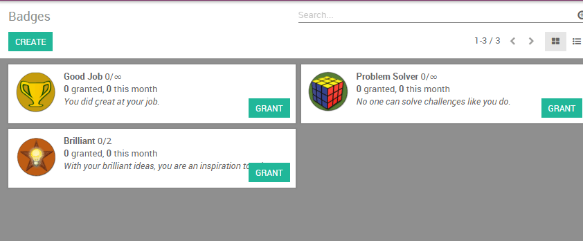

==========================================
How to motivate and reward my salespeople?
==========================================

Challenging your employees to reach specific targets with goals and
rewards is an excellent way to reinforce good habits and improve your
salespeople productivity. The **Gamification** app of Odoo gives you simple
and creative ways to motivate and evaluate your employees with real-time
recognition and badges inspired by game mechanics.

Configuration
=============

From the **Apps** menu, search and install the **Gamification** module.
You can also install the **CRM gamification** app, which will add some
useful data (goals and challenges) that can be used related to the
usage of the **CRM/Sale** modules.

.. image:: media/reward01.png
    :align: center

Create a challenge
==================

You will now be able to create your first challenge from the menu 
:menuselection:`Settings --> Gamification Tools --> Challenges`.

.. note::
    As the gamification tool is a one-time technical setup, 
    you will need to activate the technical features in order 
    to access the configuration. In order to do so, click on 
    the interrogation mark available from any app (upper-right) 
    and click on **About** and then **Activate the developer mode**.

A challenge is a mission that you will send to your salespeople. It can
include one or several goals and is set up for a specific period of
time. Configure your challenge as follows:

-   Assign the salespeople to be challenged

-   Assign a responsible

-   Set up the periodicity along with the start and the end date

-   Select your goals

-   Set up your rewards (badges)

.. note::
    Badges are granted when a challenge is finished. This is either 
    at the end of a running period (eg: end of the month for a 
    monthly challenge), at the end date of a challenge 
    (if no periodicity is set) or when the challenge is manually closed.

For example, on the screenshot below, I have challenged 2 employees with
a **Monthly Sales Target**. The challenge will be based on 2 goals: the
total amount invoiced and the number of new leads generated. At the end
of the month, the winner will be granted with a badge.

.. image:: media/reward03.png
    :align: center

Set up goals
------------

The users can be evaluated using goals and numerical objectives to
reach. **Goals** are assigned through **challenges** to evaluate (see
here above) and compare members of a team with each others and through
time.

You can create a new goal on the fly from a **Challenge**, by clicking on
**Add new item** under **Goals**. You can select any
business object as a goal, according to your company's needs, such as :

-   number of new leads,

-   time to qualify a lead or

-   total amount invoiced in a specific week, month or any other time
    frame based on your management preferences.

.. note::
    Goals may include your database setup as well (e.g. set your 
    company data and a timezone, create new users, etc.).

Set up rewards
--------------

For non-numerical achievements, **badges** can be granted to users.
From a simple *thank you* to an exceptional achievement, a badge is an
easy way to exprimate gratitude to a user for their good work.

You can easily create a grant badges to your employees based on their
performance under :menuselection:`Gamification Tools --> Badges`.

.. seealso::
    * :doc:`../../reporting/analysis`