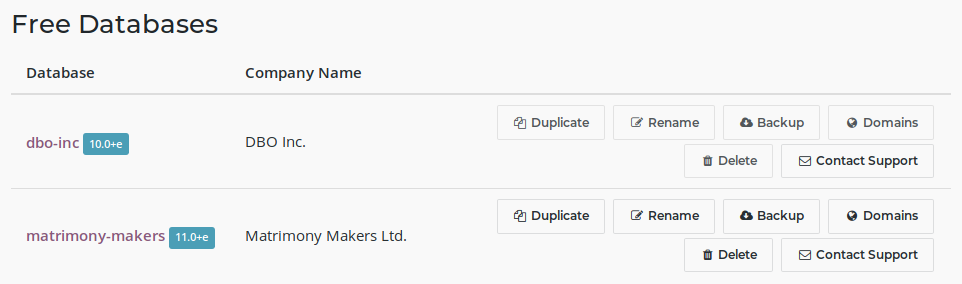
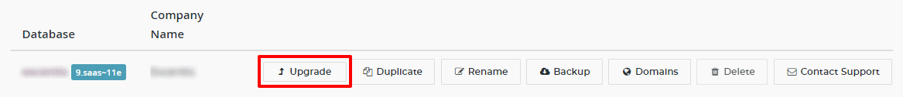
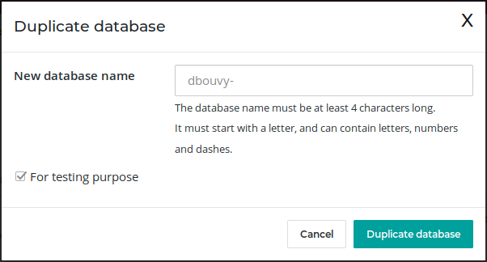
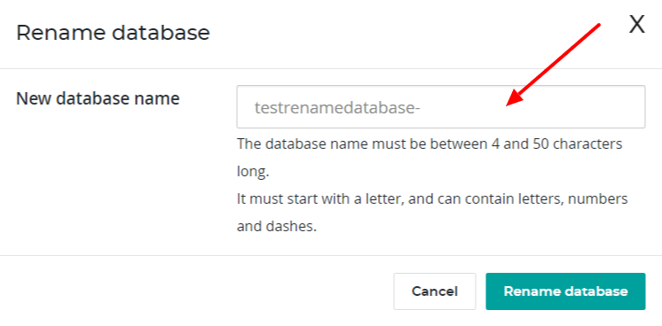
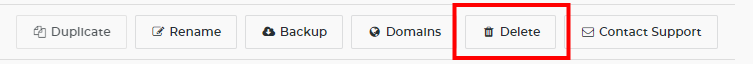
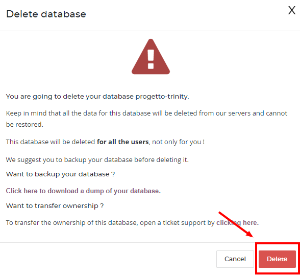

:banner: banners/db_online.jpg

.. _db_online:

==========================
Online Database management
==========================

To manage your databases, access the `database management page
<https://www.odoo.com/my/databases>`__ (you will have to sign in). Then click
on the `Manage Your Databases <https://www.odoo.com/my/databases/manage>`__
button.

.. image:: media/databases.png
    :align: center

Make sure you are connected as the administrator of the database you
want to manage - many operations depends on indentifying you remotely to that
database.

Several actions are available:

* :ref:`Upgrade <upgrade_button>`
    Upgrade your database to the latest Odoo version to enjoy cutting-edge
    features
* :ref:`Duplicate <duplicate_online>`
    Make an exact copy of your database, if you want
    to try out new apps or new flows without compromising
    your daily operations
* :ref:`Rename <rename_online_database>`
    Rename your database (and its URL)
* **Backup**
    Download an instant backup of your database; note that we
    back up databases daily according to our Odoo Cloud SLA
* :ref:`Domains <custom_domain>`
    Configure custom domains to access your
    database via another URL
* :ref:`Delete <delete_online_database>`
    Delete a database instantly
* Contact Support
    Access our `support page <https://www.odoo.com/help>`__
    with the correct database already selected

.. _upgrade_button:

Upgrade
=======

.. warning:: Upgrading your database to a newer version of Odoo is a complex operation
    that require time and caution. It is extremely important that you
    fully test the process before upgrading your production database.

Odoo releases new versions regularly (at least once a year), and upgrading your
database to enjoy new Odoo features is part of the Odoo Online experience.

The upgrade process can take some time, especially if you use multiple apps or
apps that manage sensitive data (e.g. Accounting, Inventory, etc.). In general,
the 'smaller' the database, the quickest the upgrade. A single-user
database that uses only CRM will be processed faster than a multi-company,
multi-user database that uses Accounting, Sales, Purchase and Manufacturing.

Unfortunately, it is impossible to give time estimates for every upgrade request,
since Odoo.com will test manually every database upgrade at least once and will
need to correct/adapt changes made to the standard Odoo Apps (e.g. through Studio
or through a Success Pack) on a case-by-case basis. This can make the process
slower, since requests are treated in the order they arrive. This is especially
true in the months following the release of a new major version, which can lengthen
the upgrade delay significantly.

The upgrade process is quite simple from your point of view:

1. You request a test upgrade
2. Once all tests have been validated **by you**, you upgrade your actual database

The process to request a test or a production (*actual*) upgrade is the same.

First, make sure to be connected to the database you want to upgrade and access the
`database management page <https://www.odoo.com/my/databases>`__.

.. note:: You have to have an active session with access to the Settings app
    in the database you want to upgrade for the button to be visible.

On the line of the database you want to upgrade, click
on the "Cog" menu. If an newer version of Odoo is available, you will see an 'Upgrade'
button.

You have the possibility to choose the target version of the upgrade. By default,
we select the highest available version available for your database; if you were
already in the process of testing an upgrade, we will automatically select the
version you were already testing (even if we released a more recent version during
your tests).

.. image:: media/upgrade_test.png
    :align: center

By clicking on the "Test upgrade" button, an upgrade request will be generated.
Only one request can be made at time for each database; if a request has already
been made, you will see an 'Upgrade Queued' note instead and asking another
request will not be possible.

A test upgrade will create a copy of your database, upgrade it and make it
available to you automatically once successful. If this is the first test you
request for this particular database, a manual testing phase will be done by
Odoo.com - this could take time (up to several weeks). Subsequent requests
will not go through that manual testing step and will usually be made
available in a few hours. Once the test database is available, you should
receive an e-mail with the URL of the test database.

**Testing your database is the most important step of the upgrade process!**
Even though we test all upgrades manually, we do not know your work processes.
A change in standard worfklows of Odoo in new versions might require you to
change internal processes, or some of the customizations you made through Odoo
Studio might now work properly. *It is up to you to make sure that everything
works as it should!* You can report issues with your test database through our
`Support page <https://www.odoo.com/help>`__.

Make sure to do one last test of your upgrade right before the final upgrade
(e.g. the day before) to ensure everything will run smoothly. Downgrading is
not possible and post-poning an upgrade is always easier than being prevented
to work by an upgrade issue after the fact!

Once you are ready and you have validated all your tests, you can click
again on the Upgrade button and confirm by clicking on Upgrade (the button
with the little rocket!) to switch your production database to the new version.
Your database will then be taken offline within the next 10 minutes and will be
upgraded automatically; you receive a confirmation
e-mail once the process is completed.

.. image:: media/upgrade_prod.png
    :align: center

.. warning :: Your database will be taken offline during the upgrade
    (usually between 30min up to several hours for big databases),
    so make sure to plan your migration during non-business hours.

.. _duplicate_online:

Duplicating a database
======================

.. note:: Database duplication, renaming, custom DNS, etc. is not available
    for trial databases on our Online platform. Paid Databases and "One App
    Free" database can duplicate without problem.

In the line of the database you want to duplicate, you will have a few
buttons. To duplicate your database, just click **Duplicate**. You will
have to give a name to your duplicate, then click **Duplicate Database**.

.. danger:: If you do not check the "For testing purposes" checkbox when
  duplicating a database, all external communication will remain active:

  * Emails are sent

  * Payments are processed (in the e-commerce or Subscriptions apps, for
    example)

  * Delivery orders (shipping providers) are sent

  * Etc.

  Make sure to check the checkbox "For testing purposes" if you want these
  behaviours to be disabled.

After a few seconds, you will be logged in your duplicated database.
Notice that the url uses the name you chose for your duplicated
database.

.. note :: Duplicate databases expire automatically after 15 days.

    .. image:: media/dup_expires.png
        :align: center

.. _rename_online_database:

Rename a Database
===================

To rename your database, make sure you are connected to the database you want
to rename, access the `database management page <https://www.odoo.com/my/databases>`__
and click **Rename**. You will have to give a new name to your database,
then click **Rename Database**.

.. _delete_online_database:

Deleting a Database
===================

You can only delete databases of which you are the administrator.

.. danger:: When you delete your database all the data will be permanently lost.
    The deletion is instant and for all the Users. We advise you to do an
    instant backup of your database before deleting it, since the last automated
    daily backup may be several hours old at that point.

From the `database management page <https://www.odoo.com/my/databases>`__,
on the line of the database you want to delete, click on the "Delete" button.

Read carefully the warning message that will appear and proceed only if you
fully understand the implications of deleting a database:

After a few seconds, the database will be deleted and the page will
reload automatically.

.. note::
    * If you need to re-use this database name, it will be immediately available.

    * It is not possible to delete a database if it is expired or linked
      to a Subscription. In these cases contact
      `Odoo Support <https://www.odoo.com/help>`__

    * If you want to delete your Account, please contact
      `Odoo Support <https://www.odoo.com/help>`__
