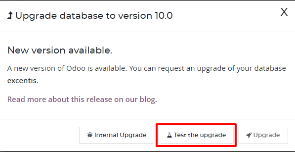
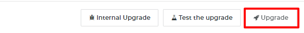

:banner: banners/db_online.jpg

.. _db_online:

==========================
Online Database management
==========================

To manage your databases, access the `database management page
<https://www.odoo.com/my/databases>`__ (you will have to sign in). Then click
on the `Manage Your Databases <https://www.odoo.com/my/databases/manage>`__
button.

.. image:: media/databases.png
    :align: center

Make sure you are connected as the administrator of the database you
want to manage - many operations depends on indentifying you remotely to that
database.

Several actions are available:

.. image:: media/db_buttons.png
    :align: center

* :ref:`Upgrade <upgrade_button>`
    Upgrade your database to the latest Odoo version to enjoy cutting-edge
    features
* :ref:`Duplicate <duplicate_online>`
    Make an exact copy of your database, if you want
    to try out new apps or new flows without compromising
    your daily operations
* :ref:`Rename <rename_online_database>`
    Rename your database (and its URL)
* **Backup**
    Download an instant backup of your database; note that we
    back up databases daily according to our Odoo Cloud SLA
* :ref:`Domains <custom_domain>`
    Configure custom domains to access your
    database via another URL
* :ref:`Delete <delete_online_database>`
    Delete a database instantly
* Contact Support
    Access our `support page <https://www.odoo.com/help>`__
    with the correct database already selected

.. _upgrade_button:

Upgrade
=======

Make sure to be connected to the database you want to upgrade and access the
database management page. On the line of the database you want to upgrade, click
on the "Upgrade" button.

.. image:: media/upgrade1.png
    :align: center

You have the possibility to choose the target version of the upgrade. By default,
we select the highest available version available for your database; if you were
already in the process of testing a migration, we will automatically select the
version you were already testing (even if we released a more recent version during
your tests).

By clicking on the "Test upgrade" button an upgrade request will be generated.
If our automated system does not encounter any problem, you will receive a
"Test" version of your upgraded database.

.. note :: If our automatic system detect an issue during the creation of your
    test database, our dedicated team will have to work on it. You will be
    notified by email and the process will take up to 4 weeks.

You will have the possibility to test it for 1 month. Inspect your data (e.g.
accounting reports, stock valuation, etc.), check that all your usual flows
work correctly (CRM flow, Sales flow, etc.).

Once you are ready and that everything is correct in your test migration, you
can click again on the Upgrade button, and confirm by clicking on Upgrade
(the button with the little rocket!) to switch your production database to
the new version.

.. warning :: Your database will be taken offline during the upgrade
    (usually between 30min up to several hours for big databases),
    so make sure to plan your migration during non-business hours.

.. _duplicate_online:

Duplicating a database
======================

.. note:: Database duplication, renaming, custom DNS, etc. is not available
    for trial databases on our Online platform. Paid Databases and "One App
    Free" database can duplicate without problem.

In the line of the database you want to duplicate, you will have a few
buttons. To duplicate your database, just click **Duplicate**. You will
have to give a name to your duplicate, then click **Duplicate Database**.

.. image:: media/db_duplicate.png
    :align: center

.. danger:: If you do not check the "For testing purposes" checkbox when
  duplicating a database, all external communication will remain active:

  * Emails are sent

  * Payments are processed (in the e-commerce or Subscriptions apps, for
    example)

  * Delivery orders (shipping providers) are sent

  * Etc.

  Make sure to check the checkbox "For testing purposes" if you want these
  behaviours to be disabled.

After a few seconds, you will be logged in your duplicated database.
Notice that the url uses the name you chose for your duplicated
database.

.. note :: Duplicate databases expire automatically after 15 days.

    .. image:: media/dup_expires.png
        :align: center

.. _rename_online_database:

Rename a Database
===================

To rename your database, make sure you are connected to the database you want
to rename, access the `database management page <https://www.odoo.com/my/databases>`__
and click **Rename**. You will have to give a new name to your database,
then click **Rename Database**.

.. image:: media/rename.png
    :align: center

.. _delete_online_database:

Deleting a Database
===================

You can only delete databases of which you are the administrator.

.. danger:: When you delete your database all the data will be permanently lost.
    The deletion is instant and for all the Users. We advise you to do an
    instant backup of your database before deleting it, since the last automated
    daily backup may be several hours old at that point.

From the `database management page <https://www.odoo.com/my/databases>`__,
on the line of the database you want to delete, click on the "Delete" button.

.. image:: media/delete_button.png
    :align: center

Read carefully the warning message that will appear and proceed only if you
fully understand the implications of deleting a database:

.. image:: media/delete_warning.png
    :align: center

After a few seconds, the database will be deleted and the page will
reload automatically.

.. note::
    * If you need to re-use this database name, it will be immediately available.

    * It is not possible to delete a database if it is expired or linked
      to a Subscription. In these cases contact
      `Odoo Support <https://www.odoo.com/help>`__

    * If you want to delete your Account, please contact
      `Odoo Support <https://www.odoo.com/help>`__
