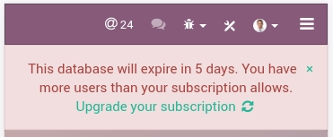
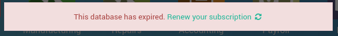

:banner: banners/db_premise.jpg

.. _db_premise:

==============================
On-premise Database management
==============================

Register a database
===================

To register your database, you just need to enter your Subscription Code in the
banner in the App Switcher. Make sure you do not add extra spaces before or after
your subscription code. If the registration is successful, it will turn green and
will provide you with the Expiration Date of your freshly-registered database. You
can check this Epiration Date in the About menu (Odoo 9) or in the Settings Dashboard
(Odoo 10).

Registration Error Message
--------------------------

If you are unable to register your database, you will likely encounter this
message:

          you can try again or contact Odoo Help

Solutions
'''''''''

* Do you have a valid Enterprise subscription?

  * Check if your subscription details get the tag "In Progress" on
    your `Odoo Account
    <https://accounts.odoo.com/my/subscription>`__ or with your Account Manager

* Have you already linked a database with your subscription reference?

  * You can link only one database per subscription.
    (Need a test or a development database? `Find a partner
    <https://www.odoo.com/partners>`__)

  * You can unlink the old database yourself on your `Odoo Contract
    <https://accounts.odoo.com/my/subscription>`__ with the button "Unlink database"

    .. image:: media/unlink_single_db.png
        :align: center

    A confirmation message will appear; make sure this is the correct database as
    it will be deactivated shortly:

    .. image:: media/unlink_confirm_enterprise_edition.png
        :align: center

* Do you have the updated version of Odoo 9?

  * From July 2016 onward, Odoo 9 now automatically change the uuid of a
    duplicated database; a manual operation is no longer required.

  * If it's not the case, you may have multiple databases sharing the same
    UUID. Please check on your `Odoo Contract
    <https://accounts.odoo.com/my/subscription>`__, a short message will appear
    specifying which database is problematic:

    .. image:: media/unlink_db_name_collision.png
        :align: center

    In this case, you need to change the UUID on your test databases to solve this
    issue. You will find more information about this in :ref:`this section <duplicate_premise>`.

    For your information, we identify database with UUID. Therefore, each database
    should have a distinct UUID to ensure that registration and invoicing proceed
    effortlessly for your and for us.

Error message due to too many users
-----------------------------------

If you have more users in your local database than provisionned in your
Odoo Enterprise subscription, you may encounter this message:

          have more users than your subscription allows

When the message appears you have 30 days before the expiration.
The countdown is updated everyday.

Solutions
'''''''''

* **Add more users** on your subscription: follow the link and Validate
  the upsell quotation and pay for the extra users.

or

* **Deactivate users** as explained in this `Documentation 
  <https://www.odoo.com
  /documentation/user/11.0/db_management/documentation.html#deactivating-users>`__
  and **Reject** the upsell quotation.

Once your database has the correct number of users, the expiration message
will disappear automatically after a few days, when the next verification occurs.
We understand that it can be a bit frightening to see the countdown,
so you can :ref:`force an Update Notification <force_ping>`  to make the message disappear
right away.

Database expired error message
------------------------------

If your database reaches its expiration date before your renew your subscription,
you will encounter this message:

This **blocking** message appears after a non-blocking message that lasts 30 days.
If you fail to take action before the end of the countdown, the database is expired.

Solutions
'''''''''

* Renew your subscription: follow the link and renew your subscription - note that
    if you wish to pay by Wire Transfer, your subscription will effectively be renewed
    only when the payment arrives, which can take a few days. Credit card payments are
    processed immediately.
* Contact our `Support <https://www.odoo.com/help>`__

None of those solutions worked for you? Please contact our
`Support <https://www.odoo.com/help>`__

.. _force_ping:

Force an Update Notification
============================

Update Notifications happen once every 7 days and keep your database up-to-date with
your Odoo Enterprise subscription. If you modify your subscription (i.e. add more users,
renew it for a year, etc.), your local database will only be made aware of the change
once every 7 days - this can cause discrepancies between the state of your subscription
and some notifications in your App Switcher. When doing such an operation on your
subscription, you can force an Update using the following procedure:

1. Connect to the database with the **Administrator** account
2. Switch to the Developer mode by using the **About** option in the
   top-right menu (in V9) /  in **Settings**  (in V10): click on
   **Activate the developer mode**
3. Navigate to the "Settings" menu, then "Technical" > "Automation" >
   "Scheduled Actions"
4. Find "Update Notification" in the list, click on it, and finally click on the
   button "**RUN MANUALLY**"
5. Refresh the page, the "Expiration" notification should be gone

.. warning:: You may have kept the same UUID on different databases and we receive
    information from those databases too. So please read :ref:`this documentation
    <duplicate_premise>` to know how to change the UUID.
    After the change you can force a ping to speed up the verification,
    your production database will then be correctly identified.

.. _duplicate_premise:

Duplicate a database
====================

You can duplicate your database by accessing the database manager on your
server (<odoo-server>/web/database/manager). In this page, you can easily
duplicate your database (among other things).

.. image:: media/db_manager.gif
    :align: center

When you duplicate a local database, it is **strongly** advised to change
the duplicated database's uuid (Unniversally Unique Identifier), since this
uuid is how your database identifies itself with our servers. Having two
databases with the same uuid could result in invoicing problems or registration
problems down the line.

.. note:: From July 2016 onward, Odoo 9 now automatically change the uuid of a
    duplicated database; a manual operation is no longer required.

The database uuid is currently accessible from the menu **Settings > Technical
> System Parameters**, we advise you to use a
`uuid generator <https://www.uuidgenerator.net>`__ or to use the unix command
``uuidgen`` to generate a new uuid. You can then simply replace it like any
other record by clicking on it and using the edit button.

.. image:: media/db_uuid.png
    :align: center
