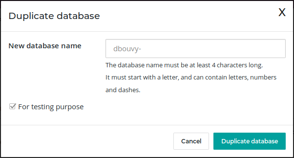
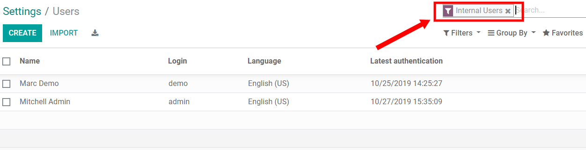

:banner: banners/db_management.jpg

.. _db_management/documentation:

============================
How to manage your databases
============================

As the administrator of your database, you are responsible for its usage.
This includes the Apps you install as well as the number of users currently
in use.

Odoo is many things (ERP, CMS, CRM application, e-Commerce backend, etc.)
but it is *not* a smartphone. You should apply caution when adding/removing
features (especially Apps) on your database since this may impact your
subscription amount significantly (or switch you from a free account
to a paying one on our online platform).

This page contains some information as to how you can manage your Odoo 
instances. The most important section concern the
:ref:`duplication <duplicate>` of your database: whenever you wish to
install or remove an App, you should **always** test it first on a duplicate
of your production database. That way, if something goes wrong, your
day-to-day business is not impacted.

.. note:: If you have questions about the content of this page or if you
    encounter an issue while carrying out these procedures, please contact
    us through our `support form <https://www.odoo.com/help>`__.

.. note:: Database duplication, renaming, custom DNS, etc. is not available
    to free customers.

.. _duplicate:

Duplicating a database (online)
===============================

Access the `database management page <https://www.odoo.com/my/databases>`__
(you will have to sign in). Next, make sure you are connected as the
administrator of the database you want to duplicate. After that, click
on the **Manage Your Databases** button.

.. image:: media/databases.png
    :align: center

In the line of the database you want to duplicate, you will have a few
buttons. To duplicate your database, just click **Duplicate**. You will
have to give a name to your duplicate, then click **Duplicate Database**.

.. image:: media/db_buttons.png
    :align: center

.. danger:: A duplicated database has the same behaviour as a real one:

  * Emails are sent

  * Payments are processed (in the e-commerce, for example)

  * Delivery orders (shipping providers) are sent

  * Etc.

  It is **strongly** advised to test behaviour using sample
  customers/products (with a `disposable e-mail <http://www.mailinator.com>`__
  address, for example)

After a few seconds, you will be logged in your duplicated database.
Notice that the url uses the name you chose for your duplicated
database.

.. note :: Duplicate databases expire automatically after 15 days.

    .. image:: media/dup_expires.png
        :align: center

Duplicating a database (on-premise)
===================================

You can duplicate your database by accessing the database manager on your
server (<odoo-server>/web/database/manager). In this page, you can easily
duplicate your database (among other things).

.. image:: media/db_manager.gif
    :align: center

When you duplicate a local database, it is **strongly** advised to change
the duplicated database's uuid (Unniversally Unique Identifier), since this
uuid is how your database identifies itself with our servers. Having two
databases with the same uuid could result in invoicing problems or registration
problems down the line.

The database uuid is currently accessible from the menu **Settings > Technical
> System Parameters**, we advise you to use a 
`uuid generator <https://www.uuidgenerator.net>`__ or to use the unix command
``uuidgen`` to generate a new uuid. You can then simply replace it like any
other record by clicking on it and using the edit button.

.. image:: media/db_uuid.png
    :align: center

Deactivating Users
==================

.. note:: Make sure you have sufficient **administrative rights** if
    you want to change the status of any of your users. 

In your Odoo instance, click on **Settings**. You will have a section
showing you the active users on your database. Click on **Manage
access rights.** 

+----------------+----------------+
|   |settings|   | |browse_users| |
+----------------+----------------+

You'll then see the list of your users.

.. note:: The pre-selected filter *Internal Users* shows your paying
    users (different from the *Portal Users* which are free). If you
    remove this filter, you'll get all your users (the ones you pay for
    and the portal ones)

In your list of users, click on the user you want to deactivate. As soon
as you are on the userform, go with your mouse cursor on the status
**Active** (top right). Click on Active and you will notice that the
status will change to **Inactive** immediately. 

.. image:: media/deactivate_user.gif
    :align: center

The user is now deactivated. 

.. danger:: **Never** deactivate the main user (*admin*)

Uninstalling Apps
=================

.. warning:: Make sure you first test what you are about to do on a 
    :ref:`duplicate <duplicate>` of your database before making any
    changes (*especially* installing/uninstalling apps).

In your Odoo instance click on **Settings**; in this app, you will be
able to see how many applications you have installed. Click on **Browse
Apps** to access the list of your installed applications. 

+----------------+----------------+
|   |settings|   | |browse_apps|  |
+----------------+----------------+

In your applications' dashboard, you will see all the icons of your
applications. Click on the application you want to uninstall. Then, on
the form of the application, click on **Uninstall**.

.. image:: media/uninstall.png
    :align: center

.. danger:: Some applications have dependencies, like Invoicing, eCommerce,
    etc. Therefore, the system will give you a warning message to advise
    you of what is about to be removed. If you uninstall your application,
    all its dependencies will be uninstalled as well (and the data in them
    will permanently disappear). If you are sure you still want to uninstall
    it, then click **Confirm**. 

Last, after having checked the warning message (if any), click **Confirm**.

.. image:: media/uninstall_deps.png
    :align: center

You have finished uninstalling your application. 

Good to know
============

* **Uninstalling apps, managing users, etc. is up to you**: no one else can
  know if your business flow is broken better than you. If we were to uninstall
  applications for you, we would never be able to tell if relevant data had
  been removed or if one of your business flow was broken because we *do not
  know how you work* and therefore cannot validate these kinds of operations.
        
* **Odoo Apps have dependencies**: this means that you may need to install
  modules that you do not actively use to access some features of Odoo
  you might need. For example, the Website Builder app is needed to be
  able to show your customer their Quotes in a web page. Even though you
  might not need or use the Website itself, it is needed for the Online
  Quotes feature to work properly.         
        
* **Always test app installation/removal on a duplicate** (or on a
  free trial database): that way you can know what other apps may
  be required, etc. This will avoid surprises when uninstalling
  or when receiving your invoices.

.. |browse_apps| image:: media/browse_apps.png

