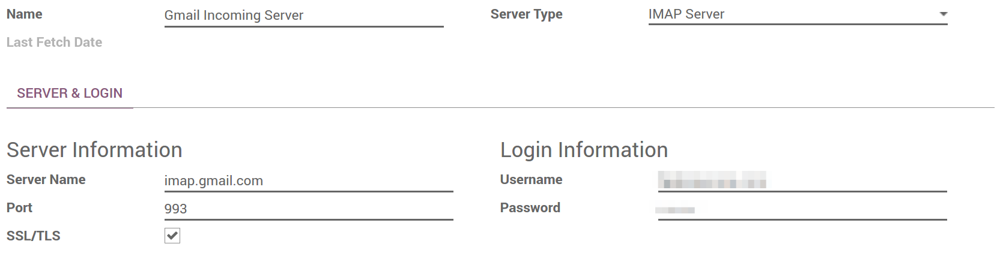

=================================================================
How to use my own email servers to send and receive email in Odoo
=================================================================

When is it needed
=================
Using your own email servers is required to send and receive messages
in Odoo Community or Enterprise. Odoo Online embeds an out-of-box 
email solution that works straight away. However you can still use
your own email servers with the online edition. Some insights 
are provided here below.

How to set it up 
================
As a system admin, go to :menuselection:`Settings --> General Settings` 
and check *External Email Servers* 
(watch out: this checkbox only shows up after Odoo 10).
Then, go through the following steps.

.. note:: Office 365 doesn't allow external hosts like Odoo. 
Consequently you can't use Office 365 email servers to send
or receive messages in Odoo.

Set an outgoing email server for outbound messages
--------------------------------------------------
You need the SMTP data of your email provider (Gmail, Outlook, 
Yahoo, AOL, etc.) as well as your admin credentials. 
Once all the information has been filled out, click on *Test Connection*.

.. image:: media/outgoing_server.png
    :align: center

Set an incoming email server for inbound messages
-------------------------------------------------
Fill out the form according to your email provider’s settings. 
Leave the *Actions to Perform on Incoming Mails* blank. Once all the 
information has been filled out, click on *TEST & CONFIRM*.

.. note:: By default inbound messages are fetched every 5 minutes. 
   You can change this value in developer mode.
   Go to :menuselection:`Settings --> Technical --> Automation --> 
   Scheduled Actions` and look for *Mail: Fetchmail Service*.

Set the domain name
-------------------
Enter the domain name of your email servers (e.g. mycompany.com)
in General Settings.

.. image:: media/alias_domain.png
    :align: center

Create a catchall address
-------------------------
When a contact replies to an email sent from Odoo, the *reply-to* address
is a generic address used to route the reply to the right discussion thread
in Odoo (opportunity, order, task, etc.) and to the inbox of all its followers.
By default this address is "catchall@" but it can be changed. 

Create a catchall address in your email server settings. We advise
you to use "catchall@" so that everything works out straight away.
If you want to use another alias, you have extra steps in Odoo:

- Activate the developer mode from your Settings Dashboard.

.. image:: media/developer_mode.png
    :align: center

- Refresh your screen. Then go to :menuselection:`Settings --> Technical
  --> Parameters --> System Parameters` and enter your custom catchall alias
  in *mail.catchall.alias*.

.. image:: media/system_parameters.png
    :align: center

.. note:: You can edit the email alias used for bounced messages the same way.

How to use my own email servers with Odoo Online
================================================
Odoo Online comes up with an embedded and ready-to-use email 
server (*@yourcompany.odoo.com*).
We recommend to keep this default setting as it is really convenient. 
Indeed, while it is Odoo-labelled, the visible source of any message
sent from Odoo will be your personal email address (your Odoo login). 
Your contacts will therefore trust your messages. 

You can still use your own email servers if you want your contacts to see
your historic email address when they reply to your messages or if you want 
to manage the reputation of your email servers yourself.

There are 2 methods:

* [Recommended] **Use a catchall redirection** (your server -> Odoo server) 
  to receive emails in Odoo in real time thanks to the Odoo email server.
  Create a catchall address in your email server settings.
  Then apply following redirection:
  catchall@yourdomain.ext -> catchall@yourcompany.odoo.com.
  That's it you're ready to go!
* **Use a catchall mailbox** to exclusively use your own email server.
  That way you can also manage your email server reputation (blacklisting, etc).
  However, incoming messages are fetched from the email server
  thanks to a cron running every hour. This is the shortest time lap
  for crons in Online instances.
  If you opt for this solution, simply follow the procedure
  of above section.

How to be SPF-compliant when using external email servers in Odoo
=================================================================
Sender Policy Framework (SPF) is an email-validation system that checks that 
incoming mail from a domain comes from a host authorized by that domain's 
administrator. Such a security system is used in most email servers. 
If you don't comply with it, your emails sent from Odoo will be likely
flagged as spam.

To be SPF-compliant, you need to authorize Odoo as a sending host 
in your domain name settings:

* Sign in to your domain’s account at your domain host.
* Locate the page for updating your domain’s DNS records. 
* If no TXT record is set, create one with following definition:
  v=spf1 include:_spf.odoo.com ~all
* In case a TXT record is already set, add "include:_spf.odoo.com".
  
  e.g. for a Gmail server it should be:

  v=spf1 include:_spf.odoo.com include:_spf.google.com ~all

Find `here <https://www.mail-tester.com/spf/>`__ the exact procedure to 
create or modify TXT records in your own domain registrar.

Your new SPF record can take up to 48 hours to go into effect, 
but this usually happens more quickly.

.. note:: Adding more than one SPF record for a domain can cause problems 
   with mail delivery and spam classification. Instead, we recommend using 
   only one SPF record by modifying it to authorize Odoo.

How to choose between Odoo and my traditional email box
=======================================================
Odoo Discuss is a perfect tool to send and read messages related to 
business documents. However it doesn't aim to replace a full-featured email 
solution (Gmail, Outlook, Yahoo, AOL, etc.). 
We recommend to take the most out of both systems without mingling them: 
What is related to Odoo business objects or applications goes into Odoo; 
What is not can be managed into your external email box. 

To do so, create specific email aliases to use in Odoo (to generate leads 
or opportunities, helpdesk tickets, etc.). If you take an email alias 
already used for messaging outside of Odoo, incoming messages will land 
into both systems. This will negatively impact your productivity.
