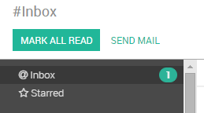
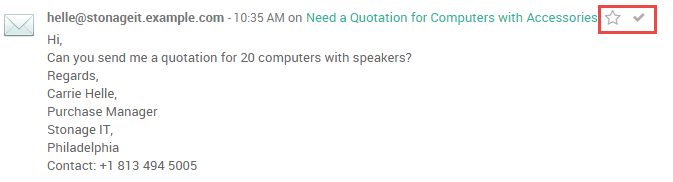
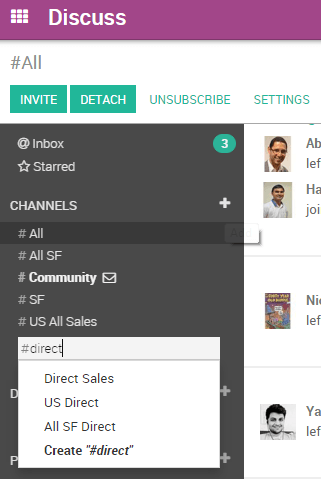
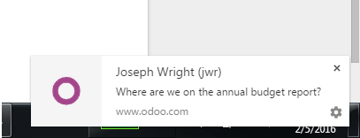
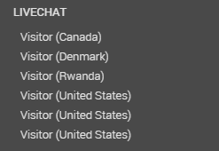

:banner: banners/discuss.jpg

=======
Discuss
=======

Overview
========

Odoo Discuss is an easy-to-use messaging app for teams that brings all
your organization’s communication into one place and integrates with the
Odoo platform. Discuss lets you send and receive messages from wherever
you are in Odoo as well as manage your messages and notifications easily
from within the app. Discuss allows you to create **channels** for team
chats, conversations about projects, meeting coordination, and more in
one simple and searchable interface.

Monitoring Your Messages Using the Inbox
========================================

Use the **inbox** to monitor updates and progress on everything you do
in Odoo. Notifications from everything you follow and conversations in
which you are mentioned appear in your inbox.

Marking an item with a check sets the message to **read** and removes it
from your inbox. If you would like to save an item for future reference
or action, mark it with a star to add it to the **Starred** box. You can
star any message or notification in Discuss or any of the item-specific
chatters throughout Odoo to keep tabs on it here.

Communicating with Your Team Using Channels
===========================================

You can use **channels** to organize discussions between individual
teams, departments, projects, and any other communication need. By
having conversations that everyone in the **channel** can see, it’s easy
to keep the whole team in the loop with the latest developments. You can
attach files with Odoo Discuss just as you would in an email.If you need
to draw someone’s attention to a conversation, you can mention them by
typing @user-name. They will see a notification in their inbox and be
notified by email. Discuss can also alert you with desktop notifications
when you receive a new message.

You can search the list of **public channels** or create a new
**channel** by clicking the plus icon.

Channels can be configured to aggregate emails from a specified address
and to send messages as emails. You can also define who can join and who
will be automatically included in a channel.

Desktop notifications allow quick previews of incoming messages without
interrupting what you are currently working on. These can be configured
or disabled via **preferences**.

You Can Take it with You
========================

Click **Detach** to move a conversation to a detached window that stays
with you when navigating from app to app. Conversations can be accessed
universally from the speech bubble icon in the top bar.

In addition to public channels and direct messages, you can create
private channels to discuss anything that is sensitive, confidential, or
otherwise unfit for a public channel. You can configure who is allowed
to join and follow private channels exactly as you would for a public
channel, however a private channel is only visible to it’s participants.

Website Livechat
================

If you have the **Website Livechat** module installed, new messages will
appear in the Discuss module allowing you to navigate between them as
you would with direct messages.

Using Filters to Navigate within Discuss
========================================

The topbar search provides access to the same comprehensive search
function present in the rest of Odoo. You can apply multiple **filter
criteria** and **save filters** for later use. The search function
accepts wildcards by using the underscore character “\ **\_**\ ” to
represent a **single character wildcard**.
