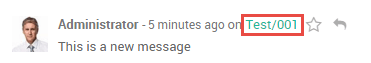

======================================================================
How to follow a discussion thread and define what I want to hear about
======================================================================

How to follow a discussion thread
=================================
You can keep track of virtually any business object in Odoo
(an opportunity, a quotation, a task, etc.), by **following** it. 

.. image:: media/discuss07.png
    :align: center

How to choose the events to follow
==================================
You can choose which types of events you want to be notified about.
The example below shows the options available when
following a **task** in the **Project** app.

.. image:: media/discuss08.png
    :align: center

How to add other followers
==========================
You can invite other users and add channels as followers. Adding a
channel as a follower will send messages posted in the chatter to the
channel with a link back to the original document.

.. image:: media/discuss09.png
    :align: center

How to be a default follower
============================
You are automatically set as a default follower of any item
you create. In some applications like CRM and Project, you can 
be a default follower of any new record created to get notified
of specific events (e.g. a new task created, an opportunity won). 

To do so, start following the parent business object
(e.g. the sales channel in CRM, the project in Project). 
Then, choose the events you want to hear about.

.. image:: media/sales_channel_follow.png
    :align: center