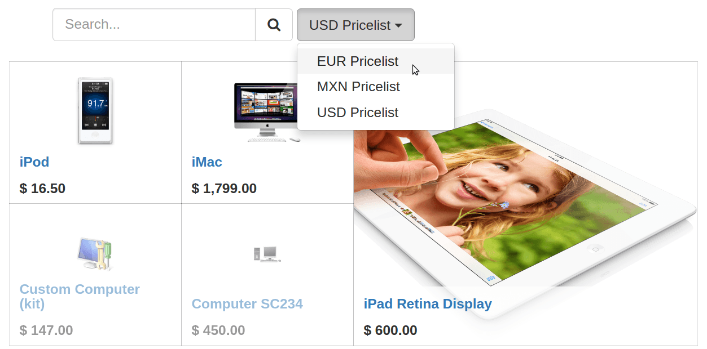

==============================================
How to adapt the prices to my website visitors
==============================================

This section sheds some light on pricing features of eCommerce app:

* force a price by geo-localization,

* let the customer choose the currency.

As a pre-requisite, check out how to managing produt pricing:
:doc:`../../sales/products_prices/prices/pricing`).

Geo-IP to automatically apply the right price
================================================

Assign country groups to your pricelists. That way, your visitors not yet
logged in will get their own currency when landing on your website.

Once logged in, they get the pricelist matching their country.

Currency selector
=================

In case you sell in several currencies, you can let your customers choose
their own currency. Check *Selectable* to add the pricelist to the website drop-down menu.

.. seealso::

  * :doc:`../../sales/products_prices/prices/pricing`
  * :doc:`../../sales/products_prices/prices/currencies`
  * :doc:`promo_code`
