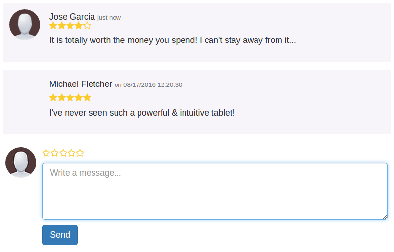
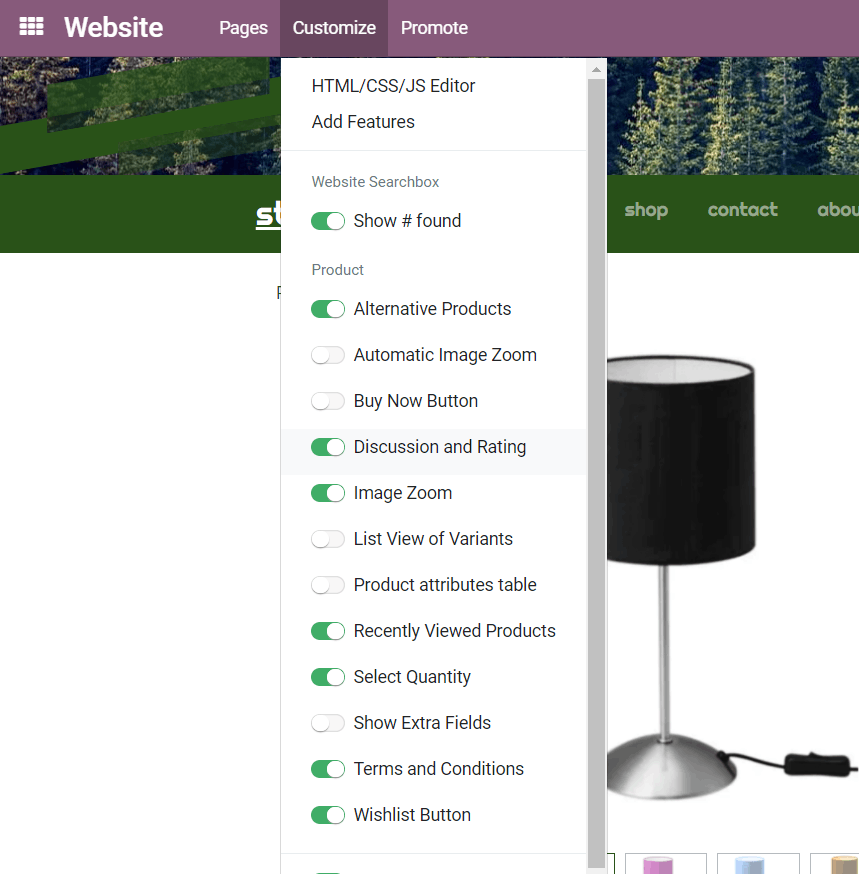
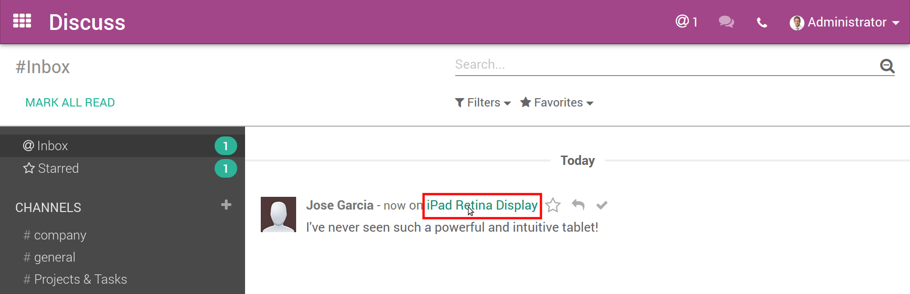
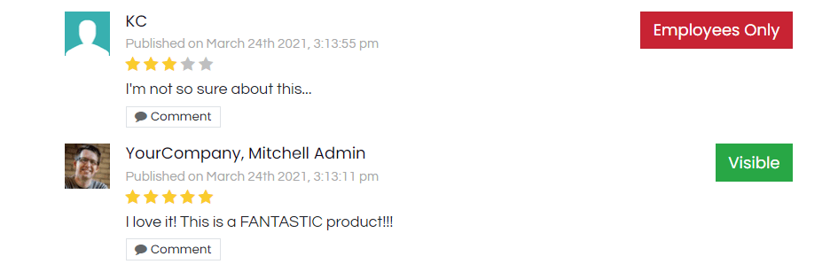

===============================
How To Enable Comments & Ratings
===============================

Publishing and monitoring the customer experience will help you gain the trust
of new customers *and* engage better with your community. In just 2 clicks, you can allow
your customers to share their feedback!

Setup
=====

Activate comments & ratings from the *Customize* menu of the product web page.

.. note::
    Visitors must log in to share their comments. Make sure they are able to
    do so (see Portal documentation).

Review The Posts In Real-Time
=============================

Whenever a post is published, the product manager (and all the product followers)
get notified in their email inbox.

.. note::
    By default, the user who created the product is automatically set as a follower.

To review the comment, you can find it in the *Chatter* of the product detail form *and* and in
the *Discuss* application.

Moderate Comments
=================

You can easily view comments by using the *Chatter*, either in the product detail form
or on the web page, itself.

To change the visibility of the post, open the product web page and click the *Visible* button
to turn it red (*Employees Only*).

