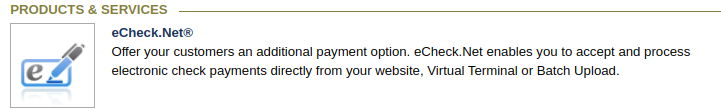
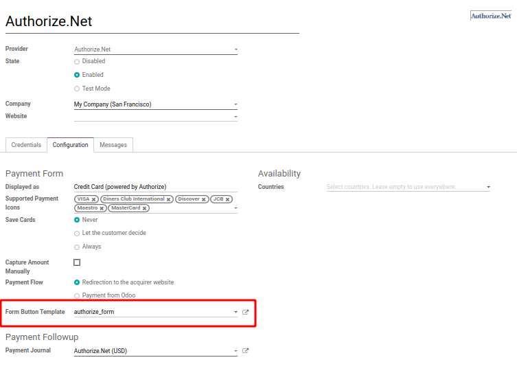

======================
============
How to get paid through ACH
==================================

This is possible(**US only**) with the standard `Authorize.net integration <https://www.odoo.com/documentation/user/13.0/ecommerce/shopper_experience/authorize.html>`__.

First, you need to have an `Authorize.net account <https://www.odoo.com/documentation/user/13.0/ecommerce/shopper_experience/authorize.html#create-an-authorize-net-account>`__ that is set up with a processor and your Authorize.net account must have the eCheck.Net feature activated.

Set up Authorize.net
===============================
* Activate Authroize.net in Odoo (::menuselection: ‘Accounting --> Configuration --> Payments --> Payment Acquires’)
* Enter your **API Login ID,**  **API Transaction Key,**  **API Signature Key**
* This will generate an **API Client Key**

.. image:: media/authorize02.png
	:align: center

* Your configuration is now ready! You can make Authorize.Net visible on your merchant interface and activate the **Enabled** state.

.. image:: media/paypal_live.png
	:align: center

.. notes:: Credentials provided by Authorize.net are different for both test and production mode. Don’t forget to update them in Odoo when you switch from testing to production or vice-versa

Set up ACH
===============================
 You will need to remove the following line in
* :menuselection: ‘Accounting --> Configuration --> Payment Acquirer --> Authorize.net --> Configuration tab --> Form Button Template’

* Click on the **External Link**

.. image:: media/ach03.png
	:align: center

*Add this code between the 
 field

.. code-block:: XML

	<input type="hidden" name="x_method" t-att-value="x_method"/>

This will allow **both** the options of **credit card payment** or **ACH payment**
.. image:: media/ach03.png
	:align: center

.. note:: Alternatively, you can replace it with  <input type="hidden" name="x_method" value="echeck"/> if you want to force ACH option only.

Once this is done, your ecommerce checkout page will display the option of paying with Authorize.net and the customer will have the option to pay with ACH by providing their bank account information.
