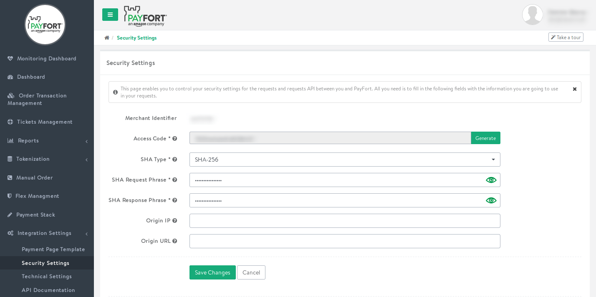
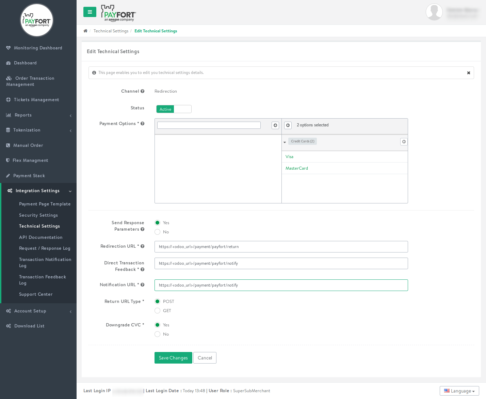

==============================
Configure your Payfort account
==============================

Payfort is an Amazon company providing payment services, mostly in the MENA region. It is fully
supported by Odoo, making classical and tokenization payment flows possible with little
configuration.

It is strongly advised to use a test account in addition to your real account; that way, you can
test configuration changes safely in a copy of your instance before making any change in your
production environment.

Installing the Payfort integration module
=========================================

The Payfort integration was added after the release of Odoo 13 for our own internal needs - we
decided to make this integration standard so that all our customers might use it.

This means that your Odoo source code must be up-to-date for the module to be available. If your
Odoo instance was created prior to the addition of the module in the code, you will need to update
the list of available modules.

To do so, follow these steps:

#. Enable the Developer Mode by going to :menuselection:`Settings --> Activate the developer mode`
#. Go to :menuselection:`Apps --> Update Apps List` and confirm the operation

The Payfort module is now visible in the list of applications and can be installed from there.
If you want the Payfort integration to be visible in the list of available payment providers without
first installing the module, you can update the ``payment`` base module:

.. warning::
   Updating a module can lead to a small downtime for your database. Make sure to check if the
   update works correctly in a duplicate database first.

#. Go to :menuselection:`Apps`
#. Remove the *Apps* filter from the search menu
#. Search for the ``payment`` module (*Payment Acquirer*)
#. Update that module

Payfort will now be visible in the list of available acquirers, independently of its installation
status.

Create a Payfort account
========================

Creating a Payfort account can take some time, as you will need to get in touch with them through
their `online form <https://www.payfort.com/get-started/>`_ first. Depending on your expected usage
of Odoo, you will need to require some specific options for your account.

The most basic configuration will require the *Redirection* channel. An advanced integration,
allowing customers to save their card for future payments (e.g. to process recurring charges in the
Subscription application or to allow your customer to pay easily through your eCommerce with saved
cards), will require the channels *Recurring* and *Merchant Page*.

Supported Payment Methods
=========================

Payfort supports multiple payment options; all major credit cards are supported,
as well as local payment methods such as Mada, Knet or Meeza. However, these
local payment methods do not support tokenization (saving payment data for future
usage, e.g. through the Subscription application).

If you configure Payfort to use the *Payment from Odoo* payment flow (which is
required if you plan to use tokenization), your customers will not be able to pay
using these local payment methods. If you plan for a simple eCommerce integration
without the use of subscriptions, using the *Redirection to the acquirer website*
payment flow is recommended, as it supports more payment methods and will make
payment more convenient for your customers.

Credit card support is always available, independently of the payment flow
selection.

Settings in Payfort
===================

Security Parameters
-------------------

First, you need to configure your security parameters. To do so, connect to your
Payfort account and go to :menuselection:`Integration Settings --> Secuirty Settings`.

This page contains your Merchant Identifier, Access Code and cryptographic passphrases
for securing communications between Odoo and Payfort. Set the *SHA Type* field to
*SHA-256*, and fill in the mandatory fields. You will need to input these in Odoo
later on. Your SHA passphrases should be difficult to guess and not too short (using
a password generator to create strong passphrases is strongly advised).

You can set up *Origin IP* and *Origin URL* restrictions, though that may not always
be advisable. Odoo Online instances can change IP without prior notice, for example in
case of hardware retirement or planned maintenance. The origin URL might not always
be the same, especially if you enable support for multiple websites in Odoo.
If you are unsure about these settings, leave them empty.

You can see here an example configuration of the security settings in Payfort:

Notification and Return URLs
----------------------------

Payfort provides a notification mechanism that will notify Odoo of new payments
and of updates in existing payments. These notifications act as a fallback to
make sure that all payments status are correct in Odoo, even if your customer closes
their browser window or lose connectivity during payment confirmation.

For every payment channel activated on your Payfort account, you will need to specify
the notification URL. To do so, go to :menuselection:`Integration Settings --> Technical Setting`
and configure every payment channel with the notification URL *<BaseUrl>/payment/payfort/notify*
(e.g. ``https://my-ecommerce.odoo.com/payment/payfort/notify``).

The URL is identical for the *Notification URL* and
*Direct Transaction Feedback*. In the case of the redirection channel, you will also
need to specify a *Redirection URL*: *<BaseUrl>/payment/payfort/return* (e.g. 
``https://my-ecommerce.odoo.com/payment/payfort/return``). Make
sure to set *Send Response Parameters* to ``Yes``.

The *Response Type* field
should be set to ``JSON`` and the *Return URL Type* to ``POST``. Downgrading
the CVC is advised as it does not impact communication with Odoo and will limit
the amount of sensitive information that will be included in the technical logs.

.. note::
   Not all fields may be available depending on the payment channel you are
   configuring.

You can see an example configuration for the Redirection channel here:

Settings in Odoo
================

Activation
----------

* Activate Payfort in Odoo from :menuselection:`Website or Accounting --> Settings -->
  Payment Acquirers`.
* Enter your Payfort security settings in the credentials tab: **Merchant Identifier**,
  **Access Code**, **SHA Request Phrase** and **SHA Response Phrase**.
* Choose your payment flow; note that the *Payment from Odoo* payment flow is only compatible with
  credit card payments.
* Finalize the configuration in the Configuration tab: set country restrictions, website
  restrictions (if you have enabled support for multiple websites) and/or payment icons for local
  payment options (only for *Redirection to the acquirer website* payment flows).
* Set the Payfort provider to the correct status (*Enabled* for a production account, *Test* for a
  test account)

.. note::
   Payment Icons are only there to indicate to your customers which payment options are available.
   Enabling support for these options should be done in your Payfort account. Icons for the local
   payment options are available but are not active by default.

Go live!
========

Payfort is now available in your payment form available in eCommerce, Sales, Subscription and
Invoicing apps. Your customers will get back to a confirmation page in Odoo once the payment is
processed.

.. note::
   *(for integrators only)* Be aware that the Payfort integration makes use of ``iframe`` elements;
   your web server configuration should allow iframes with the ``sameorigin`` value of the
   ``X-Frame-Options`` header of Odoo pages.

.. seealso::
   - :doc:`payment`
   - :doc:`payment_acquirer`
