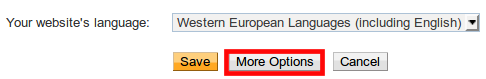
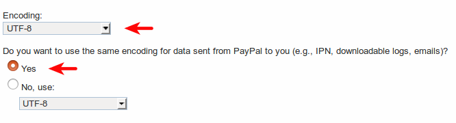

===========================
How to get paid with Paypal
===========================

Paypal is the easiest online payment acquirer to configure. 
It is also the only one without any subscription fee.
We definitely advise it to any starter.

Set up your Paypal account
==========================

* Create a `Paypal Business Account <https://www.paypal.com>`__
  or upgrade your account to *Business account* if you have a basic account.

* Log in to `Paypal <https://www.paypal.com>`__ 
  and open the settings of your **Profile**.

  .. image:: media/paypal_profile.png
    :align: center

* Now enter the menu **My selling tools**.

  .. image:: media/paypal_selling_tools.png
    :align: center

* Let's start with the **Website Preferences**.

* Turn on **Auto Return** and enter the **Return URL**:
  <odoo_instance_url>/shop/confirmation.
  Verify that this address uses the correct protocol (HTTP/HTTPS).

  .. image:: media/paypal_auto_return.png
    :align: center

* Turn on **Payment Data Transfer**. 
  When saving, an **Identity Token** is generated.
  You will be later requested to enter it in Odoo.

  .. image:: media/paypal_data_transfer.png
    :align: center

* Then, get back to your profile to activate the 
  **Instant Payment Notification (IPN)** in *My selling tools*.

  Enter the **Notification URL**: <odoo_instance_url>/payment/paypal/ipn

  .. image:: media/paypal_ipn_setup.png
    :align: center

  .. tip:: If you want your customers to pay without creating a Paypal account, 
    **Paypal Account Optional** needs to be turned on.
    
    .. image:: media/paypal_account_optional.png
     :align: center

  .. tip:: For Encrypted Website Payments & EWP_SETTINGS error,
     please check the `paypal documentation. <https://developer.paypal.com/docs/classic/paypal-payments-standard/integration-guide/encryptedwebpayments/#encrypted-website-payments-ewp>`__

Configure the encoding of the requests
--------------------------------------

If you use accented characters (or anything else than basic Latin characters)
for your customer names, addresses... you MUST configure the encoding format of
the payment request sent by Odoo to Paypal.

.. danger::

    If you don't configure this setting, some transactions fail without notice.

To do so, open:

* `this page for a test account <https://sandbox.paypal.com/cgi-bin/customerprofileweb?cmd=_profile-language-encoding>`__

* `this page for a production account <https://www.paypal.com/cgi-bin/customerprofileweb?cmd=_profile-language-encoding>`__

Then, click *More Options* and set the two default encoding formats as **UTF-8**.

Set up Odoo
===========
* Open Paypal setup form in :menuselection:`Website or Sales or Accounting 
  --> Settings --> Payment Acquirers+`. Enter both your **Email ID** 
  and your **Merchant ID** and check **Use IPN**.

  .. image:: media/paypal_credentials.png
    :align: center

  They are both provided in your Paypal profile,
  under :menuselection:`My business info`.

* Enter your **Identity Token** in Odoo (from *Auto Return* option).
  To do so, open the *Settings* and activate the **Developer Mode**.

  .. image:: media/paypal_debug.png
    :align: center

  Then, go to :menuselection:`Settings --> Technical --> Parameters --> System Parameters`
  and create a parameter with following values:

  * Key: payment_paypal.pdt_token
  * Value: your Paypal *Identity Token*

  .. image:: media/paypal_identity_token.png
    :align: center

Go live
=======
Your configuration is now ready! 
You can make Paypal visible on your merchant interface
and activate the **Production mode**.

.. image:: media/paypal_live.png
    :align: center

Transaction fees
================

You can charge an extra to the customer to cover the transaction fees Paypal charges you.
Once redirected to Paypal, your customer sees an extra applied to the order amount. 

To activate this, go to the *Configuration* tab of Paypal config form in Odoo
and check *Add Extra Fees*. Default fees for US can be seen here below.

.. image:: media/paypal_fees.png
    :align: center

To apply the right fees for your country, please refer to 
`Paypal Fees <https://www.paypal.com/webapps/mpp/paypal-fees>`__.

Test the payment flow
=====================

You can test the entire payment flow thanks to Paypal Sandbox accounts.

* Log in to `Paypal Developer Site <https://developer.paypal.com>`__
  with your Paypal credentials.
  This will create two sandbox accounts:

  * A business account (to use as merchant, e.g. pp.merch01-facilitator@example.com).
  * A default personal account (to use as shopper, e.g. pp.merch01-buyer@example.com).

* Log in to `Paypal Sandbox <https://www.sandbox.paypal.com>`__ 
  with the merchant account and follow the same configuration instructions.

* Enter your sandbox credentials in Odoo and make sure Paypal is 
  still set on *Test* mode.
  Also, make sure the confirmation mode of Paypal is not
  *Authorize & capture the amount, confirm the SO and auto-validate 
  the invoice on acquirer confirmation*.
  Otherwise a confirmed invoice will be automatically generated when
  the transaction is completed.

* Run a test transaction from Odoo using the sandbox personal account.

.. seealso::

  * :doc:`payment`
  * :doc:`payment_acquirer`
